# 00. 메모리 계층 - 속도·용량·비용의 트릴레마

> **최종 검증: 2026-09-26**
> 출처 등급 체계와 전체 출처 인덱스는 [SOURCES.md](SOURCES.md)를 참조하십시오.
> 반도체 수치는 6개월이면 낡습니다. 인용 전 검증일을 확인하십시오.

메모리 계층은 단일 속도축의 서열이 아니라, 접근 지연·대역폭·용량·비트당 비용·프로세서 결합도라는 다섯 축이 서로 다른 방향으로 정렬되는 좌표계입니다.

---

## 1. "위로 갈수록 빠르다"가 틀리는 지점

메모리 계층을 설명하는 가장 흔한 방식은 피라미드 한 장에 "위로 갈수록 빠르고 비싸고 작다"를 적어 넣는 것입니다. SRAM에서 DRAM, DRAM에서 NAND로 내려가는 구간만 보면 이 서술은 맞습니다. 문제는 이 정렬이 **어떤 단일 지표로도 재현되지 않는다**는 점입니다. 정렬 기준을 말하지 않은 채 서열만 제시하면, 그 서열에 들어맞지 않는 계층이 등장하는 순간 설명이 무너집니다.

가장 명확한 반례가 HBM입니다. HBM의 셀은 DRAM과 **동일한 1T1C**이고, 접근 지연 역시 10–100 ns로 사실상 동급입니다. 셀이 같으니 셀이 만들어내는 물리량도 같습니다. 그럼에도 거의 모든 자료가 HBM을 DRAM 위 칸에 그립니다. 만약 계층의 정렬 기준이 접근 지연이라면 HBM과 DRAM은 같은 칸에 있어야 하고, 그렇지 않다면 정렬 기준은 접근 지연이 아닌 다른 무엇입니다.

HBF(High Bandwidth Flash)는 같은 문제를 더 극단적으로 드러냅니다. HBF의 셀은 NAND 그 자체이지만 대역폭은 HBM급이고 배치 위치도 인터포저 위입니다. 접근 지연으로 정렬하면 NAND 옆에, 대역폭으로 정렬하면 HBM 옆에 놓입니다. 한 계층이 정렬 기준에 따라 다른 칸으로 이동한다면, 이상한 쪽은 계층이 아니라 정렬이 1차원이라는 가정입니다.

따라서 이 문서 모음집은 계층을 **5개 축의 복합**으로 정의합니다. 계층 순서를 하나의 숫자로 압축하지 않고, 각 계층을 다섯 개 좌표값의 조합으로 기술합니다. 이렇게 하면 HBM이 DRAM 위에 오는 근거를 두 축으로 특정할 수 있고, HBF처럼 축마다 소속이 갈리는 계층도 모순 없이 기술할 수 있습니다. 다섯 축의 정의는 이 문서가 소유하며, 이후 계층 문서(01–05)는 자기 좌표값만 제시하고 정의를 반복하지 않습니다.

---

### 1-1. 격차는 좁혀지지 않고 벌어집니다

이 문서가 계층을 다섯 축으로 다시 그리는 이유는 계층이 존재한다는 사실 자체가 아니라, **축들이 서로 다른 속도로 움직인다**는 데 있습니다. 그 속도차를 20년 구간으로 측정한 논문이 있습니다[^00-memwall].

| 항목 | 2년당 증가율 | 20년 누적 |
|---|---|---|
| 서버 하드웨어 피크 FLOPS | **3.0배** | **약 60,000배** |
| DRAM 대역폭 | **1.6배** | **약 100배** |
| 인터커넥트 대역폭 | **1.4배** | **약 30배** |

**20년 누적 열이 이 문서 전체의 출발점입니다.** 연산은 6만 배가 되는 동안 메모리 대역폭은 100배, 칩 사이를 잇는 대역폭은 30배에 그쳤습니다. 같은 논문은 그 결과로 **병목이 연산에서 메모리로 옮겨갔다**고 정리하며, 특히 서빙(추론) 구간에서 그렇다고 지적합니다.

**세 줄의 기울기가 다르다는 것이 축을 나누는 근거입니다.** A2(대역폭)를 A1(지연)이나 A3(용량)과 묶어 하나의 "속도" 축으로 뭉뚱그리면, 벌어지는 것이 무엇이고 따라오는 것이 무엇인지가 보이지 않습니다. 다섯 축을 나눠 놓아야 **어느 축이 먼저 한계에 닿는가**를 물을 수 있습니다.

**인터커넥트 행이 A5를 별도 축으로 세운 이유입니다.** 이 문서는 프로세서 결합도를 다섯 번째 축으로 놓았는데, 위 표에서 가장 느리게 자란 것이 바로 그 축의 대역폭입니다. 메모리를 프로세서 쪽으로 끌어당기는 [03-hbm.md](03-hbm.md)의 모든 시도가 왜 나왔는지가 이 한 행에 있습니다. **칩 사이를 건너는 일이 가장 비싸졌기 때문에 건너는 거리를 줄이는 쪽으로 설계가 움직입니다.**

**수요 쪽 기울기는 더 가파릅니다.** 같은 논문은 최신 자연어 모델의 학습 연산량이 **2년에 750배**, 모델 파라미터 수가 **2년에 410배**로 늘었다고 적습니다. 하드웨어의 3.0배와 나란히 놓으면 격차가 어느 쪽에서 벌어지는지가 분명해집니다.

> **인용 시 주의.** 이 수치는 **2024년 발표 논문이 "지난 20년"을 관측한 값**이며, 특정 제품 두 개를 비교한 값이 아닙니다. 또 DRAM 대역폭 1.6배는 **DRAM 일반**의 값이지 HBM만 따로 잰 것이 아닙니다. HBM은 이 표의 추세를 패키징으로 국소적으로 이긴 사례이며(2절 A2 참조), 그럼에도 아래에서 보듯 연산을 따라잡지는 못합니다.

**제조사도 같은 그림을 그립니다.** 마이크론은 Hot Chips 2026에서 AI 가속기 연산이 2년에 약 3배 느는 동안 **2.5D로 붙인 메모리의 대역폭은 2년에 2배 미만**으로 는다고 제시하며, 메모리 월이 여전히 존재하고 **오히려 나빠지고 있다**고 정리했습니다[^00-micron-hc]. 위 논문의 DRAM 일반 1.6배와 같은 값은 아니지만 방향과 크기가 겹칩니다.

**대가도 함께 제시되었습니다.** 같은 발표에 따르면 HBM3E로 DDR5와 같은 용량을 만드는 데 **약 3배의 실리콘**이 들고, 이 격차 역시 세대마다 벌어집니다. base die와 HBM4 여덟 개를 포함한 GPU 패키지의 총면적은 **12,000 mm²** 를 넘고, 12단 HBM4 구성에서는 **메모리 실리콘이 GPU 다이 면적의 여덟 배를 넘습니다.**

**즉 A2를 사는 값이 A4입니다.** 이 문서가 A2와 A4를 별도 축으로 세운 이유가 여기 있습니다. 대역폭을 얻는 방법이 "셀을 빠르게 만드는 것"이 아니라 "폭을 넓히고 실리콘을 더 쓰는 것"이므로, 두 축은 개선이 아니라 **교환 관계**로 묶여 있습니다.

## 2. 다섯 개의 정렬 축

| # | 축 | 단위 | 의미 |
|---|---|---|---|
| **A1** | **접근 지연 (Access Latency)** | ns / µs | 요청이 데이터로 돌아오기까지의 시간. 셀 구조가 지배 |
| **A2** | **대역폭 (Bandwidth)** | GB/s – TB/s | 단위 시간당 전송량. 버스 폭 × 전송률. 패키징으로 개선 가능 |
| **A3** | **용량 (Capacity)** | MB – TB | 디바이스/스택 단위 저장량. 셀 밀도와 적층 수가 지배 |
| **A4** | **비트당 비용 (Cost per bit)** | $/GB | 셀 면적, 공정 난도, 수율, 패키징 비용의 합 |
| **A5** | **프로세서 결합도 (Coupling)** | 온다이 / 인터포저 / PCB / PCIe | 물리적 거리. 지연·전력·신호 무결성에 동시 작용 |

**A1 접근 지연 - 셀 구조가 지배하며, 패키징으로 바꿀 수 없습니다.**
SRAM의 읽기는 래치 전압을 비트라인으로 전달하는 것이 전부여서 1 ns 이하가 나옵니다[^00-sram-latency]. DRAM은 charge sharing으로 전하를 나눠 센스앰프로 증폭하고, 읽기가 파괴적이므로 restore까지 마쳐야 한 사이클이 끝납니다. NAND는 저장 전하량에 따라 달라지는 문턱 전압을 측정해야 하고 멀티 레벨일수록 전압 구분 단계가 늘어, 랜덤 읽기가 50–100 µs 수준입니다[^00-nand-latency]. 이 차이는 셀이 정보를 담고 꺼내는 물리 과정에서 나오므로, 다이를 몇 단 쌓든 인터포저를 어떻게 깔든 줄지 않습니다.

**A2 대역폭 - 버스 폭과 전송률의 곱이며, 패키징으로 바꿀 수 있습니다.**
셀을 그대로 두고도 한 번에 꺼내는 폭을 늘리면 전송량은 늘어납니다. DDR5 모듈이 64-bit 버스로 약 50 GB/s를 내는 데 비해[^00-ddr5-spec], 동일한 1T1C 셀을 쓰는 HBM4는 2048-bit 버스와 32개 독립 채널로 스택당 2 TB/s 이상을 냅니다[^00-hbm4-spec]. 셀은 그대로인데 대역폭만 40배 이상 벌어진 것이며, 그 차이를 만든 것은 TSV 적층과 실리콘 인터포저라는 패키징 기술입니다.

**A3 용량 - 셀 밀도와 적층 수가 지배하며, 부분적으로만 패키징의 영역입니다.**
면적당 셀 밀도는 공정이 결정하고(6절), 그 위에 몇 개의 다이를 쌓느냐는 패키징이 결정합니다. HBM4가 스택당 36–48 GB에 머무는 것은 셀 밀도의 한계와 패키지 높이 규격이 동시에 작용한 결과입니다. HBF가 8단·16단 적층으로 스택당 최대 512 GB를 규정한 것도 같은 구조이며[^00-hbf-gen1], 여기서 벌어진 격차는 NAND 셀이 DRAM 셀보다 작아서가 아니라 NAND만 3차원으로 확장했기 때문에 생깁니다(6-1절).

**A4 비트당 비용 - 셀 면적·공정 난도·수율·패키징 비용의 합입니다.**
패키징은 이 축을 개선하지 않습니다. 오히려 TSV, 인터포저, 적층 본딩은 전부 비용을 더하는 항목입니다. HBM이 DRAM보다 비싼 것은 셀이 비싸서가 아니라 셀 위에 얹힌 공정이 비싸기 때문이며, 이 축에서만큼은 패키징이 개선 수단이 아니라 지불 항목으로 나타납니다.

**A5 프로세서 결합도 - 물리적 거리이며, 패키징이 직접 결정하는 유일한 축입니다.**
온다이, 인터포저(수 mm), PCB(수십 cm), PCIe(수십 cm 이상)의 네 단계로 구분됩니다. 거리는 신호 전달 시간뿐 아니라 구동 전력과 신호 무결성에 동시에 작용하므로, 같은 대역폭을 내더라도 거리가 짧을수록 비트당 에너지가 낮아집니다. HBM과 DRAM이 A1에서 동률이면서도 시스템 성능에서 갈리는 근거는 A2와 이 축, 두 개뿐입니다.

**이 문서 모음집의 뼈대가 되는 대비는 다음과 같습니다.** A1은 셀 구조가 지배하므로 패키징으로 바꿀 수 없고, A2와 A5는 패키징으로 바꿀 수 있습니다. 03에서 다룰 HBM은 이 대비를 정면으로 이용한 계층이고, 04에서 다룰 HBF는 같은 전략을 NAND 셀에 적용한 뒤 A1이 끝내 따라오지 않아 생긴 문제를 다루는 계층입니다. 이후 다섯 개 계층 문서는 전부 "이 계층은 어느 축을 어떤 수단으로 밀었고, 밀 수 없는 축에서 무엇을 지불했는가"라는 같은 질문에 답하는 구조입니다.

---

## 3. 정렬 축이 아닌 부가 속성

아래 세 항목은 계층을 정렬하는 데 쓰이지 않지만 계층의 성격을 결정합니다. 크기를 비교해 서열을 매길 수 있는 값이 아니라, 해당 계층을 어디에 쓸 수 있는지를 가르는 조건이기 때문에 정렬 축과 분리합니다.

- **휘발성 (Volatility)**: 전원 차단 시 데이터 유지 여부. SRAM·DRAM·HBM은 휘발성이고 HBF·NAND는 비휘발성입니다. "더 좋은 값"이 없으므로 축이 될 수 없습니다. 다만 **HBF의 비휘발성에는 단서가 붙습니다.** 사양이 전원 차단 후 보존을 보증하지 않고 주기적 리프레시를 요구하므로, NAND와 같은 칸에 놓되 같은 내용으로 읽으면 안 됩니다[^00-hbf-retention].
- **접근 입도 (Granularity)**: 한 번의 요청이 다루는 최소 단위. SRAM은 워드, DRAM은 캐시라인 64B, HBM4는 32B, NAND page는 약 4KB입니다. HBF는 **읽기가 64B – 4KiB, 쓰기가 4KiB 고정**으로 방향에 따라 다릅니다. 입도가 크면 랜덤 소량 접근에서 명목 대역폭과 실효 대역폭이 크게 벌어집니다. A2가 아무리 높아도 이 속성이 실제 성능을 결정하는 경우가 있어, 대역폭 수치만으로 계층을 비교하면 안 되는 이유가 됩니다.
- **쓰기 내구성 (Write endurance)**: 반복 write의 물리적 수명 제한 유무. SRAM·DRAM·HBM은 제한이 없고, HBF·NAND는 erase/write 사이클에 물리적 수명 제한이 있습니다. 이 속성 하나가 "학습에는 쓸 수 없고 추론에는 쓸 수 있다"는 용도 구분을 만들어냅니다.

세 항목 모두 셀 구조에서 직접 유도되며 패키징으로 바뀌지 않습니다. 즉 A1과 같은 성격의 제약이고, HBF의 세 가지 약점 중 두 가지가 여기에서 나옵니다.

### 3-1. 신뢰성이 여섯 번째 축이 아닌 이유

A1–A5 어디에도 신뢰성은 들어 있지 않습니다. 축이 되려면 값의 크고 작음으로 계층을 정렬할 수 있어야 하는데, 신뢰성은 그렇게 환산되지 않습니다. 계층마다 **틀리는 방식 자체가 다르기 때문**입니다. SRAM은 쓰기 마모가 없는 대신 환경 입자 flux와 소자 수에 좌우되는 확률적·일시적 비트 반전(soft error)이 지배적이고, DRAM과 HBM은 리텐션 tail bit, row hammer, 개별 row 불량과 열이 겹칩니다. NAND는 P/E 사이클 누적에 따른 결정론적 마모와 층간 공정 편차가 지배적이며, read disturb는 평면 NAND 세대에서 주요 오류원으로 보고되었습니다[^00-failure-mode].

따라서 신뢰성은 "얼마나 신뢰할 수 있는가"라는 정도의 문제가 아니라 **"어떻게 실패하고 무엇으로 막는가"라는 지배적 실패 양식(failure mode)**, 즉 휘발성이나 접근 입도와 같은 범주형 속성으로 다루는 것이 맞습니다. 이 문서 모음집이 신뢰성을 A6로 추가하지 않고 부가 속성 쪽에 두는 이유가 여기에 있습니다. "상위 계층일수록 안전하다"는 단선적 정렬은 성립하지 않습니다.

→ 계층별 실패 양식과 그 대응(refresh, 온다이 ECC, TRR/RFM/PRAC, 캐시 보호 계층, LDPC, PPR)의 상세는 [07-reliability.md](07-reliability.md)에서 다룹니다.

---

## 4. 5계층 좌표

*그림 0-1. 5계층과 5개 정렬 축의 좌표계*

| | SRAM | HBM | DRAM (DDR5) | HBF | NAND (SSD) | 출처 |
|---|---|---|---|---|---|---|
| **셀** | 6T | 1T1C + TSV 적층 | 1T1C | CTF + TSV 적층 | CTF (구세대 FG) | T1 |
| **A1 지연** | 약 1 ns 이하 | 10–100 ns | 10–100 ns | 10–20 µs **[벤더 목표치]** | 50–100 µs | 일반 통용 / T1 (HBF) |
| **A2 대역폭** | 수 TB/s (온칩) | 약 2 TB/s (HBM4 스택) | 약 50 GB/s (모듈) | **0.384 / 1.536 / 3.072 TB/s** (OCP 등급 3종) | 약 7 GB/s | T0/T1/T3 |
| **A3 용량** | 수 MB – 수십 MB | 36–48 GB (스택) | 수 GB – 수십 GB | **큐브당 512 GiB** (8단 또는 16단) | 수 TB | T0/T1 |
| **A4 비트당 비용** | 매우 높음 | 높음 | 중간 | 낮음 | 매우 낮음 | 정성 비교 |
| **A5 결합도** | 온다이 | 인터포저 (수 mm) | PCB (수십 cm) | 인터포저 / D2D | PCIe (수십 cm+) | 정성 비교 |
| **휘발성** | 휘발성 | 휘발성 | 휘발성 | **비휘발성 (조건부)**[^00-hbf-retention] | 비휘발성 | T0 (HBF) |
| **입도** | 워드 | 32B | 64B | 읽기 **64B – 4KiB** / 쓰기 **4KiB** | 4KB page | T0/T1 |
| **쓰기 내구성**[^00-endurance-axis] | 무제한 | 무제한 | 무제한 | **제한** | **제한** | — |

이 표의 열 순서(SRAM → HBM → DRAM → HBF → NAND)는 어떤 단일 행으로도 재현되지 않습니다. A1 행만 보면 HBM과 DRAM이 동률이라 두 열의 순서가 임의가 되고, A3 행만 보면 HBF가 HBM보다 앞서며, A4 행은 순서를 정확히 뒤집습니다. 열 순서 자체가 이 문서가 계층을 단일 축으로 정렬하지 않는다는 사실의 증거입니다.

HBF 열의 A4(낮음)는 SanDisk가 제시한 가치 제안에 근거한 정성 값이며, 비트당 비용 실측치는 **[미공개]** (2026-08 기준)입니다. Gen2·Gen3의 접근 지연 역시 **[미공개]** 이므로, 표의 HBF 지연 값은 Gen1 공개분에만 적용됩니다[^00-hbf-undisclosed].

**2026-09-01 갱신 - HBF 열의 다섯 칸이 T0으로 바뀌었습니다.** OCP 사양 원문을 확보했기 때문이며, 그 과정에서 **휘발성 칸에 단서가 붙었습니다.** 사양은 HBF를 NVM 계열로 분류하면서도 **전원 차단 후 보존을 보증하지 않고**, 전원이 들어와 있는 상태에서도 **24 – 48시간마다 호스트가 리프레시**하도록 요구합니다. 이 표에서 HBF와 NAND가 같은 "비휘발성"으로 묶여 있지만 **두 칸의 내용이 같지 않습니다.** 상세는 [04-hbf.md](04-hbf.md) 6-3-1절에 있습니다.

---

## 5. 이 정의가 해결하는 두 가지 서술 문제

### 5-1. HBM이 DRAM 위에 오는 근거

HBM과 DRAM은 동일한 1T1C 셀을 씁니다. A1에서는 두 계층이 10–100 ns로 동률이며, 이는 우연이 아니라 셀이 같으므로 필연입니다. HBM이 상위에 놓이는 근거는 **A2(대역폭)와 A5(결합도) 단 두 축**이고, 그 대가로 A3(용량)와 A4(비용)에서는 오히려 DRAM에 밀립니다. HBM4 스택 하나가 36–48 GB인 반면 서버 소켓에 붙는 DDR5는 수십 GB 모듈을 여러 채널로 확장할 수 있습니다.

따라서 정확한 서술은 **"HBM은 빠른 DRAM이 아니라 넓은 DRAM"** 입니다. 이 구분을 하지 않는 자료가 대부분이며, "HBM은 초고속 메모리"라는 표현은 A1에서 개선이 없다는 사실을 가립니다. HBM이 해결한 문제는 지연이 아니라 핀 수 한계였고, 그 해법이 TSV 적층과 인터포저라는 패키징이었습니다.

→ 셀 구조, 2048-bit 버스, base die의 로직 공정 전환, NVIDIA Rubin 사례 등 상세는 [03-hbm.md](03-hbm.md)에서 다룹니다.

### 5-2. HBF의 위치가 애매한 이유

HBF는 축마다 소속이 갈립니다.

| 축 | 소속 | 근거 | 출처 |
|---|---|---|---|
| A1 · 접근 입도 · 쓰기 내구성 | **NAND에 가까움** | 사실상 NAND 셀 그 자체 | T1 |
| A2 · A5 | **HBM에 가까움** | TB/s 대역폭, 인터포저 인접 배치 | T1 |
| A3 · A4 | **NAND와 HBM 사이** | 스택 최대 512 GB, 비용은 두 계층 사이 | T1/T3 |

이 분포는 계층 정의의 결함이 아니라 HBF라는 계층의 정체입니다. HBF는 NAND 셀에 HBM의 패키징 전략을 적용한 결과물이므로, 패키징으로 바꿀 수 있는 축(A2·A5)에서는 HBM을 따라가고 셀이 지배하는 축(A1·입도·내구성)에서는 NAND에 남습니다. 2절에서 세운 대비가 그대로 한 계층 안에서 관찰되는 사례입니다.

따라서 HBF를 피라미드의 특정 한 칸에 고정하는 서술은 정확하지 않습니다. 이 문서 모음집은 HBF를 **"축마다 소속이 갈리는 최초의 계층"** 으로 제시합니다.

→ CBA 구조, 3대 약점, OCP 표준화 경로, H³ 아키텍처와 반론 축은 [04-hbf.md](04-hbf.md)에서 다룹니다.

---

## 6. 계층 간 밀도 비교

*그림 0-2. SRAM·DRAM·NAND의 면적당 비트 밀도 (로그 스케일, 2D/3D 구분)*

A3(용량)와 A4(비용)의 밑바닥에는 면적당 비트 밀도가 있습니다. 아래는 셀 계열이 서로 다른 세 계층을 동일 단위로 비교한 값입니다. HBM과 HBF는 각각 DRAM 셀과 NAND 셀을 그대로 쓰므로 셀 밀도로는 별도 항목이 되지 않습니다.

| 계층 | 면적당 밀도 | 근거 | 3D 여부 | 출처 |
|---|---|---|---|---|
| SRAM | **0.038 Gb/mm²** (38.1 Mb/mm²) | TSMC N2 매크로 밀도 | 2D (셀 1층) | T1/T3[^00-sram-density] |
| DRAM | **0.435 Gb/mm²** (범위 0.43–0.45) | D1b 세대 16 Gb, 3사 실측 | 2D (셀 1층) | T2.5[^00-dram-density] |
| NAND | **29.1 Gb/mm²** | BiCS10 332층, **TLC** | **3D (332층 적층)** | T1[^00-nand-density] |

**배율은 약 1 : 11 : 760입니다.**

DRAM 쪽에는 한 가지 주석이 필요합니다. D1y/D1z 세대의 약 0.22–0.25 Gb/mm²에서 D1b 세대의 약 0.43–0.45 Gb/mm²로, 두 세대 만에 밀도가 약 2배가 되었습니다[^00-dram-gen-jump]. "셀 스케일링이 정체됐다"는 서사와 나란히 놓으면 어긋나 보이지만, 정체된 것은 최소 피처 F의 축소 속도이지 밀도 자체가 아니라는 점을 보여주는 대비입니다.

### 6-1. 방법론적 주의 - 이 배율을 셀 크기 비교로 읽으면 안 됩니다

SRAM과 DRAM의 밀도는 **셀 1개 층**의 값인 반면, 3D NAND의 Gb/mm²는 **332층을 Z축으로 쌓은 결과**입니다. 세 값을 같은 단위로 나열하면 "NAND 셀이 본질적으로 760배 작다"는 인상을 주지만, 이는 사실이 아닙니다.

BiCS10의 층당 환산 밀도는 29.1 ÷ 332 ≈ **0.087 Gb/mm²/층** 수준으로, DRAM의 0.435 Gb/mm²보다 **오히려 낮습니다**[^00-nand-per-layer]. 즉 NAND가 면적당 밀도에서 앞서는 이유는 셀이 DRAM 셀보다 작아서가 아니라, **NAND만 3차원으로 확장했기 때문**입니다. 평면 하나만 비교하면 순위는 뒤집힙니다.

이 구분을 흐리면 두 가지 오류가 따라옵니다. 첫째, NAND 셀 공정이 DRAM 셀 공정보다 미세하다는 잘못된 인식이 생깁니다. 실제로 3D NAND의 병목은 리소그래피 해상도가 아니라 채널 홀의 고종횡비 식각(HAR etch)이며, 종횡비는 층수와 함께 계속 높아집니다. 둘째, DRAM 로드맵이 왜 4F²를 거쳐 3D DRAM으로 향하는지를 설명할 수 없습니다. DRAM이 쫓아가려는 것은 NAND의 셀 크기가 아니라 NAND의 Z축입니다.

밀도 비교표를 인용할 때는 `(2D 셀 기준)` / `(N층 적층 결과)` 를 반드시 함께 표기하고, 층당 환산치를 병기하십시오. 층수와 면적당 밀도가 별개 지표라는 점도 확인해야 합니다. 삼성 V10이 400층 이상이고 BiCS10이 332층이지만 면적 밀도는 BiCS10이 앞선다는 것이 Kioxia/SanDisk의 주장이며, 층수는 Z축이고 밀도는 XY×Z의 결과입니다[^00-layers-vs-density].

### 6-2. 왜 DRAM은 아직 못 쌓는가

DRAM이 NAND처럼 수직으로 확장하지 못하는 이유는 **커패시터 형성과 리텐션 요구가 수직 적층과 충돌**하기 때문입니다. 3D NAND는 ONON 다층막을 쌓은 뒤 위에서 아래로 홀 하나를 뚫으면 그 벽면을 따라 수백 개의 셀이 한 번에 정의됩니다. 전하를 부도체 트랩층에 가두는 CTF (Charge Trap Flash) 구조여서 층마다 별도의 저장 소자를 만들어 넣을 필요가 없습니다.

1T1C DRAM은 사정이 다릅니다. 셀마다 물리적 커패시터가 있어야 하고, 그 커패시터는 정해진 리텐션 시간 동안 센싱 가능한 전하를 유지해야 합니다. 평면에서조차 이 요구는 이미 한계에 몰려 있습니다. storage node contact 면적이 셀 CD에 대해 제곱으로 축소되면서 셀 컨택 개구 마진이 매 노드 좁아지고 있으며, TechInsights는 10 nm가 6F² DRAM의 마지막 노드가 될 가능성을 제기합니다[^00-6f2-limit]. 층마다 이 구조를 반복해서 쌓으려면 커패시터 형성 공정 전체를 적층 친화적으로 재설계해야 합니다.

그래서 DRAM 로드맵은 Z축으로 직행하지 않고 두 단계를 거칩니다. 먼저 4F² + VCT(Vertical Channel Transistor)로 평면 면적을 6F² 대비 2/3로 줄이고, 그다음 3D DRAM으로 넘어갑니다. Tokyo Electron은 VCT/4F² DRAM을 2027–2028년으로 전망하고, 삼성은 2030년대 초 stacked DRAM 도입 계획을 언급했습니다[^00-3d-dram].

→ 커패시턴스 축소 서사, 6F²→4F²+VCT→3D DRAM 로드맵의 상세는 [02-dram.md](02-dram.md)에서 다룹니다. HAR 식각과 본딩 등 공정 측 근거는 [06-process.md](06-process.md)에 있습니다.

---

## 7. 계층 밖 항목의 처리 원칙

다섯 축으로 좌표를 매길 수 없는 항목이 있습니다. 이들을 계층 피라미드에 억지로 끼워 넣으면 축의 정의가 무너지므로, 별도 지면으로 분리합니다.

**CXL** - 메모리 소자가 아니라 캐시 일관성 인터커넥트입니다. 자체 셀이 없으므로 A1·A3·A4에 고유한 값이 없고, **A5 축을 확장하는 수단**으로 작동합니다. PCIe PHY 위에 일관성 프로토콜을 얹어 "PCB보다는 멀지만 캐시라인 단위 load/store가 되는" 새로운 결합도 단계를 만들어냅니다. 계층의 한 칸이 아니라 칸과 칸 사이를 잇는 배선이므로 부록으로 분리합니다.
→ [appendix-a-cxl.md](appendix-a-cxl.md)

**PIM / NMP** - 메모리에 연산을 붙이는 아키텍처 축이며, 다섯 정렬 축 중 어디에도 대응되지 않습니다. 비트를 담는 소자의 종류가 아니라 그 소자 옆에 무엇을 두는가의 문제이므로 **이 문서 모음집의 범위 밖**으로 둡니다. LPDDR6 관련 확장 로드맵처럼 표준 문서에 등장하는 언급은 해당 계층 문서에서 사실 그대로만 인용합니다.

> **2026-09-01 - 배제 사유를 정정합니다.** 이전 판은 여기에 "근거 자료에 PIM/NMP를 기술 수준에서 서술할 상세 자료가 없다"는 이유를 함께 적었습니다. **이제 그 이유는 성립하지 않습니다.** 삼성이 FMS 2026과 Hot Chips 2026에서 LPDDR5X-PIM을 발표했고, 같은 학회 Memory 세션에서 XCENA와 삼성이 CXL 연산 메모리 소자를 함께 발표했습니다. 자료는 존재합니다.
>
> **그럼에도 범위 밖 판정은 유지합니다.** 배제의 진짜 근거는 자료의 유무가 아니라 **축의 직교성**이기 때문입니다. 자료가 없어서 빼는 것과 축이 달라서 빼는 것은 다른 판단이고, 전자는 자료가 생기면 뒤집히지만 후자는 그렇지 않습니다. 이전 판이 두 이유를 함께 적어 둔 탓에 전자가 무너지면 판정 전체가 흔들리는 형태였으므로, 근거를 후자 하나로 정리합니다.

**공정** - 8대 공정, EUV, HAR 식각, 본딩은 특정 계층의 속성이 아니라 5계층 전체를 관통하는 횡단 관심사입니다. 각 계층 문서는 병목의 **결과**만 언급하고, 공정 자체는 별도 챕터에서 다룹니다.
→ [06-process.md](06-process.md)

**시장·가격·공급망** - 반년이면 뒤집히는 값이므로 기술 서술과 격리합니다. 다섯 계층 문서 본문에는 시황 수치를 넣지 않습니다.
→ [appendix-c-industry.md](appendix-c-industry.md)

---

## 8. 읽는 순서

| 순서 | 문서 | 한 줄 요약 |
|---|---|---|
| 1 | [01-sram.md](01-sram.md) | 6T 셀이 만든 최단 A1과, 로직만큼 줄지 않는 비트셀이 만든 A3·A4의 벽 |
| 2 | [02-dram.md](02-dram.md) | 1T1C가 얻은 면적과 그 대가인 refresh·restore, 커패시턴스 축소와 4F²·3D 로드맵 |
| 3 | [03-hbm.md](03-hbm.md) | 셀은 그대로 두고 패키징으로 A2·A5만 밀어 올린 계층 |
| 4 | [04-hbf.md](04-hbf.md) | 같은 전략을 NAND 셀에 적용했을 때 A1이 따라오지 않아 생긴 문제 |
| 5 | [05-nand.md](05-nand.md) | FG→CTF 전환이 연 3D 적층, 층수와 밀도의 구분, AI 서버에서의 현재 역할 |
| 6 | [06-process.md](06-process.md) | 다섯 계층의 한계가 노광·식각·본딩으로 수렴하는 지점 |
| 7 | [07-reliability.md](07-reliability.md) | 다섯 계층이 각기 다른 방식으로 틀리는 지점과 그 대응 |
| 8 | [appendix-a-cxl.md](appendix-a-cxl.md) | A5 축을 확장하는 인터커넥트 |
| 9 | [appendix-b-workloads.md](appendix-b-workloads.md) | LLM 추론이 각 계층에 요구하는 접근 패턴 |
| 10 | [appendix-c-industry.md](appendix-c-industry.md) | 공급망·시장 (날짜 명시, 본문과 격리) |

06과 07은 특정 계층에 속하지 않는 **횡단 챕터**입니다. 계층 문서 10항목 템플릿을 쓰지 않고, 다섯 계층을 관통하는 하나의 주제(06은 공정, 07은 실패 양식)를 세로로 훑습니다. 두 문서 모두 01–05를 읽은 뒤에 보는 것이 자연스럽습니다. 각 계층의 셀 구조를 알고 있어야 왜 그 계층이 그 공정에서 막히고 그 방식으로 틀리는지가 연결되기 때문입니다.

파일 번호상 04(HBF)가 05(NAND)보다 앞에 옵니다. 이는 4절의 계층 좌표에서 HBF가 NAND보다 위 칸에 놓이기 때문이며, 번호를 계층 순서에 맞춘 결과입니다. 다만 HBF의 셀은 NAND 그 자체이므로, **NAND 셀 구조(FG → CTF)에 익숙하지 않다면 [05-nand.md](05-nand.md)의 셀 구조 절을 먼저 읽어도 좋습니다.** 04는 셀 자체를 다시 설명하지 않고 05를 참조합니다.

전체 조감도와 용어 정의는 [README.md](README.md)에, 출처 인덱스와 등급 체계는 [SOURCES.md](SOURCES.md)에 있습니다. 이미지 플레이스홀더의 원본 문자열은 [assets/IMAGE-MANIFEST.md](assets/IMAGE-MANIFEST.md)에서 관리합니다.

---

## 9. 참고 문헌

- TSMC N2 SRAM 매크로 밀도 및 HD 비트셀 보고값 - T1/T3
- TechInsights 다이 분석, D1b 세대 16 Gb DRAM 3사 비교 (FMS 2025 공개 발표자료 포함) - T2.5
- TechInsights, "DRAM Scaling Trend and Beyond" - 6F² 한계 및 차세대 셀 전망 - T2.5
- Kioxia / SanDisk, BiCS10 (332층) 발표 - T1
- JEDEC, HBM4 (JESD270-4), 2025-04 - T0
- JEDEC, LPDDR6 (JESD209-6), 2025-07 - T0
- SanDisk, HBF Fact Sheet 및 HBF Spec. Standardization Consortium Kick-Off (2026-02-25) - T1
- Tokyo Electron, VCT/4F² DRAM 전망 - T3
- 삼성, stacked DRAM 도입 계획 언급 - T3

[^00-sram-latency]: SRAM 접근 지연 1 ns 이하는 일반 통용 수치입니다. 확인 2026-07-28.

[^00-nand-latency]: NAND 랜덤 읽기 지연 약 50–100 µs, SSD 대역폭 약 7 GB/s(PCIe 4.0급)는 일반 통용 수치입니다. 확인 2026-07-28.

[^00-ddr5-spec]: DDR5 버스 폭 64-bit(32-bit 서브채널 2개)는 JEDEC 규격(T0), 모듈 대역폭 약 50 GB/s는 T3, native 지연 약 80–100 ns는 CXL 비교 기준값입니다. 확인 2026-07-28. 상세는 [02-dram.md](02-dram.md) 참조.

[^00-hbm4-spec]: HBM4 (JESD270-4, 2025-04 공개, T0) 기준 2048-bit 버스, 32 독립 채널, 스택당 2 TB/s 이상, 스택당 36–48 GB. 확인 2026-07-28. 상세는 [03-hbm.md](03-hbm.md) 참조.

[^00-hbf-gen1]: SanDisk 공개분(T1) 기준 HBF Gen1 목표 스펙은 읽기 대역폭 1.6 TB/s, 스택 용량 512 GB(16-die × 256 Gb), 접근 지연 약 10–20 µs입니다. **2026-08 갱신**: OCP 첫 기술 사양이 8단·16단 적층에서 최대 512 GB, 성능 등급 3종 약 0.4–3.0 TB/s를 규정했습니다(T1/T3, 사양 원문 미확인). 위 표의 A2·A3는 벤더 로드맵 값이 아니라 **표준 값**으로 바꿔 적었고, 벤더 세대별 목표치는 [04-hbf.md](04-hbf.md) 3-1절이 소유합니다. 접근 지연은 표준 규정 여부를 확인하지 못해 벤더 목표치를 유지합니다. 확인 2026-08-12.

[^00-memwall]: A. Gholami, Z. Yao, S. Kim, C. Hooper, M. W. Mahoney, K. Keutzer, **"AI and Memory Wall"**, *IEEE Micro*, 2024. DOI **10.1109/MM.2024.3373763**, arXiv:2403.14123. 원래 **Hot Chips 2023 테마 논문**으로 발표되었습니다. 등급 **T2**(피어리뷰), **PDF 원문을 확보해 초록과 결론을 직접 대조**했습니다.
    초록 원문: "Over the past 20 years, peak server hardware floating-point operations per second have been scaling at **3.0× per two years**, outpacing the growth of dynamic random-access memory and interconnect bandwidth, which have only scaled at **1.6 and 1.4 times every two years**, respectively."
    결론이 누적값을 함께 제시합니다: "peak hardware FLOPS has increased by **60,000×** over the past 20 years, while DRAM/interconnect bandwidth has only scaled by a factor of **100×/30×**". 학습 연산량 2년 750배, 모델 파라미터 2년 410배도 같은 절에 있습니다.
    **인용 조건 셋.** (1) **2024년 발표 논문이 "지난 20년"을 관측한 값**이며 2026년 시점의 재측정이 아닙니다. (2) DRAM 대역폭 1.6배는 **DRAM 일반**의 값이고 HBM만 따로 잰 값이 아닙니다. (3) 특정 제품 두 개의 비교가 아니라 **추세 회귀값**입니다.
    이 논문의 존재는 SK하이닉스 뉴스룸 기고(2026-08-30)가 지목해 확인했고, 이 문서는 **원 논문 PDF를 직접 열어 대조**했습니다. 확인 2026-09-01.

[^00-micron-hc]: 마이크론 "Evolving memory architectures for AI"(발표자 Raghu Sreeramaneni), Hot Chips 2026 Tutorial 1 「Memory technology」, 2026-08-23. 근거는 **학회 현장 보도(T3, ServeTheHome, 본문 확보)** 이며 **발표 슬라이드 원문은 확보하지 못했습니다**(`2차 인용`). 해당 매체는 실시간 작성에 따른 오기 가능성을 스스로 고지했습니다.
    증가율 두 값은 세대 구간이나 기준 연도가 함께 제시되지 않은 **추세 서술**이며, 특정 두 제품을 비교한 실측치가 아닙니다. 마이크론이 말한 대상은 **"2.5D로 붙인 메모리(HBM)"** 이고 위 논문의 대상은 **DRAM 일반**이므로, 두 수치를 같은 것으로 취급하면 안 됩니다. 상세와 나머지 수치는 [03-hbm.md](03-hbm.md) 7-4절에 있습니다. 확인 2026-09-01.

[^00-hbf-undisclosed]: **2026-09-01 갱신.** 이전 판은 이 각주에서 최종 패키징 규격, 전기 인터페이스와 프로토콜, 컨트롤러 분담 구조, 쓰기 내구성, 전력·열 조건, 가격을 **전부 미공개**로 적었습니다. **OCP HBF High-Level Base Die Specification v0.7.0 원문을 확보해 앞의 셋과 열 조건 일부가 해소되었습니다.** 남은 미공개는 **쓰기 내구성 정량 스펙(사양이 "제품별"로 비워 둠), 전력 프로파일, 가격·비트당 비용 실측치** 셋입니다.
    표준화 창구가 JEDEC이 아니라 OCP 전용 워크스트림이라는 점은 그대로이며, 확보한 사양은 버전 번호가 1.0 미만인 **초안 성격(v0.7.0)** 이므로 이후 개정에서 값이 바뀔 수 있습니다. Gen2·Gen3의 접근 지연은 여전히 확인되지 않았습니다. 상세는 [04-hbf.md](04-hbf.md) 6-3절·6-5절 참조.

[^00-hbf-retention]: **OCP HBF High-Level Base Die Specification v0.7.0** 9절·11-5절(T0, 원문 확보). HBF는 NVM 계열로 분류되지만 **전원 인가 상태의 데이터 리텐션이 85°C에서 24시간으로 보증**되며, 전원 차단 시에는 "may not retain data after the specific duration, **equivalent to HBM**"이라고 명시됩니다. 사양은 영구 저장이 필요하면 SSD를 쓰라고 권고합니다. 또한 11-5절은 **통상 24 – 48시간 간격의 주기적 데이터 리프레시**를 호스트 책임으로 규정합니다.
    따라서 이 표의 HBF 칸과 NAND 칸은 같은 "비휘발성"으로 표기되어 있으나 **내용이 다릅니다.** HBF의 비휘발성을 SSD의 그것과 같은 것으로 옮기면 안 되며, "리프레시가 필요 없다"는 형태의 서술은 사양과 충돌합니다. 확인 2026-09-01.

[^00-layers-vs-density]: 층수와 면적당 비트 밀도는 별개 지표입니다. 삼성 V10이 400층 이상, BiCS10이 332층이지만 면적 밀도에서는 BiCS10이 앞선다는 것이 Kioxia/SanDisk의 주장입니다(T1/T3). 확인 2026-07-28. 상세는 [05-nand.md](05-nand.md) 참조.

[^00-sram-density]: TSMC N2 SRAM **매크로 밀도** 38.1 Mb/mm²(≈0.038 Gb/mm²)를 주 지표로 사용합니다(T1/T3). 매크로 밀도는 비트셀에 디코더·센스앰프·워드라인 드라이버 등 주변회로를 포함한 값이므로 비트셀 크기와는 다른 지표입니다. N2 HD 비트셀은 출처에 따라 0.0175–0.021 µm²로 보고됩니다(T3). 확인 2026-07-28. 상세는 [01-sram.md](01-sram.md) 참조.

[^00-dram-density]: TechInsights 다이 분석 기준(T2.5), D1b/D1β 세대 16 Gb 다이 3사 실측값의 중앙값 435 Mb/mm², 범위 431–447 Mb/mm²입니다. 주의: TechInsights는 삼성 D1b 셀 크기(0.00123 µm²)에서 F를 추출할 때 7.8F² 기준을 사용했습니다. 교과서적 6F² 셀과 실측 셀 면적을 직접 대응시키면 어긋나며, 레이아웃 오버헤드를 포함한 실효 F²가 6보다 큽니다. DDR5와 LPDDR5X 다이가 섞여 있어 제품군 간 소폭 편차가 있으므로 비교 시 제품군을 맞춰야 합니다. 확인 2026-07-28. 상세는 [SOURCES.md](SOURCES.md#4-techinsights-다이-분석-t25) 참조.

[^00-dram-gen-jump]: D1y/D1z 세대 실측 밀도는 약 218–247 Mb/mm²(≈0.22–0.25 Gb/mm²)로, D1b 세대 대비 약 절반입니다(T2.5). 널리 인용되는 "DRAM 0.2–0.3 Gb/mm²"는 이 D1y/D1z 세대값이며 현행 선단 세대를 과소평가합니다. 확인 2026-07-28.

[^00-nand-density]: Kioxia/SanDisk BiCS10 발표 기준(T1) 332 active layers, **TLC 1 Tb 다이의 면적 밀도 29.1 Gb/mm²**, 전송률 4,800 MT/s. BiCS8(218층) 대비 면적 밀도 +59%. 2026-07-03 TLC 샘플 출하 개시, 데이터센터 타깃. **같은 332층 플랫폼의 QLC 다이는 37.6 Gb/mm²이며(2026-08-05 발표, T1) 이 표는 셀당 비트가 다른 값을 섞지 않기 위해 TLC를 씁니다.** 셀 타입별 차이와 오인용 사례는 [05-nand.md](05-nand.md) 4-1-1절에 있습니다. 확인 2026-08-12.

[^00-nand-per-layer]: 29.1 Gb/mm² ÷ 332층 ≈ 0.087 Gb/mm²/층. BiCS10의 공개 밀도값과 층수로부터 이 문서에서 산출한 환산치이며, Kioxia/SanDisk가 별도로 발표한 수치는 아닙니다. 확인 2026-08-12.

[^00-6f2-limit]: TechInsights 다이 분석 기준(T2.5). 6F² 셀은 1d 노드까지가 한계로 관측되며, 병목은 storage node contact 면적이 셀 CD에 대해 제곱으로 축소되는 셀 컨택 개구 마진입니다. 확인 2026-07-28.

[^00-3d-dram]: Tokyo Electron의 VCT/4F² DRAM 2027–2028년 등장 전망(T3), 삼성의 2030년대 초 stacked DRAM 도입 계획 언급(T3). 4F²는 6F² 대비 셀 면적이 2/3이며, 최소 피처 F를 줄이지 않고 얻는 개선입니다. 통용되는 이론적 이득은 약 30% 밀도 향상이나 셀 기하학만으로는 1.5배(약 50%)가 되어 서로 어긋나며, 이 간극은 [02-dram.md](02-dram.md)에서 다룹니다. 확인 2026-07-28.

[^00-failure-mode]: 계층별 지배적 실패 양식의 요약이며, 근거 자료의 등급과 연식이 항목마다 다릅니다. SRAM의 soft error율은 소자 고유 스펙이 아니라 환경 입자 flux와 소자 수의 함수이고, 근거 자료 일부는 발행연도를 확인하지 못했습니다. 공정 노드별 SER 추이 데이터는 확보되지 않았으므로 "미세화 때문에 SRAM soft error가 문제가 된다"는 인과는 이 문서 모음집에서 쓰지 않습니다. NAND의 read disturb가 주요 오류원이었다는 서술은 Cai et al.(2017년 발표, **평면 NAND** 기준)에 근거하며, 같은 자료는 3D NAND에서 feature size가 커져 완화되었다고 보고합니다. DRAM row hammer 임계값은 칩 제조 세대마다 다르고 DDR5 세대 값은 확인하지 못했습니다. 확인 2026-07-29. 상세와 개별 출처는 [07-reliability.md](07-reliability.md) 참조.

[^00-endurance-axis]: 이 행의 "무제한"은 **쓰기 횟수 축에 한정된 표현**입니다. SRAM·DRAM·HBM에 erase/program 사이클 누적에 따른 물리적 마모가 없다는 의미이며, 신뢰성 제약이 없다는 뜻이 아닙니다. SRAM에는 soft error가, DRAM에는 불량 row를 예비 row로 대체하는 PPR (Post Package Repair)이 별도의 제약으로 남습니다. 확보된 hPPR/sPPR 사양은 전부 DDR5 초안(JESD79-5, `T0 (초안)`) 기준이며, HBM의 PPR 사양은 확인하지 못했습니다. 확인 2026-07-29. 상세는 [07-reliability.md](07-reliability.md) 참조.
