# 02. DRAM - 커패시터 한 개에 걸린 산업

> **최종 검증: 2026-08-22**
> 출처 등급 체계와 전체 출처 인덱스는 [SOURCES.md](SOURCES.md)를 참조하십시오.
> 반도체 수치는 6개월이면 낡습니다. 인용 전 검증일을 확인하십시오.

DRAM은 트랜지스터 한 개와 커패시터 한 개로 비트 하나를 저장하는 휘발성 메모리이며, 그 커패시터가 담을 수 있는 전하량이 이 계층의 지연·밀도·공정 로드맵을 동시에 결정합니다.

---

## 1. 한 줄 정의

DRAM(Dynamic Random Access Memory)의 셀은 스위치 역할을 하는 트랜지스터 1개와 전하를 담는 커패시터 1개로 구성됩니다. 이 구조를 **1T1C**라고 부릅니다. SRAM이 트랜지스터 6개로 래치를 만들어 상태를 스스로 유지하는 것과 달리, DRAM은 상태를 전하량이라는 아날로그 물리량으로 보관합니다. 소자 개수가 6개에서 2개로 줄어든 결과가 곧 이 계층의 존재 이유이며, 셀 면적은 SRAM의 1/4 – 1/6 수준입니다.

면적당 밀도로 환산하면 차이는 더 벌어집니다. D1b 세대 16 Gb 다이의 실측 비트 밀도는 중앙값 **435 Mb/mm²(≈ 0.435 Gb/mm²)** 이고[^02-density-d1b], 같은 시점 TSMC N2 SRAM 매크로는 38.1 Mb/mm²입니다. 셀 자체가 1/4 – 1/6인데 밀도 격차가 약 11배로 나타나는 것은 SRAM 매크로가 디코더와 센스앰프 같은 주변회로를 포함하기 때문이며, 계층 간 밀도 비교 방법론은 [00-memory-hierarchy.md](00-memory-hierarchy.md)가 다룹니다.

이 단순함에는 두 가지 대가가 붙습니다. 첫째, 커패시터의 전하를 읽어내는 행위가 그 전하를 소모하므로 읽을 때마다 원래 값을 다시 써 넣어야 합니다(**restore**). 둘째, 아무도 건드리지 않아도 전하는 새어 나가므로 주기적으로 읽고 다시 쓰는 작업을 반복해야 합니다(**refresh**). "Dynamic"이라는 이름은 이 두 번째 성질에서 왔습니다.

이 문서가 가장 공들여 다루는 지점이 하나 더 있습니다. 그 커패시터가 담아야 할 전하량의 목표치가 최근 10년 사이에 바뀌었다는 사실입니다. 널리 인용되는 "약 25 fF"는 현행 세대의 값이 아닙니다. 3절에서 별도 소절로 다룹니다.

셀 구조만 놓고 보면 HBM도 동일한 1T1C입니다. HBM이 상위 계층에 놓이는 근거는 셀이 아니라 패키징에 있으며, 그 논의는 [03-hbm.md](03-hbm.md)로 넘깁니다.

---

## 2. 셀 구조 - 왜 이렇게 생겼는가



*그림 2-1. 1T1C DRAM 셀 회로도와 센스앰프 위치*

### 2-1. 두 개의 소자

셀의 구성은 다음과 같습니다.

- **트랜지스터 1개**: 게이트가 워드라인(Word Line, WL)에 연결된 스위치입니다. 해당 행이 선택될 때만 커패시터와 비트라인 사이를 연결합니다.
- **커패시터 1개**: 한쪽 전극이 트랜지스터의 소스/드레인에 연결되고(이 전극을 storage node라고 부릅니다), 반대쪽은 공통 플레이트에 묶입니다. 전하가 차 있으면 1, 비어 있으면 0입니다.

셀 면적이 SRAM의 1/4 – 1/6이 되는 이유는 소자 수 차이만이 아닙니다. SRAM은 트랜지스터 6개를 모두 평면에 배치해야 하지만, DRAM은 커패시터를 트랜지스터 위쪽 수직 방향으로 세울 수 있습니다. 즉 저장 소자가 차지하는 공간을 XY 평면에서 Z 방향으로 밀어낸 구조입니다.



*그림 2-2. 1T1C DRAM 셀의 수직 단면 - 실린더형 커패시터, 매몰 워드라인(Buried WL), 비트라인 컨택*

수직 단면에서 확인해야 할 요소는 세 가지입니다. 실린더형으로 세워 올린 커패시터, 기판에 파묻힌 매몰 워드라인, 그리고 트랜지스터와 커패시터를 잇는 storage node contact입니다. 마지막 항목이 7절에서 다룰 스케일링 병목의 정확한 위치입니다.

### 2-2. 읽기 경로 - charge sharing과 파괴적 읽기

DRAM의 읽기는 다음 순서로 진행됩니다.

1. **비트라인 프리차지**: 비트라인을 기준 전압으로 미리 충전해 둡니다.
2. **워드라인 활성화**: 해당 행의 트랜지스터가 열리면서 셀 커패시터와 비트라인이 연결됩니다.
3. **charge sharing**: 셀 커패시턴스 `Cc`에 담긴 전하가 비트라인 기생 커패시턴스 `Cp`와 나뉘어 섞입니다. 이때 비트라인 전압이 프리차지 기준선에서 아주 조금 움직입니다.
4. **sense amplifier 증폭**: 센스앰프가 이 미세한 전압차를 감지해 완전한 논리 레벨로 증폭합니다.
5. **restore**: 3번 과정에서 셀의 전하가 비트라인 쪽으로 빠져나갔으므로, 증폭된 값을 셀에 다시 써 넣어야 합니다.

핵심은 3번과 5번입니다. 셀 커패시턴스는 비트라인 기생 커패시턴스보다 작기 때문에, 셀이 만들어내는 신호는 처음부터 미약한 전압차입니다. 그리고 그 신호를 얻는 행위 자체가 셀의 상태를 파괴합니다. **DRAM의 읽기는 파괴적 읽기(destructive read)이며, restore는 선택 사항이 아니라 읽기 동작의 일부**입니다. SRAM의 읽기가 래치 전압을 비트라인에 전달하는 데서 끝나는 것과 대비됩니다([01-sram.md](01-sram.md) 참조).

### 2-3. refresh - "Dynamic"의 어원

커패시터에 담긴 전하는 접합 누설과 유전체 누설 경로를 통해 시간이 지나면 사라집니다. 따라서 아무 접근이 없어도 컨트롤러는 주기적으로 모든 행을 읽고 다시 써 넣어야 합니다. 이 동작이 refresh이며, 상태 유지에 외부 개입이 필요하다는 의미에서 "Dynamic"이라는 이름이 붙었습니다. SRAM의 "Static"이 래치의 자기 유지 특성에서 온 것과 정확히 대칭되는 명명입니다.

여기서 주기를 세대와 무관한 상수처럼 다루면 틀립니다. DDR3·DDR4는 refresh window 64 ms에 tREFI(base) 7.8 µs이지만, **DDR5는 refresh window 32 ms에 tREFI 3.9 µs**입니다[^02-refresh-gen]. 널리 통용되는 "DRAM은 64 ms마다 refresh한다"는 서술은 DDR5에 그대로 적용되지 않습니다. 64 ms라는 값의 성격, 리텐션 시간의 분포, tRFC·FGR·REFsb 같은 파라미터의 상세는 [07-reliability.md](07-reliability.md)가 소유합니다.

refresh는 데이터 보존을 위한 필수 동작이지만, 시스템 입장에서는 아무 유용한 일도 하지 않으면서 뱅크를 점유하는 시간입니다. 이 비용이 얼마나 큰지가 3절의 주제입니다.

---

## 3. 왜 빠른가 / 느린가 - 물리적 근거

### 3-1. 좌표 확인

DRAM의 접근 지연은 **10 – 100 ns** 범위이고, DDR5 native 기준으로는 **약 80 – 100 ns**입니다[^02-latency]. SRAM의 1 ns 이하와 비교하면 한 자릿수 이상 느리고, NAND의 50 – 100 µs와 비교하면 최소 세 자릿수 배 빠릅니다. 계층 전체에서 DRAM은 "레지스터·캐시가 감당하지 못하는 용량을, 스토리지가 감당하지 못하는 시간 안에" 처리하는 자리를 차지합니다.

다만 이 범위를 그대로 쓰면 두 가지가 섞입니다. 하나는 DRAM 디바이스가 데이터시트로 보증하는 시간이고, 다른 하나는 CPU가 체감하는 시간입니다. 두 층위의 값이 얼마나 다른지, 그리고 그 차이가 무엇으로 채워지는지는 3-6절에서 분해합니다.

이 지연이 어디에서 오는지는 2절의 읽기 경로에 그대로 대응됩니다. 아래 세 항목이 지배적입니다.

| 지연 요인 | 물리적 원인 | 개선 가능성 |
|---|---|---|
| charge sharing 후 신호 감지 | 셀 커패시턴스가 비트라인 기생 커패시턴스보다 작아 신호가 미약 | 센스앰프 설계·비트라인 분할로 일부 개선 |
| restore | 파괴적 읽기의 필연적 후속 동작 | 제거 불가 |
| refresh | 전하 누설. 리텐션 시간이 유한 | 주기 최적화·부분 refresh로 완화만 가능 |

### 3-2. restore가 지연에 부과하는 비용

restore는 읽기 지연의 꼬리를 늘립니다. 센스앰프가 값을 판정한 시점에 데이터 자체는 이미 확보되지만, 셀에 원래 값을 다시 채워 넣기 전에는 워드라인을 닫고 다음 행을 열 수 없습니다. 즉 **같은 뱅크에서 다른 행에 접근하려면 restore 완료를 기다려야 합니다.** 행이 바뀌지 않는 연속 접근(row hit)이 빠르고 행이 바뀌는 접근(row miss)이 느린 구조적 이유가 여기 있습니다.

이 비대칭은 대역폭에도 그대로 작용합니다. 한 번 열어 둔 행 안에서 열(column)만 바꿔 가며 읽으면 프리페치 버퍼를 통해 높은 전송률을 유지할 수 있지만, 접근 패턴이 행을 자주 넘나들면 restore 대기가 반복되어 실효 대역폭이 떨어집니다. DRAM의 명목 대역폭과 실효 대역폭이 벌어지는 첫 번째 원인이 이것입니다.

### 3-3. refresh가 부과하는 비용

refresh는 지연이 아니라 **가용 시간을 잠식하는 방식**으로 비용을 부과합니다. refresh 중인 뱅크는 정상 요청을 받을 수 없으므로, 컨트롤러 입장에서는 주기적으로 일정 비율의 접근 슬롯이 사라지는 셈입니다. 용량이 커질수록 refresh해야 할 행 수가 늘어나므로 이 비율은 밀도와 함께 증가하는 방향으로 작용합니다. 다만 이 방향을 단선적으로 읽으면 DDR5 세대를 왜곡합니다. DDR5는 REFsb(Same-Bank Refresh)를 도입해 랭크 전체를 막던 블로킹을 뱅크 단위로 좁혔습니다. 이 곡선이 어떻게 꺾였는지는 [07-reliability.md](07-reliability.md)가 다룹니다.

여기에 리텐션 시간이 셀 커패시턴스에 직접 의존한다는 점이 겹칩니다. 담긴 전하가 적을수록 같은 누설 전류에서 판정 불가 상태에 도달하는 시간이 짧아집니다. 그래서 "커패시턴스를 얼마나 확보할 것인가"는 면적 문제인 동시에 refresh 주기 문제이고, 결국 성능과 전력 문제입니다. 다음 소절이 이 문서의 중심입니다.

### 3-4. 셀 커패시턴스 - 통용 수치의 정정


*그림 2-3. DRAM 셀 커패시턴스 추이 - "일정 유지" 원칙이 깨지는 변곡점*

**"DRAM 셀은 리텐션을 위해 약 25 fF가 필요하다"는 서술은 현행 세대에 맞지 않습니다.** 이 값은 ITRS 로드맵 시절의 가정치이며, 지금 양산되는 선단 노드의 실측 범위와 두 배 이상 벌어져 있습니다.

| 시기 / 세대 | 셀 커패시턴스 | 출처 |
|---|---|---|
| 1985년 1Mb DRAM (0.9 µm) | 32 fF | T2 (IEEE JSSC 1985) |
| 1988년 16Mb DRAM (0.6 µm) | 33 fF | T2 (IEEE JSSC 1988) |
| 2004년 MESH 커패시터 - **80 nm COB DRAM 실증** (논문 목표는 sub-70 nm) | **30 fF/cell 초과** | T2 (IEDM 2004, MESH capacitor) |
| ITRS 가정치 (레거시) | 최소 25 fF - **현행 아님** | T2 |
| **D1z / D1a 세대** | **10 fF 미만** | T2.5 (TechInsights 다이 분석) |
| **D1c 세대 (전망)** | **5 – 6 fF** | T2.5 (TechInsights 다이 분석), `원문 미확인`[^02-cap-d1c] |

**(a) 왜 과거에는 약 30 fF를 세대와 무관하게 유지했는가**

1985년의 32 fF와 2004년 MESH 커패시터의 30 fF/cell 초과가 사실상 같은 수준이라는 점이 눈에 띕니다. 20년 동안 공정 노드는 0.9 µm에서 80 nm급까지 한 자릿수 이상 줄었는데도 셀 커패시턴스는 그대로였습니다[^02-cap-history]. 이는 우연이 아니라 설계 원칙이었습니다.

근거는 비트라인 센싱 전압입니다. charge sharing 이후 센스앰프가 감지해야 하는 전압 진폭은 다음 관계를 따릅니다.

`Vs ≈ Vcc/2 × Cc/(Cc+Cp)`

여기서 `Cc`는 셀 커패시턴스, `Cp`는 비트라인 기생 커패시턴스입니다. 센스앰프가 안정적으로 판정하려면 `Vs`가 일정 수준 이상이어야 하고, 노드가 미세해져도 `Cp`가 비례해 줄어들지는 않으므로, `Vs`를 지키는 가장 직접적인 방법은 `Cc`를 유지하는 것이었습니다. 셀의 평면 면적은 계속 줄어드는데 커패시턴스는 유지해야 했으므로, 그 부담은 전부 커패시터의 수직 구조와 유전체로 넘어갔습니다. 실린더형 커패시터를 점점 높게 세우고 유전체를 점점 얇게 만드는 경쟁이 여기서 나왔습니다.

이 식에서 `Cp`가 실제로 얼마나 큰지를 알면 감각이 잡힙니다. 비트라인 총 커패시턴스는 **30 fF를 넘는 것으로 보고되며, 셀 커패시턴스 대비 약 5배의 희석이 일어납니다**[^02-bl-cap]. 즉 셀이 내놓은 전하의 대부분은 신호가 아니라 비트라인을 채우는 데 쓰입니다. 전하량 쪽으로 환산하면, 갓 쓰인 셀에 담긴 전자는 **약 40,000개** 수준입니다[^02-bl-cap]. 셀 하나가 만들어내는 신호가 처음부터 미약한 전압차인 이유가 이 두 숫자에 들어 있습니다. 다만 두 값 모두 단일 출처이고 세대가 특정되어 있지 않으므로, 자릿수 감각을 잡는 용도로만 쓰는 것이 안전합니다.

**(b) 원칙이 깨진 경위**

최근 10년의 핵심 변화는 이 원칙이 더 이상 유지되지 못했다는 것입니다. 진행 순서는 대략 다음과 같습니다.

1. **유전체 박막화의 한계**: high-k 유전체 두께를 6 – 7 nm(EOT가 아니라 물리 두께)까지 줄여 단위 면적당 커패시턴스를 끌어올렸습니다. 그러나 더 얇게 만들면 누설 전류가 리텐션을 잠식하므로, 유전체 쪽 여유는 사실상 소진되었습니다.
2. **구조 변경**: 커패시터 형상을 실린더형에서 **준실린더형**으로 바꾸는 대응이 뒤따랐습니다. SK하이닉스는 D1y/D1z 세대에서, 삼성은 D1z 세대에서 이 전환을 적용했습니다.
3. **방향 전환**: 두 수단으로도 30 fF를 지킬 수 없게 되자, 업계는 **커패시턴스 자체를 낮추는 쪽으로 선회**했습니다. D1z/D1a 세대의 셀 커패시턴스는 10 fF 미만이며[^02-cap-d1z], D1c 세대에서는 5 – 6 fF까지 내려갈 것으로 전망됩니다[^02-cap-d1c].

즉 `Cc`를 상수로 두고 다른 변수를 조정하던 시대가 끝나고, `Cc`가 감소하는 것을 전제로 나머지를 재설계하는 시대가 되었습니다.

위 1·2번이 가리키는 유전체·전극 재료와 커패시터 몰드·지지대 형성 공정의 상세는 [06-process.md](06-process.md) 5절이 다룹니다. 이 절이 다루는 것은 그 공정이 만들어낸 결과값, 즉 커패시턴스뿐입니다.

**(c) 낮은 커패시턴스를 감당하는 대응**

`Cc`가 3분의 1 이하로 줄면 위 식에 따라 `Vs`도 함께 줄어듭니다. 이를 감당하기 위해 다음 대응이 병행됩니다.

| 대응 축 | **적용 위치** | 내용 |
|---|---|---|
| 센싱 마진 개선 | 센싱 회로 | 줄어든 `Vs`에서도 판정 가능하도록 회로 전반을 재설계 |
| 센스앰프 트랜지스터 구조 변경 | 센스앰프 | SK하이닉스는 센스앰프에 **recessed channel** 구조를 채택 |
| 게이트 워크펑션 엔지니어링 (DWMG) | **셀 매몰 워드라인** | 워드라인 금속을 워크펑션이 다른 구간으로 나눠 GIDL과 문턱 전압을 조절 |
| HKMG (High-K Metal Gate) | **주변(peri)/코어 트랜지스터** | 게이트 스택 재료 변경. **셀 트랜지스터에는 적용되지 않습니다** |
| row-hammer 대응 | 컨트롤러·표준 | 마진이 줄어든 만큼 인접 행 반복 활성화가 일으키는 교란에도 함께 대응해야 함 (6-2절) |

**표의 3행과 4행을 같은 층위로 읽으면 안 됩니다.** 둘 다 "금속 게이트의 워크펑션"을 말하지만 대상이 다릅니다. HKMG는 센스앰프 드라이버·워드라인 드라이버·I/O 같은 **주변 및 코어 트랜지스터**에 쓰이는 기술이고, 셀 쪽의 워크펑션 엔지니어링은 **매몰 워드라인 금속을 구간별로 나누는 DWMG(dual work-function metal gate)**를 가리킵니다[^02-cap-response]. 같은 단어가 서로 다른 두 곳에서 다른 뜻으로 쓰이는 셈이며, DRAM 서술에서 가장 자주 어긋나는 지점입니다. 두 공정의 상세와 적용 위치 구분은 [06-process.md](06-process.md) 5절이 다룹니다.

이 목록이 시사하는 바가 있습니다. 커패시턴스 축소는 커패시터만의 문제가 아니라 **센스앰프·트랜지스터·컨트롤러 정책까지 함께 움직여야 하는 시스템 문제**로 번졌습니다[^02-cap-response].

**(d) "25 fF가 필요하다"는 서술이 왜 틀렸는가**

세 가지 이유로 부정확합니다.

첫째, **시점이 틀렸습니다.** 25 fF는 ITRS 로드맵의 가정치로, 현재 양산 중인 D1z/D1a 세대의 실측 범위(10 fF 미만)보다 두 배 이상 높습니다.

둘째, **인과가 뒤집혀 있습니다.** 25 – 30 fF는 리텐션이 물리적으로 요구하는 하한선이 아니라, `Vs ≈ Vcc/2 × Cc/(Cc+Cp)` 에서 다른 변수를 그대로 둔 채 `Vs`를 지키기 위해 선택한 설계값이었습니다. 다른 변수를 바꿀 수 있다면 그 값도 바뀝니다. 실제로 바뀌었습니다.

셋째, **로드맵을 오독하게 만듭니다.** 25 fF를 필요 조건으로 받아들이면 "커패시터를 어떻게 더 크게 만들 것인가"가 유일한 질문이 됩니다. 그러나 현행 로드맵의 질문은 "더 작은 커패시턴스에서 어떻게 센싱을 성립시킬 것인가"이며, 2T0C capacitorless DRAM 같은 접근이 논의되는 배경도 여기에 있습니다(7절).

정확한 서술은 다음과 같습니다. **과거에는 약 30 fF를 세대와 무관하게 유지하는 것이 원칙이었으나, 현행 D1z/D1a는 10 fF 미만이며 D1c에서는 5 – 6 fF까지 내려갈 전망입니다.**

이 정정이 실무적으로 의미가 있는 이유는, 국내 블로그와 강의 자료 상당수가 여전히 25 – 30 fF를 현행 수치처럼 인용하고 있기 때문입니다. 수치를 옮기기 전에 그 수치가 어느 세대의 값인지 확인하는 것이 이 절의 실질적 교훈입니다.

### 3-5. 코어 타이밍 파라미터 - 읽기 경로를 시간으로 나누면

3-1의 "10 – 100 ns"는 범위이지 분해가 아닙니다. 그 아래 층위를 규정하는 것은 데이터시트의 코어 타이밍 파라미터이며, 다섯 개가 2-2절 읽기 경로의 각 단계와 1:1로 대응합니다[^02-timing-source].

| 파라미터 | 데이터시트 정의 표현 | 2-2절 읽기 경로 대응 | 무엇을 기다리는가 |
|---|---|---|---|
| **tRCD** | ACTIVATE-to-internal READ or WRITE delay time | 2 – 4단계 (워드라인 활성화 → charge sharing → 센스앰프 증폭) | 행 전체가 센스앰프 래치에 실릴 때까지. "행을 연다"의 실체 |
| **CL (tAA)** | Internal READ command to first data | 4단계 이후 (열 선택 → 글로벌 데이터라인 → I/O 게이팅 → 출력 드라이버) | 첫 비트가 DQ 핀에 나올 때까지 |
| **tRP** | PRECHARGE command period | 1단계로의 복귀 (비트라인 프리차지) | 워드라인을 내리고 비트라인을 기준 전압으로 평형화할 때까지 |
| **tRAS** | ACTIVATE-to-PRECHARGE command period | **5단계 (restore)** | restore가 끝날 때까지. ACT 후 최소 이만큼은 행을 열어 둬야 함 |
| **tRC** | ACTIVATE-to-ACTIVATE or REFRESH command period | 한 행의 회전 주기 전체 | tRAS + tRP. 한 뱅크의 행 회전율 상한을 규정 |

**tRAS는 여유가 아니라 무결성 조건입니다.** 2-2절에서 본 대로 DRAM의 읽기는 파괴적이므로, 센스앰프가 증폭한 값을 셀에 다시 써 넣기 전에 precharge하면 그 행의 데이터가 깨집니다. 마이크론 DDR4 데이터시트는 auto-precharge가 "RAS lockout 회로를 사용해 ARRAY RESTORE 동작이 완료될 때까지 PRECHARGE를 내부적으로 지연시킨다"고 적어, precharge가 restore 완료 이후여야 한다는 순서를 명시합니다. 즉 3-2절이 "restore 완료를 기다려야 한다"고 서술한 것의 데이터시트상 이름이 tRAS입니다.

다만 **tRAS 안에서 감지가 몇 ns이고 restore가 몇 ns인지를 분해한 근거는 데이터시트에 없습니다**[^02-tras-restore]. 데이터시트가 주는 것은 순서에 대한 정성 서술뿐이며, 이 문서는 그 이상을 추정하지 않습니다.

**"22-22-22" 같은 표기의 단위는 ns가 아니라 클럭입니다.** 데이터시트 표의 헤더는 `CL-nRCD-nRP`이고 접두 `n`은 "number of clocks"를 뜻합니다. 따라서 같은 "22-22-22"라도 tCK가 다르면 실제 시간이 다르며, speed bin 이름과 반드시 함께 읽어야 합니다. 세 값이 항상 같지도 않습니다. 삼성 DDR5-4800B는 **40-39-39**, 마이크론 DDR5-5600(-56B)은 **46-45-45**입니다. ns → nCK 변환이 항상 올림이고 CWL = CL − 2 같은 제약이 걸리므로 CL만 한두 클럭 더 붙습니다.

같은 speed bin 안에서도 부품이 갈립니다. 마이크론 16 Gb DDR4의 DDR4-3200 bin에는 **-062Y / -062E / -062** 세 부품이 있고 각각 22-22-22 / 22-22-22 / 24-24-24이며, tAA min은 **13.75 / 13.75 / 15.00 ns**입니다(-062Y는 non-native 조합에서 13.32 ns 적용). **"DDR4-3200의 tAA는 얼마"라는 단일 대표값은 존재하지 않습니다.** 아래 표가 부품 등급을 병기하는 이유가 이것입니다.

### 3-6. 지연 분해 - row hit / row miss / row conflict



*그림 2-4. 세 접근 시나리오의 지연 누적과 세대 간 ns 정체*

같은 하드웨어가 세 가지 다른 지연을 냅니다. 차이를 만드는 것은 셀도 공정도 아니고 **접근하려는 행이 지금 어떤 상태인가**입니다.

| 시나리오 | 식 | DDR4-1600 (-125E, 11-11-11) | DDR4-3200 (-062E, 22-22-22) | DDR5-4800B (삼성, 40-39-39) | DDR5-6400 (마이크론 -64B, 52-52-52) | DDR5-6400C (JEDEC 초안, **[미비준]**) |
|---|---|---|---|---|---|---|
| **row hit** - 그 행이 이미 열려 있음 | CL(tAA) | **13.75 ns** | **13.75 ns** | **16.00 ns** | **16.00 ns** | **18.00 ns** |
| **row miss** - 뱅크가 닫혀 있음 | tRCD + CL | **27.50 ns** | **27.50 ns** | **32.00 ns** | **32.00 ns** | **36.00 ns** |
| **row conflict** - 다른 행이 열려 있음 | tRP + tRCD + CL | **41.25 ns** | **41.25 ns** | **48.00 ns** | **48.00 ns** | **54.00 ns** |
| (참고) row conflict의 클럭 수 | — | 33 CK | 66 CK | 118 CK | 156 CK | CL 미정 (초안 TBD) |

**위 ns 값은 데이터시트 min 값을 그대로 더한 계산값입니다**[^02-latency-decomp]. DRAM 디바이스 내부, 즉 커맨드 핀에서 DQ 핀까지만 포함합니다. 오른쪽 끝 열은 비준 전 JEDEC 초안 값이므로 확정 사양이 아닙니다 **[미비준]**.

읽어야 할 사실이 두 가지입니다.

**(1) 클럭 수만 두 배가 됐고 절대 시간은 그대로입니다.**

DDR4-1600 -125E와 DDR4-3200 -062E는 **같은 다이(마이크론 16 Gb DDR4)**의 서로 다른 speed bin입니다. 전송률이 두 배가 되는 동안 세 시나리오의 ns 값은 13.75 / 27.50 / 41.25로 **완전히 동일합니다.** 달라진 것은 클럭 수뿐입니다. 11-11-11이 22-22-22가 되었고, row conflict의 클럭 수는 33 CK에서 66 CK가 되었습니다.

DDR5로 넘어가면 방향이 뒤집힙니다. DDR5-6400(마이크론 -64B)의 row conflict는 **48.00 ns로 DDR4-3200보다 오히려 약 16% 깁니다.** 전송률이 1600에서 6400 MT/s로 4배가 되는 동안 클럭 수는 33 CK에서 156 CK로 4.7배가 되었는데, 절대 시간은 줄기는커녕 늘었습니다.

이유는 나눗셈에 있습니다. CL[nCK] = CL[ns] ÷ tCK인데, 분자인 CL[ns]를 결정하는 것은 **센스앰프 래치 → 열 선택 → 글로벌 I/O → 출력 드라이버**라는 아날로그 경로입니다. 이 경로는 3-1의 표가 정리한 이유(셀 커패시턴스가 비트라인 기생 커패시턴스보다 작아 신호가 처음부터 미약하다는 사정) 때문에 미세화로 거의 빨라지지 않습니다. 반면 분모인 tCK는 인터페이스(PHY·링크) 개선으로 계속 줄어듭니다.

| 부품 | tCK (ns) | tAA (ns) | CL (nCK) |
|---|---|---|---|
| DDR4-1600 (-125E) | 1.250 | 13.75 | 11 |
| DDR4-3200 (-062E) | 0.625 | 13.75 | 22 |
| DDR5-4800B (삼성) | 0.416 | 16.000 | 40 |
| DDR5-6400 (마이크론 -64B) | 0.312 | 16.000 | 52 |

**분자는 거의 고정, 분모는 계속 축소** - tAA는 13.75에서 16.00 ns로 사실상 제자리인데 tCK는 1.250에서 0.312 ns로 약 1/4이 되었습니다(계산값). 그래서 CL[nCK]가 커질 수밖에 없습니다. 이 표는 두 가지를 동시에 반박합니다. "CL 숫자가 커졌으니 메모리가 느려졌다"는 통념이 틀렸고(ns는 13.75 → 16.00), 동시에 "그렇다면 빨라진 것 아니냐"도 틀립니다(빨라지지 않았습니다).

3-1이 인용한 "10 – 100 ns"라는 넓은 범위의 정체가 이것입니다. 대역폭은 4배가 되었는데 지연은 그 자리에 있습니다.

**근거 구간의 한계**: 이 절의 1차 자료는 DDR4-1600부터 DDR5-6400까지입니다. DDR3의 코어 타이밍은 T0/T1 원문을 확보하지 못했으므로, 이 문서는 "DDR3 → DDR4 → DDR5 3세대에 걸친 정체"라고 쓰지 않습니다.

**(2) 디바이스 타이밍과 시스템 지연은 다른 층위입니다.**

위 표에서 가장 큰 값은 DDR5-6400C JEDEC 초안의 **54.00 ns**입니다. 즉 **데이터시트 타이밍만으로 계산되는 최악값은 약 54 ns이며, 3-1이 인용한 "DDR5 native 약 80 – 100 ns"에 도달하지 않습니다.** 여기에 버스트 전송 시간을 더해도 마찬가지입니다. DDR5 BL16을 4800 MT/s로 내보내는 데 걸리는 시간은 8 tCK × 0.4167 ns ≈ **3.33 ns**입니다(계산값).

반대쪽 끝도 어긋납니다. 위 표에서 가장 작은 값은 DDR4-1600 -125E와 DDR4-3200 -062E의 row hit **13.75 ns**이므로, 3-1이 인용한 범위의 하단 "10 ns"는 이 문서가 확보한 어떤 speed bin에서도 나오지 않습니다. 즉 **"10 – 100 ns"는 디바이스 타이밍의 범위가 아닙니다.**

두 값은 층위가 다릅니다.

| 층위 | 무엇을 포함하는가 | 확보된 값 |
|---|---|---|
| **디바이스 타이밍** | 커맨드 핀 → DQ 핀. tRCD·CL·tRP만 | row hit 약 14 – 18 ns, row conflict 약 41 – 54 ns (위 표) |
| **시스템 지연 (load-to-use)** | 캐시 미스 판정, 온칩 인터커넥트, 메모리 컨트롤러 큐잉·스케줄링, PHY, RDIMM이면 RCD 버퍼, 그리고 위 디바이스 타이밍 전부 | 약 80 – 100 ns (일반 통용값) |

**두 값의 차이가 어느 항목에 얼마씩 배분되는지는 이 문서가 확인하지 못했습니다**[^02-latency-layer]. 디바이스 쪽에서 추가로 쌓이는 항목(같은 뱅크 그룹 연속 접근의 tCCD_L, tRRD·tFAW의 ACTIVATE 발행 제약, refresh 블로킹)과 칩 밖 항목이 함께 작용한다는 것까지가 근거로 뒷받침되는 범위이며, 이 문서는 배분을 추정하지 않습니다.

실무적으로는 이 구분 자체가 중요합니다. "DRAM 지연"이라는 말이 나올 때 그것이 디바이스 값인지 시스템 값인지 확인하지 않으면, 두 배 가까이 차이 나는 숫자를 같은 축에 놓고 비교하게 됩니다.

### 3-7. 뱅크 병렬성 - 대역폭이 1/지연이 아닌 이유

한 뱅크는 ACT를 받은 뒤 다음 ACT까지 tRC 동안 묶입니다. 삼성 DDR5-4800B는 tRC를 **48.000 ns**로 숫자까지 명시하며, 이 값이 tRAS(32.00) + tRP(16.000)와 정확히 맞습니다. 즉 **그 뱅크는 48 ns에 행 하나씩만 열 수 있습니다.**

메모리에 뱅크가 하나뿐이라면 채널 대역폭의 상한은 `버스트 데이터량 ÷ tRC`가 됩니다. 그러나 뱅크는 여러 개이고, **어떤 뱅크가 tRC 동안 회복 중이어도 다른 뱅크는 독립적으로 ACT·RD·PRE를 진행합니다.** 그래서 실효 대역폭의 상한은 두 겹이 됩니다.

1. **버스(핀) 상한** - 채널 폭 × 데이터레이트. tRC와 무관합니다.
2. **어레이 측 공급 능력** - 뱅크 수 × (버스트 데이터량 ÷ tRC), 여기에 tRRD·tFAW의 ACTIVATE 발행 제약과 디바이스 전력 제약이 겹칩니다.

둘 중 작은 쪽이 실효 상한입니다. 그러므로 정확한 문장은 "지연은 대역폭과 무관하다"가 아니라 다음과 같습니다. **뱅크 수가 충분하고 접근이 뱅크에 골고루 흩어지면 버스가 병목이 되어 tRC가 감춰지지만, 접근이 소수 뱅크에 몰리면 tRC가 다시 대역폭 상한이 됩니다.** RAIDR(ISCA 2012)도 bank-level parallelism이 "공유 채널 대역폭과 DRAM 디바이스 내 뱅크 간 공유 자원(예: 디바이스 전력)에 의해 제약된다"고 못 박습니다[^02-bank-parallel].

**이것이 A1(접근 지연)과 A2(대역폭)가 별개의 축인 이유입니다.** 지연은 뱅크 하나의 사정이고 대역폭은 뱅크 여러 개의 합입니다. 축의 정의와 계층 간 비교는 [00-memory-hierarchy.md](00-memory-hierarchy.md)가 소유합니다.

같은 논리가 행 정책(row buffer policy)에도 적용됩니다. 3-6의 표에서 DDR5-4800B는 row hit 16 ns와 row conflict 48 ns로 **3배 차이**입니다. open-page 정책은 hit를 노리고 행을 열어 두고, close-page 정책은 conflict를 피하려 매번 auto-precharge를 겁니다. 다만 **"DRAM의 row buffer hit rate는 보통 몇 %"라는 대표값은 존재하지 않습니다**. 확보된 자료에서 같은 응용이 스레드 수만 바뀌어도 hit rate가 한 자릿수까지 무너집니다[^02-bank-parallel]. hit rate는 소자의 성질이 아니라 응용·동시성·주소 매핑의 함수입니다.

ACTIVATE 쪽 제약인 tRRD와 tFAW에도 주의가 필요합니다. **tFAW가 순간 전류 제한 때문에 존재한다는 설명은 널리 통용되지만, JEDEC 사양과 제조사 데이터시트는 그 이유를 명시하지 않습니다.** 자료로 확실한 것은 **tFAW가 페이지 크기에 비례해 커진다**는 사실입니다. DDR4-3200에서 1/2 KB 페이지는 max(16 CK, 10 ns), 1 KB는 max(20 CK, 21 ns), 2 KB는 max(28 CK, 30 ns)입니다[^02-tccd]. 이 문서는 정황까지만 제시하고 기전을 단정하지 않습니다.

여기까지가 "행 하나를 여는 데 얼마나 걸리는가"입니다. 그 행들이 어떤 구조에 담겨 있고 무엇이 무엇과 병렬로 도는지는 6절 후반부(6-5 – 6-7절)에서 다룹니다.

한편 위 표의 값 중 refresh가 잠식하는 몫(tRFC 동안의 뱅크 블로킹, 그리고 PRAC 같은 row hammer 완화 기능이 tRP에 얹는 비용)은 [07-reliability.md](07-reliability.md)가 소유합니다. 그리고 하나의 다이에서 부품번호에 따라 코어 타이밍 등급이 -062Y / -062E / -062로 갈린다는 사실은 "만든 것 중 무엇을 어떤 등급으로 파는가"라는 별도의 질문으로 이어집니다. 그 질문은 [08-test-yield.md](08-test-yield.md)가 다룹니다.

---

## 4. 왜 비싼가 / 싼가 - 면적·공정 근거

### 4-1. 싼 이유는 셀 면적

DRAM이 SRAM보다 비트당 싼 이유는 단순합니다. 같은 웨이퍼 면적에서 훨씬 많은 비트가 나오기 때문입니다. 소자 수가 6개에서 2개로 줄고, 그중 저장 소자를 수직 방향으로 세울 수 있으므로 셀 면적이 SRAM의 1/4 – 1/6이 됩니다.

문제는 이 진술이 얼마나 정확한가입니다. 이 절은 개략치 대신 **TechInsights 다이 분석 실측치**를 사용합니다. 동일 용량(16 Gb)·동일 세대를 기준으로 정리한 값이며, 3사 간 차이가 남아 중앙값과 범위를 함께 표기합니다.

### 4-2. 실측 다이 분석

| 세대 | 업체 | 다이 면적 | 비트 밀도 | 셀 크기 | F (D/R) | 출처 |
|---|---|---|---|---|---|---|
| **D1b / D1β** | 삼성 | 36.68 mm² | **446.67 Mb/mm²** | 0.00123 µm² | 12.5 nm | T2.5 |
| **D1b / D1β** | SK하이닉스 | 37.98 mm² | **431.40 Mb/mm²** | 0.00125 µm² | 12.6 nm | T2.5 |
| **D1b / D1β** | 마이크론 | 36.78 mm² | **435.00 Mb/mm²** | 0.00133 µm² | 13.1 nm | T2.5 |
| D1y / D1z (DDR5 초기) | 마이크론 | 66.26 mm² | 약 247 Mb/mm² | — | 15.9 nm | T2.5 |
| D1y / D1z (DDR5 초기) | 삼성 | 73.58 mm² | 약 223 Mb/mm² | — | — | T2.5 |
| D1y / D1z (DDR5 초기) | SK하이닉스 | 75.21 mm² | 약 218 Mb/mm² | — | — | T2.5 |
| G4 (참고) | CXMT | 66.99 mm² | 239 Mb/mm² | 0.0020 µm² | 16.0 nm | T2.5 |

**이 문서가 사용하는 인용값 (D1b 세대 16 Gb 기준)**

- **중앙값 435 Mb/mm² (≈ 0.435 Gb/mm²)**
- **범위 431 – 447 Mb/mm² (≈ 0.43 – 0.45 Gb/mm²)**

### 4-3. 두 세대 만의 밀도 배증

표에서 읽어야 할 첫 번째 사실은 세대 간 격차입니다.

| 세대 | 비트 밀도 범위 | 배율 | 출처 |
|---|---|---|---|
| D1y / D1z | 약 0.22 – 0.25 Gb/mm² | 기준 | T2.5 (TechInsights 다이 분석) |
| D1b / D1β | 약 0.43 – 0.45 Gb/mm² | **약 2배** | T2.5 (TechInsights 다이 분석) |

**두 세대 만에 면적당 밀도가 약 2배가 되었습니다**[^02-density-gen]. 이 사실은 "메모리 스케일링이 끝났다"는 통상적 서사와 직접 충돌하지는 않지만, 최소한 그 서사가 DRAM에 대해서는 단순하지 않다는 점을 보여줍니다. 셀의 최소 피처 F는 15.9 nm에서 12.5 – 13.1 nm로 줄었을 뿐인데 밀도가 두 배가 된 것은, 셀 축소 외에 다이 레이아웃과 주변회로 배치의 기여가 컸다는 의미로 읽는 편이 정확합니다.

동시에 이 표는 흔히 인용되는 개략치를 교정합니다. **"DRAM은 0.2 – 0.3 Gb/mm²"라는 값은 D1y/D1z 세대의 값이며, 현행 선단 세대를 과소평가합니다.**

### 4-4. 실측 셀 면적과 교과서적 6F²를 직접 대응시키면 안 되는 이유

표의 "셀 크기"와 "F" 열을 보고 6F² 공식을 역산하려는 시도는 어긋납니다. 삼성 D1b의 셀 크기 0.00123 µm²와 F 12.5 nm를 대입하면 `6 × (12.5 nm)² = 0.000938 µm²` 가 나와 실측값과 맞지 않습니다.

원인은 F 추출 기준에 있습니다. **TechInsights는 삼성 D1b 셀 크기에서 F를 추출할 때 7.8F² 기준을 사용했습니다**[^02-density-78f2]. 즉 실제 셀 면적에는 교과서적 6F² 레이아웃이 상정하지 않는 오버헤드가 포함되어 있고, 레이아웃 오버헤드까지 포함한 **실효 F²는 6보다 큽니다.** "6F² 셀"이라는 표현은 셀 레이아웃의 위상적 분류를 가리키는 용어이지, 실측 셀 면적을 F²로 나눈 값이 정확히 6이라는 뜻이 아닙니다. 7절에서 4F²를 다룰 때도 같은 주의가 적용됩니다.

### 4-5. 비교 시 유의사항

- **제품군을 맞출 것**: 위 표에는 DDR5 다이와 LPDDR5X 다이가 섞여 있습니다. 두 제품군은 인터페이스 회로와 뱅크 구성이 달라 제품군 간 소폭 편차가 있습니다. 세대 간 비교를 할 때는 제품군을 맞춰야 합니다.
- **계층 간 비교는 별도 문서**: SRAM·DRAM·NAND의 면적당 밀도를 나란히 놓을 때는 2D 셀 1층 값과 다층 적층 결과를 구분해야 합니다. 이 방법론과 배율 비교는 [00-memory-hierarchy.md](00-memory-hierarchy.md)가 소유합니다.

### 4-6. 그런데 왜 무한정 싸지지 않는가

셀이 작다는 것과 비트당 원가가 계속 떨어진다는 것은 다른 이야기입니다. DRAM 원가는 셀 면적뿐 아니라 그 면적을 만들기 위해 투입되는 공정 스텝 수와 수율의 함수입니다. 커패시터는 로직 공정에는 없는 구조물이며, 높은 종횡비의 실린더를 형성하고 그 위에 균일한 high-k 유전체를 입히는 공정은 노드가 미세해질수록 난도가 올라갑니다.

여기에 메모리 산업의 구조적 제약이 겹칩니다. **메모리는 극도로 비용에 민감하므로 추가되는 모든 공정 스텝을 비트당 원가로 정당화해야 합니다.** High-NA 도입 판단이 신중한 이유도 여기에 있습니다. 새 장비가 물리적으로 더 미세한 패턴을 만들 수 있다는 사실만으로는 부족하고, 패터닝 스텝 수를 줄이거나 수율을 올려서 비트당 원가를 낮춘다는 점을 증명해야 합니다. 공정 측면의 상세는 [06-process.md](06-process.md)가 다룹니다.

시장 가격·CapEx·공급 상황 같은 시황 수치는 이 문서에서 다루지 않습니다. 해당 내용은 [appendix-c-industry.md](appendix-c-industry.md)에 날짜를 명시해 격리했습니다.

---

## 5. 5축 좌표 (A1–A5)

축의 정의 자체는 [00-memory-hierarchy.md](00-memory-hierarchy.md)에 있습니다. 아래는 DRAM(DDR5)의 좌표값입니다.

| 축 | 값 | 근거 |
|---|---|---|
| **A1 접근 지연** | 10 – 100 ns (DDR5 native 약 80 – 100 ns) | 1T1C 셀의 charge sharing + 센싱 + restore 경로. **위 값은 시스템 층위**이며 디바이스 타이밍은 row hit 약 14 – 18 ns / row conflict 약 41 – 54 ns입니다 (3-6절) |
| **A2 대역폭** | 약 50 GB/s (모듈 기준) | 64-bit 버스 × 전송률. 핀 수가 상한을 규정. 6절 |
| **A3 용량** | 수 GB – 수십 GB (디바이스/모듈 단위) | 셀 밀도 약 0.435 Gb/mm², 적층 없음. 4절 |
| **A4 비트당 비용** | 중간 | 셀 면적은 SRAM의 1/4 – 1/6이나 커패시터 공정 난도가 하한을 규정. 4절 |
| **A5 프로세서 결합도** | PCB (수십 cm) | DIMM 슬롯을 경유하는 물리적 거리. 9절 |
| 휘발성 | 휘발성 | 전하 저장 방식. 전원 차단 시 소실 |
| 접근 입도 | 64B (캐시라인) | 호스트 캐시 계층과 정합 |
| 쓰기 내구성 | 무제한 | 전하 충방전 방식으로 물리적 마모 없음 |

같은 1T1C 셀을 쓰는 HBM은 A1이 사실상 동률이고 A2·A5만 개선된 계층입니다. 그 대신 A3·A4에서 DRAM에 밀립니다. 이 대비는 [03-hbm.md](03-hbm.md)에서 다룹니다.

---

## 6. 인터페이스와 표준 현황

### 6-1. DDR5 - 현행 주력

| 항목 | 값 | 출처 |
|---|---|---|
| 버스 폭 | 64-bit (**모듈 레벨**에서 32-bit 서브채널 2개로 분할, 6-7절) | T0 |
| 프리페치 | 16n (DDR4는 8n) | T0 |
| 모듈 대역폭 | 약 50 GB/s | T3 |
| native 지연 | 약 80 – 100 ns (컨트롤러·큐잉·링크를 포함한 **시스템 값**, 3-6절) | 일반 통용 / CXL 비교 기준값 |

DDR5의 구조적 변화 두 가지가 이 표에 압축되어 있습니다.

첫째, **채널 분할**입니다. 다만 이 분할을 "동시성을 높이려고 나눴다"로 읽으면 인과가 뒤집힙니다. 프리페치가 16n이 되면서 64-bit × BL16 = 128B가 되어 64B 캐시라인과 어긋났고, **32-bit로 쪼개야 다시 64B가 맞습니다.** 독립적인 커맨드 스트림 2개는 그 결과로 따라온 것입니다. 또한 서브채널은 SDRAM 다이의 속성이 아니라 모듈(DIMM) 레벨의 구조입니다. 두 가지 모두 6-7절에서 자료와 함께 정정합니다.

둘째, **프리페치 심화**입니다. 8n에서 16n으로 늘렸다는 것은 코어 어레이에서 한 번에 꺼내는 데이터 폭을 두 배로 넓혔다는 뜻입니다. 코어 어레이의 동작 속도는 셀 물리에 묶여 크게 개선되지 않으므로, I/O 전송률을 올리려면 한 번에 꺼내는 폭을 넓히는 방식이 사실상 유일한 선택지입니다. **DDR 세대 진화의 실질은 셀을 빠르게 만드는 것이 아니라 셀에서 한 번에 더 넓게 퍼 올리는 것**이며, 이 사실은 9절의 한계 논의로 이어집니다.

### 6-2. LPDDR6 (JESD209-6)

LPDDR6는 2025년 7월에 공개된 확정 표준입니다[^02-lpddr6].

| 항목 | 값 | 출처 |
|---|---|---|
| 전송률 | 10,667 – 14,400 MT/s | T0 |
| 유효 대역폭 (64-bit 버스 환산) | 약 28.5 – 38.4 GB/s | T0 |
| 비교 기준 | LPDDR5X 최대 8,533 MT/s | T0 |
| 다이당 인터페이스 | 24-bit를 12-bit 서브채널 2개로 분할 | T0 |
| 서브채널 구성 | 데이터 12라인 + 커맨드/어드레스 4라인 | T0 |
| 버스트 길이 | 32B / 64B 동적 전환 | T0 |

추가된 전력·효율 기능에는 static efficiency mode, DVFSL(전압·주파수 동적 조정), per-row activation tracking이 있습니다.

마지막 항목은 별도로 짚을 필요가 있습니다. **업계 보도 기준으로 이 기능의 정체는 PRAC(Per Row Activation Counting)이며, row hammer 대응이 맞습니다**[^02-lpddr6-prac]. row마다 카운터를 두고 precharge 시 read-modify-write로 값을 올리는 방식이며, 그 대가로 tRP를 비롯한 코어 타이밍이 늘어납니다. 다만 이 서술의 근거는 복수 기술 매체의 일치(T3)이고 **JEDEC 원문 직접 인용은 확보하지 못했습니다.** 확정형으로 쓰지 않는 편이 안전합니다.

읽어야 할 지점은 이것입니다. 3절에서 본 셀 마진 축소의 결과가 컨트롤러 정책을 넘어 **인터페이스 표준의 정규 기능으로 올라왔습니다.** row hammer의 물리적 기전, 세대별 임계값 추이, TRR → RFM → PRAC로 이어지는 대응 계보는 [07-reliability.md](07-reliability.md)가 소유합니다.

주목할 흐름이 하나 더 있습니다. JEDEC은 2026년 4월에 **LPDDR6의 데이터센터 및 PIM 확장 로드맵**을 예고했습니다. LPDDR 계열이 모바일 전용이라는 전제가 흔들리고 있으며, 저전력 규격이 서버 영역으로 진입하는 경로가 열리는 셈입니다.

### 6-3. DDR5 MRDIMM

MRDIMM(Multiplexed Rank DIMM)은 셀을 바꾸지 않고 모듈 레벨에서 대역폭을 늘리는 접근입니다[^02-mrdimm].

- **원리**: 멀티플렉싱으로 복수 랭크의 데이터를 합쳐 전달해 native 대비 **최대 2배 피크 대역폭**을 목표로 합니다. 목표 전송률은 12.8 Gbps입니다.
- **호환성**: RDIMM과 플랫폼 호환됩니다. 기존 서버 설계를 유지한 채 대역폭을 늘릴 수 있다는 점이 채택 논리의 핵심입니다.
- **표준화 진행 상황 (2026-04 기준)**: MDB(Multiplexed Data Buffer) 표준이 공개되었고, MRCD(레지스터 클록 드라이버) 규격과 MRDIMM Gen2 로드맵은 진행 중입니다.
- **용량 축**: Tall MRDIMM으로 3DS 적층 없이 모듈당 다이 수를 2배로 탑재하는 계획이 함께 논의됩니다.

MRDIMM은 6-1에서 정리한 명제의 연장선입니다. 셀 물리를 건드릴 수 없으니 폭과 병렬성으로 푸는 방식이며, 그 방식이 다이에서 모듈 레벨로 올라온 형태입니다.

### 6-4. DDR6 - **[미비준]**

**2026년 7월 현재 DDR6는 JEDEC 비준 전 상태입니다.** JC-42.3 소위에서 타이밍·시그널링 파라미터를 조율 중입니다[^02-ddr6-source].

| 항목 | 초안 내용 | 상태 | 출처 |
|---|---|---|---|
| 전송률 | 8,800 – 17,600 MT/s | **[초안 목표]** | T3 (원문 유료 제약) |
| OC 모듈 | 21,000 MT/s 초과 | **[초안 목표]** | T3 (원문 유료 제약) |
| 서브채널 구성 | 24-bit 서브채널 4개 (DDR5는 32-bit 2개) | **[초안 목표]** | T3 (원문 유료 제약) |
| 폼팩터 | DIMM → CAMM2 전환 예상 | **[초안 목표]** | T3 (원문 유료 제약) |
| 엔터프라이즈/데이터센터 제품 | 2027 – 2028년 | **[초안 목표]** | T3 (원문 유료 제약) |
| 컨슈머 데스크톱 제품 | 2028 – 2029년 | **[초안 목표]** | T3 (원문 유료 제약) |

DDR6 초안은 서브채널을 더 잘게 쪼개는 방향을 목표로 합니다. DDR5의 32-bit 2개에서 24-bit 4개로 가면 채널당 폭은 좁아지지만 독립 채널 수가 두 배가 됩니다. 6-1에서 정리한 논리가 한 단계 더 진행된 형태로, 행 전환 대기를 서로 다른 채널의 동작으로 가리는 설계입니다.

DDR6 계열에서 **최초로 확정된 표준은 LPDDR6(JESD209-6, 2025-07)** 입니다. 저전력 규격이 먼저 확정되고 서버·데스크톱 규격은 아직 비준 전이라는 순서를 6-2에서 본 LPDDR6의 데이터센터 확장 로드맵과 함께 보면, 두 계열의 경계가 흐려지는 흐름으로 읽을 수 있습니다.

### 6-5. 조직 구조 - 채널에서 행·열까지

6-1 – 6-4가 인터페이스의 겉면이라면, 이 절부터는 그 인터페이스 뒤에 무엇이 어떻게 묶여 있는지를 다룹니다. 3-7절에서 "지연은 뱅크 하나의 사정이고 대역폭은 뱅크 여러 개의 합"이라고 적은 그 뱅크가 어디에 놓여 있는가입니다.

```
[메모리 컨트롤러]
  └─ 채널 (Channel)
      └─ 서브채널 (Sub-channel) - DDR5, 모듈 레벨
          └─ 랭크 (Rank)
              └─ [DRAM 다이]
                  └─ 뱅크 그룹 (Bank Group)
                      └─ 뱅크 (Bank)
                          └─ 행 (Row) → 열 (Column)
```

계층이라고 해서 각 단계가 모두 같은 것을 병렬화하지는 않습니다. **무엇을 공유하고 무엇이 병렬화되는지를 단계마다 따로 봐야 합니다.**

| 층 | 공유하는 것 | 병렬화되는 것 | 병렬화되지 않는 것 |
|---|---|---|---|
| **채널** | 컨트롤러 외에는 없음 | 커맨드와 데이터 전송 전부 | — |
| **서브채널** (DDR5, 모듈 레벨) | DIMM 물리 커넥터, PMIC, SPD | 커맨드 스트림, 데이터 32비트씩 | 물리 슬롯 |
| **랭크** | **데이터 버스(DQ)** | 뱅크 상태 - 각 랭크가 자기 행을 열어 둘 수 있음 | **데이터 전송. 한 시점에 한 랭크만 DQ를 몹니다** |
| **뱅크 그룹** | 다이의 글로벌 I/O, 커맨드/어드레스 버스 | 글로벌 I/O 게이팅 앞단의 **로컬 I/O 경로** | 커맨드 버스, DQ |
| **뱅크** | 뱅크 그룹의 로컬 I/O | **행 버퍼(센스앰프)** - 뱅크마다 행 하나를 열어 둠 | 데이터 경로 |
| **행 / 열** | 뱅크의 센스앰프 | 없음. 순차 | 전부 |

**표에서 가장 자주 틀리는 행이 랭크입니다. 랭크는 병렬성 계층이 아닙니다.** 서로 다른 랭크는 DQ 버스를 공유하므로, 랭크가 병렬화하는 것은 뱅크 상태이지 데이터 전송이 아닙니다. 한 랭크 안의 여러 칩도 마찬가지입니다. x8 칩 8개로 x64 랭크를 만들면 ACTIVATE 하나에 칩 8개가 각자 자기 몫의 행을 엽니다. **그 여덟 개는 병렬성의 원천이 아니라 데이터 폭을 만드는 수단입니다.**

뱅크 수도 조건 없이 말하면 틀립니다. **뱅크 그룹 수를 결정하는 것은 밀도가 아니라 DQ 폭입니다**[^02-bank-org].

| 세대 | DQ 폭 | 밀도 | 뱅크 그룹 수 | 그룹당 뱅크 | 총 뱅크 |
|---|---|---|---|---|---|
| DDR4 | x4 / x8 | 2 – 16 Gb 전 밀도 | 4 | 4 | **16** |
| DDR4 | x16 | 2 – 16 Gb 전 밀도 | 2 | 4 | **8** |
| DDR5 | x4 / x8 | **8 Gb** | 8 | **2** | **16** |
| DDR5 | x4 / x8 | **16 Gb 이상** | 8 | 4 | **32** |
| DDR5 | x16 | 전 밀도 | 4 | 4 | **16** |

**"DDR5는 32뱅크"는 16 Gb 이상 x4/x8에 한정된 명제입니다.** 8 Gb는 뱅크 그룹당 뱅크가 2개뿐이라 총 16뱅크이고, x16은 전 밀도에서 뱅크 그룹이 절반(4개)이라 역시 16뱅크입니다. 같은 이유로 "DDR4는 16뱅크"도 x4/x8 한정이며 x16은 8뱅크입니다. 밀도가 커질 때 늘어나는 것은 주로 **행 주소 비트**입니다. DDR5 16 Gb는 R0–R15이며(마이크론 16 Gb DDR5 데이터시트와 JEDEC 초안이 일치), 32 Gb R0–R16과 64 Gb R0–R17은 초안에서만 확인되는 값입니다 **[미비준]**.

### 6-6. 뱅크 그룹 - 프리페치를 8n에 묶어 둔 대가

뱅크 그룹을 "뱅크가 많아져서 관리하려고 묶은 것"으로 설명하면 인과가 반대가 됩니다. **뱅크 그룹은 DDR4가 프리페치를 8n에 묶어 둔 대가로 생긴 tCCD 병목을, 로컬 I/O 경로를 나눠 우회한 구조입니다.** 마이크론이 데이터시트에 이 인과를 직접 적습니다: **"DDR4가 프리페치를 8n에서 16n으로 늘리지 않았음을 고려하면, 8n 프리페치에 머문 데 따른 페널티가 뱅크 그룹 사용으로 상당히 완화되었다."**[^02-tccd]

경위는 다음과 같습니다. DDR3까지 프리페치는 8n이었고 64비트 × BL8 = 512비트 = 64B로 캐시라인 하나가 딱 맞았습니다. DDR4에서 데이터율을 두 배로 올리려면 원칙적으로 프리페치를 16n으로 올려야 했지만, 그러면 한 번의 접근이 128B를 가져와 64B 캐시라인 시스템에 과잉이 됩니다. DDR4는 **8n에 머무는 쪽**을 택했습니다.

문제는 8n 프리페치에서 연속 CAS 간격이 4 클럭이라는 점입니다. 데이터율이 오를수록 4 클럭이라는 실시간은 짧아지는데, **센스앰프 → 로컬 I/O → 글로벌 I/O로 이어지는 코어 경로는 그만큼 빨라지지 않습니다.** 뱅크를 몇 개씩 묶어 **뱅크 그룹**으로 나누고 묶음마다 별도의 로컬 I/O 경로를 주면, 서로 다른 묶음으로 가는 두 CAS는 서로 다른 하드웨어를 쓰므로 4 클럭 간격으로 낼 수 있습니다(tCCD_S). 같은 묶음으로 갈 때만 코어의 진짜 한계인 tCCD_L을 지키면 됩니다. DDR4 x4/x8의 경우 뱅크 그룹 4개에 각 4뱅크가 그 묶음입니다.

**여기서 3-6절과 같은 현상이 다시 나타납니다.**

| 속도등급 | tCK | tCCD_S | tCCD_L (규정값) | tCCD_L 환산 nCK (계산값) |
|---|---|---|---|---|
| DDR4-1600 | 1.250 ns | 4 nCK | max(4 nCK, **6.25 ns**) | 5 |
| DDR4-1866 | 1.071 ns | 4 nCK | max(4 nCK, **5.355 ns**) | 5 |
| DDR4-2133 | 0.9375 ns | 4 nCK | max(4 nCK, **5.355 ns**) | 6 |
| DDR4-2400 | 0.833 ns | 4 nCK | max(4 nCK, **5 ns**) | 6 |
| DDR4-2666 | 0.750 ns | 4 nCK | max(4 nCK, **5 ns**) | 7 |
| DDR4-2933 | 0.682 ns | 4 nCK | max(4 nCK, **5 ns**) | 8 |
| DDR4-3200 | 0.625 ns | 4 nCK | max(4 nCK, **5 ns**) | 8 |

**tCCD_L의 ns 값이 DDR4-2400 이후 5 ns에서 멈춥니다.** 클럭이 빨라져도 5 ns는 줄지 않고, 그래서 nCK로 환산한 값만 6 → 7 → 8로 커집니다. 3-6절이 tRCD·tRP·CL에서 보여준 "코어 속도의 벽"이 tCCD_L에서 한 번 더 확인되는 셈이며, 이번에는 speed bin 표가 아니라 AC 타이밍 표에서 읽힙니다.

반대로 **tCCD_S가 전 속도등급에서 4 nCK 고정인 것은 코어 제약이 아닙니다.** BL8이 버스를 4 클럭 점유하므로 그보다 짧을 수가 없는 하한일 뿐이고, 그래서 실시간으로는 클럭에 비례해 줄어듭니다. 같은 이유로 **DDR5의 tCCD_S가 8 nCK인 것도 "DDR4보다 느려졌다"는 뜻이 아닙니다**. BL16이 버스를 8 클럭 점유하기 때문입니다.

두 값의 비를 보면 뱅크 그룹의 효과 크기가 드러납니다. DDR4-3200에서 tCCD_L(8 nCK) ÷ tCCD_S(4 nCK) = **2.0**이므로, 접근이 전부 같은 뱅크 그룹으로 몰리면 **대역폭이 절반이 됩니다**. 이 값은 규정값에서 나온 산술 유도이며 실측이 아닙니다[^02-tccd]. 그럼에도 결론은 분명합니다. DDR4-3200에서 뱅크 그룹 인터리빙은 있으면 좋은 최적화가 아니라 **정격 대역폭을 내기 위한 조건**입니다.

DDR5는 같은 논리를 확장했습니다. 프리페치를 16n으로 올려 tCCD_S를 8 nCK로 늘리고, 동시에 **뱅크 그룹 수를 4개에서 8개로 두 배**로 만들었습니다. 마이크론 백서의 설명이 정확합니다: "뱅크 그룹 수 증가는 짧은 타이밍이 쓰일 확률을 높여 내부 타이밍 제약을 완화한다."

그리고 **DDR5에서 신설된 파라미터 하나를 놓치면 안 됩니다.**

| 파라미터 | DDR5-3200 – 4000 규정값 (JEDEC 초안, **[미비준]**) | tCCD_L 대비 |
|---|---|---|
| tCCD_L (같은 뱅크 그룹, CAS → CAS) | max(8 nCK, 5 ns) | 기준 |
| **tCCD_L_WR** (같은 뱅크 그룹, WRITE → WRITE) | **max(32 nCK, 20 ns)** | **4배** |

**같은 뱅크 그룹에 쓰기가 연달아 몰리면 페널티가 읽기의 4배입니다**[^02-tccdlwr]. 읽기 쪽 타이밍만 보고 뱅크 그룹의 중요도를 판단하면 쓰기 부담을 크게 과소평가하게 됩니다. 다만 이 값은 비준 전 JEDEC 초안의 DDR5-3200 – 4000 구간 값이며 **[미비준]**, **DDR5-4800 이상의 tCCD_L·tCCD_L_WR·tRRD·tFAW 규정값은 이 문서가 확인하지 못했습니다.**

### 6-7. 서브채널과 랭크 - 정의를 정확히 잡기

**(a) 서브채널은 모듈 레벨 구조입니다.**

6-1 표의 "64-bit(32-bit 서브채널 2개)"는 **모듈 관점의 서술**입니다. DDR5 SDRAM 컴포넌트 사양 초안에는 `sub-channel`이라는 단어가 한 번도 나오지 않으며, 제조사 데이터시트는 이를 **"Channel A / Channel B"**라고 부릅니다[^02-subchannel]. "DDR5 SDRAM이 서브채널로 나뉘어 있다"고 쓰면 층위를 잘못 짚는 것이고, 정확한 서술은 **"DDR5 DIMM이 32비트 독립 서브채널 2개로 나뉘고 각 서브채널이 별도의 CA·CS·CK를 갖는다"**입니다.

핀 이름이 이를 그대로 보여 줍니다.

| 신호 | 채널 A | 채널 B |
|---|---|---|
| 데이터 | DQ0_A–DQ31_A (32비트) | DQ0_B–DQ31_B (32비트) |
| ECC 체크비트 | CB0_A–CB3_A (4비트) | CB0_B–CB3_B (4비트) |
| 커맨드 / 어드레스 | CA0_A–CA12_A (13비트) | CA0_B–CA12_B (13비트) |
| 랭크 선택 | CS0_A_n, CS1_A_n | CS0_B_n, CS1_B_n |
| 클럭 | CK0_A_t/c, CK1_A_t/c | CK0_B_t/c, CK1_B_t/c |

(삼성 DDR5 UDIMM 데이터시트 Rev. 1.0, 2021-03 기준)

**(b) 분할의 인과는 성능이 아니라 캐시라인 정합입니다.**

산술이 짧습니다.

| 구성 | 한 번의 READ가 내는 데이터 | 64B 캐시라인 기준 |
|---|---|---|
| DDR4: 64비트 × BL8 | 512비트 = **64B** | 정확히 1개 |
| DDR5를 64비트로 유지하면: 64비트 × BL16 | 1024비트 = **128B** | 2개 분량 - 과잉 인출 |
| DDR5 실제: 32비트 서브채널 × BL16 | 512비트 = **64B** | 정확히 1개 - 정합 회복 |
| DDR5 BL32 옵션 (x4 전용): 32비트 × BL32 | 1024비트 = **128B** | 128B 캐시라인 시스템용 |

마이크론 백서의 문장 순서가 이 인과를 그대로 따릅니다. "버스트 길이 증가는 같은 64B 캐시라인 페이로드를 접근하는 데 필요한 IO 수를 줄인다. **기본 버스트 길이 증가가 DDR5 DIMM 아키텍처의 dual sub-channel을 가능하게 하며**, 이는 전체 채널 동시성·유연성·개수를 늘린다." 캐시라인 정합이 먼저이고 동시성은 뒤에 옵니다. 즉 **동시성 2배는 원인이 아니라 결과입니다.**

체크비트 폭을 인용할 때는 **모듈 종류를 반드시 밝혀야 합니다.** 삼성 ECC UDIMM은 서브채널당 (32 + 4)비트로 총 x72이고 체크비트 비율이 12.5%이지만, 마이크론 RDIMM은 서브채널당 (32 + 8)비트로 총 x80이고 25%입니다. **"DDR5는 체크비트가 25%"라고 일반화하면 UDIMM에 대해 틀립니다.** 온다이 ECC와 시스템 ECC가 별개의 층이라는 논의는 [07-reliability.md](07-reliability.md)가 소유합니다.

**(c) 랭크는 칩셀렉트를 공유하는 칩 집합입니다.**

1차 자료가 주는 정의는 이것 하나뿐입니다. CS_n은 "여러 랭크가 있는 시스템에서 외부 랭크 선택을 제공한다". **"DIMM 한 면"이나 "칩 8개 묶음" 같은 경험적 정의는 부정확합니다.** 삼성 8 GB UDIMM은 x16 칩 **4개**로 1랭크입니다[^02-rank-def].

| 모듈 | 밀도 | 조직 | 부품 구성 | 랭크 수 |
|---|---|---|---|---|
| 삼성 DDR5 NECC UDIMM | 8 GB | 1G x64 | 1G x16 × **4개** | **1** |
| 삼성 DDR5 NECC UDIMM | 16 GB | 2G x64 | 2G x8 × **8개** | **1** |
| 삼성 DDR5 NECC UDIMM | 32 GB | 4G x64 | 2G x8 × **16개** | **2** |
| 삼성 DDR5 ECC UDIMM | 16 GB | 2G x72 | 2G x8 × **10개** | **1** |
| 마이크론 DDR5 RDIMM (288핀) | 32 GB | 4G x80 | 16 Gb(2Gb x8) 다이 | **2** |

**같은 2G x8 다이를 8개 쓰면 16 GB 1랭크, 16개 쓰면 32 GB 2랭크입니다.** 랭크는 용량을 늘리는 수단이지 성능을 늘리는 수단이 아니라는 점이 이 표에서 바로 보입니다.

**(d) 3DS 스택은 랭크가 아닙니다.**

여기서 갈립니다. 전통적 DDP 패키지는 두 번째 다이에 **CS1_n / CKE1 / ODT1**을 따로 붙이므로 실제로 물리 2랭크입니다. 반면 4H·8H·16H 같은 3DS 스택은 **단일 CS_n·CKE·ODT를 공유**하고 CID(chip ID)로 다이를 고릅니다. 업계는 이 스택 내 다이를 **logical rank**라고 부르며, 삼성 DDR5 자료의 IDD 측정 절차에도 "각 3DS logical rank마다"라는 표현이 나옵니다[^02-rank-def]. **"3DS 8단 = 8랭크"라고 쓰면 틀립니다.**

이 구분은 [03-hbm.md](03-hbm.md)로도 이어집니다. 다이를 쌓는다는 행위가 인터페이스상의 랭크를 늘리는 것과 같지 않다는 사실이, HBM이 "빠른 DRAM"이 아니라 "넓은 DRAM"인 이유의 한 조각입니다.

**(e) 물리 주소가 이 계층에 어떻게 매핑되는지는 사양에 없습니다.**

CPU가 보는 물리 주소를 채널·랭크·뱅크 그룹·뱅크·행·열로 어떻게 쪼갤지는 JEDEC 사양에도 DRAM 데이터시트에도 없습니다. DRAM은 핀에 실려 온 BG·BA·행·열을 받을 뿐이며, **매핑은 전적으로 메모리 컨트롤러의 설계 선택입니다.** 구조에서 연역할 수 있는 것은 다음까지입니다. 뱅크 그룹 비트를 낮은 주소 비트에 두면 연속 접근이 뱅크 그룹을 순회해 tCCD_S가 쓰이고, 높은 비트에 두면 같은 뱅크 그룹에 몰려 tCCD_L을 뭅니다. 6-6절의 산술대로 DDR4-3200에서는 이 선택 하나가 대역폭 2배 차이입니다. 실제 상용 컨트롤러가 어느 비트를 쓰는지는 이 문서의 근거 범위 밖입니다.

이 절이 다룬 구조는 성능 이야기이면서 동시에 수율 이야기이기도 합니다. 뱅크와 행·열이 예비 자원과 함께 설계되고, 불량이 난 행을 예비 행으로 바꿔치기하는 리페어가 이 좌표계 위에서 이뤄지기 때문입니다. 그 논의는 [08-test-yield.md](08-test-yield.md)가 소유하며, 리페어가 신뢰성 쪽으로 넘어가는 지점은 [07-reliability.md](07-reliability.md)가 다룹니다.

---

## 7. 공정 병목과 로드맵

### 7-1. 병목의 정확한 위치 - 셀 컨택 개구 마진

DRAM 스케일링의 1차 병목은 노광 해상도가 아니라 **셀 컨택 개구 마진**입니다. 정확히는 storage node contact, 즉 트랜지스터와 커패시터를 잇는 연결부입니다.

문제의 성격은 다음과 같습니다. 셀 CD(Critical Dimension)가 선형적으로 줄어들 때 **storage node contact의 유효 개구 면적은 기하학적으로 제곱에 가깝게 축소됩니다**[^02-snc-square]. 그런데 이 컨택에는 서로 반대 방향의 두 요구가 걸려 있습니다.

- 트랜지스터와 커패시터를 확실히 연결하려면 컨택이 **충분히 커야** 합니다. 작아지면 저항이 오르고 접촉 불량이 발생합니다.
- 인접 셀과 단락되지 않으려면 컨택이 **충분히 작아야** 합니다. 커지면 옆 셀과 붙습니다.

두 조건이 동시에 성립하는 공정 창이 **매 노드마다 좁아집니다.** 이것이 6F² 셀 구조의 수명을 규정하는 물리적 조건입니다. 노광으로 더 작은 패턴을 그릴 수 있는지와는 별개의 문제이며, 그래서 EUV 도입만으로는 해결되지 않습니다.

이 컨택을 실제로 어떻게 뚫는지(self-aligned contact의 선택비 원리, landing pad, 비트라인 air spacer)는 [06-process.md](06-process.md) 5절이 다룹니다.

### 7-2. 노드 현황과 6F²의 한계

| 노드 | 상태 | 출처 |
|---|---|---|
| 1a | 양산 | T3 (SemiAnalysis) |
| 1b | 양산 | T3 (SemiAnalysis) |
| **1c** | **HVM(대량 양산) 진입** | T3 (SemiAnalysis) |
| 1d | 향후 1 – 2년 내 등장 예상 | T3 (SemiAnalysis) |

**6F² 셀은 1d까지가 한계로 관측됩니다**[^02-node]. TechInsights는 여기서 한 걸음 더 나아가 **10 nm가 6F² DRAM 셀의 마지막 노드**가 될 가능성을 제기했습니다[^02-6f2-last].

이 전망이 의미하는 바는 명확합니다. 지금까지 DRAM은 같은 셀 레이아웃을 유지한 채 F를 줄여 밀도를 올려 왔지만, 그 경로가 끝나면 **레이아웃 자체를 바꾸거나 차원을 늘리는 수밖에 없습니다.** 아래 세 변곡점이 그 대안입니다.



*그림 2-5. 6F² 셀과 4F²+VCT 셀의 레이아웃 및 전류 경로 비교*

### 7-3. 변곡점 1 - 4F² + VCT

VCT(Vertical Channel Transistor)를 적용한 4F² 셀은 가장 가까운 대안입니다.

**(a) 면적 이득**

4F²는 6F² 대비 셀 면적이 **2/3**입니다. 셀 기하학만 놓고 환산하면 같은 면적에 1.5배의 셀이 들어가므로 밀도로는 약 50% 향상이 됩니다. 그런데 이 대안을 설명할 때 널리 인용되는 이론적 이득은 **약 30%**로, 기하학이 주는 값보다 낮습니다[^02-4f2-gap].

두 수치의 간격은 4절에서 확인한 것과 같은 이유로 설명할 수 있습니다. 셀 면적 이득이 주변회로를 포함한 다이 레벨 밀도로 그대로 옮겨가지 않기 때문입니다. 다만 통용되는 30%가 셀 층위의 값인지 다이 층위의 값인지 명시한 1차 자료는 확인하지 못했으므로, 이 문서는 **셀 기하학 기준 1.5배**와 **통용 수치 약 30%**를 함께 적어 둡니다. 어느 쪽을 쓰든 결론은 같습니다. F를 줄이지 않고 얻는 이득이라는 점입니다.

중요한 점은 이 이득을 **최소 피처 F를 줄이지 않고도** 얻는다는 것입니다. 노광 해상도를 더 밀어붙이지 않고 레이아웃 변경만으로 얻는 밀도이므로, 7-1의 컨택 개구 마진 문제를 우회하는 성격이 있습니다.

**(b) 배선 혼잡도와 전류 경로**

두 구조의 차이는 평면도에서 드러납니다.

| 항목 | 6F² | 4F² + VCT |
|---|---|---|
| 비트라인 배치 | 비트라인과 buried contact이 **같은 층에서 혼잡** | **buried bitline이 독립 공간**을 차지 |
| 전류 경로 | 커패시터 → 수평 채널 → 컨택 → 비트라인 | 커패시터 → **수직 채널** → 비트라인으로 직선화 |
| 저항 | 경로 굴절에 따른 저항 | 경로 단축으로 **저항 감소** |

전류 경로가 직선화되어 저항이 낮아진다는 점은 밀도와 별개의 이득입니다. 3절에서 확인했듯 셀 커패시턴스가 5 – 6 fF까지 내려가는 상황에서 경로 저항 감소는 센싱 마진에 직접 기여합니다. 즉 4F²+VCT는 면적 문제와 센싱 문제를 동시에 건드리는 선택지입니다.

**(c) 일정과 전제 조건**

- Tokyo Electron은 VCT/4F² DRAM의 등장 시점을 **2027 – 2028년**으로 전망했습니다[^02-vct]. 다만 커패시터와 비트라인용 **신규 소재**가 필요하다는 조건이 붙습니다. 현행 커패시터가 어떤 유전체·전극 재료로 만들어지고 있고 그 다음 후보가 무엇인지는 [06-process.md](06-process.md) 5절이 다룹니다.
- TechInsights는 3D / 4F² / VCT가 **0C 노드에서 양산 진입**할 것으로 전망했습니다.

### 7-4. 변곡점 2·3 - 3D DRAM과 capacitorless DRAM

**변곡점 2: 3D DRAM.** 삼성은 2030년대 초 **stacked DRAM** 도입 계획을 언급했습니다 **[벤더 목표치]**[^02-3d-dram]. NAND가 이미 300층대를 양산하는 것과 대비하면 늦어 보이지만, DRAM의 수직 적층은 NAND보다 조건이 까다롭습니다. 셀마다 커패시터를 형성해야 하고 리텐션 요구를 층마다 만족시켜야 하므로, 단순히 같은 막을 반복해 쌓는 방식이 성립하지 않습니다. "왜 DRAM은 아직 못 쌓는가"에 대한 정리는 [00-memory-hierarchy.md](00-memory-hierarchy.md)에 있습니다.

**변곡점 3: 2T0C capacitorless DRAM.** 커패시터를 아예 없애고 트랜지스터 2개로 셀을 구성하는 접근이며, IGZO TFT 기반이 후보로 논의됩니다. TechInsights는 **2028년 이후** 프로토타입이 필요해질 영역으로 분류했습니다[^02-2t0c]. 3절에서 본 커패시턴스 축소의 종착점 중 하나가 이것입니다. `Cc`를 계속 낮추다 보면 커패시터를 유지할 실익이 사라지는 지점에 도달한다는 논리입니다.

### 7-5. 추적 항목과 2026년 관측

TechInsights의 Q3 2026 메모리 기술 로드맵이 추적하는 DRAM 관련 항목은 **3D DRAM, X-DRAM, IGZO DRAM, VCT 기반 4F², EUVL** 다섯 가지입니다.

ISSCC 2026에서 나온 관측이 이 목록을 한 문장으로 요약합니다. **VCT 4F² + 하이브리드 본딩이 DRAM과 NAND의 공통 변곡점으로 지목되었습니다**[^02-isscc26]. 셀 구조도 스케일링 방향도 서로 다른 두 계층이 같은 기술로 수렴한다는 뜻입니다.

그 결과 경쟁축이 이동합니다. **"얼마나 줄이나"에서 "얼마나 잘 쌓고 붙이고 수율을 내나"로** 옮겨 갑니다. 이 서사는 DRAM만의 것이 아니라 다섯 계층 전체를 관통하며, [06-process.md](06-process.md)가 그 축을 소유합니다.

### 7-6. EUV - 결과만

DRAM은 메모리 계층에서 노광 의존도가 가장 높은 구조입니다. NAND가 수직 방향 스케일링으로 노광 부담을 덜어낸 것과 대비됩니다. 도입 결과만 요약하면 다음과 같습니다[^02-euv].

| 업체 | 경과 | 출처 |
|---|---|---|
| SK하이닉스 | 1a에서 EUV 1개 레이어 적용 → 1b에서 4개 → **1c에서 5 – 6개 레이어** | T1/T3 |
| 마이크론 | **1γ(1-gamma)가 자사 최초 EUV 적용** DRAM | T1/T3 |

EUV 원리, High-NA(NA 0.55) 전환, 장비 도입 현황, 비용 정당화 논리는 이 문서에서 다루지 않습니다.

→ 공정 상세: [06-process.md](06-process.md) (3절 노광, 5절 DRAM 셀 형성)

---

## 8. AI 워크로드에서의 실제 역할

### 8-1. 메인 메모리라는 자리

AI 서버에서 DRAM은 가속기 옆의 눈에 띄는 자리에 있지 않습니다. HBM이 GPU에 직결되어 모델 가중치와 활성값을 담는 동안, DDR5 메인 메모리는 호스트 CPU 측에서 데이터 준비, 스케줄링, 그리고 가속기 메모리에 들어가지 못한 데이터의 보관을 담당합니다.

이 자리가 중요한 이유는 **계층 사이의 계단**이기 때문입니다. 가속기 메모리가 부족할 때 데이터가 곧바로 스토리지로 내려가면 지연이 ns 단위에서 µs 단위로 뛰지만, 중간에 DDR5가 있으면 한 단계 완충이 생깁니다. 서빙 프레임워크가 비활성 세션의 KV cache를 호스트 DRAM으로 먼저 밀어내고 그다음에 SSD로 내리는 구조가 그 예입니다. 이 경로의 상세는 [05-nand.md](05-nand.md)와 [appendix-b-workloads.md](appendix-b-workloads.md)가 다룹니다.

### 8-2. CXL 2-tier 구성의 첫 번째 칸

메모리 용량 확장 논의에서 DDR5의 위치는 명확합니다. **"가까운 DDR + 한 단계 멀리의 CXL"이라는 2-tier 구성의 첫 번째 칸**입니다.

이 구도가 성립하는 근거는 지연 차이입니다. DDR5 native 지연 약 80 – 100 ns가 기준선이 되고, CXL로 붙인 메모리는 그보다 느립니다. 따라서 CXL은 메인 메모리를 대체하는 기술이 아니라 그 뒤에 한 칸을 더 놓는 기술이며, 접근 빈도가 높은 데이터는 첫 번째 칸에, 낮은 데이터는 두 번째 칸에 배치하는 것이 기본 설계입니다.

CXL의 프로토콜 구성, Type 분류, 버전별 차이, 그리고 지연 비용의 구체적 수치는 [appendix-a-cxl.md](appendix-a-cxl.md)에서 다룹니다.

### 8-3. DRAM이 AI 워크로드에서 유리한 조건

3절과 6절의 내용을 워크로드 관점에서 정리하면 다음과 같습니다.

| 조건 | DRAM에 유리한가 | 근거 |
|---|---|---|
| 접근 입도 64B 이하의 세밀한 접근 | 유리 | 캐시라인 단위 접근이 기본 |
| 쓰기 집약적 패턴 | 유리 | 쓰기 내구성 무제한 |
| 큰 폭의 순차 스트리밍 | 조건부 | 행을 유지하는 접근에서 실효 대역폭 확보 |
| 행을 자주 넘나드는 랜덤 접근 | 불리 | restore 대기 반복 (3-2절) |
| 수백 GB – TB 단위 상주 용량 | 불리 | 9절 |

---

## 9. 이 계층이 풀지 못하는 문제

### 9-1. 대역폭 천장은 핀 수와 채널 수에서 온다

6절에서 확인한 대로, DDR 세대 진화의 실질은 셀을 빠르게 만드는 것이 아니라 **한 번에 더 넓게 퍼 올리고, 더 잘게 나눈 채널로 대기를 가리는 것**이었습니다. 프리페치 8n에서 16n으로, 서브채널 2개에서 4개로 가는 방향이 그것입니다.

그런데 이 방향에는 물리적 상한이 있습니다.

- **핀 수**: DDR5 모듈의 버스 폭은 64-bit입니다. 더 넓히려면 패키지 핀과 PCB 배선을 늘려야 하는데, 신호 무결성과 기판 면적이 즉시 제약으로 작용합니다.
- **채널 수**: 서버 CPU 최신 세대도 메모리 채널이 8 – 16개, 채널당 모듈 1 – 2개입니다. 결과적으로 **소켓당 DRAM 용량 수 TB가 물리적 천장**을 형성합니다.
- **거리**: A5 축에서 DRAM은 PCB를 경유하는 수십 cm 거리에 있습니다. 이 거리가 신호 무결성과 전력의 상한을 동시에 규정하므로, 전송률을 올리는 방식에도 한계가 있습니다.

정리하면 DRAM의 대역폭 문제는 셀의 문제가 아니라 **패키지 밖의 문제**입니다. 셀을 아무리 개선해도 64개 핀으로 나가는 데이터의 양은 늘지 않습니다.

### 9-2. 셀 자체에 남은 문제

패키지 밖 문제와 별개로, 셀 안에도 미해결 항목이 남습니다.

- **커패시턴스 하한**: 10 fF 미만에서 5 – 6 fF로 향하는 경로에서 센싱 마진을 어떻게 확보할지가 열려 있습니다(3-4절).
- **6F² 수명**: 셀 컨택 개구 마진이 1d 이후를 제약합니다(7-1절).
- **휘발성**: 전원이 끊기면 데이터가 사라진다는 성질은 셀 구조가 바뀌지 않는 한 유지됩니다.
- **refresh 오버헤드**: 용량이 늘수록 refresh 부담이 늘어나는 방향 자체는 남아 있습니다(2-3절, 3-3절).
- **신뢰성 마진**: 리텐션 시간의 분포와 그 꼬리, row hammer, 온다이 ECC의 한계는 셀 커패시턴스가 줄어드는 만큼 함께 좁아지는 항목입니다.

7절의 세 변곡점은 모두 이 목록에 대한 응답이지만, 어느 것도 2026년 7월 현재 양산 단계가 아닙니다.

위 목록의 마지막 항목인 신뢰성 마진은 이 문서의 범위를 벗어납니다. **DRAM이 어떻게 틀리는가**는 [07-reliability.md](07-reliability.md)가 소유합니다. 리텐션 분포와 tail bit, VRT, row hammer의 세대별 임계값과 TRR·RFM·PRAC 대응 계보, 온다이 ECC가 SEC이지 SECDED가 아니라는 정정이 거기에 있습니다. 이 문서는 그 문제들이 발생하는 물리적 자리(셀 커패시턴스, 센싱 마진, 컨택 마진)까지만 다룹니다.

### 9-3. 다음 단계로

9-1의 결론은 명확합니다. 셀을 바꾸지 않고 대역폭을 늘리려면 **핀 수 제약 자체를 다른 방식으로 돌파해야 합니다.** 데이터가 나가는 통로를 PCB 배선에서 실리콘 인터포저 위의 수천 개 연결로 바꾸고, 프로세서와의 거리를 수십 cm에서 수 mm로 줄이는 접근이 그 답입니다.

셀은 그대로 1T1C를 쓰면서 패키징만 바꾼 결과가 다음 계층입니다.

→ [03-hbm.md](03-hbm.md)

---

## 10. 참고 문헌

[^02-latency]: DRAM 접근 지연 10–100 ns는 일반 통용 값이며, DDR5 native 약 80–100 ns는 CXL 지연 비교의 기준값으로 사용되는 수치입니다. 확인 2026-07-28. 상세는 [SOURCES.md](SOURCES.md) 참조.

[^02-refresh-gen]: DDR3/DDR4의 refresh window 64 ms와 tREFI(base) 7.8 µs는 JESD79-4 기준입니다(T0). DDR5의 tREFI 3.9 µs는 **DDR5 Full Spec Draft Rev0.1(JC42.3 위원회 회람본) 기준 T0 (초안)** 값이며, refresh window 32 ms(16 Gb에서 32 ms 내 8,192회 REF)는 마이크론 16 Gb DDR5 다이 자료 기준 T1입니다. 서로 다른 두 경로가 tREFI 3.9 µs로 일치합니다. 85°C 초과 구간에서는 두 세대 모두 주기가 절반이 됩니다. 확인 2026-07-29. 상세는 [07-reliability.md](07-reliability.md) 및 [SOURCES.md](SOURCES.md) 참조.

[^02-cap-history]: 1985년 1Mb DRAM 32 fF(IEEE JSSC 1985), 1988년 16Mb DRAM 33 fF(IEEE JSSC 1988), 2004년 MESH 커패시터 30 fF/cell 초과(IEDM 2004). 모두 T2. **MESH 논문의 제목은 "aiming at sub 70nm DRAMs"이고 초록은 80 nm COB DRAM에서의 개발·실증을 기술합니다. 즉 sub-70 nm는 목표 세대이지 실적용 세대가 아니며, "2004년 70 nm 세대"라는 표기는 목표를 실적용처럼 옮긴 것이므로 쓰지 않습니다.** 같은 논문의 MIS 유전체 EOT는 2.3 nm이며, 이는 2004년 값이므로 현행 세대와 직접 비교할 수 없습니다. 확인 2026-07-29.

[^02-bl-cap]: 비트라인 총 커패시턴스 30 fF 초과(셀 커패시턴스 대비 약 5배 희석)와 갓 쓰인 셀의 저장 전자 약 40,000개는 모두 SemiAnalysis "The Memory Wall: Past, Present, and Future of DRAM" 기준입니다(T3, `단일 출처`). 교차 확인되지 않았고 세대도 특정되어 있지 않습니다. 셀 커패시턴스 6 – 7 fF 수준을 대입해 `Cc/(Cc+Cp)`를 계산하면 약 1/5이 나와 출처의 "약 5배 희석" 표현과 정합합니다. 확인 2026-07-29.

[^02-cap-d1z]: D1z/D1a 세대 셀 커패시턴스 10 fF 미만. TechInsights 다이 분석 기준(T2.5). 확인 2026-07-28. 상세 출처는 [SOURCES.md](SOURCES.md) 참조. 널리 인용되는 "최소 25 fF"는 ITRS 로드맵의 가정치(T2)이며 현행 세대 값이 아닙니다.

[^02-cap-d1c]: D1c 세대 5–6 fF는 TechInsights의 전망치입니다(T2.5). 양산 다이 실측치가 아닙니다. **2026-08 갱신**: TechInsights가 SK하이닉스 D1c 다이 분석을 2026-06-09에 공개했습니다(분석 대상은 DDR5-7200 CSODIMM에서 확보한 SK하이닉스 H5CG48CKBD-X030 16 Gb DDR5). 다만 **공개 블로그에는 셀 커패시턴스·셀 크기·면적 밀도 수치가 실려 있지 않고 실측값은 유료 보고서 영역**이므로, 이 문서는 전망치 5–6 fF를 그대로 두고 상태만 `[미공개]`에서 `원문 미확인`으로 옮깁니다. 실측치 확보 시 이 각주와 3-4절 표를 함께 갱신합니다. 확인 2026-08-12.

[^02-cap-response]: 센싱 마진 개선, 센스앰프 recessed channel 채택(SK하이닉스), 게이트 워크펑션 엔지니어링, HKMG, row-hammer 대응은 낮은 셀 커패시턴스를 감당하기 위한 병행 대응으로 보고된 항목입니다(T2.5). **적용 위치는 서로 다릅니다.** HKMG는 **주변(peripheral)/코어 트랜지스터**에 적용되며 셀 트랜지스터에는 적용되지 않습니다(T2, "Integration of High-k Metal Gate (HKMG) to Core/Peri…" 및 SK하이닉스 IEDM 발표 - 후자는 `2차 인용`). 셀 쪽의 워크펑션 엔지니어링은 매몰 워드라인 금속을 워크펑션이 다른 구간으로 나누는 **DWMG(dual work-function metal gate)**를 가리키며, GIDL 억제가 목적입니다(T1, Lam Research). **DWMG의 정량 개선치는 확보하지 못했으므로 정성 서술로만 씁니다.** HKMG의 세대별 채택 시점(업체별 노드)은 유일한 출처가 T4 포럼이므로 이 문서에서 인용하지 않습니다. 확인 2026-07-29.

[^02-density-d1b]: D1b/D1β 세대 16 Gb 다이 3사 실측 기준 비트 밀도 중앙값 435 Mb/mm², 범위 431–447 Mb/mm². TechInsights 다이 분석 기준(T2.5). 확인 2026-07-28. 상세 출처는 [SOURCES.md](SOURCES.md) 참조.

[^02-density-gen]: D1y/D1z 세대 약 0.22–0.25 Gb/mm² → D1b 세대 약 0.43–0.45 Gb/mm². TechInsights 다이 분석 기준(T2.5). 확인 2026-07-28. 통용되는 "0.2–0.3 Gb/mm²"는 D1y/D1z 세대 값이며 현행 선단 세대에 적용하면 과소평가가 됩니다.

[^02-density-78f2]: TechInsights는 삼성 D1b 셀 크기(0.00123 µm²)에서 F를 추출할 때 7.8F² 기준을 사용했습니다(T2.5). 따라서 교과서적 6F² 공식에 실측 셀 면적을 대입해 F를 역산하면 값이 어긋납니다. 레이아웃 오버헤드를 포함한 실효 F²는 6보다 큽니다. 다만 7.8F² 기준의 산출 근거 원문은 2026-07-28 시점에 확인되지 않았으며, 원문 확보 시 이 각주를 갱신해야 합니다.

[^02-snc-square]: 확인된 것은 정성 명제뿐입니다 - "DRAM이 축소되면서 COB 구조에서 storage node contact와 비트라인 사이 오버레이 마진이 줄어 단락 위험이 생긴다"(**T1 (특허)**, self-aligned landing pad 특허군 명세). **"제곱으로 축소"라는 표현의 1차 출처는 확인하지 못했습니다.** 컨택 개구가 2차원 면적인 반면 이를 잠식하는 항(비트라인 스페이서 두께, 오버레이 오차, 식각 CD 산포)은 선형으로만 줄거나 거의 줄지 않는다는 기하학적 유도이며, 실측 근거가 붙은 수치가 아닙니다. 또한 특허 명세는 청구된 실시례이지 양산 채택 증거가 아닙니다. 확인 2026-07-29.

[^02-node]: 1a/1b 양산, 1c HVM 진입, 1d 향후 1–2년 내 등장 예상. T3(SemiAnalysis). 확인 2026-07-28.

[^02-6f2-last]: 10 nm가 6F² DRAM 셀의 마지막 노드가 될 가능성. TechInsights 다이 분석 기준(T2.5). 확인 2026-07-28.

[^02-4f2-gap]: 4F²의 이론적 이득은 "6F² 대비 셀 면적 2/3, 약 30% 밀도 향상"으로 통용됩니다(T3). 확인 2026-07-28. 다만 셀 면적비 2/3를 밀도로 직접 환산하면 1.5배(약 50%)가 되어 통용 수치와 어긋납니다. 약 30%는 면적 축소율(약 33%)에 가까운 값이며, 셀 층위와 다이 층위 중 어느 쪽 수치인지 명시한 1차 자료를 확인하지 못했습니다. [SOURCES.md](SOURCES.md)의 미확정·추적 항목에 등록했습니다.

[^02-vct]: VCT/4F² DRAM 2027–2028년 등장 전망은 Tokyo Electron의 전망입니다(T3). 커패시터·비트라인용 신규 소재 확보가 전제 조건으로 제시되었습니다. 확인 2026-07-28.

[^02-3d-dram]: 삼성이 2030년대 초 stacked DRAM 도입 계획을 언급한 것으로 보도되었습니다(T3). 표준·양산 확정 사항이 아니므로 **[벤더 목표치]** 로 표기합니다. 확인 2026-07-28.

[^02-2t0c]: 2T0C capacitorless DRAM(IGZO TFT 기반)은 2028년 이후 프로토타입이 필요해질 영역으로 분류되었습니다. TechInsights 기준(T2.5). 확인 2026-07-28.

[^02-isscc26]: ISSCC 2026 기준 관측으로, VCT 4F²와 하이브리드 본딩이 DRAM/NAND 공통 변곡점으로 지목되었습니다. TechInsights 기준(T2.5). 확인 2026-07-28.

[^02-euv]: SK하이닉스 EUV 레이어 수(1a 1개 → 1b 4개 → 1c 5–6개), 마이크론 1γ 자사 최초 EUV 적용. T1/T3. 확인 2026-07-28. 공정 상세는 [06-process.md](06-process.md) 참조.

[^02-lpddr6]: LPDDR6는 JEDEC JESD209-6으로 2025년 7월 공개되었습니다(T0). 전송률·서브채널 구성·버스트 길이 수치는 해당 표준 및 공개 자료 기준이며, 확인 2026-07-28.

[^02-lpddr6-prac]: LPDDR6(JESD209-6)의 "per-row activation tracking"이 PRAC(Per Row Activation Counting)이며 row hammer 대응이라는 서술은 **업계 보도 기준**입니다(T3, 복수 기술 매체 일치). **JEDEC 원문(T0) 직접 인용은 확보하지 못했으므로 등급을 T3로 유지합니다.** PRAC 자체는 DDR5 규격 JESD79-5C(2024-04 공표)가 도입한 기능이며, 이는 **사양의 도입**이지 특정 벤더 제품의 탑재 현황이 아닙니다 - 어느 제품이 실제로 탑재했는지는 미확인입니다. row별 카운터를 precharge 시 read-modify-write로 갱신하며 그 대가로 tRP 등 코어 타이밍이 늘어난다는 서술도 T3입니다. LPDDR5X 대비 완화 트리거 횟수 비교치가 매체에 반복 인용되나 원 자료를 특정하지 못해 이 문서에서는 수치로 쓰지 않습니다. 확인 2026-07-29. 상세는 [07-reliability.md](07-reliability.md) 참조.

[^02-mrdimm]: DDR5 MRDIMM 관련 수치(최대 2배 피크 대역폭, 12.8 Gbps 목표)와 표준화 진행 상황(MDB 표준 공개, MRCD 진행, Gen2 로드맵)은 2026년 4월 기준입니다(T0). 확인 2026-07-28.

[^02-ddr6-source]: **JEDEC DDR6 사양서는 유료 회원 전용이며, 본문의 DDR6 수치는 공개 보도 및 벤더 로드맵을 종합한 값(T3)으로 최종 비준 사양과 다를 수 있습니다.** 2026-07-28 현재 JC-42.3 소위에서 타이밍·시그널링 파라미터 조율 중이며 비준되지 않았습니다. 비준 시 이 절 전면 갱신이 필요합니다.

[^02-timing-source]: 3-5 – 3-7절의 코어 타이밍 값은 다음 1차 자료에서 직접 읽은 것입니다. **마이크론 16 Gb DDR4 SDRAM 데이터시트 Rev. H, 2021-08 (T1)** - DDR4-1600 / DDR4-3200 speed bin 표, AC 타이밍 표, PRECHARGE 및 ARRAY RESTORE 서술. **마이크론 16 Gb DDR5 SDRAM Die Rev D 데이터시트 Rev. F, 2024-04 (T1)** - DDR5-5600 / 6400 speed bin. 같은 표의 DDR5-7200은 마이크론이 "Advance(개발 중)"로 규정하므로 이 문서는 인용하지 않고 Production 등급만 씁니다. **삼성 DDR5 UDIMM 데이터시트 Rev. 1.0, 2021-03 (T1)** - DDR5-4800B 전체 타이밍. **"Proposed DDR5 Full spec (JESD79-5)" Rev0.1 위원회 회람본, T0 (초안)** - DDR5-6400 A/B/C bin. 해당 표 제목에 "No Ballot"이 붙어 있고 지원 CL/CWL이 전부 TBD입니다. 이 초안의 표준 bin 목록에는 DDR5-4800이 없으므로 4800의 근거로 쓰지 않았습니다. **초안의 tWR 45 ns는 원문에 "currently defined as"라는 단서가 붙고 MR6 인코딩이 전부 TBD이므로 이 문서에서 인용하지 않습니다.** DDR3 코어 타이밍은 T0/T1 원문 확보에 3회 시도 후 실패했으므로(`확인 실패`), 근거 구간을 DDR4-1600 – DDR5-6400으로 한정했습니다. 확인 2026-07-29.

[^02-tras-restore]: 데이터시트가 제공하는 것은 순서에 대한 정성 서술뿐입니다 - auto-precharge는 "RAS lockout 회로를 사용해 ARRAY RESTORE 동작이 완료될 때까지 PRECHARGE를 내부적으로 지연시킨다"(마이크론 16 Gb DDR4 Rev. H, T1). **tRAS를 "감지 X ns + restore Y ns"로 분해하거나 "tRAS의 몇 %가 restore"라고 쓸 근거는 데이터시트에 없습니다(`확인 실패`).** 정량 분해에는 별도의 학술 문헌이 필요합니다. 확인 2026-07-29.

[^02-latency-decomp]: 표의 ns 값은 데이터시트 min 값을 그대로 더한 **계산값(산술 유도)**이며 자료에 직접 실려 있는 합계가 아닙니다. 부품·등급은 다음과 같습니다 - DDR4-1600 **-125E**(11-11-11, tCK 1.250 ns), DDR4-3200 **-062E**(22-22-22, tCK 0.625 ns), 삼성 **DDR5-4800B**(40-39-39, tCK 0.416 ns), 마이크론 **DDR5-6400 -64B**(52-52-52, tCK 0.312 ns), JESD79-5 초안 **DDR5-6400C**(tAA·tRCD·tRP 18.00 ns, CL 표기는 TBD, **[미비준]**). 같은 DDR4-3200 bin 안에도 -062(24-24-24, tAA 15.00 ns)와 -062Y의 non-native 조합값(13.32 ns)이 공존하므로 단일 대표값은 성립하지 않습니다. tRC는 대부분의 데이터시트에서 숫자가 아니라 `tRAS + tRP` 수식으로만 주어지며, 숫자로 명시된 것은 삼성 DDR5-4800B의 48.000 ns뿐입니다. 확인 2026-07-29.

[^02-latency-layer]: 디바이스 타이밍(row hit 약 14 – 18 ns, row conflict 약 41 – 54 ns)은 위 1차 자료의 산술 합이고, "DDR5 native 약 80 – 100 ns"는 CXL 지연 비교의 기준값으로 통용되는 시스템 값입니다(각주 02-latency 참조). **두 값의 차이가 어느 항목에 얼마씩 배분되는지는 `확인 실패`입니다.** 확인된 것은 추가로 쌓이는 항목의 목록뿐입니다 - 버스트 전송 시간(DDR5 BL16 @4800 MT/s = 8 tCK × 0.4167 ns ≈ 3.33 ns, **계산값**), 같은 뱅크 그룹 연속 접근의 tCCD_L, tRRD·tFAW의 ACTIVATE 발행 제약, refresh 블로킹(tRFC), 그리고 칩 밖의 캐시 미스 판정·온칩 인터커넥트·컨트롤러 큐잉과 스케줄링·PHY·(RDIMM이면) RCD 버퍼. **이 문서는 이 목록의 정량 배분을 추정하지 않습니다.** CPU가 체감하는 load-to-use 지연의 실측치도 확보하지 못했습니다. 확인 2026-07-29.

[^02-bank-parallel]: bank-level parallelism이 "공유 채널 대역폭과 DRAM 디바이스 내 뱅크 간 공유 자원(예: 디바이스 전력)에 의해 제약된다"는 서술은 RAIDR(Liu, Jaiyen, Veras, Mutlu, ISCA 2012) 원문입니다(T2). row buffer hit rate 분포값은 Ghose, Li, Hajinazar, Senol Cali, Mutlu, arXiv:1902.07609(T2)에서 확보했으며 **전부 시뮬레이션 값이고 DDR3/DDR4 대상**입니다. 같은 응용(quicksilver, DDR3)이 1스레드에서 83.1%, 32스레드에서 7.2%로 무너집니다. **시뮬레이터·코어 수·페이지 정책 등 세부 조건은 확보하지 못했고 게재 학회도 확인 실패이므로 arXiv 프리프린트로만 인용하며, 이 문서는 수치를 본문에 쓰지 않고 "대표값이 존재하지 않는다"는 결론만 사용합니다.** 확인 2026-07-29.

[^02-tccd]: tCCD_S / tCCD_L 규정값은 **마이크론 16 Gb DDR4 Rev. H(2021-08)의 정식 AC 타이밍 표(T1)** 에서 읽은 것입니다. 같은 문서의 참고표(Bank Group Timing Examples)는 마이크론 스스로 "참고용이며 정확도를 검증하지 않았다"는 단서를 달았으므로 인용하지 않았습니다. **JESD79-4 원판(2012-09, T0)은 DDR4-2666 이상 열이 전부 TBD**이므로 고속 DDR4 값의 근거는 마이크론 데이터시트가 유일합니다. **표의 "환산 nCK" 열은 규정 ns를 tCK로 나눈 계산값(산술 유도)이며 데이터시트에는 ns만 있습니다.** 다만 그 계산 결과 4/5/6/7/8 nCK가 JEDEC MR6의 tCCD_L 인코딩 5단계와 정확히 일치하므로 교차 확인됩니다. **"뱅크 그룹을 쓰지 않으면 대역폭 절반"은 tCCD_L(8 nCK) ÷ tCCD_S(4 nCK) = 2.0에서 나온 산술 유도이며 실측이 아닙니다.** tFAW 값(DDR4-3200에서 1/2 KB max(16 CK, 10 ns) / 1 KB max(20 CK, 21 ns) / 2 KB max(28 CK, 30 ns))도 같은 문서 기준이며, ns만 떼어 인용하면 저속 bin에서 틀리므로 nCK 하한과 함께 씁니다. **tFAW가 순간 전류 제한 때문이라는 설명의 근거는 JESD79-4·JESD79-5 초안·마이크론·삼성 자료 어디에서도 확인되지 않았습니다(`확인 실패`).** 뱅크 그룹의 인과에 대한 마이크론 데이터시트 서술과 DDR5 백서의 "짧은 타이밍이 쓰일 확률" 서술은 모두 T1입니다. 확인 2026-07-29.

[^02-bank-org]: DDR4 뱅크 구성은 **JESD79-4(2012-09 원판, T0)** 와 마이크론 16 Gb DDR4 Rev. H(T1)가 일치합니다. DDR5 16 Gb 구성은 마이크론 16 Gb DDR5 Die Rev D Rev. F(2024-04, T1)와 JESD79-5 초안(**T0 (초안)**)이 일치하며, **8 Gb에서 뱅크 그룹당 뱅크가 2개(BA0 1비트만 사용)라는 사실은 초안 어드레싱 표에서만 확인됩니다.** 이 8 Gb n=2 / 16 Gb n=4 구조는 삼성 DDR5 UDIMM의 tREFIsb 계산식(n = 뱅크 그룹당 뱅크 수)과 독립적으로 교차 확인됩니다. 밀도별 행 주소 비트(16 Gb R0–R15 / 32 Gb R0–R16 / 64 Gb R0–R17)는 초안 값입니다 **[미비준]**. 확인 2026-07-29.

[^02-tccdlwr]: tCCD_L = max(8 nCK, 5 ns)와 tCCD_L_WR = max(32 nCK, 20 ns)는 **"Proposed DDR5 Full spec (JESD79-5)" Rev0.1 회람본의 DDR5-3200 – 4000 구간 표(T0 (초안))** 값입니다 **[미비준]**. 4배라는 비는 nCK(32 ÷ 8)와 ns(20 ÷ 5) 양쪽에서 같습니다. **DDR5-4800 / 5600 / 6400의 tCCD_L·tCCD_L_WR·tRRD·tFAW 규정값은 `확인 실패`입니다** - 초안은 DDR5-4000까지만 값을 담고 있고, 마이크론 16 Gb DDR5 Die Rev D 요약본에는 해당 항목 자체가 없습니다. DDR5 tCCD_L의 nCK 인코딩을 담을 MR12도 초안에서 "No Ballot"이며 값 표가 비어 있습니다. 확인 2026-07-29.

[^02-subchannel]: **DDR5 SDRAM 컴포넌트 사양 초안에서 `sub-channel` 문자열은 0건입니다**(검색 확인). 서브채널은 모듈(DIMM) 레벨 구조이며, 삼성 DDR5 UDIMM(Rev. 1.0, 2021-03, T1)과 마이크론 32 GB DDR5 RDIMM(Rev. F, 2022-12, T1) 데이터시트는 이를 "Channel A / Channel B"로 표기합니다. "dual sub-channel"이라는 표현과 BL16 → 캐시라인 정합이라는 인과는 마이크론 DDR5 백서(T1)에서 확인됩니다. 캐시라인 정합 산술(64비트 × BL8 = 64B, 64비트 × BL16 = 128B, 32비트 × BL16 = 64B, 32비트 × BL32 = 128B)은 **산술 유도**입니다. 체크비트 폭은 삼성 ECC UDIMM이 채널당 CB0–CB3(4비트)로 총 x72(12.5%), 마이크론 RDIMM이 총 x80(25%)입니다. **다만 RDIMM 40비트의 "32 데이터 + 8 ECC" 분해를 명시한 문자열은 확인하지 못했으며 산술 유도입니다.** 물리 주소를 채널·랭크·뱅크 그룹·뱅크·행·열로 나누는 매핑 표는 JEDEC 사양과 제조사 데이터시트 어디에도 없습니다(`확인 실패` - 컨트롤러 설계 영역). 확인 2026-07-29.

[^02-rank-def]: 랭크의 유일한 1차 정의는 CS_n 설명입니다 - "CS_n은 여러 랭크가 있는 시스템에서 외부 랭크 선택을 제공한다"(마이크론 16 Gb DDR4 Rev. H, T1. DDR5 초안도 같은 문장, **T0 (초안)**). 모듈 구성표는 삼성 DDR5 UDIMM(Rev. 1.0, 2021-03, T1)과 마이크론 32 GB DDR5 RDIMM(Rev. F, 2022-12, T1) 기준입니다. 3DS 구분의 근거는 마이크론 DDR4 데이터시트로, 전통적 DDP 패키지는 C0/C1/C2 핀을 두 번째 다이의 CS1_n·CKE1·ODT1로 쓰지만 4H/8H 스택은 단일 CS_n·CKE·ODT를 공유하고 C0/C1/C2를 chip ID select로 씁니다(T1). DDR5는 이를 CID0-3 / 최대 16H로 확장했습니다(T1). "logical rank"라는 용어는 삼성 DDR5 UDIMM의 IDD 측정 절차에서 확인됩니다(T1). **랭크 전환 페널티의 구체적 클럭 수는 `확인 실패`입니다** - DDR5 초안의 Different Ranks 턴어라운드 그림에는 "모든 타이밍은 참고용이며 파라미터가 정의되면 변경될 수 있다"는 단서가 붙어 있고, `tRTRS`는 JEDEC 문서와 제조사 데이터시트 어디에도 없는 시뮬레이터·모델 파라미터입니다. RDIMM과 UDIMM의 랭크 수 상한·지연 차이도 확인하지 못했으며, 확보된 차이는 RCD(Registering Clock Driver)의 유무뿐입니다. 확인 2026-07-29.

### 주요 참조 표준·자료

| 구분 | 항목 | 등급 |
|---|---|---|
| 표준 | LPDDR6 (JESD209-6, 2025-07) | T0 |
| 표준 | DDR5 및 DDR5 MRDIMM / MDB / MRCD (JEDEC) | T0 |
| 표준 | JESD79-4 DDR4 SDRAM (2012-09 원판) - DDR4-2666 이상 타이밍은 TBD | T0 |
| 표준 | "Proposed DDR5 Full spec (JESD79-5)" Rev0.1 위원회 회람본 - **[미비준]** | T0 (초안) |
| 표준 | DDR6 (JC-42.3 조율 중, **[미비준]**) | T3 (원문 유료 제약) |
| 데이터시트 | 마이크론 16 Gb DDR4 SDRAM (Rev. H, 2021-08), 마이크론 16 Gb DDR5 SDRAM Die Rev D (Rev. F, 2024-04), 마이크론 32 GB DDR5 RDIMM (Rev. F, 2022-12), 삼성 DDR5 UDIMM (Rev. 1.0, 2021-03), 마이크론 DDR5 백서 | T1 |
| 논문 | RAIDR (Liu, Jaiyen, Veras, Mutlu, ISCA 2012), Ghose et al. (arXiv:1902.07609, 게재 학회 확인 실패) | T2 |
| 다이 분석 | TechInsights - D1b DRAM 셀 3사 비교, "Samsung D1b DRAM Confirmed", "Industry-leading DDR5 Technology", "Micron DDR5 DIMM Technology", CXMT G4 분석, "DRAM Scaling Trend and Beyond", 메모리 기술 로드맵 Q3 2026, "The 4F² Breakthrough: VCT DRAM and the Hybrid Bonding Era" | T2.5 |
| 논문 | IEEE JSSC 1985 (32 fF), IEEE JSSC 1988 (33 fF), IEDM 2004 MESH capacitor (80 nm COB DRAM 실증, sub-70 nm 대응 목표, 30 fF/cell 초과) | T2 |
| 논문·특허 | HKMG의 Core/Peri 적용 (IEEE), DWMG (Lam Research), self-aligned landing pad 특허군 | T2 / **T1 (특허)** |
| 제조사·장비사 | SK하이닉스, 삼성, 마이크론, Tokyo Electron, ASML | T1 |
| 분석기관·매체 | SemiAnalysis, SemiEngineering, Tom's Hardware, EE Times Asia | T3 |
