# 03. HBM - 빠른 DRAM이 아니라 넓은 DRAM

> **최종 검증: 2026-08-25**
> 출처 등급 체계와 전체 출처 인덱스는 [SOURCES.md](SOURCES.md)를 참조하십시오.
> 반도체 수치는 6개월이면 낡습니다. 인용 전 검증일을 확인하십시오.

DRAM과 동일한 1T1C 셀을 TSV로 수직 적층하고 로직 base die 위에 얹은 뒤, 실리콘 인터포저로 프로세서 바로 옆에 붙여 인터페이스 폭만 넓힌 메모리입니다.

---

## 1. 한 줄 정의

HBM (High Bandwidth Memory)은 새로운 셀이 아닙니다. 저장 소자는 [02-dram.md](02-dram.md)에서 다룬 1T1C(트랜지스터 1개와 커패시터 1개) 그대로이고, 다이 자체도 같은 세대의 DRAM 공정에서 나옵니다. 달라지는 것은 **다이를 몇 장 쌓는가, 어떤 배선으로 빼는가, 프로세서에서 얼마나 떨어진 곳에 두는가** 세 가지뿐입니다. 바탕이 되는 셀 기술이 아니라 패키징 기술이 계층을 만든 사례입니다.

이 문서 전체를 관통하는 논지 축은 다음 한 문장입니다.

> **셀이 DRAM과 동일한 1T1C이므로 A1(접근 지연)은 동률입니다. HBM이 계층 상위에 놓이는 근거는 A2(대역폭)와 A5(프로세서 결합도) 두 축뿐이며, 그 대가로 A3(용량)와 A4(비트당 비용)에서는 오히려 DRAM에 밀립니다.**

| 축 | HBM과 DDR5 DRAM의 관계 | 판정 | 출처 |
|---|---|---|---|
| A1 접근 지연 | 양쪽 모두 10–100 ns 대. 셀이 같으므로 지연을 지배하는 요인도 같음 | 동률 | 일반 통용 |
| A2 대역폭 | 스택당 2 TB/s 이상 vs 모듈당 약 50 GB/s | HBM 우위 | T0/T3 |
| A3 용량 | 스택당 36–48 GB. 반면 DRAM은 채널·모듈 증설로 소켓 단위 총량을 키움 | DRAM 우위 | T0/T1 |
| A4 비트당 비용 | 셀 밀도는 동일한데 TSV·적층 본딩·인터포저 비용이 추가로 얹힘 | DRAM 우위 | — |
| A5 결합도 | 인터포저 위 수 mm vs PCB 위 수십 cm | HBM 우위 | — |

5개 축(A1–A5)의 정의 자체는 [00-memory-hierarchy.md](00-memory-hierarchy.md)에 있습니다. 이 문서는 HBM의 좌표값만 다룹니다.

"HBM은 빠른 DRAM"이라는 요약이 널리 쓰이지만, 위 표에서 A1은 동률입니다. 정확한 요약은 **넓은 DRAM**입니다. 이 구분을 하지 않으면 4절의 비용 구조도, 9절의 HBF 등장 동기도 설명되지 않습니다.

---

## 2. 셀 구조 - 왜 이렇게 생겼는가

*그림 3-1. HBM 스택 단면과 인터포저 위 GPU 병렬 배치*

셀 자체는 이 절에서 다시 설명하지 않습니다. 1T1C의 charge sharing, sense amplifier 증폭, 파괴적 읽기와 restore, refresh는 전부 [02-dram.md](02-dram.md)의 소관이며 HBM에서도 하나도 바뀌지 않습니다. HBM에서 "구조"라고 부를 것은 셀 위가 아니라 **다이 위**에 있습니다.

### 2-1. TSV 관통 적층

HBM 스택은 DRAM 다이 여러 장을 수직으로 쌓고, 다이를 위아래로 관통하는 TSV (Through-Silicon Via)로 신호와 전원을 연결합니다. HBM4 세대의 상용 구성은 12단이며, 16단 제품이 공개 단계에 있습니다.

수직 적층을 택한 이유는 배선 길이가 아니라 **핀 수**입니다. 단일 DRAM 패키지는 신호선을 패키지 가장자리로만 뽑을 수 있어 버스 폭이 물리적으로 제한됩니다. 다이를 관통하는 경로를 쓰면 다이 면 전체를 인터페이스 면적으로 사용할 수 있고, 그 결과 1024-bit, 2048-bit 같은 폭이 배선 관점에서 성립합니다.

대가는 두 가지입니다. 첫째, TSV는 다이 면적을 잠식합니다. 셀 배열에 쓸 수 있었던 면적 일부가 관통 전극과 그 주변 keep-out 영역으로 넘어갑니다. 둘째, 스택 높이 규격이 다이 두께를 직접 구속합니다. 이것이 7절의 30 µm 박막화 문제로 이어집니다.

### 2-2. 로직 base die

스택 최하단에는 셀이 없는 **base die**가 들어갑니다. HBM4 세대에서 이 base die가 메모리 공정이 아니라 **로직 공정 커스텀 실리콘**으로 전환된 것이 세대 최대의 구조 변화입니다. 삼성과 SK하이닉스가 4–5 nm 노드를 base die에 사용하며[^03-basedie], 삼성은 자사 4nm 파운드리 공정으로 base die를 만들고 그 위에 1c DRAM을 얹는 구성을 공개했습니다[^03-samsung-hbm4].

base die가 로직 공정으로 넘어가면 PHY, 테스트 회로, 채널 라우팅에 더해 그 위에 얹을 수 있는 기능의 폭이 달라집니다. 메모리 회사가 파운드리 로직을 자기 제품 안으로 끌어오는 구조이며, 이 변화의 파급은 9절에서 다시 다룹니다.

**2026-08 갱신 - 무엇을 얹을 것인지가 로드맵으로 제시되었습니다.** 삼성이 Hot Chips 2026에서 base die를 3단계로 확장하는 계획을 발표했습니다[^03-basedie-roadmap].

| 단계 | 내용 |
|---|---|
| 1 | 첨단 로직 공정으로 **PHY 풋프린트를 줄여 면적을 회수**하고, 그 자리에 **메모리 컨트롤러**와 **SRAM 기반 셀 리페어**를 통합 |
| 2 | **RAS 기능**, 온도·전압 센서, 전용 PHY를 통한 외부 메모리 확장, 인터포저 대역폭을 아끼기 위한 **처리 요소 오프로딩** |
| 3 | **zHBM** - 웨이퍼 대 웨이퍼 본딩으로 2.5D 인터포저 자체를 제거하는 수직 적층 |

읽는 순서가 중요합니다. 1단계는 **면적을 만드는 일**이고, 2단계는 **만든 면적에 무엇을 넣을지**이며, 3단계는 base die 얘기가 아니라 **A5(결합도) 축의 변경**입니다. 1·2단계는 스택 안에서 끝나지만 3단계는 패키지 구조를 바꾸므로, 이 문서는 3단계를 7절에서 따로 다룹니다.

**2단계의 셀 리페어 항목을 눈여겨보십시오.** 불량 행을 예비 행으로 갈아끼우는 판단이 DRAM 다이 안이 아니라 base die로 올라간다는 뜻입니다. [08-test-yield.md](08-test-yield.md) 3절이 다루는 리던던시·리페어가 스택 구조에서 어디에 놓이는지가 바뀌는 항목이며, 다만 **규격상 지위는 여전히 확인하지 못했습니다**(SOURCES 9절 추적 항목).

> 위 표는 **발표 슬라이드 원문이 아니라 학회 현장 보도를 종합한 것**입니다. 단계별 시점, 각 기능의 채택 확정 여부는 보도에 없으므로 이 문서가 서술하지 않습니다.

### 2-3. 실리콘 인터포저 위 병렬 배치

스택은 프로세서와 같은 패키지 안, 실리콘 인터포저 (silicon interposer) 위에 나란히 놓입니다. GPU 다이 옆에 HBM 스택 여러 개를 병렬 배치하고, 인터포저의 미세 배선이 둘을 잇습니다.

인터포저가 필요한 이유도 핀 수입니다. 스택당 2048개 신호선을 여러 스택분 동시에 끌어내는 일은 PCB의 배선 피치로 성립하지 않습니다. 실리콘 위에 반도체 공정으로 배선을 그려야 그 밀도가 나옵니다. 즉 HBM의 넓은 버스는 스택 혼자 만드는 것이 아니라 **스택과 인터포저가 함께 성립시키는 조건**이며, 그래서 인터포저 비용이 HBM의 비용 구조에 포함됩니다.

---

## 3. 왜 빠른가 / 느린가 - 물리적 근거

*그림 3-2. DDR5·HBM3E·HBM4의 버스 폭 비교*

### 3-1. 질문을 바꿔야 합니다

HBM의 접근 지연은 10–100 ns이며, 이는 DDR5 DRAM과 같은 대역입니다. 지연을 지배하는 것은 링크 구간이 아니라 셀 접근 경로(워드라인 구동, charge sharing, sense amplifier 증폭, 파괴적 읽기 이후의 restore)이고, HBM은 그 경로를 바꾸지 않았기 때문입니다. 인터포저 배선이 짧아 링크 구간의 비행 시간은 줄지만, 총 지연에서 그 항의 비중이 지배적이지 않습니다.

따라서 "HBM은 왜 빠른가"는 성립하지 않는 질문입니다. 성립하는 질문은 "HBM은 왜 넓은가"입니다.

### 3-2. 세대별 수치

| 항목 | DDR5 | HBM3E | HBM4 | 출처 |
|---|---|---|---|---|
| 버스 폭 | 64-bit | 1024-bit | **2048-bit** | T0 |
| 독립 채널 수 | — | 16 | **32** | T0 |
| 스택당 대역폭 | 약 50 GB/s (모듈) | 약 1.2 TB/s | 2 TB/s 이상 | T0/T3 |
| 스택당 용량 | — | 24–36 GB | 36–48 GB | T0/T1 |
| 패키지 높이 규격 | — | 약 720 µm | **775 µm** | T0 |
| 프로세서 거리 | 수십 cm | 수 mm | 수 mm | — |

대역폭은 `버스 폭 × 전송률`입니다. HBM4 (JESD270-4)의 JEDEC 기준 핀당 전송률은 8 GT/s이고[^03-jesd270-4], 2048-bit는 256 byte이므로 `256 B × 8 GT/s = 2,048 GB/s`, 즉 표의 "2 TB/s 이상"과 정확히 맞습니다. 한편 DDR5 모듈의 약 50 GB/s를 64-bit(8 byte)로 나누어 환산하면 핀당 약 6 GT/s 대가 됩니다.

두 값을 나란히 놓으면 결론이 분명합니다. 대역폭 격차는 약 40배인데 **핀당 전송률 차이는 1.3배 남짓에 그칩니다.** 격차의 대부분은 버스 폭 32배(2048 ÷ 64)에서 나옵니다. HBM은 신호를 더 빨리 보내는 기술이 아니라 더 많은 선으로 동시에 보내는 기술입니다.

독립 채널이 HBM3E 16개에서 HBM4 32개로 늘어난 것도 같은 방향입니다. 채널을 쪼개면 서로 다른 뱅크·행에 대한 요청이 동시에 진행되므로, 단일 요청의 지연은 그대로여도 동시 처리량이 올라갑니다. A1은 그대로 두고 A2만 끌어올리는 설계입니다.

### 3-3. A5가 세 가지에 동시에 작용한다

프로세서와의 거리가 수십 cm에서 수 mm로 줄어드는 것(A5)은 단일 효과가 아니라 세 축에 동시에 작용합니다.

- **신호 무결성**: 배선이 짧으면 손실, 크로스토크, 채널 간 스큐 관리가 쉬워집니다. 그래서 핀당 전송률을 무리하게 올리지 않고도 2048개 라인을 병렬로 유지할 수 있습니다. PCB 위 수십 cm 배선으로는 같은 조건에서 2048 라인을 동시에 성립시킬 수 없습니다.
- **전력**: 구동해야 할 배선 길이와 그에 딸린 기생 성분이 줄어 비트당 전송 에너지가 낮아집니다. 폭을 32배로 넓히면서 전력 예산을 유지하려면 이 항이 필수입니다.
- **지연**: 링크 구간 비행 시간은 줄어들지만, 앞서 말했듯 A1의 지배 요인은 셀 접근 경로이므로 총 지연 대역은 DDR5와 같은 자리에 머뭅니다.

정리하면 A5는 A2를 성립시키기 위한 **전제 조건**으로 작동하고, A1을 개선하는 수단으로는 작동하지 않습니다. 이것이 HBM이 A2·A5에서만 상위인 물리적 이유입니다.

---

## 4. 왜 비싼가 / 싼가 - 면적·공정 근거

HBM의 DRAM 다이는 같은 세대 DDR5 다이와 동일한 셀을 씁니다. D1b 세대 16 Gb 기준 비트 밀도 중앙값은 435 Mb/mm²이며[^03-density], 셀 자체의 밀도는 HBM용 다이라고 해서 달라지지 않습니다. **즉 HBM은 셀 면적으로 비싼 것이 아니라, 셀 위에 얹히는 공정으로 비쌉니다.** 계층 간 밀도 비교는 [00-memory-hierarchy.md](00-memory-hierarchy.md)에서 다룹니다.

비용이 추가되는 지점은 네 곳입니다.

**(1) TSV 형성** - 관통 전극을 뚫고 채우는 공정 스텝이 DRAM 다이 공정 위에 추가됩니다. 동시에 전극과 keep-out 영역이 셀에 쓸 면적을 잠식하므로, 같은 용량을 담는 데 필요한 다이 면적이 일반 DRAM보다 커집니다. 스텝 추가와 면적 잠식이 함께 발생합니다.

**(2) 웨이퍼 박막화와 적층 본딩** - 높이 규격을 맞추기 위해 웨이퍼를 극단적으로 얇게 갈아낸 뒤 12–16장을 정렬해 접합합니다. 박막화된 웨이퍼는 취급 중 손상과 휨에 취약하고, 접합은 단수만큼 반복됩니다.

**(3) 수율의 곱셈** - 이것이 비용 구조의 핵심입니다. 스택은 다이 12–16장이 하나의 부품으로 묶인 형태이므로, 산술적으로 스택 수율은 단일 다이 수율을 단수만큼 곱한 값에 가까워집니다. 한 층에서 접합이 실패하면 그 스택에 들어간 정상 다이 전부가 함께 폐기됩니다. 단수를 늘릴수록 용량은 선형으로 늘지만 폐기 위험은 그렇지 않습니다.

**(4) 실리콘 인터포저** - 2-3절에서 본 대로 넓은 버스는 인터포저가 있어야 성립합니다. 인터포저는 반도체 공정으로 만드는 대면적 실리콘이고, 스택 수가 늘면 면적도 함께 커집니다. 8절의 NVIDIA Rubin은 4× 레티클 크기 CoWoS-L 인터포저를 씁니다.

여기에 base die가 4–5 nm 로직 파운드리 공정으로 넘어가면서, 메모리 제품 원가에 선단 로직 웨이퍼 비용이 직접 들어옵니다.

결과적으로 HBM의 A4는 DRAM 대비 열위입니다. 셀 차원에서 얻은 것이 없는 상태에서 패키징 비용만 순증했기 때문이며, 이는 4절에서 새로 발견한 사실이 아니라 1절 논지 축의 산술적 귀결입니다.

> HBM 시장 규모, 단가, CapEx 등 시황 수치는 이 문서에 넣지 않습니다. → [appendix-c-industry.md](appendix-c-industry.md)

---

## 5. 5축 좌표 (A1–A5)

| 축 | 값 | 근거 |
|---|---|---|
| **A1 접근 지연** | 10–100 ns | 셀이 DRAM과 동일한 1T1C. 지연을 지배하는 경로가 같음 |
| **A2 대역폭** | 스택당 2 TB/s 이상 (HBM4) | 2048-bit × 핀당 8 GT/s |
| **A3 용량** | 스택당 36–48 GB (HBM4) | 12–16단 적층. 높이 규격이 단수를 구속 |
| **A4 비트당 비용** | 높음 | 셀 밀도는 DRAM과 동일, TSV·적층·인터포저 비용이 순증 |
| **A5 프로세서 결합도** | 인터포저 (수 mm) | 같은 패키지 내 병렬 배치 |
| 휘발성 | 휘발성 | 1T1C 커패시터 전하 저장, refresh 필요 |
| 접근 입도 | 32B | HBM4 기준. DDR5의 캐시라인 64B보다 작은 fine-grained access |
| 쓰기 내구성 | 무제한 | 전하 저장 방식이라 반복 write에 물리적 수명 제한 없음 |

축의 정의와 계층 간 상대 위치는 [00-memory-hierarchy.md](00-memory-hierarchy.md)를 참조하십시오.

---

## 6. 인터페이스와 표준 현황

### 6-1. HBM4 (JESD270-4)

HBM4 표준은 JEDEC이 **JESD270-4**로 2025년 4월 공개했습니다[^03-jesd270-4]. 버스 폭 2048-bit, 독립 채널 32개, 패키지 높이 775 µm가 이 표준의 뼈대입니다.

주목할 점은 벤더 제품이 표준 기준선 위에서 각자 다른 지점에 서 있다는 것입니다.

| 벤더 | 공개 내용 | 출처 |
|---|---|---|
| SK하이닉스 | CES 2026에서 16단 48GB HBM4 공개, 스택당 2 TB/s 초과. MR-MUF로 DRAM 웨이퍼를 30 µm까지 박막화. 양산 목표 2026 Q3 **[벤더 목표치]**. JEDEC 기준 8 GT/s 대비 10 GT/s 이상 | T1/T3 |
| 삼성 | 1c DRAM + 자사 4nm 파운드리 로직 base die, 최대 11.7 Gbps. 2026년 2월 출하 | T1 |
| 마이크론 | 11 Gbps/pin 초과 샘플, 스택당 2.8 TB/s 초과 주장 **[벤더 목표치]** | T1 |

3사 모두 JEDEC 기준 8 GT/s를 상회하는 핀 속도를 제시합니다[^03-skhynix-hbm4][^03-samsung-hbm4][^03-micron-hbm4]. 표준이 하한을 정하고 벤더가 그 위에서 경쟁하는 구도이며, 이 구도가 6-2절의 HBM4E 표준 부재로 이어집니다.

수요 측 요구도 표준보다 앞서 있습니다. NVIDIA가 16-Hi HBM4를 2026년 4분기 납품 요청했다는 보도가 있습니다[^03-nvidia-16hi].

### 6-2. HBM4E - 통합 표준 부재와 높이 완화 논의

이 절의 수치는 전부 미확정입니다. HBM4E에는 JEDEC 확정 사양이 없으며, 아래 값은 모두 논의 중이거나 벤더가 제시한 목표치입니다[^03-t0-paywall].

**(a) 통합 표준 자체가 없습니다**

2026년 중반 기준 HBM4E에는 **통합 JEDEC 표준이 존재하지 않습니다 [미확정]**. 삼성·SK하이닉스·마이크론이 핀 속도, 공정 노드, 패키징을 각자 차별화한 버전을 개발 중이라는 보도가 나왔습니다[^03-hbm4e-nostd].

이는 HBM4E·HBM5 세대가 **커스텀 HBM 중심**으로 간다는 흐름과 일치합니다. 삼성은 HBM4부터 표준팀과 커스텀팀을 분리 운영하고, 커스텀 프로젝트에 인력 250명을 추가 투입했다고 보도되었습니다[^03-custom-team]. 표준이 제품을 정의하던 구조에서, 고객사별 요구가 제품을 정의하고 표준이 뒤따르는 구조로 무게가 옮겨가는 중입니다.

표준이 없는 동안 벤더는 실물 샘플로 앞서 나갔습니다. 2026년 중반에 3사 중 두 곳이 12단 샘플을 출하했고, 아래 값은 그 시점에 각 사가 공개한 것입니다. **표준 사양이 아니라 벤더 발표라는 점은 그대로입니다.**

| 항목 | 값 | 상태 | 출처 |
|---|---|---|---|
| 삼성 12단 HBM4E 샘플 출하 | 2026-05-29, 업계 최초 | 출하 사실 | T1/T3[^03-hbm4e-samples] |
| 삼성 스택당 총 대역폭 | 3.6 TB/s | **[벤더 목표치]** | T3[^03-hbm4e-samples] |
| SK하이닉스 12단 HBM4E 샘플 출하 | 2026-06-18, 계획보다 앞당김 | 출하 사실 | T1/T3[^03-hbm4e-samples] |
| SK하이닉스 스택 용량 | 48 GB (12단) | **[벤더 목표치]** | T1/T3[^03-hbm4e-samples] |
| SK하이닉스 핀당 전송률 | 최대 16 Gb/s | **[벤더 목표치]** | T3[^03-hbm4e-samples] |
| SK하이닉스 스택당 총 대역폭 | 약 4 TB/s | **[벤더 목표치]** | T3[^03-hbm4e-samples] |

**용량 쪽 변화가 더 중요합니다.** HBM4의 12단 스택이 36 GB인데 HBM4E의 12단이 48 GB라면, 늘어난 것은 단수가 아니라 **다이 하나의 밀도**입니다. 6-1절 표에서 SK하이닉스가 48 GB를 16단으로 달성했던 것과 대비하면, 같은 용량을 네 단 적게 쌓아 만든 셈이고 이는 높이 예산에 그대로 여유로 돌아옵니다. 다만 다이 밀도 증가의 근거가 되는 세대·용량 표기를 T1 원문에서 확인하지 못했으므로, 이 문서는 **48 GB라는 결과값까지만 적고 다이당 용량을 역산해 쓰지 않습니다.**

**(b) 패키지 높이 완화 - 논의 중, 확정 발표 없음**

HBM4의 775 µm 높이 제한을 완화하자는 논의가 진행 중입니다. 시점별 보도 내용은 다음과 같으며, 전부 미확정 상태입니다[^03-height-relax].

| 시점 | 내용 | 상태 | 출처 |
|---|---|---|---|
| 2026-03-06 | 업계에서 825 – 900 µm 범위 논의. 20단 적층 대비 | **[미확정]** | T3 (ZDNet Korea → TrendForce) |
| 2026-03-30 | JEDEC이 900 µm 확대 공식 논의에 착수했다는 보도 | **[미확정]** | T3 |
| 2026-04-01 | 약 900 µm 검토, HBM4E부터 적용 전망 | **[미확정]** | T3 (조선일보/뉴시스 → TrendForce) |
| 2026-08-12 | 확정 발표 확인되지 않음. 재검색에서도 논의 단계 보도만 확인 | **[미확정]** | — |
| **2026-08-22 현재** | **여전히 변화 없음.** 완화 논의는 3 – 4월 보도 이후 진전이 확인되지 않음 | **[미확정]** | — |

**HBM4 본체의 775 µm는 이 논의와 별개로 이미 확정된 값입니다.** 12단과 16단 모두 775 µm로 정리되었고, 완화 논의의 대상은 20단 적층을 겨냥한 **차세대(HBM4E·HBM5)** 규격입니다. 두 층위를 섞어 "HBM4 높이가 900 µm로 완화된다"고 옮기면 오독입니다.

완화가 확정될 경우의 파급은 공정 선택 전체에 걸칩니다. 높이 여유가 생기면 초박막 DRAM 웨이퍼 가공 부담이 줄고 적층 오류 관리도 완화되므로, 기존 TC 본더로 16–20단까지 대응할 수 있습니다. 그 결과 하이브리드 본딩의 전면 도입은 HBM4E 이후로 밀리는 쪽으로 작용합니다.

반대 견해도 있습니다. SK하이닉스 패키지개발 담당 임원은 20단 이상에서는 하이브리드 본딩이 필수라고 언급했습니다[^03-hcb-required]. 높이 완화가 접합 기법 전환 자체를 없애는 것이 아니라 시점을 미루는 데 그친다는 시각입니다.

최종 결정 변수는 표준화 기구가 아니라 **NVIDIA의 성능 요구**입니다. 삼성과 SK하이닉스 모두 NVIDIA 요구에 맞춰 개발·공급하는 구조이므로, NVIDIA가 요구하는 단수와 대역폭이 높이 규격 논의의 실질적 입력값이 됩니다.

### 6-3. SPHBM4 (JESD330-4) - 인터포저를 떼어낸 HBM4

2026년 7월 13일, JEDEC이 **JESD330-4: Standard Package High Bandwidth Memory (SPHBM4)** 를 공표했습니다[^03-sphbm4]. 이 문서 모음집의 5축 관점에서 보면 이 표준은 **A5(결합도) 축만 건드려 새 제품군을 만든 사례**이고, 그래서 여기에 별도 절을 둡니다.

| 항목 | HBM4 (JESD270-4) | SPHBM4 (JESD330-4) |
|---|---|---|
| DRAM 코어 다이 | HBM4 코어 | **동일** |
| 데이터 신호 수 | 2048 | **512** |
| 직렬화 | 없음 | **4:1** |
| 총 대역폭 | 기준 | **동일** |
| 기판 | 실리콘 인터포저 | **표준 유기 기판** |
| 범프 피치 | 미세 | **완화** |
| 스택당 용량 | 기준 | **동일** |

핵심은 세 문장으로 요약됩니다.

**셀도 다이도 바꾸지 않았습니다.** JEDEC은 "SPHBM4가 HBM4와 같은 DRAM 다이를 쓰고 인터페이스 base die만 새로 둔다"고 명시합니다. 2-1절이 세운 "HBM에서 새로운 것은 셀이 아니라 배선과 위치"라는 명제가, 이번에는 base die 하나만 교체하는 형태로 다시 확인됩니다.

**폭을 줄이고 속도로 갚았습니다.** 2048-bit를 512-bit로 4분의 1로 줄이고 4:1 직렬화로 같은 대역폭을 맞춥니다. 이것이 3-2절에서 세운 "HBM은 빠른 DRAM이 아니라 넓은 DRAM"이라는 명제의 예외처럼 보일 수 있으나 그렇지 않습니다. **셀 접근 경로는 그대로이므로 A1 지연은 바뀌지 않고**, 바뀐 것은 같은 대역폭을 어떤 폭과 어떤 주파수의 조합으로 만들 것인가 하는 배분뿐입니다.

**목적은 성능이 아니라 결합도의 비용입니다.** 신호 수를 줄이면 범프 피치가 완화되고, 그러면 실리콘 인터포저 없이 표준 유기 기판에 붙일 수 있습니다. JEDEC은 여기에 더해 유기 기판 배선이 **SoC에서 메모리까지의 지원 채널 길이를 늘려** 스택 수를 더 놓을 여지를 만든다고 적었습니다. 즉 A5를 한 칸 느슨하게 푸는 대가로 A3의 상한을 넓히는 거래입니다.

7절이 다루는 병목 목록에서 인터포저 면적과 CoWoS 공급이 차지하던 자리를, 이 표준은 **표준을 고쳐서** 우회하려 합니다. 같은 시기에 진행된 높이 완화 논의(6-2절 b)와 방향이 같습니다. 둘 다 소자를 개선하는 대신 소자를 담는 규격을 고치는 접근입니다.

> **한정.** JEDEC 보도자료가 밝힌 것은 위 표까지입니다. **핀당 전송률, 등급별 대역폭, 지원 단수, 채널 구성은 보도자료에 없습니다.** 기술 매체가 인용하는 22.4 – 46.0 GT/s 범위는 JEDEC 보도자료에 등장하지 않으므로 이 문서는 쓰지 않습니다(`원문 미확인`). 규격 원문은 유료 회원 전용입니다[^03-t0-paywall]. 또한 2026-08-22 재확인 시점에도 **SPHBM4 제품을 출하하거나 채택을 발표한 벤더는 확인되지 않았습니다.**

---

## 7. 공정 병목과 로드맵

HBM의 1차 병목은 노광이나 셀 형성이 아니라 **적층 본딩과 열**입니다. 구체적 난제는 세 가지입니다.

**775 µm 높이 제한** - 표준이 스택 전체 높이를 고정하므로, 단수를 12단에서 16단으로 늘리려면 다이 한 장의 두께와 접합부 갭을 그만큼 줄여야 합니다. 용량(A3)을 늘리는 유일한 방향인 단수 증가가 높이 규격에 정면으로 막혀 있습니다.

**16단 발열** - 스택 내부 다이는 방열 경로가 길고, 위아래 다이가 서로의 열원이 됩니다. DRAM은 온도가 오르면 리텐션이 나빠져 refresh 부담이 늘어나므로, 발열은 신뢰성과 소비 전력 양쪽에 작용합니다. 열 경로의 지배적 저항은 실리콘 자체가 아니라 계면에 있습니다. TIM, 마이크로범프 접합의 열경계저항 (TBR, thermal boundary resistance), 다이 간 본딩층, low-κ BEOL이 겹치면서 위아래 어느 쪽으로도 방열 경로가 긴 **스택 중간 다이가 최고 접합 온도에 도달**하는 것으로 보고되며, 최상단이 아니라 중간이므로 스택 상단 센서 하나로 온도를 대표시키면 최악점을 놓칩니다[^03-thermal-mid].

행 단위 사후 수리 수단으로는 **PPR (Post Package Repair)** 이 있고, e-fuse를 태워 영구 대체하는 hPPR과 레지스터에만 기록해 전원이 끊기면 소실되는 sPPR 두 종류로 나뉩니다. 다만 확보된 hPPR/sPPR 규정과 타이밍 값은 전부 DDR5 사양 초안(JC42.3 위원회 회람본) 기준이며 HBM 규격서로 확인된 것이 아니므로 HBM에 그대로 적용할 수 없습니다. 상세는 [07-reliability.md](07-reliability.md)에서 다룹니다[^03-ppr].

**30 µm 박막화** - SK하이닉스는 MR-MUF로 DRAM 웨이퍼를 30 µm까지 박막화했다고 밝혔습니다[^03-skhynix-hbm4]. 이 두께의 웨이퍼는 취급 중 손상과 휨 관리가 그 자체로 공정 난제입니다.

접합 기법은 TC-NCF, MR-MUF, 하이브리드 본딩(HCB)의 세 갈래로 나뉩니다. 현재 상태만 요약하면, SK하이닉스는 MR-MUF를 먼저 고도화해 16단 HBM4의 775 µm 제한에 대응하는 한편 12단 하이브리드 본딩 검증을 마치고 양산 수율을 확보하는 단계이며, 삼성은 HBM4E 16단부터 HCB를 TCB와 병행 도입하고 HBM5에서 전면 전환하는 계획을 제시했습니다[^03-bonding-status]. 세 기법의 원리·단면 구조·장단점 비교는 이 문서의 소관이 아닙니다.

HBM4가 결국 마이크로범프를 유지하고 하이브리드 본딩을 미룬 이유는 한 문장으로 요약됩니다. 현행 기법이 pad pitch 약 10 µm까지 커버하는데 HBM4의 pad pitch가 정확히 10 µm이어서, 전환할 경제적 이유가 성립하지 않았기 때문입니다[^03-microbump].

### 7-1. Hot Chips 2026에서 나온 두 로드맵 (2026-08 갱신)

2026년 8월 23 – 25일 Hot Chips 2026에서 두 제조사가 각각 다른 방향을 제시했습니다[^03-hotchips]. 같은 병목을 놓고 **삼성은 인터포저를 없애는 쪽**, **SK하이닉스는 인터포저를 고르는 쪽**으로 갈렸습니다.

**삼성 - zHBM으로 2.5D를 건너뜁니다.** 앞의 3단계 로드맵 마지막 항목이며, 웨이퍼 대 웨이퍼 본딩으로 HBM을 XPU 위에 직접 쌓아 인터포저를 제거하는 구상입니다. 공개된 수치는 아래와 같고 **전부 벤더 주장**입니다.

| 항목 | 값 | 비교 기준 | 상태 |
|---|---|---|---|
| 전력 효율 | **+70%** | 표준 HBM4E 스택 | **[벤더 목표치]** |
| DRAM 대역폭 | **+230%** | 표준 HBM4E 스택 | **[벤더 목표치]** |
| XPU 가용 전력 | **+8.3%** | - | **[벤더 목표치]** |
| SiP 구성 예시 | zHBM 4스택 + 1200 W GPU에서 약 **100 W 절감** | - | **[벤더 목표치]** |

**같은 기술의 이득이 두 가지 방식으로 제시되었다는 점에 주의하십시오.** "+70%"는 비율이고 "약 100 W 절감"은 특정 구성의 절대값이며, 두 값이 같은 계산에서 나왔는지는 확인하지 못했습니다. 하나만 옮기면서 다른 쪽 기준을 붙이면 오인용이 됩니다.

발표에서 함께 제시된 **PHY 전력 밀도 0.5 → 2.0 W/mm² 초과**(sHBM4E → sHBM5)가 이 방향의 동기를 설명합니다. 인터포저를 건너는 신호가 늘어날수록 PHY가 먹는 전력이 면적당으로 급증하므로, 건널 거리를 없애면 그 항이 사라집니다. 7절 첫머리의 발열 논의와 같은 축입니다.

**SK하이닉스 - 인터포저 선택지를 늘리고 접합을 바꿉니다.** 2.5D를 유지하되 어떤 인터포저를 쓸지를 비교했습니다. **CoWoS-S, CoWoS-L, 그리고 Intel EMIB**가 HBM 큐브와 실리콘 인터포저에 주는 **기계적·열적 스트레스가 서로 다르다**는 것이 논지이며, 로드맵에는 CoWoS-R도 함께 올랐습니다.

접합 쪽 공개 수치는 다음과 같습니다.

| 항목 | 값 |
|---|---|
| 하이브리드 본딩이 여는 단수 | **20단 이상** |
| 하이브리드 본딩 범프 피치 | **18 µm 미만** |
| 하이브리드 본딩 공정 | 상온 pick and place → **200°C 초과 어닐링**으로 산화막·구리 접합. 범프와 gap-fill 재료 제거 |
| HBM3E 16단 48 GB 달성 방법 | 칩 두께·갭 높이·범프 피치를 **각각 약 절반으로** |
| iHBM 열저항 | **30% 초과 감소**. HBM5 지원 계획 |
| HBM4 TSV | **20,000개 초과** |
| HBM4 base 마이크로범프 | **16,148개** |
| 최근 세대 PDN 개선 | **75%** |

**16,148이라는 값이 이 표에서 가장 많은 것을 말합니다.** base die 하나가 스택 위쪽과 주고받는 접점이 만 육천 개를 넘는다는 뜻이고, 그 접점 하나하나가 8절에서 다룰 수율 곱셈의 항입니다. 하이브리드 본딩이 "범프를 없앤다"고 할 때 없어지는 것의 규모가 이 숫자입니다.

**두 로드맵의 관계.** 삼성의 3단계와 SK하이닉스의 하이브리드 본딩은 **모두 웨이퍼 대 웨이퍼 접합**입니다. 6절의 SPHBM4가 유기 기판으로 인터포저를 우회하는 세 번째 경로였다는 점까지 놓으면, 2026년 8월 시점에 인터포저를 벗어나는 길이 세 갈래로 제시된 셈입니다. [06-process.md](06-process.md) 6절이 세운 "다섯 계층이 모두 웨이퍼를 붙이는 기술로 수렴한다"는 서사가 HBM 안에서도 반복됩니다.

**다만 시점은 확인하지 못했습니다.** 하이브리드 본딩이 어느 세대부터 양산에 들어가는지를 두고 **보도가 엇갈립니다.** 한 매체는 SK하이닉스가 HBM4E에는 준비되지 않는다고 밝혔고 MR-MUF를 그 세대까지 연장한다고 전했으나 **본문을 확보하지 못했고**, 다른 보도는 같은 발표를 "16단 HBM3E에 이미 advanced MR-MUF를 쓰고 있으며 16단 너머는 하이브리드 본딩을 핵심 경로로 본다"고 정리했습니다. **두 서술은 같은 발표에 대한 것이므로 이 문서는 어느 쪽도 채택하지 않습니다.** 세대별 도입 시점은 [SOURCES.md](SOURCES.md) 9절 추적 항목으로 남깁니다.

→ 공정 상세: [06-process.md](06-process.md)의 6절 「본딩 - 계층을 관통하는 축」

---

## 8. AI 워크로드에서의 실제 역할

### 8-1. NVIDIA Rubin 실측 사양

HBM4가 실제 시스템에서 어떤 수치로 나타나는지는 NVIDIA Rubin 사양에서 확인할 수 있습니다.

| 항목 | 값 | 출처 |
|---|---|---|
| GPU당 HBM4 용량 | **288 GB** (8 스택 × 12-high) | T1/T3 |
| GPU당 대역폭 | **최대 22 TB/s** (Blackwell 8 TB/s 대비 약 2.8배) | T1/T3 |
| 핀당 전송률 | 약 10.8 GT/s | T1/T3 |
| 패키지 | TSMC N3, 컴퓨트 다이 2개 + I/O 다이, 4× 레티클 CoWoS-L 인터포저 | T1/T3 |
| NVL72 랙 | HBM4 총 20.7 TB, 집계 대역폭 1.6 PB/s | T1/T3 |

이 표를 보면 3절의 논지가 그대로 드러납니다[^03-rubin]. 핀당 10.8 GT/s는 JEDEC 기준 8 GT/s보다 높지만 배수가 크지 않은 반면, GPU 하나가 8개 스택을 붙여 22 TB/s를 확보합니다. 대역폭은 여전히 **폭을 늘려서** 만들어집니다. 4× 레티클 크기 CoWoS-L 인터포저는 4절에서 말한 인터포저 비용이 실제로 어느 규모인지를 보여줍니다.

용량은 288 GB이며 384 GB가 아닙니다[^03-rubin-384].

### 8-2. HBM이 실제로 담는 것

AI 추론에서 HBM은 모델 가중치와 생성 중 KV cache, activation을 담습니다. 가중치는 기동 시 SSD 등 하위 계층에서 올라오고, KV cache는 세션이 진행되는 동안 계속 커집니다. HBM4의 접근 입도가 32B라는 점이 여기서 중요합니다. NAND page(약 4KB) 단위 접근과 달리 소량 랜덤 접근에서도 명목 대역폭과 실효 대역폭의 괴리가 작기 때문에, attention 계산처럼 접근 패턴이 잘게 흩어지는 연산을 대역폭 손실 없이 받아낼 수 있습니다.

워크로드별 접근 패턴과 서빙 프레임워크 동작은 [appendix-b-workloads.md](appendix-b-workloads.md)에서 다룹니다.

---

## 9. 이 계층이 풀지 못하는 문제

### 9-1. 세대 최대 변화는 셀이 아니라 base die였습니다

HBM4에서 일어난 가장 큰 변화는 대역폭 수치가 아니라 **base die가 로직 공정 커스텀 실리콘으로 전환된 것**입니다[^03-basedie]. 메모리 회사가 4–5 nm 파운드리 로직을 자기 제품 스택 안에 포함하기 시작했다는 뜻이며, 이는 제품 사양의 변화가 아니라 산업 구조의 변화입니다.

이 변화는 다음 계층으로 직접 이어집니다. base die가 로직이라면 그 위에 무엇을 얹을지가 설계 항목이 되고, 주소 디코딩, 라우팅, prefetch 정책 같은 판단을 어느 칩이 담당할지가 열린 문제가 됩니다. HBF에서 컨트롤러 분담 구조가 핵심 쟁점이 되는 것도 같은 뿌리입니다.

### 9-2. 셀은 여전히 1T1C입니다

패키징이 A2와 A5를 끌어올리는 동안, 셀은 하나도 바뀌지 않았습니다. 그 결과 두 가지가 그대로 남습니다.

- **A1은 개선되지 않았습니다.** 3절에서 본 대로 지연은 셀 접근 경로가 지배하며, 인터포저는 여기에 관여하지 못합니다.
- **A3는 구조적으로 막혀 있습니다.** 용량을 늘리는 수단이 단수 증가뿐인데, 단수는 775 µm 높이 규격에 걸려 있고(7절), 완화 논의는 아직 확정되지 않았습니다(6-2절).

5축이 잡아내지 못하는 항목도 남습니다. 적층 열, row 불량과 리페어, row hammer는 A1–A5 어디로도 환산되지 않는 별도의 실패 양식이며, 각 계층이 어떻게 실패하고 무엇으로 막는지는 [07-reliability.md](07-reliability.md)에서 다룹니다.

### 9-3. A3 격차가 다음 계층을 부릅니다

Rubin의 GPU당 HBM4 용량은 288 GB입니다. 반면 프론티어 LLM의 파라미터는 수백 GB에서 수 TB 규모입니다. 모델 하나가 GPU 한 장의 HBM에 들어가지 않는 상태가 기본값이 되었습니다.

비교 대상을 바꿔도 결론은 같습니다. 서버 CPU는 소켓당 DRAM 용량이 수 TB 수준까지 확장되지만[^03-socket-cap], 그 DRAM은 PCB 위 수십 cm 거리(A5)에 있어 GPU에 필요한 대역폭을 낼 수 없습니다. 결합도를 얻으면 용량을 잃고, 용량을 얻으면 결합도를 잃는 구도입니다. 이 빈자리를 인터커넥트로 메우려는 시도가 CXL이며, 이는 [appendix-a-cxl.md](appendix-a-cxl.md)에서 다룹니다.

소자 쪽에서 이 빈자리를 노리는 것이 HBF입니다. HBM과 유사한 대역폭과 결합도를 유지하면서 셀을 비휘발성 대용량으로 바꾸면 A3만 따로 끌어올릴 수 있다는 발상이며, **A3 격차가 HBF 등장의 직접 동기**입니다. 다만 셀을 바꾸는 순간 A1과 쓰기 내구성, 접근 입도가 함께 따라온다는 것이 다음 문서의 주제입니다.

→ [04-hbf.md](04-hbf.md)

---

## 10. 참고 문헌

**표준 (T0)**
- JEDEC, **JESD270-4** (HBM4), 2025-04 공개. `jedec.org`
- JEDEC, **DDR5 사양 초안** (JC42.3 위원회 회람본) - `T0 (초안)`. PPR 규정의 근거이며 HBM 규격서(JESD235 계열)는 미확보

**논문·리뷰 (T2)**
- 3D 이종집적 열 해석 모델링 리뷰 - HBM 스택 열 경로 및 최고 접합 온도 다이 위치. `단일 출처`, 발행연도 확인 실패

**제조사·시스템 벤더 (T1)**
- SK하이닉스 - CES 2026 16단 48GB HBM4 공개, MR-MUF 30 µm 박막화
- 삼성 - 1c DRAM + 4nm 파운드리 로직 base die HBM4, HBM4E 관련 발표
- 마이크론 - HBM4 11 Gbps/pin 초과 샘플
- NVIDIA - Rubin 아키텍처 발표

**분석기관·기술 매체 (T3)**
- SemiEngineering, "HBM4 Sticks With Microbumps, Postponing Hybrid Bonding" (2026-01)
- EE Times / EE Times Asia, "The State of HBM4 Chronicled at CES 2026"
- TrendForce - HBM4E 커스텀 동향, HBM 패키지 높이 완화 (2026-03-06, 2026-04-01)
- The Elec / ZDNet Korea / 조선일보 / 뉴시스 - 국내 공정·장비·표준 동향, 높이 완화 논의 1차 보도

**다이 분석 (T2.5)**
- TechInsights - D1b DRAM 셀 비교 (삼성/SK하이닉스/마이크론), FMS 2025 발표자료 공개본

**관련 문서**
- 셀 구조와 DRAM 로드맵: [02-dram.md](02-dram.md)
- 5축 정의와 계층 간 밀도 비교: [00-memory-hierarchy.md](00-memory-hierarchy.md)
- 본딩·박막화·열 관리 상세: [06-process.md](06-process.md) (6절 본딩)
- 열·리페어·계층별 실패 양식: [07-reliability.md](07-reliability.md)
- 다음 계층: [04-hbf.md](04-hbf.md)
- 인터커넥트: [appendix-a-cxl.md](appendix-a-cxl.md)
- 워크로드: [appendix-b-workloads.md](appendix-b-workloads.md)
- 시장·공급망: [appendix-c-industry.md](appendix-c-industry.md)

[^03-jesd270-4]: JEDEC JESD270-4(HBM4), 2025년 4월 공개(T0). 버스 폭 2048-bit, 독립 채널 32개, 패키지 높이 775 µm, 핀당 기준 전송률 8 GT/s. JEDEC 사양 원문은 유료 회원 전용이므로 본문 수치는 공개 발표 및 벤더 자료를 종합한 값입니다. 확인 2026-07-28. 상세는 [SOURCES.md](SOURCES.md) 참조.

[^03-basedie]: 삼성·SK하이닉스가 HBM4 base die에 4–5 nm 로직 노드를 사용한다는 T1/T3 종합. 확인 2026-07-28.

[^03-basedie-roadmap]: 삼성 "Evolving HBM Base Die", Hot Chips 2026(2026-08-23 – 25, Stanford) 발표. 3단계 로드맵과 base die 공정이 HBM4부터 4nm로 전환된다는 서술은 **학회 현장 보도(T3, ServeTheHome 2026-08-23) 종합**이며, **발표 슬라이드 원문을 직접 확인하지 않았습니다**(`2차 인용`). 단계별 시점과 각 기능의 채택 확정 여부는 보도에 없어 서술하지 않습니다. 확인 2026-08-25.

[^03-hotchips]: Hot Chips 2026(2026-08-23 – 25) 메모리 세션 종합. 삼성 zHBM 수치(전력 효율 +70%, DRAM 대역폭 +230%, XPU 가용 전력 +8.3%, 표준 HBM4E 스택 대비)는 T3(TrendForce 2026-08-24), "zHBM 4스택 + 1200 W GPU에서 약 100 W 절감"과 "PHY 전력 밀도 0.5 → 2.0 W/mm² 초과"는 T3(ServeTheHome 2026-08-23). SK하이닉스 패키징 수치(CoWoS-S·CoWoS-L·EMIB 스트레스 비교, 하이브리드 본딩 20단 이상·범프 피치 18 µm 미만·200°C 초과 어닐링, HBM3E 16단 48 GB의 절반 축소, HBM4 TSV 20,000개 초과·base 마이크로범프 16,148개, PDN 75% 개선)는 T3(ServeTheHome 2026-08-23), iHBM 열저항 30% 초과 감소는 T3(TrendForce 2026-08-24). **전부 학회 현장 보도이며 발표 슬라이드 원문을 확인하지 않았습니다**(`2차 인용`). 하이브리드 본딩의 세대별 도입 시점은 보도가 엇갈려 채택하지 않았습니다. 확인 2026-08-25.

[^03-samsung-hbm4]: 삼성 발표 기준(T1). 1c DRAM + 자사 4nm 파운드리 로직 base die, 최대 11.7 Gbps, 2026년 2월 출하. 확인 2026-07-28.

[^03-skhynix-hbm4]: SK하이닉스 CES 2026 공개 내용(T1/T3). 16단 48GB HBM4, 스택당 2 TB/s 초과, MR-MUF 적용 DRAM 웨이퍼 30 µm 박막화, JEDEC 기준 8 GT/s 대비 10 GT/s 이상. 양산 목표 2026 Q3는 제조사 목표 시점이며 확정 실적이 아닙니다. 확인 2026-07-28.

[^03-micron-hbm4]: 마이크론 발표 기준(T1). 11 Gbps/pin 초과 샘플, 스택당 2.8 TB/s 초과는 제조사 주장값으로 표준·양산 확정치가 아닙니다. 확인 2026-07-28.

[^03-nvidia-16hi]: NVIDIA가 16-Hi HBM4를 2026년 4분기 납품 요청했다는 보도(T3). 확인 2026-07-28.

[^03-density]: D1b 세대 16 Gb 3사 다이 분석 기준 비트 밀도 중앙값 435 Mb/mm², 범위 431–447 Mb/mm²(T2.5, TechInsights 다이 분석). 값 자체는 DDR5·LPDDR5X 다이 기준이며 HBM용 DRAM 다이도 동일 세대 셀을 사용합니다. 확인 2026-07-28.

[^03-t0-paywall]: JEDEC 사양서는 다수가 유료 회원 전용이며, HBM4E는 2026년 중반 기준 통합 표준 자체가 존재하지 않습니다. 이 절의 수치는 공개 보도 및 벤더 로드맵을 종합한 값으로 향후 확정 사양과 다를 수 있습니다. 확인 2026-07-28.

[^03-hbm4e-nostd]: 2026년 중반 기준 HBM4E 통합 JEDEC 표준 부재, 3사가 핀 속도·공정 노드·패키징을 각자 차별화한 버전 개발 중이라는 보도(T3). 2026-08-12 재확인 시점에도 통합 표준은 확인되지 않았습니다. 확인 2026-08-12.

[^03-sphbm4]: JEDEC, "New JEDEC® SPHBM4 Standard Enables HBM4-Class Bandwidth on Organic Substrates", 2026-07-13 보도자료(**T0**). JESD330-4로 공표되었습니다. 보도자료가 밝힌 사항은 (1) HBM4와 동일한 DRAM 다이에 새 인터페이스 base die를 결합, (2) HBM4의 2048 데이터 신호 대비 512 데이터 신호 + 4:1 직렬화로 동일 대역폭, (3) 이로써 완화된 범프 피치와 표준 유기 기판 실장, (4) 스택당 용량은 HBM4와 동일, (5) 유기 기판 배선이 SoC–메모리 채널 길이를 늘려 스택 수를 늘릴 여지를 만든다는 다섯 가지입니다. **핀당 전송률·등급별 대역폭·지원 단수는 보도자료에 없으며 규격 원문은 유료 회원 전용이라 확인하지 못했습니다.** 동일 내용의 사전 예고 보도자료가 2025-12-11에 먼저 나왔습니다(T0). 확인 2026-08-12.

[^03-hbm4e-samples]: HBM4E 12단 샘플 출하. 삼성 2026-05-29 업계 최초 출하 및 스택당 3.6 TB/s(T1 발표 + T3 보도), SK하이닉스 2026-06-18 출하, 48 GB/스택, 최대 16 Gb/s/pin, 약 4 TB/s, 전력 효율 20% 이상 개선(SK하이닉스 뉴스룸 T1 + T3 보도). FMS 2026(2026-08-04 – 06)에서 SK하이닉스가 12단 48 GB HBM4E와 16단 48 GB HBM4를 전시했습니다(T3, StorageReview 2026-08-09). **대역폭·핀 속도 값은 벤더 발표이며 JEDEC 확정 사양이 아닙니다.** 확인 2026-08-12.

[^03-custom-team]: 삼성이 HBM4부터 표준팀과 커스텀팀을 분리 운영하고 커스텀 프로젝트에 인력 250명을 추가 투입했다는 보도(T3, The Elec). 확인 2026-07-28.

[^03-height-relax]: HBM 패키지 높이 완화 논의 경과(T3). 2026-03-06 업계 825–900 µm 논의(ZDNet Korea → TrendForce), 2026-03-30 JEDEC 900 µm 확대 공식 논의 착수 보도, 2026-04-01 약 900 µm 검토 및 HBM4E부터 적용 전망(조선일보/뉴시스 → TrendForce). 2026-07 현재 확정 발표는 확인되지 않았습니다. 확정 시 이 절 전면 갱신이 필요합니다. 확인 2026-07-28.

[^03-hcb-required]: SK하이닉스 패키지개발 담당 임원이 20단 이상에서는 하이브리드 본딩이 필수라고 언급한 보도(T3, 조선일보). 확인 2026-07-28.

[^03-bonding-status]: SK하이닉스 12단 하이브리드 본딩 검증 완료 및 양산 수율 확보 단계(2026-04), 삼성의 HBM4E 16단 HCB·TCB 병행 도입 및 HBM5 전면 전환 계획(T1/T3). 기법별 상세 비교는 [06-process.md](06-process.md) 소관입니다. 확인 2026-07-28.

[^03-microbump]: SemiEngineering, "HBM4 Sticks With Microbumps, Postponing Hybrid Bonding"(2026-01, T3). 현행 기법이 pad pitch 약 10 µm까지 커버하는데 HBM4 pad pitch가 정확히 10 µm이라는 점이 전환 유인을 없앴다는 분석입니다. 확인 2026-07-28.

[^03-thermal-mid]: 3D 이종집적 열 해석 모델링 리뷰 기준(T2, `단일 출처`, 발행연도 확인 실패). TIM·마이크로범프 접합의 TBR·다이 간 본딩층·low-κ BEOL이 겹쳐 스택 중간 다이가 최고 접합 온도에 도달한다는 정성 서술이며, **다이 간 정량 온도차는 확인하지 못했습니다.** 같은 자료는 HBM-GPU 모듈에서 GPU가 전달하는 열 결합이 HBM 열 응력의 지배 요인이 될 수 있다고도 기술합니다. 확인 2026-07-29.

[^03-ppr]: hPPR(e-fuse 영구 수리, 비가역)과 sPPR(레지스터 임시 수리, VDD 제거 또는 RESET 시 미수리 상태로 복귀)의 규정과 타이밍 값은 **DDR5 사양 초안(JC42.3 위원회 회람본) 기준**입니다(`T0 (초안)`). 초안 본문에 `TBD` 미확정 표기가 남아 있으며, **HBM 규격서(JESD235 계열)는 확인하지 못했습니다.** 타이밍 값을 포함한 상세는 [07-reliability.md](07-reliability.md) 참조. 확인 2026-07-29.

[^03-rubin]: NVIDIA Rubin 사양(T1/T3, 교차 검증 완료). GPU당 HBM4 288 GB(8 스택 × 12-high), 최대 22 TB/s, 핀당 약 10.8 GT/s, TSMC N3 컴퓨트 다이 2개 + I/O 다이, 4× 레티클 CoWoS-L 인터포저, NVL72 랙 HBM4 총 20.7 TB·집계 대역폭 1.6 PB/s. 확인 2026-07-28.

[^03-rubin-384]: 일부 자료에 보이는 "384 GB"는 오류입니다. 이는 16단 48GB 스택 8개를 가정한 이론값이며 Rubin의 실제 사양이 아닙니다. Rubin은 12-high 스택 8개로 288 GB입니다. 확인 2026-07-28.

[^03-socket-cap]: 서버 CPU 최신 세대 기준 메모리 채널 8–16개, 채널당 모듈 1–2개로 소켓당 DRAM 용량이 수 TB 수준에서 물리적 천장에 닿는다는 정리(T3 종합). CXL 등장 배경으로 인용되는 수치이며 상세는 [appendix-a-cxl.md](appendix-a-cxl.md) 참조. 확인 2026-07-28.
