# 04. HBF - 축마다 소속이 갈리는 계층

> **최종 검증: 2026-08-22**
> 출처 등급 체계와 전체 출처 인덱스는 [SOURCES.md](SOURCES.md)를 참조하십시오.
> 반도체 수치는 6개월이면 낡습니다. 인용 전 검증일을 확인하십시오.

HBF(High Bandwidth Flash)는 NAND 셀을 TSV로 수직 적층하고 가속기 인접에 배치해, 비휘발성 대용량과 TB/s급 대역폭을 동시에 노리는 계층입니다.

---

> **이 문서의 집필 정책 (소스 팩 3-4절 확정)**
> HBF는 **2026-08-22 시점에 공개된 정보만으로** 서술합니다. 미공개 스펙에 대한 추정·유추, "~일 것으로 보인다" 류의 서술을 사용하지 않습니다. 공개되지 않은 항목은 `**[미공개]** (2026-08 기준)`으로 명시하고, 스펙이 공개되면 해당 절을 전면 갱신합니다.
> **2026-08 갱신.** FMS 2026에서 OCP 첫 기술 사양이 공표되어 인터페이스·패키징·컨트롤러 분담 세 항목이 `[미공개]`에서 벗어났습니다. 다만 이 문서는 **사양 원문을 직접 확인하지 못했으므로** 해당 항목을 `원문 미확인`으로 표기합니다. 확인 완료가 아닙니다. 상세는 6-3절과 6-5절에 있습니다.
> 그 결과 이 문서에는 다른 계층 문서라면 채워져 있을 자리 - 쓰기 내구성 정량 스펙, 전력 프로파일, 비트당 비용 - 이 여전히 비어 있습니다. 그 공백을 추정으로 메우지 않는 것이 이 문서의 서술 방침이며, 공백의 목록 자체가 2026년 8월 현재 HBF의 상태입니다.

---

## 1. 한 줄 정의

HBF는 **SanDisk의 BiCS NAND 다이를 TSV로 수직 적층하고, HBM과 유사한 물리적 형상으로 가속기 인접에 배치한 비휘발성 메모리 계층**입니다.

### 논지 - 단일 위치에 고정되지 않는 계층

이 문서 모음집이 다루는 다섯 계층 중 HBF만 계층 피라미드의 한 칸에 고정되지 않습니다. 다른 계층도 축을 바꾸면 순위가 뒤집히기는 합니다. HBM은 A2·A5에서 DDR5 DRAM을 앞서지만 A3·A4에서는 오히려 밀립니다. 그러나 순위가 바뀌어도 어느 계열에 속하는지는 달라지지 않습니다. HBF는 그렇지 않습니다. **어느 축으로 재느냐에 따라 소속 자체가 바뀝니다.**

| 축 묶음 | 소속 |
|---|---|
| A1(접근 지연) · 접근 입도 · 쓰기 내구성 | **NAND에 가까움**. 사실상 NAND 셀 그 자체입니다 |
| A2(대역폭) · A5(프로세서 결합도) | **HBM에 가까움**. TB/s급 대역폭, 인터포저 인접 배치 |
| A3(용량) · A4(비트당 비용) | **NAND와 HBM 사이** |

이 분해가 HBF 서술의 출발점입니다. "HBF는 NAND와 HBM 사이 어딘가"라는 표현은 위치를 하나로 뭉개기 때문에 오히려 부정확합니다. HBF는 **축마다 소속이 갈리는 최초의 계층**이며, 이 문서의 나머지 절은 각 축이 왜 그쪽으로 갈렸는지를 물리적 근거로 되짚는 순서로 구성됩니다.

A1–A5 다섯 축의 정의 자체는 [00-memory-hierarchy.md](00-memory-hierarchy.md)가 소유합니다. 이 문서는 정의를 다시 설명하지 않고 HBF의 좌표값만 다룹니다.

> NAND 셀 구조(FG → CTF)에 익숙하지 않다면 [05-nand.md](05-nand.md)의 셀 구조 절을 먼저 읽어도 좋습니다. 파일 번호는 04가 앞이지만 HBF의 셀은 NAND이므로, 셀 수준 서술은 05가 소유합니다.

---

## 2. 셀 구조 - 왜 이렇게 생겼는가

*그림 4-1. HBF 스택 단면 구조. TSV로 관통 적층된 NAND 다이와 CBA 본딩 계면, 인터포저 위 가속기 인접 배치*

### 2-1. 셀은 새로 설계되지 않았다

HBF의 저장 소자는 SanDisk의 **BiCS NAND** 다이 그 자체입니다. 새 셀도, 새 저장 원리도 아닙니다. CTF(Charge Trap Flash) 방식의 전하 저장, 문턱 전압 측정 기반 읽기, 블록 단위 erase까지 셀 수준의 동작은 SSD에 들어가는 NAND와 동일합니다. 셀 구조의 상세는 [05-nand.md](05-nand.md)가 소유하므로 이 문서에서 되풀이하지 않습니다.

따라서 HBF에서 새로운 것은 셀이 아니라 **셀을 꺼내오는 방식과 셀이 놓이는 위치** 두 가지입니다. 앞의 것이 CBA이고, 뒤의 것이 TSV 적층과 인터포저 인접 배치입니다.

### 2-2. CBA - 순차 접근 구조를 수천 갈래로 쪼개는 일

SanDisk가 HBF의 핵심 기술로 제시한 것은 **CBA(CMOS Bonded Array)** 입니다[^04-cba]. NAND의 전통적 배열은 단일 대형 배열에 순차적으로 접근하는 구조이고, 이 구조에서는 배열 하나가 한 번에 하나의 동작만 처리합니다. 대역폭이 낮은 근본 원인이 여기 있습니다.

CBA는 이 배열을 **수천 개의 독립 서브어레이로 분할**하고, 각 서브어레이에 자체 read/write 채널을 부여해 병렬로 동작시킵니다. 대역폭은 이 병렬도에서 나옵니다. 셀 하나가 빨라진 것이 아니라, 동시에 접근되는 셀 묶음의 수가 늘어난 것입니다. 이 구분이 3절 전체의 전제입니다.

### 2-3. TSV 적층과 HBM 인프라 재활용

BiCS NAND 다이는 TSV로 수직 적층됩니다. SanDisk는 HBF 스택이 HBM4와 **물리적 footprint 및 PHY 레벨의 전기 인터페이스에서 근접**하도록 설계되어, 기존 인터포저·패키징 인프라를 재활용할 수 있다고 설명했습니다[^04-cba]. 새 패키징 라인을 처음부터 세우지 않아도 된다는 점이 HBF의 도입 비용 논리에서 큰 비중을 차지합니다.

Gen1의 스택 구성으로는 **16-die × 256 Gb** **[벤더 목표치]** 가 제시되었습니다. 다이 수 16단은 HBM4의 12–16단 적층과 같은 범위입니다.

### 2-4. 그러나 drop-in 대체는 불가능하다

형상과 PHY가 가깝다는 사실은 **HBM 자리에 HBF를 그대로 꽂을 수 있다는 뜻이 아닙니다.** SanDisk는 drop-in 대체가 불가능하다는 점을 명시했습니다[^04-dropin]. 이유는 세 가지이며, 전부 셀 특성에서 옵니다.

1. **접근 단위가 다릅니다.** HBM은 word 단위로 읽고 쓰지만 NAND는 page 단위입니다.
2. **erase 사이클이 존재합니다.** 덮어쓰기 전에 블록 단위 erase가 선행해야 합니다. DRAM 계열에는 대응 개념이 없습니다.
3. **wear leveling이 필요합니다.** 쓰기 횟수를 물리 블록에 고르게 분산시키는 정책이 계층 내부 또는 호스트 어딘가에 반드시 있어야 합니다.

이 세 가지 때문에 **호스트 컨트롤러의 프로토콜 변경이 필수**입니다. HBF가 소자 표준이 아니라 시스템 아키텍처 표준의 성격을 띠는 첫 번째 이유가 여기에 있으며, 이 관찰은 6절의 OCP 표준화 논의로 이어집니다.

---

## 3. 왜 빠른가 / 느린가 - 물리적 근거

HBF의 성능 서술에서 대역폭과 지연은 **서로 다른 층위에서 결정되며, 개선 수단이 공유되지 않습니다.**

- **대역폭은 병렬화로 얻습니다.** CBA의 수천 개 서브어레이가 동시에 채널을 점유하고, TSV 적층이 그 출력을 좁은 거리로 뽑아냅니다. 병렬도와 배선 폭을 늘리면 계속 개선할 수 있는 양입니다.
- **지연은 셀 차원에서 결정됩니다.** 하나의 page를 읽어내는 데 걸리는 시간은 CTF 셀의 문턱 전압 측정 시간과 page buffer 전송 시간의 합이며, 이 값은 서브어레이를 몇 개로 쪼개든 줄어들지 않습니다. **패키징으로 해소되지 않는 항목입니다.**

이 비대칭이 HBF 전체 설계를 규정합니다. A2는 HBM 쪽으로 갔고 A1은 NAND 쪽에 남았습니다.

### 3-1. 세대별 목표 스펙

아래 값은 SanDisk가 공개한 세대별 **목표치**이며, 표준화 완료나 양산 확정을 뜻하지 않습니다[^04-genspec].

| 항목 | HBM4 (기준) | HBF Gen1 | HBF Gen2 | HBF Gen3 | 출처 |
|---|---|---|---|---|---|
| 읽기 대역폭 | 약 2 TB/s 이상 | **1.6 TB/s** **[벤더 목표치]** | **2 TB/s 초과** **[벤더 목표치]** | **3.2 TB/s 초과** **[벤더 목표치]** | T1 (SanDisk) |
| 스택 용량 | 36–48 GB | **512 GB** (16-die × 256 Gb) **[벤더 목표치]** | **1 TB** **[벤더 목표치]** | **1.5 TB** **[벤더 목표치]** | T1 (SanDisk) |
| 접근 지연 | 약 10–100 ns | **약 10–20 µs** **[벤더 목표치]** | **[미공개]** (2026-07 기준) | **[미공개]** (2026-07 기준) | T1 (SanDisk) |

읽는 법은 이렇습니다.

- **대역폭 열은 HBM4와 같은 자리에 있습니다.** Gen1의 1.6 TB/s는 최상급 PCIe 5.0 SSD 대비 50배 이상이며[^04-genspec], 이 수치가 HBF를 "NAND 계열"이 아니라 별도 계층으로 다루는 근거입니다.
- **용량 열은 HBM4의 8–16배입니다.** SanDisk가 제시한 가치 제안은 "HBM 대비 8–16배 용량을 **유사한 대역폭과 유사한 비용**으로 제공한다"는 것입니다[^04-genspec].
- **지연 열만 반대 방향으로 벌어집니다.** 10–20 µs는 HBM4의 10–100 ns 대비 약 100배입니다. Gen2 이후의 지연 목표는 공개되지 않았고, 이 문서는 그 값을 추정하지 않습니다.

HBM 용량 격차가 HBF 등장의 직접 동기였다는 맥락은 [03-hbm.md](03-hbm.md)에 있습니다.

**2026-08 갱신.** 위 표는 여전히 SanDisk의 제품 로드맵 목표치입니다. 이와 별개로 OCP가 2026-08 첫 기술 사양을 공표하면서 **표준 차원의 성능 등급 3종(약 0.4–3.0 TB/s)**과 **8단·16단 적층에서 최대 512 GB**를 규정했습니다[^04-ocp-spec]. 벤더 로드맵의 세대 구분과 표준의 등급 구분은 다른 축이므로 겹쳐 읽으면 안 됩니다. 상세는 6-3절에 있습니다.

---

## 4. 왜 비싼가 / 싼가 - 면적·공정 근거

HBF의 비트당 비용이 HBM보다 낮을 것으로 논의되는 근거는 두 가지이며, 둘 다 셀과 공정 구조에서 나옵니다.

**(1) NAND 셀의 면적당 비트 밀도.** HBF는 BiCS NAND 다이를 그대로 쓰므로 NAND의 비트 밀도를 그대로 물려받습니다. 다만 NAND의 면적당 밀도가 높은 이유는 셀이 본질적으로 작아서가 아니라 **3차원으로 확장했기 때문**이며, 층당으로 환산하면 이야기가 달라집니다. 이 논점과 계층 간 밀도 배율은 [00-memory-hierarchy.md](00-memory-hierarchy.md)와 [05-nand.md](05-nand.md)가 소유하므로 여기서 되풀이하지 않습니다.

**(2) CBA의 웨이퍼 분리.** CBA는 메모리 셀 웨이퍼와 CMOS 주변회로 웨이퍼를 각각 최적 공정으로 따로 제작한 뒤 미세 구리 패드로 본딩하는 방식입니다[^04-cba-bics8]. 셀 웨이퍼는 셀에만 면적을 쓰고, 주변회로는 셀 공정 제약에서 자유로운 별도 웨이퍼에서 최적화됩니다. 서브어레이를 수천 개로 쪼개면 채널·디코더·센스 회로가 그만큼 늘어나는데, 그 증가분을 셀 웨이퍼 면적에서 빼지 않아도 된다는 점이 CBA가 HBF의 전제 기술인 실질적 이유입니다.

**그러나 결론을 낼 수 없습니다.** 실제 시스템 비용에는 TSV 가공, 적층 본딩, 인터포저 탑재 비용이 얹히고, HBF의 **가격과 비트당 비용 실측치는 공개되지 않았습니다** **[미공개]** (2026-07 기준). "유사한 비용"이라는 표현은 SanDisk가 제시한 가치 제안의 문구이며, 검증 가능한 수치가 아닙니다. 이 문서는 5절 좌표표의 A4 값을 **정성 등급으로만** 기재하고, 정량 비교는 스펙 공개 시점으로 미룹니다.

---

## 5. 5축 좌표 (A1–A5)

축마다 소속이 갈린다는 1절의 논지는 좌표표에서 그대로 드러납니다. "가까운 계층" 열이 세로로 일관되지 않는 것이 이 계층의 정의입니다.

| 축 | 값 | 가까운 계층 | 근거 | 출처 |
|---|---|---|---|---|
| **A1 접근 지연** | 약 10–20 µs **[벤더 목표치]** | **NAND** | CTF 셀의 문턱 전압 측정 시간이 지배. 병렬화로 줄어들지 않음 | T1 (SanDisk) |
| **A2 대역폭** | 표준 등급 3종 약 0.4–3.0 TB/s. 벤더 Gen1 목표는 1.6 TB/s **[벤더 목표치]** | **HBM** | CBA 수천 서브어레이 병렬 + TSV 적층 | T1/T3[^04-ocp-spec] |
| **A3 용량** | 8단·16단 적층에서 최대 512 GB | HBM과 NAND의 **사이** | HBM 스택(36–48 GB)의 8–16배, SSD(수 TB)에는 미달 | T1/T3[^04-ocp-spec] |
| **A4 비트당 비용** | 낮음 (정성) / 실측치 **[미공개]** (2026-07 기준) | HBM과 NAND의 **사이** | NAND 셀 밀도 + CBA. 단 TSV·적층·인터포저 비용 미반영 | T1 (정성 서술) |
| **A5 프로세서 결합도** | 인터포저 / D2D (**UCIe**) | **HBM** | 가속기와 수 mm 거리. 호스트 인터커넥트는 OCP 첫 사양이 UCIe로 규정(2026-08) | T1/T3[^04-ocp-spec] |
| 휘발성 | **비휘발성** | **NAND** | CTF 셀의 전하 저장이 전원과 무관 | 일반 통용 |
| 접근 입도 | **약 4KB page** | **NAND** | NAND 배열의 page 단위 접근. HBM4는 32B | T0/T1 |
| 쓰기 내구성 | **제한** | **NAND** | erase/write 사이클에 물리적 수명 한계. 정량 스펙 **[미공개]** (2026-07 기준) | T1 |

여덟 행 중 네 행이 NAND, 두 행이 HBM, 두 행(A3·A4)이 그 사이입니다. **비휘발성과 대역폭이 한 표에 공존하는 계층은 이 문서 모음집에서 HBF뿐입니다.**

### 3대 약점

세 약점은 모두 공개된 특성만으로 도출되며, 전부 **셀에서 오고 패키징으로 해소되지 않습니다.**

**(1) A1 지연 - 약 10–20 µs, HBM 대비 약 100배.** **[벤더 목표치]**
셀 차원의 한계이므로 서브어레이를 더 쪼개도, 적층을 더 높여도, 인터포저 거리를 더 줄여도 내려가지 않습니다. HBF를 쓰는 모든 아키텍처는 이 지연을 **줄이려 하지 않고 숨기려 합니다**. 8절의 LHB가 그 대응입니다.

**(2) 쓰기 내구성 - erase/write 사이클의 물리적 수명 제한.**
NAND 셀에는 P/E 사이클 한계가 있고, 이는 HBF에도 그대로 따라옵니다. 결과적으로 **학습(training) 워크로드에 부적합**합니다. 학습은 가중치와 옵티마이저 상태를 반복적으로 갱신하므로 쓰기 빈도가 구조적으로 높습니다. HBF의 목표 시장이 추론으로 좁혀지는 것은 마케팅상의 포지셔닝이 아니라 셀 수명에서 오는 제약입니다. P/E 사이클과 DWPD 상당치의 정량 스펙은 **[미공개]** (2026-07 기준)입니다.

**(3) 접근 입도 - NAND page 단위 약 4KB.**
HBM4는 32B fine-grained access를 제공합니다. 랜덤 소량 접근 패턴에서는 4KB를 읽어 32B만 쓰는 상황이 반복되고, 그 결과 **명목 대역폭이 아무리 높아도 실효 대역폭이 급락합니다.** 이 약점은 1.6 TB/s라는 수치를 무의미하게 만들 수 있으므로, HBF의 성능은 항상 "어떤 접근 패턴에서"라는 조건과 함께 읽어야 합니다. 8절의 워크로드 3조건 중 세 번째가 이 약점을 겨냥합니다.

---

## 6. 인터페이스와 표준 현황

### 6-1. 경과

| 시점 | 내용 | 출처 |
|---|---|---|
| 2025-08 | SanDisk와 SK하이닉스가 HBF 관련 MOU 체결 | T1 |
| 2025-08 (FMS 2025) | SanDisk가 HBF 프로토타입 시연, Technical Advisory Board 구성 | T1 |
| **2026-02-25** | **HBF Spec. Standardization Consortium Kick-Off** (Milpitas, SanDisk 본사) | T1[^04-kickoff] |
| 2026-02 | OCP에 HBF 기술 워크스트림 개설. Google·Tenstorrent가 검증에 합류 | T1[^04-ocp-spec] |
| **2026-08-04 – 06 (FMS 2026)** | **OCP 첫 기술 사양(technical specification) 공표** | T1[^04-ocp-spec] |

### 6-2. JEDEC이 아니라 OCP로 갔다

HBF 표준화에서 가장 눈여겨볼 지점은 스펙의 내용이 아니라 **표준화 창구의 선택**입니다.

HBF의 표준화는 JEDEC이 아니라 **OCP(Open Compute Project)의 전용 워크스트림**에서 진행됩니다[^04-ocp]. HBM 계열이 JEDEC을 거쳐 JESD270-4(HBM4) 같은 소자 표준으로 정리된 것과 대비되는 행보이며, SemiEngineering도 이를 다소 의외로 평가했습니다.

이 선택이 시사하는 바는 2-4절의 관찰과 정확히 맞물립니다. HBF는 drop-in 대체가 불가능하고, 호스트 컨트롤러의 프로토콜 변경을 요구하며, 정책 판단(어떤 데이터를 언제 올릴 것인가)이 소자 바깥에서 이루어져야 합니다. 즉 표준화 대상이 **핀 배치와 타이밍 파라미터에 그치지 않고 시스템 전체의 역할 분담**까지 걸쳐 있습니다. JEDEC이 소자 사양의 표준화 기구인 반면 OCP는 데이터센터 시스템 사양을 다루는 조직이라는 점을 고려하면, 창구 선택 자체가 **HBF가 메모리 소자 표준이라기보다 시스템 아키텍처 표준의 성격을 띤다는 방증**입니다.

### 6-3. 첫 사양이 공표되었습니다 (2026-08)

워크스트림 개설로부터 약 6개월 만인 2026년 8월, SanDisk와 SK하이닉스가 FMS 2026에서 **OCP 첫 HBF 기술 사양**을 공표했습니다[^04-ocp-spec]. 이 문서의 이전 판이 비워 두었던 자리 중 일부가 여기서 채워집니다.

| 항목 | 규정 내용 |
|---|---|
| 호스트 인터커넥트 | **UCIe (Universal Chiplet Interconnect Express)** |
| 적층 | 8단·16단 TSV NAND 다이 스택 |
| 용량 | 최대 **512 GB** |
| 성능 등급 | **3종**, 약 **0.4–3.0 TB/s** |
| 문서가 규정하는 범위 | 시스템 인터페이스, 전기적 특성, xPU-HBF 호스트 인터페이스, HBF 다이 스택의 신뢰성·패키징 가이드, 읽기·쓰기 소프트웨어 가이드 |

**규정 범위 자체가 6-2절의 논지를 확인시킵니다.** 이 목록에는 핀 배치와 타이밍 파라미터만 있는 것이 아니라 **소프트웨어 사용 가이드**가 들어 있습니다. 소자 표준이 읽기·쓰기 소프트웨어 가이드를 함께 규정하는 일은 JEDEC 계열 메모리 표준에서 통상적이지 않습니다. 창구 선택이 조직 사정이 아니라 표준화 대상의 성질에서 나왔다는 6-2절의 서술을, 사양의 목차가 뒷받침합니다.

**인터페이스 선택 문제는 UCIe로 결론이 났습니다.** 7절이 두 선택지(PCIe 기반 / HBM 스타일 인터포저 통합)를 나란히 놓고 판정을 미뤘던 항목입니다. UCIe는 다이 대 다이 인터커넥트이므로 결과적으로 후자 계열이며, 그에 따르는 수명 mismatch와 발열 문제는 해소된 것이 아니라 그대로 남습니다.

> **원문 미확인.** 이 절의 값은 OCP·SanDisk·SK하이닉스의 공개 발표와 기술 매체 보도를 종합한 것이며, **사양 원문을 직접 확인하지 않았습니다.** 성능 등급 3종의 개별 값, 지연·내구성·전력 규정 여부는 원문 대조 전까지 이 문서가 서술하지 않습니다. 상태가 `[미공개]`에서 **`원문 미확인`으로 옮겨간 것**이지 확인 완료가 아닙니다.

### 6-4. 일정 (공개 전망)

| 단계 | 시점 | 상태 | 출처 |
|---|---|---|---|
| HBF 샘플 | 2026년 하반기 | 전망 | T1/T3[^04-schedule] |
| HBF 탑재 AI 추론 디바이스 샘플 | 2027년 초 | 전망 | T1/T3[^04-schedule] |
| 수요 본격화 | 2030년 전후 | 전망 | T1/T3[^04-schedule] |

샘플 출하와 수요 본격화 사이에 약 3–4년의 간격이 놓여 있다는 점이 이 표의 핵심입니다. HBF는 2026년 시점에 구매 가능한 부품이 아니라, 표준화와 시스템 소프트웨어 정비가 병행되어야 성립하는 계층입니다.

### 6-5. 남은 공백 (2026-08 기준)

이 문서의 이전 판은 여섯 항목을 **[미공개]**로 두었습니다. 첫 사양 공표로 상태가 셋으로 갈렸습니다.

| 항목 | 이전 | 현재 |
|---|---|---|
| 전기 인터페이스와 프로토콜 | [미공개] | **규정됨** - UCIe. 세부는 `원문 미확인` |
| 최종 패키징 규격 (높이·핀 배치·footprint) | [미공개] | **사양이 다룸** - 값은 `원문 미확인` |
| 컨트롤러 분담 구조 (host / base die / HBF) | [미공개] | **사양이 다룸**(xPU-HBF 호스트 인터페이스, 소프트웨어 가이드) - 역할 경계의 세부는 `원문 미확인` |
| 쓰기 내구성 정량 스펙 (P/E 사이클, DWPD) | [미공개] | **[미공개] 유지** |
| 전력 프로파일, 열 설계 조건 | [미공개] | **[미공개] 유지** |
| 가격·비트당 비용 실측치 | [미공개] | **[미공개] 유지** |

이 목록은 임의로 고른 것이 아니라, HBF를 실제 시스템에 넣을 수 있는지를 판정하는 데 필요한 최소 항목입니다. **셋이 사양 안으로 들어왔고 셋은 그대로 비어 있습니다.** 그리고 남은 셋은 전부 "얼마나 오래 쓰는가"와 "얼마인가"에 해당합니다. 표준이 먼저 정하는 것은 붙이는 방법이고, 나중까지 남는 것은 수명과 가격이라는 순서가 여기서도 반복됩니다.

---

## 7. 공정 병목과 로드맵

### 7-1. 두 개의 병목

HBF의 1차 병목 공정은 **본딩과 인터페이스**이며, 구체적 난제는 **CBA 서브어레이 병렬화**와 **표준 미확정** 두 가지입니다[^04-bottleneck]. 앞의 것은 공정 문제이고 뒤의 것은 산업 조율 문제인데, 후자가 병목 목록에 함께 오르는 계층은 다섯 중 HBF뿐입니다.

서브어레이 병렬화는 CBA 본딩 계면의 구리 패드 밀도·정렬 정밀도와 직결됩니다. 병렬도를 올리려면 셀 웨이퍼와 CMOS 웨이퍼 사이를 오가는 채널 수를 늘려야 하고, 채널 수는 본딩 패드 수의 함수이기 때문입니다.

### 7-2. CBA는 이미 양산된 기술의 연장이다

HBF의 CBA는 새로 발명된 기술이 아닙니다. Kioxia가 **218층 BiCS8에서 최초로 양산한 웨이퍼 대 웨이퍼 본딩 기술의 연장**입니다[^04-cba-bics8]. 셀 웨이퍼와 CMOS 주변회로 웨이퍼를 따로 만들어 붙이는 방식은 이미 양산 라인에서 검증되었고, 삼성도 같은 접근을 CoP(Cell-on-Periphery)로 명명해 V10에 적용했습니다.

즉 HBF에서 미검증인 부분은 CBA 자체가 아니라 **CBA로 확보한 병렬도를 TSV 적층·인터포저 배치와 결합했을 때의 수율과 열 거동**입니다. 그리고 열 설계 조건은 6-5절 표에서 **[미공개] 유지**로 남은 세 항목 중 하나입니다.

### 미해결 과제

공개된 논의를 기준으로, HBF가 시스템에 들어가기 전에 결정되어야 할 항목이 세 가지 남아 있습니다.

**(1) 수명 mismatch.**
GPU와 DRAM의 통상 수명은 5–7년으로 잡히는 반면, NAND의 수명은 절대 연수가 아니라 **사용 패턴에 의존**합니다[^04-lifetime]. 쓰기가 많은 워크로드에서는 훨씬 빨리 소진되고, 읽기 위주라면 훨씬 오래 갑니다. 문제는 HBF를 GPU와 동일 패키지에 통합할 경우 **부분 교체가 불가능**하다는 점입니다. 수명이 먼저 다한 쪽 때문에 멀쩡한 쪽까지 함께 폐기해야 하는 구조가 됩니다.

**(2) 인터페이스 선택 - 2026-08에 UCIe로 결론이 났습니다.**

| 선택지 | 장점 | 제약 | 출처 |
|---|---|---|---|
| **PCIe 기반** | 검증된 인터페이스. 슬롯이 분리되므로 **교체 가능** → 수명 mismatch 회피 | Gen5 x16 기준 약 64 GB/s[^04-pcie]. **TB/s 목표에 물리적으로 도달 불가** | T0/T3 |
| **HBM 스타일 인터포저 통합** | HBF 본래의 강점(A2·A5)을 살릴 **사실상 유일한 선택지** | 수명 mismatch가 **부분 교체 불가** 형태로 따라붙음. 발열·전력 예산을 같은 패키지 안에서 해결해야 함 | T1/T3 |

표를 그대로 읽으면 결론은 곤란한 형태로 남습니다. 대역폭 목표를 지키는 선택지는 하나뿐인데, 그 선택지가 수명·발열 문제를 그대로 떠안습니다.

**OCP 첫 사양은 호스트 인터커넥트를 UCIe로 규정했습니다**[^04-ocp-spec]. UCIe는 다이 대 다이 인터커넥트이므로 아래 행이 선택된 셈이고, 따라서 **위 표의 제약 열은 해소된 것이 아니라 확정된 것입니다.** 수명 mismatch와 열 예산은 표준이 정해졌다고 사라지지 않으며, (1)의 논점은 그대로 유효합니다. 다만 UCIe가 유기 기판 위에서도 성립하는 규격이라는 점은 남은 변수입니다. 실리콘 인터포저를 반드시 전제하는지는 사양 원문을 확인하지 못했으므로 이 문서가 단정하지 않습니다.

**(3) 정책 판단의 소재지 이동.**
기존 SSD offloading 구조에서는 swap 정책과 prefetch 결정을 host CPU 또는 DPU가 담당했습니다. HBF가 인터포저 위로 올라오면 이 정책 판단을 **HBM/HBF 컨트롤러 또는 base die가 흡수해야 할 가능성**이 제기됩니다. 이는 HBM4에서 base die가 로직 공정 커스텀 실리콘으로 전환된 흐름과 같은 방향이며, 그 논의는 [03-hbm.md](03-hbm.md)가 소유합니다. 다만 host / base die / HBF 컨트롤러 사이의 역할 경계는 OCP 첫 사양이 xPU-HBF 호스트 인터페이스와 소프트웨어 가이드로 다루는 범위에 들어왔고(6-3절), 세부 값은 아직 `원문 미확인`입니다.

→ 공정 상세: [06-process.md](06-process.md) (6절 본딩)

---

## 8. AI 워크로드에서의 실제 역할

### 8-1. H³ - HBM 뒤에 HBF를 다는 구성

*그림 4-2. H³ 아키텍처. GPU shoreline에 직결된 HBM 뒤로 D2D 인터페이스를 경유해 HBF 스택이 daisy-chain으로 붙고, base die 안에 LHB SRAM이 놓인다*

SK하이닉스 연구진이 제안한 **H³(Hybrid Architecture using High Bandwidth Memory and High Bandwidth Flash)** 는 HBF를 실제 추론 시스템에 배치하는 방식을 구체적으로 제시한 사례입니다[^04-h3].

구성은 다음과 같습니다.

- HBM을 GPU shoreline에 직결하고, **HBM base die에 D2D(die-to-die) 인터페이스를 추가**해 HBF 스택을 그 뒤에 daisy-chain으로 연결합니다. GPU의 shoreline 면적은 유한하므로, HBF를 GPU에 직접 붙이는 대신 HBM 뒤에 다는 선택입니다.
- GPU에는 HBM과 HBF가 **통합 주소 공간**으로 보이며, base die의 address decoder/router가 요청을 어느 쪽으로 보낼지 분기합니다.
- 데이터 배치는 접근 특성에 따라 갈립니다. **HBF에는 model weight와 CAG 방식으로 사전 계산된 공유 KV cache**를, **HBM에는 생성 중에 계속 갱신되는 KV cache와 activation**을 둡니다. 쓰기가 잦은 쪽을 HBM에 남기는 배치이며, 5절 (2)번 약점에 대한 직접적 대응입니다.

### 8-2. LHB - 지연을 줄이지 않고 숨긴다

H³의 핵심 부품은 base die 안에 두는 prefetch 전용 SRAM, **LHB(Latency Hiding Buffer)** 입니다. 이름 그대로 지연을 줄이는 것이 아니라 가리는 장치입니다. HBF에서 다음 데이터를 미리 끌어오는 동안 앞서 받아 둔 데이터를 소비하게 만들어, 10–20 µs가 연산 시간 뒤에 묻히도록 합니다.

필요한 용량은 double buffering을 가정하면 다음 식으로 산정됩니다[^04-lhb].

`Capacity_LHB = 2 × BW_HBF × Latency_HBF`

여기에 값을 넣으면 규모가 나옵니다.

- `1 TB/s × 20 µs` → **약 40 MB**
- 3nm SRAM 기준 **약 8 mm²**
- base die 약 121 mm²의 **6.7%**

여기서 두 가지를 읽을 수 있습니다. 첫째, HBF의 지연을 숨기는 대가가 base die 면적의 약 6.7%라는 것. 둘째, 그 대가가 **SRAM으로 지불된다**는 것입니다. 계층 구조의 맨 위에 있는 가장 비싼 셀이 맨 아래에서 두 번째로 느린 계층을 뒷받침하는 구조이며, SRAM의 면적·비용 특성은 [01-sram.md](01-sram.md)가 소유합니다. 대역폭이나 지연 목표가 바뀌면 LHB 용량은 위 식에 따라 선형으로 변하므로, HBF 스펙 변경은 곧바로 base die 면적 예산 변경으로 전달됩니다.

### 8-3. 시뮬레이션 결과

H³ 논문이 가정한 스케일은 GPU당 **HBM3e 192 GB / 8 TB/s + HBF 약 3 TB / 8 TB/s**이며, 용량 기준 약 **16배 확장**에 해당합니다[^04-h3].

Llama 3.1 405B FP8 모델과 NVIDIA B200을 기준으로, HBM-only 구성 대비 결과는 다음과 같이 보고되었습니다[^04-sim].

| 지표 | 1M context | 10M context | 출처 |
|---|---|---|---|
| 최대 batch size | 약 2.6배 | 약 18.8배 | T2 (IEEE CAL 2026) |
| Throughput (TPS/request) | 약 1.25배 | 약 6.14배 | T2 (IEEE CAL 2026) |
| Throughput per power | — | 최대 약 2.69배 | T2 (IEEE CAL 2026) |

효과가 context 길이에 강하게 의존한다는 점이 이 표의 핵심입니다. 1M에서 1.25배였던 throughput 이득이 10M에서 6.14배로 벌어집니다. KV cache가 커질수록 HBM 용량이 먼저 고갈되고, 그 시점부터 HBF의 용량이 batch size를 결정하기 때문입니다.

시스템 규모로 환산하면, 이 구성은 **단일 GPU로 1M context, GPU 2장으로 10M context 추론**을 수행합니다. HBM-only 구성에서는 각각 8장과 32장이 필요합니다. 즉 HBF의 가치는 토큰 생성 속도보다 **같은 작업에 필요한 GPU 수**에서 먼저 나타납니다.

이 수치는 시뮬레이션 결과이며 실물 측정치가 아닙니다. 실제 HBF 샘플은 6-4절 일정표대로 2026년 하반기 전망일 뿐, 2026-08 시점에 실측 데이터는 없습니다.

### 8-4. HBF에 맞는 워크로드 - 세 조건

5절의 3대 약점을 뒤집으면 HBF가 성립하는 조건이 그대로 나옵니다.

1. **한 번 적재한 뒤 반복해서 읽는 워크로드** → 쓰기 내구성 문제를 회피
2. **접근 패턴이 예측 가능한 워크로드** → prefetch로 A1 지연을 은닉
3. **큰 단위로 묶어 읽는 워크로드** → page 단위 실효 대역폭을 유지

세 조건을 모두 만족하는 대표 사례로 **CAG(Cache-Augmented Generation)** 가 거론됩니다[^04-cag]. 결론만 요약하면, 문서 집합의 KV cache를 사전에 한 번 계산해 두고 이후 다수 요청이 그 결과를 공유하는 방식입니다. 한 번 쓰고 여러 번 읽으며, 읽을 위치가 미리 정해져 있고, 큰 덩어리 단위로 읽힙니다.

*그림 4-3. RAG와 CAG의 데이터 흐름 비교. CAG는 사전 1회 생성한 KV cache를 다중 요청이 공유한다*

CAG의 동작 원리, RAG와의 정량 비교, 서빙 프레임워크에서의 실제 적용은 [appendix-b-workloads.md](appendix-b-workloads.md)가 소유합니다.

---

## 9. 이 계층이 풀지 못하는 문제

8절의 세 조건은 HBF가 성립하는 조건인 동시에, **성립하지 않는 조건의 목록**이기도 합니다. HBF를 둘러싼 논의에서 가장 자주 생략되는 부분이 이쪽이므로 별도로 다룹니다.

### 9-1. sparse attention 계열 - 예측 가능성이 무너지는 지점

8절 조건 2번(접근 패턴 예측 가능)은 KV cache 접근이 결정론적이라는 전제 위에 서 있습니다. 그런데 추론 효율화 연구의 상당 부분이 **KV cache 접근을 동적으로 만드는 방향**으로 진행되고 있습니다.

| 기법 | 동작 | KV cache 접근 예측 가능성 |
|---|---|---|
| **StreamingLLM** (arXiv:2309.17453) | attention sink + sliding window | 접근 위치가 규칙적이라 **prefetch 친화적**. 다만 중간 토큰의 정보가 손실됨 |
| **InfLLM** (arXiv:2402.04617) / **Quest** (arXiv:2406.10774) | query 기반으로 KV index를 동적 선택 | **토큰마다 달라 사전 예측이 곤란**[^04-sparse] |
| **CSA / HCA** (DeepSeek-V4) | KV cache를 토큰 방향으로 압축한 뒤 압축본을 재사용 | 압축본은 결정론적이라 **예측이 용이**. 다만 파이프라인이 복잡해짐 |

가운데 행이 HBF에 가장 불리합니다. query에 따라 읽을 KV index가 매 토큰 달라지면 prefetch 대상을 미리 정할 수 없고, LHB는 채울 데이터를 알 수 없는 버퍼가 됩니다. 그 상태에서 남는 것은 10–20 µs의 지연과 4KB page 입도이며, 이 조합에서 1.6 TB/s는 실현되지 않습니다.

반대로 위·아래 행은 HBF에 유리합니다. DeepSeek이 압축 KV를 SSD storage에 보관해 재사용 이점을 살린다고 소개한 것은 아래 행 방향의 사례입니다. **결론은 "HBF가 sparse attention과 맞지 않는다"가 아니라, 어느 계열이 주류가 되느냐에 따라 HBF의 유효성이 갈린다는 것**입니다. 이는 소자 성능이 아니라 모델 아키텍처 쪽에서 결정되는 변수이며, HBF 진영이 통제할 수 없는 종류의 위험입니다.

### 9-2. MoE weight 저장소 - 라우터 결정이 늦게 나온다

HBF의 유력 용도로 MoE(Mixture-of-Experts) 모델의 expert weight 저장이 거론됩니다. 전체 expert 중 일부만 활성화되므로 용량은 크고 접근은 희소한, 계층 분리에 어울리는 구조로 보이기 때문입니다.

그런데 어느 expert를 쓸지 정하는 **라우터의 결정이 attention 연산 이후에 나옵니다.** 결정이 나온 시점에는 이미 weight가 필요하므로, prefetch에 쓸 hint를 미리 확보하는 것이 난제로 남습니다. 8절 조건 2번이 여기서도 걸립니다.

방향이 반대인 연구도 있습니다. 서울대 연구진은 **"SSD Offloading for LLM Mixture-of-Experts Weights Considered Harmful in Energy Efficiency"** 에서 MoE weight의 SSD offloading이 에너지 효율 측면에서 해롭다는 결론을 제시했습니다[^04-snu]. HBF는 SSD가 아니지만, 셀은 같은 NAND이고 문제의 구조(라우터 결정 이후에야 대용량 weight를 끌어와야 함)도 같습니다. HBF 논의를 읽을 때 이 논문을 함께 놓아야 균형이 맞습니다.

### 9-3. 용도가 좁아질수록 base die가 커스텀이 된다

**HAVEN**은 거대 vector DB를 HBF에 두고 인접에 search 엔진을 배치해 top-k 결과만 가속기로 전달하는 구조를 제안합니다[^04-haven]. 8절 세 조건에 잘 맞는 용도입니다. 다만 이 구조는 **custom base die 제작을 필요 조건으로 요구**합니다.

여기서 순환이 하나 생깁니다. HBF의 약점을 가리려면 base die에 로직(LHB, address router, search 엔진, 정책 판단)을 넣어야 하는데, 로직을 넣을수록 base die는 용도별 커스텀 실리콘이 되고, 커스텀이 될수록 표준 부품으로서의 성격은 옅어집니다. 6-2절에서 표준화 창구가 OCP로 간 것과 7절의 컨트롤러 분담 구조가 미공개로 남아 있는 것이, 이 순환의 두 단면입니다.

sparse attention 계열의 상세, MoE offloading 논쟁의 전개, 서빙 프레임워크 수준의 데이터 배치 전략은 [appendix-b-workloads.md](appendix-b-workloads.md)가 소유합니다.

### 9-4. 남는 질문

이 절의 세 항목은 모두 시스템·모델 층위의 문제입니다. 그러나 그 아래에는 바꿀 수 없는 것이 하나 깔려 있습니다. **10–20 µs의 지연도, 4KB의 접근 입도도, P/E 사이클 한계도 전부 CTF 셀에서 옵니다.** CBA로 병렬도를 올리고, TSV로 거리를 줄이고, LHB로 지연을 가리는 모든 작업은 셀을 건드리지 않은 채 셀의 성질을 우회하려는 시도입니다.

우회의 한계를 보려면 셀 자체를 봐야 합니다.

→ [05-nand.md](05-nand.md) - HBF의 셀은 결국 NAND입니다. 셀 차원에서 무엇이 한계이고 무엇이 아직 남아 있는지를 확인합니다.

---

## 10. 참고 문헌

- SanDisk 뉴스룸 - HBF Fact Sheet, SK하이닉스 MOU(2025-08-06), HBF Spec. Standardization Consortium Kick-Off(2026-02-25) (T1)
- SK하이닉스 뉴스룸 - HBF 표준화 관련 게시(2026-02-26) (T1)
- Open Compute Project - HBF 표준화 워크스트림(2026-02 개설) (T0)
- M. Ha, E. Kim, H. Kim, "H³: Hybrid Architecture using High Bandwidth Memory and High Bandwidth Flash for Cost-Efficient LLM Inference," *IEEE Computer Architecture Letters*, 2026. DOI: 10.1109/LCA.2026.3660969 (T2)
- B. J. Chan et al., "Don't Do RAG: When Cache-Augmented Generation is All You Need for Knowledge Tasks," WWW 2025. arXiv:2412.15605 (T2)
- G. Xiao et al., StreamingLLM. arXiv:2309.17453 (ICLR 2024) (T2)
- InfLLM. arXiv:2402.04617 (NeurIPS 2024) (T2)
- Quest. arXiv:2406.10774 (ICML 2024) (T2)
- K. Kyung, S. Yun, J. H. Ahn (SNU), "SSD Offloading for LLM Mixture-of-Experts Weights Considered Harmful in Energy Efficiency," *IEEE Computer Architecture Letters*, 2025. arXiv:2508.06978 (T2)
- HAVEN. arXiv:2603.01175 (T2)
- SemiEngineering - "Flash Getting Stacked High-Bandwidth Version"(2026-05) (T3)
- TrendForce - HBF 표준화 동향 (T3)
- Kioxia - BiCS8 / BiCS10 발표 자료 (T1)
- KAIST TERALAB - "2026 HBF Workload and Roadmap" (T3)

[^04-cba]: CBA(CMOS Bonded Array) 구조, BiCS NAND TSV 적층, HBM4와의 footprint·PHY 근접성은 SanDisk 공개 발표 기준(T1). 확인 2026-07-28. 상세 출처는 [SOURCES.md](SOURCES.md)를 참조하십시오.

[^04-dropin]: drop-in 대체 불가 근거(page vs word 접근 단위, erase 사이클, wear leveling)는 SanDisk 공개 발표 기준(T1). 확인 2026-07-28.

[^04-genspec]: HBF 세대별 스펙은 SanDisk가 공개한 **목표치**이며 표준 비준·양산 확정 사양이 아닙니다(T1). HBF 사양은 OCP 워크스트림에서 표준화가 진행 중이고 **T0 원문이 공개되지 않았으므로**, 이 표의 값은 벤더 발표를 종합한 것으로 최종 사양과 다를 수 있습니다. 확인 2026-07-28.

[^04-kickoff]: 2026-02-25 HBF Spec. Standardization Consortium Kick-Off(Milpitas, SanDisk 본사). SanDisk 뉴스룸 기준(T1). 확인 2026-07-28.

[^04-ocp]: 표준화 창구가 JEDEC이 아니라 OCP(Open Compute Project) 전용 워크스트림이라는 사실은 T0(OCP)/T1(SanDisk) 기준이며, "다소 의외"라는 평가는 SemiEngineering(T3)의 서술입니다. 확인 2026-07-28.

[^04-ocp-spec]: OCP 첫 HBF 기술 사양 공표. FMS 2026(2026-08-04 – 06, 산타클라라)에서 SanDisk·SK하이닉스가 발표했고, 워크스트림은 2026-02 개설, Google·Tenstorrent가 검증에 합류했습니다. 확인된 규정 항목은 UCIe 호스트 인터커넥트, 8단·16단 TSV NAND 스택, 최대 512 GB, 성능 등급 3종 약 0.4–3.0 TB/s이며, 사양이 다루는 범위는 시스템 인터페이스·전기적 특성·xPU-HBF 호스트 인터페이스·신뢰성 및 패키징 가이드·읽기 쓰기 소프트웨어 가이드입니다. 근거는 SanDisk 투자자 보도자료(2026-08-03)와 SK하이닉스 뉴스룸(2026-08-04)이라는 T1 두 건, 그리고 EE Times Asia·StorageNewsletter 등 T3 보도의 종합입니다. **OCP 사양 원문은 직접 확인하지 않았으므로 등급 3종의 개별 값, 지연·내구성·전력 규정 여부는 `원문 미확인`입니다.** 확인 2026-08-12.

[^04-schedule]: HBF 샘플 2026년 하반기 / HBF 탑재 AI 추론 디바이스 샘플 2027년 초 / 수요 본격화 2030년 전후는 모두 **전망치**입니다(T1/T3). 확인 2026-07-28.

[^04-bottleneck]: HBF의 1차 병목을 "본딩 + 인터페이스", 구체적 난제를 "CBA 서브어레이 병렬화, 표준 미확정"으로 분류한 것은 소스 팩 6-5절 계층별 공정 병목 요약 기준입니다. 확인 2026-07-28.

[^04-cba-bics8]: CBA/CoP는 메모리 셀 웨이퍼와 CMOS 주변회로 웨이퍼를 각각 최적 공정으로 제작한 뒤 미세 구리 패드로 본딩하는 방식이며, Kioxia가 218층 BiCS8에서 최초 양산했습니다(T1/T3). 확인 2026-07-28. 공정 상세는 [06-process.md](06-process.md) (6절 본딩) 참조.

[^04-lifetime]: GPU/DRAM 통상 수명 5–7년 대비 NAND 수명이 사용 패턴에 의존한다는 서술은 공개 논의 기준입니다. 정량 스펙(P/E 사이클, DWPD 상당치)은 **[미공개]** (2026-07 기준)입니다.

[^04-pcie]: PCIe Gen5 x16 단방향 약 64 GB/s. 소스 팩 5절 CXL 항목의 기준값과 동일한 수치를 사용했습니다(T0/T3). 확인 2026-07-28.

[^04-h3]: M. Ha, E. Kim, H. Kim, "H³: Hybrid Architecture using High Bandwidth Memory and High Bandwidth Flash for Cost-Efficient LLM Inference," *IEEE Computer Architecture Letters*, 2026. DOI: 10.1109/LCA.2026.3660969 (T2). 확인 2026-07-28.

[^04-lhb]: LHB 용량 산정식 `Capacity_LHB = 2 × BW_HBF × Latency_HBF`(double buffering 가정) 및 1 TB/s × 20 µs → 약 40 MB → 3nm SRAM 기준 약 8 mm², base die 약 121 mm²의 6.7%는 H³ 논문 기준(T2). 확인 2026-07-28.

[^04-sim]: Llama 3.1 405B FP8 / NVIDIA B200 / HBM-only 대비 시뮬레이션 결과이며 실물 측정치가 아닙니다. H³ 논문 기준(T2). 확인 2026-07-28.

[^04-cag]: B. J. Chan et al., "Don't Do RAG: When Cache-Augmented Generation is All You Need for Knowledge Tasks," WWW 2025. arXiv:2412.15605 (T2). CAG 상세는 [appendix-b-workloads.md](appendix-b-workloads.md) 참조.

[^04-sparse]: StreamingLLM(arXiv:2309.17453), InfLLM(arXiv:2402.04617), Quest(arXiv:2406.10774) (T2). CSA/HCA는 DeepSeek-V4 관련 공개 서술 기준입니다. 확인 2026-07-28.

[^04-snu]: K. Kyung, S. Yun, J. H. Ahn, "SSD Offloading for LLM Mixture-of-Experts Weights Considered Harmful in Energy Efficiency," *IEEE Computer Architecture Letters*, 2025. arXiv:2508.06978 (T2). 확인 2026-07-28.

[^04-haven]: HAVEN, arXiv:2603.01175 (T2). custom base die 제작이 필요 조건이라는 점을 포함합니다. 확인 2026-07-28.
