# 05. NAND - 3차원으로 도망친 메모리

> **최종 검증: 2026-09-01**
> 출처 등급 체계와 전체 출처 인덱스는 [SOURCES.md](SOURCES.md)를 참조하십시오.
> 반도체 수치는 6개월이면 낡습니다. 인용 전 검증일을 확인하십시오.

전하를 부도체 트랩층에 가두어 전원 없이 유지하고, 평면 미세화 대신 수직 적층으로 밀도를 확보한 비휘발성 메모리 계층입니다.

---

## 1. 한 줄 정의

NAND는 다섯 계층 중 유일하게 **평면 스케일링 경쟁에서 이탈해 Z축으로 방향을 튼** 메모리입니다. 셀은 전하를 부도체 질화물 트랩층에 저장하고, 절연층이 전하의 탈출을 막아 전원이 끊겨도 데이터가 유지됩니다.

그 대가로 A1(접근 지연)은 약 50–100 µs로 다섯 계층 중 가장 나쁩니다[^05-latency]. 대신 A4(비트당 비용)는 다섯 계층 중 가장 낮습니다. 이 문서는 그 저렴함이 **셀이 작아서가 아니라 셀을 쌓았기 때문**이라는 점을 4절에서 수치로 분리해 보여줍니다.

NAND는 또한 이 문서 모음집에서 두 방향으로 뻗는 분기점입니다. 하나는 SSD로서 AI 서버의 저장 계층을 담당하는 현재의 역할(8절)이고, 다른 하나는 같은 셀을 인터포저 위로 끌어올린 [04-hbf.md](04-hbf.md)입니다.

---

## 2. 셀 구조 - 왜 이렇게 생겼는가



*그림 5-1. FG와 CTF의 전하 저장 방식 대비*

### 2-1. FG와 CTF는 저장 매체 자체가 다르다

NAND 셀을 "플로팅 게이트"로 뭉뚱그리는 자료가 많지만, 현대 3D NAND는 대부분 **CTF(Charge Trap Flash) 기반**이며 두 방식은 전하를 담는 매체부터 다릅니다.

| 구분 | FG (Floating Gate) | CTF (Charge Trap Flash) |
|---|---|---|
| 저장 매체 | 절연층으로 둘러싸인 **전도체** | **부도체(질화물층)** |
| 전하 상태 | 도체 내부에 축적 | 트랩 사이트에 포획 |
| 보고된 효과 | 구세대 방식 | 셀 간 간섭 해결, 셀 면적 축소와 read/write 성능 확보를 동시 달성 |
| 출처 | T1 | T1 (SK하이닉스 뉴스룸)[^05-ctf-comm] |

전하를 부도체에 저장한다는 것은 저장된 전하가 저장층 전체로 자유롭게 이동하지 않는다는 뜻입니다. SK하이닉스는 CTF가 셀 간 간섭 문제를 해결하면서 셀 면적 축소와 read/write 성능 확보를 동시에 달성한 방식이며, 자사가 국내 최초로 상용화했다고 밝힙니다[^05-ctf-comm].

### 2-2. 이 구분이 3D 적층의 전제 조건인 이유

FG → CTF 전환은 단순한 성능 개선이 아니라 **3D 적층을 가능하게 한 전제 조건**입니다. 셀이 수십에서 수백 층으로 수직 배열되면 인접 셀 간 거리가 물리적으로 좁아지고, 저장 노드가 전도체일 때 발생하던 간섭이 그대로 확대됩니다. 따라서 4절의 적층 경쟁과 7절의 공정 병목은 모두 CTF를 출발점으로 삼는 논의입니다.

이 문서에서 "NAND 셀"이라고 쓸 때는 별도 표기가 없는 한 CTF 셀을 가리킵니다.

### 2-3. 쓰기와 읽기 - 동작 원리

- **쓰기**: 고전압을 인가하면 터널링으로 전자가 저장층에 주입됩니다. 인가를 멈추면 절연층이 전자의 탈출을 차단하므로 전원 없이도 상태가 유지됩니다. 이것이 비휘발성의 물리적 근거입니다.
- **읽기**: 저장된 전하량에 따라 셀의 문턱 전압이 달라집니다. 읽기는 이 **문턱 전압을 측정하는 동작**입니다.
- **멀티 레벨**: 셀 하나에 여러 비트를 담으면 구분해야 할 전압 구간이 늘어납니다. 구분 단계가 늘어난 만큼 판정에 걸리는 시간도 증가합니다.

SRAM의 읽기가 래치 전압을 비트라인으로 전달하는 것으로 끝나고 DRAM의 읽기가 charge sharing 후 센스앰프 증폭으로 끝나는 것과 달리, NAND의 읽기는 **전압 구간 판정**입니다. 3절의 지연 수치는 여기서 나옵니다.

---

## 3. 왜 빠른가 / 느린가 - 물리적 근거

NAND의 A1이 나쁜 이유는 세 가지가 겹치기 때문이며, 셋 다 셀과 배열 구조에서 직접 파생됩니다.

**(1) 읽기가 측정이다**
저장 전하량에 따라 달라지는 문턱 전압을 측정해야 판정이 끝납니다. 값을 꺼내오는 것이 아니라 값이 어느 구간에 있는지를 알아내는 동작이므로, 판정에 필요한 전압 인가와 감지 과정이 그대로 지연에 들어갑니다.

**(2) 멀티 레벨이 판정 횟수를 늘린다**
셀당 비트 수가 늘면 전압 구분 단계가 늘고, 늘어난 단계만큼 시간이 증가합니다. 용량 단가를 낮추는 수단인 멀티 레벨화가 곧바로 A1을 악화시키는 구조입니다. A3·A4와 A1이 정면으로 상충합니다.

**(3) 접근 입도가 page 단위다**
NAND는 워드나 캐시라인이 아니라 **약 4KB의 page** 단위로 접근합니다. 1바이트만 필요해도 page 전체를 다루는 비용을 치릅니다.

| 지표 | 값 | 출처 |
|---|---|---|
| 랜덤 읽기 지연 | 약 50–100 µs | 일반 통용[^05-latency] |
| SSD 대역폭 | 약 7 GB/s (PCIe 4.0급) | 일반 통용[^05-ssd-bw] |
| 접근 입도 | 약 4KB page | 일반 통용[^05-page] |

DRAM의 접근 지연이 10–100 ns 범위인 것과 대비하면, NAND의 랜덤 읽기 지연과의 격차는 대략 **500배에서 1만 배**입니다.

한 가지 구분이 필요합니다. **A1이 나쁘다는 것과 A2가 나쁘다는 것은 다른 이야기**입니다. NAND는 지연이 µs 단위이면서도 SSD 수준에서 약 7 GB/s의 대역폭을 냅니다[^05-ssd-bw]. 큰 단위로 묶어 순차적으로 읽는 워크로드에서는 A1의 불리함이 상당 부분 가려지고, 반대로 작은 단위의 랜덤 접근에서는 명목 대역폭이 실효 대역폭으로 이어지지 않습니다. 8절의 AI 워크로드 논의는 전부 이 구분 위에 서 있습니다.

---

## 4. 왜 비싼가 / 싼가 - 면적·공정 근거



*그림 5-2. 3D NAND의 수직 적층 단면과 채널 홀 종횡비*

답은 3D 적층입니다. SRAM과 DRAM이 평면에서 셀을 줄이는 경쟁을 계속하는 동안, NAND는 셀 크기 경쟁을 포기하고 **같은 면적 위에 셀을 수백 층 쌓는 방향**으로 이동했습니다.

| 항목 | 값 | 출처 |
|---|---|---|
| **BiCS10 면적 밀도 (TLC, 1 Tb 다이)** | **29.1 Gb/mm²** | T1 (Kioxia/SanDisk), 주 지표[^05-bics10-density] |
| BiCS10 면적 밀도 (QLC, 2 Tb 다이) | 37.6 Gb/mm² | T1[^05-bics10-qlc] |
| BiCS10 전송률 | 4,800 MT/s | T1[^05-bics10-mt] |
| BiCS10 활성 층수 | 332층 | T1[^05-bics10-density] |

**셀 타입을 떼고 인용하지 마십시오.** 같은 332층 플랫폼에서 TLC와 QLC의 면적 밀도가 29.1과 37.6으로 갈립니다. 이 모음집은 계층 간 비교의 주 지표로 **TLC 값**을 씁니다. QLC는 셀당 비트가 4개여서 다른 계층의 셀 밀도와 직접 비교되지 않기 때문입니다.

### 4-1. 층수와 면적 밀도는 별개 지표

층수로 밀도 순위를 매기는 서술은 정확하지 않습니다. **층수는 Z축의 값이고, 면적당 비트 밀도는 XY 평면과 Z축이 함께 만드는 결과**입니다.

**2026-08 갱신 - 이 명제가 실측으로 확인되었습니다.** FMS 2026에서 두 제품의 값이 같은 자리에 놓였습니다[^05-fms2026].

| 제품 | 층수 | 셀 타입 | 면적 밀도 | 출처 |
|---|---|---|---|---|
| Kioxia/SanDisk BiCS10 | **332** | TLC | **29.1 Gb/mm²** | T1[^05-bics10-density] |
| 삼성 V10 BV-NAND | **400층 이상** | **TLC (3b/cell)** | **28 Gb/mm²** | **T2**[^05-v10-isscc] |

**층수가 약 17% 적은 쪽이 면적 밀도에서 약 4% 앞섭니다.** 셀 타입이 같으므로 이 비교는 성립합니다. 층당으로 환산하면 격차의 출처가 드러납니다.

```
BiCS10  29.1 Gb/mm² ÷ 332층 ≈ 0.0876 Gb/mm²/층
삼성 V10  28 Gb/mm² ÷ 400층 ≈ 0.0700 Gb/mm²/층   (계산값)
```

층당 밀도에서 BiCS10이 약 25% 높습니다. 층수가 적은 쪽이 총 밀도에서 앞서는 실체가 이것이며, 그 차이를 만드는 것은 XY 평면에서 함께 작용하는 다음 요소입니다.

- 워드라인 피치
- 채널 홀 직경
- 주변회로 배치

즉 "몇 층인가"는 제품 홍보에서 가장 눈에 띄는 숫자이지만, 비트당 원가를 결정하는 것은 층수 단독이 아니라 **층수 × 평면 밀도 × 주변회로 오버헤드**입니다. 두 지표를 같은 것으로 취급하면 세대 비교 자체가 어긋납니다.

### 4-1-0. 이 수치의 출처가 정리되었습니다 (2026-09-01)

이전 판은 삼성 V10의 28 Gb/mm²와 TLC 표기를 **기술 매체가 제시한 값(T3)** 으로 두고, 삼성 발표 원문에서 확인하지 못했다고 밝혔습니다. 두 갈래로 정리됩니다.

**첫째, FMS 2026 보도자료에는 정말로 없습니다.** 삼성 공식 보도자료 원문을 확보해 확인한 결과 `Gb/mm²` 표기가 **0건**이고, 셀 타입도 언급되지 않으며, 층수는 일관되게 "400층 이상"으로만 적혀 있습니다. 일부 매체가 전한 "약 430층"도 원문에 없습니다. 이전 판의 유보는 정확했습니다.

**둘째, 그러나 삼성 자신의 논문에는 있습니다.** ISSCC 2025 세션 30.1의 삼성 논문 제목이 곧 사양입니다[^05-v10-isscc].

> A **28Gb/mm²** 4XX-Layer 1Tb **3b/cell** WF-Bonding 3D-NAND Flash with 5.6Gb/s/pin IOs

**28 Gb/mm²와 3b/cell(= TLC)이 제목 안에 들어 있습니다.** 따라서 이 두 값은 매체가 만든 것이 아니라 **삼성이 피어리뷰 자리에서 자기 이름으로 제시한 값**이며, 등급이 T3에서 **T2**로 올라갑니다. 다만 확인해 둘 것이 둘 있습니다.

- **"4XX-Layer"** 라고 적혀 있습니다. 논문 제목조차 정확한 층수를 밝히지 않으므로, "400층 이상"이라는 표기가 회피가 아니라 **공개된 최대 정밀도**입니다.
- 논문은 **2025년 2월**, 제품 공개는 **2026년 8월**입니다. 논문의 시제품과 FMS에서 공개된 V10 BV-NAND가 동일한 것인지 명시적으로 확인되지는 않았습니다. 웨이퍼 본딩·400층대·1 Tb가 일치하므로 같은 계열로 보되, 이 문서는 두 자료를 **같은 것으로 단정하지 않고 나란히 인용**합니다.

**삼성이 밝힌 "V9 대비 +58%"와도 맞물립니다.** 보도자료의 이 수치를 위 밀도로 역산하면 V9 세대의 TLC 밀도가 나옵니다.

```
28 Gb/mm² ÷ 1.58 ≈ 17.7 Gb/mm²   (V9 TLC 추정, 계산값)
```

한편 매체가 전한 V9의 1 Tb **QLC** 밀도는 약 28.5 Gb/mm²입니다(T3). 두 값을 나란히 놓으면 다음 절의 함정이 왜 생기는지가 미리 보입니다. **V10의 TLC 밀도(28)가 V9의 QLC 밀도(28.5)와 거의 같습니다.** 셀 타입을 떼고 숫자만 비교하면 "한 세대 지나도 밀도가 그대로"라는 정반대 결론이 나옵니다.

### 4-1-1. 같은 발표에서 나온 오인용 함정

FMS 2026 직후 여러 매체가 **"332층이 400층보다 밀도가 38% 높다"**는 형태로 보도했습니다. 이 문장은 **BiCS10 QLC(37.6)와 삼성 V10 TLC(28)를 맞붙인 것**입니다. 셀 타입이 다릅니다.

셀당 비트로 나누면 무엇이 남는지 보입니다.

```
BiCS10 QLC   37.6 ÷ 4비트 = 9.40 G셀/mm²
삼성 V10 TLC   28 ÷ 3비트 = 9.33 G셀/mm²   (계산값)
```

**셀 밀도로는 두 제품이 1% 이내입니다.** 38%로 보이던 격차는 거의 전부 QLC와 TLC의 차이(4비트 대 3비트, 약 33%)에서 나옵니다. 남는 실제 격차는 앞 절의 TLC 대 TLC 비교, 즉 약 4%입니다.

**같은 함정이 세대 비교에서도 작동합니다.** 4-1-0절에서 본 대로 삼성 V10의 TLC 밀도(28)와 V9의 QLC 밀도(약 28.5)는 거의 같습니다. 여기서 셀 타입을 떼면 "V10이 V9보다 밀도가 낮다"는 문장이 만들어지는데, 같은 TLC끼리 비교하면 삼성 자신이 밝힌 대로 **약 58% 증가**입니다. **한 세대의 진전 전체가 셀 타입 표기 하나에 가려집니다.**

정리하면 밀도 수치를 만났을 때 확인할 것은 넷입니다. **셀 타입, 세대, 층수, 그리고 그 수치가 면적당인지 셀당인지**입니다. 넷 중 하나만 빠져도 방향이 뒤집힐 수 있습니다.

여기서 두 가지를 구분해야 합니다. **셀당 비트를 늘리는 것과 셀을 작게 만드는 것은 다른 일입니다.** QLC는 같은 셀에 문턱 전압 준위를 더 촘촘히 나눠 담는 방식이므로, 면적 밀도를 올리는 대신 리텐션 여유와 P/E 내구성을 내놓습니다. 이 대가는 [07-reliability.md](07-reliability.md)가 다룹니다. 면적 밀도 숫자만 옮기고 셀 타입을 떼면 그 대가가 보이지 않게 됩니다.

### 4-2. 밀도 우위의 진짜 이유

NAND가 면적당 밀도에서 다른 계층을 크게 앞서는 것은 사실입니다. 그러나 그 원인을 "NAND 셀이 훨씬 작기 때문"으로 설명하면 틀립니다. BiCS10의 밀도를 층수로 나눠보면 근거가 드러납니다.

```
29.1 Gb/mm² ÷ 332층 ≈ 0.087 Gb/mm²/층
```

**층당 환산 0.087 Gb/mm²는 DRAM의 0.435 Gb/mm²보다 오히려 낮습니다**[^05-density-ratio]. 셀 하나의 크기로 보면 NAND는 DRAM에 앞서 있지 않습니다. NAND가 면적당 밀도에서 앞서는 이유는 단 하나, **NAND만 3차원으로 확장했기 때문**입니다.

이 구분은 A4가 낮은 이유를 설명할 때 중요합니다. NAND의 저렴함은 셀 미세화의 성과가 아니라 **적층이라는 다른 축을 열어젖힌 결과**이며, 그래서 7절의 병목이 노광이 아니라 식각으로 나타납니다. 계층 간 밀도 비교의 전체 맥락과 2D·3D 혼합 비교의 함정은 [00-memory-hierarchy.md](00-memory-hierarchy.md)에서 다룹니다.

### 4-3. 적층 경쟁 현황 (2026-08 기준)

2026년 8월 FMS에서 3사가 나란히 V10 세대를 공개하면서 이 표가 한 세대분 움직였습니다[^05-fms2026].

| 업체 | 세대 | 층수 | 상태 | 출처 |
|---|---|---|---|---|
| SK하이닉스 | V9 | 321 | 양산 중(2024~), triple string stack | T1/T3[^05-layer-race] |
| SK하이닉스 | **V10** | **375** | FMS 2026 공개. **웨이퍼 본딩 첫 적용**, 전력 효율 2.5배 주장. eSSD 양산 목표 2027 상반기 **[벤더 목표치]** | T1/T3[^05-fms2026] |
| 삼성 | V9 | 286–290 | 양산 중(2024-04~) | T1/T3[^05-layer-race] |
| 삼성 | **V10 BV-NAND** | **400층 이상** | FMS 2026 공개. **웨이퍼 본딩**으로 셀 어레이와 주변 로직을 분리 제작 후 접합. V9 대비 밀도 +58% | T1/T3[^05-fms2026] |
| Kioxia/SanDisk | BiCS8 | 218 | CBA 최초 양산 | T1/T3[^05-layer-race] |
| Kioxia/SanDisk | **BiCS10** | **332** | 2026-07-03 TLC 샘플 출하 개시, 2026-08-05 QLC 공개. 데이터센터 전용(BiCS9는 클라이언트용) | T1[^05-bics10-density][^05-bics10-qlc] |
| 마이크론 | G8 | 276 | 양산 중. Gen7에서 400층 직행 준비 **[벤더 목표치]** | T1/T3[^05-layer-race] |
| Solidigm | — | 192 | QLC | T1/T3[^05-layer-race] |
| YMTC | — | 300급 | — | T1/T3[^05-layer-race] |

**삼성 V10의 양산 여부는 여전히 확정되지 않았습니다.** 이미 양산해 특정 고객에 공급 중이라는 국내 매체 보도와, 공급 시점을 발표하지 않았다는 해외 매체 서술이 병존합니다(둘 다 T3, 전자는 업계 소식통 기반).

**2026-09-01 갱신 - 삼성 공식 문서에 과거형 표현이 처음 등장했습니다.** 2026년 8월 31일 게재된 개발진 인터뷰에서 삼성은 **"양산 단계에서는 최고 수준의 신뢰성을 완성할 수 있었습니다"**, **"양산화할 수 있었습니다"** 라고 적었습니다[^05-v10-interview].

**그럼에도 이 문서는 판정하지 않습니다.** 같은 인터뷰에 **공급처·출하·양산 개시 시점이 전혀 없기** 때문입니다. 개발 서사를 회고하는 문맥의 과거형과 "언제부터 얼마나 양산 중인가"는 다른 진술이며, 후자를 밝힌 공식 자료는 여전히 없습니다. 상태를 **"공식 문서에 과거형 양산 표현 등장, 시점·물량은 미공개"** 로 한 단계만 옮깁니다.

> **"V10"이라는 이름을 두 회사가 함께 씁니다.** 위 표에서 삼성 V10은 **400층 이상 BV-NAND**이고 SK하이닉스 V10은 **375층 4D NAND**입니다. 층수도 구조 명칭도 다르므로, 제조사를 빼고 "V10 세대"라고만 적으면 어느 쪽인지 알 수 없게 됩니다. 세대 번호는 각 사의 내부 세대 계수이지 업계 공통 규격이 아닙니다.

4-1절의 관점에서 이 표는 **밀도 순위표가 아니라 층수 현황표**로 읽어야 합니다. 그리고 이번 세대에서 눈여겨볼 것은 층수가 아닙니다. **3사가 전부 웨이퍼 본딩으로 수렴했습니다.** Kioxia가 BiCS8에서 CBA로 먼저 갔고, 삼성이 V10에서 BV(Bonding Vertical) 구조로, SK하이닉스가 V10에서 처음으로 웨이퍼 본딩을 적용했습니다. [06-process.md](06-process.md) 6절이 세운 "다섯 계층이 모두 웨이퍼를 붙이는 기술로 수렴한다"는 서사가, NAND 내부에서도 3사 수렴이라는 형태로 한 번 더 나타난 셈입니다.

### 4-4. BiCS10이 보여주는 개선의 성격

Kioxia/SanDisk가 발표한 BiCS10의 수치를 보면 적층 세대 전환이 무엇을 얻고 무엇을 대가로 치르는지가 비교적 분명하게 드러납니다.

| 항목 | BiCS8 (218층) | BiCS10 (332층) | 변화 |
|---|---|---|---|
| 면적 밀도 (TLC) | 기준 | 29.1 Gb/mm² | **+59%** |
| 면적 밀도 (QLC) | 기준 | 37.6 Gb/mm² | **+60%**[^05-bics10-qlc] |
| 전송 속도 | 기준 | 4,800 MT/s | **+33%** |
| 읽기 지연 | 기준 | 약 4 µs 단축 | 약 -10% |
| 읽기 전력 | 약 100 mJ/GB | 약 75 mJ/GB | **-29%** |

출처: T1 (Kioxia/SanDisk)[^05-bics10-gain]

주목할 것은 읽기 전력 개선의 원리입니다. 332층 초고적층에서는 워드라인 체인이 길어지고, 이 긴 체인을 매 사이클 VSS와 VREAD 사이로 완전히 충방전하면 그만큼 전력을 소모합니다. BiCS10은 완전 충방전 대신 **중간 전압까지만 낮췄다가 복원해 전압 스윙 폭을 줄이는 방식**을 취했습니다[^05-bics10-gain]. 적층이 만든 문제를 적층 자체를 줄여서가 아니라 구동 방식을 바꿔 상쇄한 사례입니다.

Kioxia/SanDisk는 같은 계열 기술인 MSA-CBA를 1,000층 **[벤더 목표치]** 기술에 적용하는 내용을 VLSI 2026에서 발표했습니다[^05-msa-cba]. 1,000층 구간에서는 이런 종류의 구동·배선 최적화가 선택이 아니라 필수 조건이 됩니다(7절).

### 4-5. 3D 전환이 바꾼 것 - 밀도만이 아니다

Z축으로 방향을 튼 결과는 밀도에만 나타나지 않았습니다. Cai 등이 2017년에 발표한 조사는 read disturb가 20–24 nm 급 **평면(planar) NAND**에서 주요 오류원이었으나 3D NAND는 feature size가 커서 그 영향이 작다고 기술합니다[^05-3d-reliability]. 같은 자료는 평면 미세화에서 심각했던 셀 간 program interference도 3D의 큰 공정 치수에서는 문제가 되지 않아 제조사들이 one-shot programming으로 회귀했다고 적었습니다. 또 P/E 내구성이 1자릿수 이상 증가했다고 보고합니다. 다만 개선 후 절대값은 그 자료에 제시되지 않았습니다.

이 절과 4-2절을 함께 놓으면, 평면 경쟁에서 이탈한 것은 밀도만이 아니라 미세화가 깎아내던 신뢰성 여유도 일부 되돌려 받은 선택이었습니다.

한쪽만 적으면 왜곡입니다. 같은 전환이 평면 세대에 없던 오류원을 새로 만들었습니다. 전하 트랩 셀은 전하가 z 방향으로도 이동할 수 있어 리텐션 누설에는 오히려 더 취약합니다. Luo 등이 2018년에 실제 3D NAND 칩을 측정해 보고한 층간 공정 편차·early retention loss·retention interference도 평면 NAND에 없던 항목입니다[^05-3d-reliability]. 층을 쌓는 것은 같은 문제를 더 많이 만드는 일이 아니라 **지배적 실패 양식을 바꾸는 일**입니다.

덧붙여 이 계층에서 내구성과 리텐션은 별개 지표가 아닙니다. 같은 2017년 자료는 SSD 수명을 **최소 리텐션 보증을 지키면서 수행 가능한 P/E 사이클 수**로 정의합니다[^05-lifetime-def]. 세대별 P/E 사이클 수치와 각 오류 기구의 상세는 [07-reliability.md](07-reliability.md)에서 다룹니다.

---

## 5. 5축 좌표 (A1–A5)

| 축 | 값 | 근거 |
|---|---|---|
| **A1 접근 지연** | 약 50–100 µs | 문턱 전압 측정 방식 + 멀티 레벨 판정 + page 단위 접근(3절) |
| **A2 대역폭** | 약 7 GB/s (PCIe 4.0급) | SSD 수준 값. 순차 대용량 전송에서 확보되는 값이며 랜덤 소량 접근에서는 실효치가 급락 |
| **A3 용량** | 수 TB | 332층급 적층으로 확보한 면적당 밀도 29.1 Gb/mm²(TLC 기준, 4절) |
| **A4 비트당 비용** | 매우 낮음 | 셀 미세화가 아니라 Z축 적층의 결과. 층당 환산 밀도는 오히려 DRAM보다 낮음(4-2절) |
| **A5 프로세서 결합도** | PCIe (수십 cm 이상) | 프로세서와의 물리적 거리가 다섯 계층 중 가장 멂. 9절 병목의 직접 원인 |
| 휘발성 | **비휘발성** | 절연층이 주입된 전하의 탈출을 차단(2-3절) |
| 접근 입도 | 약 4KB page | 워드·캐시라인 단위 접근 불가 |
| 쓰기 내구성 | **제한** | erase/write 사이클에 물리적 수명 제한이 있음. 이 한계는 리텐션 보증과 묶여 정의됨(4-5절) |

5축의 정의 자체는 [00-memory-hierarchy.md](00-memory-hierarchy.md)에 있습니다. 여기서는 NAND의 좌표값만 다룹니다.

이 좌표의 특징은 **A1·A5가 최하위이고 A3·A4가 최상위라는 완전한 양극화**입니다. 다른 계층이 축마다 중간값에 놓이는 것과 달리 NAND는 양 끝에 몰려 있고, 그래서 "느린 대용량 저장소"라는 명확한 역할을 맡습니다. 이 양극화를 A2·A5 쪽에서 끌어올리려는 시도가 [04-hbf.md](04-hbf.md)입니다.

---

## 6. 인터페이스와 표준 현황

NAND의 인터페이스는 두 층위로 나뉘며, 두 값을 섞으면 안 됩니다.

| 층위 | 값 | 성격 |
|---|---|---|
| NAND 다이 인터페이스 전송률 | 4,800 MT/s (BiCS10)[^05-bics10-mt] | 컨트롤러와 NAND 다이 사이의 채널 전송률 |
| 시스템 인터페이스 | PCIe / NVMe, SSD 대역폭 약 7 GB/s (PCIe 4.0급)[^05-ssd-bw] | 호스트가 실제로 체감하는 대역폭 |

BiCS10은 PCIe 5.0 및 PCIe 6.0 데이터센터 SSD를 타깃으로 발표되었습니다[^05-bics10-density]. 다이 전송률 개선(+33%)이 곧바로 호스트 체감 대역폭 개선으로 이어지지는 않으며, 사이에 컨트롤러와 시스템 인터페이스 세대가 놓입니다.

DRAM 계열의 세대가 JEDEC 표준 번호(JESD270-4, JESD209-6 등)로 정의되는 것과 달리, 이 문서의 소스 범위에서 NAND 인터페이스에 대응하는 표준 문서 번호와 세부 프로토콜 사양은 확인되지 않았습니다. 따라서 이 절은 **전송률 수준과 시스템 인터페이스 세대까지만** 기술하며, 그 이상은 서술하지 않습니다.

한편 NAND 셀을 인터포저 위로 올리는 HBF의 표준화는 JEDEC이 아니라 OCP 워크스트림에서 진행되고 있으며, 세부 사양은 **[미공개]** (2026-07 기준)입니다[^05-hbf-spec]. 이 선택의 의미는 [04-hbf.md](04-hbf.md)에서 다룹니다.

---

## 7. 공정 병목과 로드맵

NAND는 노광 의존도가 낮은 대신 **HAR(고종횡비) 채널 홀 식각**이 진짜 병목입니다. 여기서는 병목의 결과만 정리합니다.

### 7-1. 종횡비가 병목인 이유

| 세대 | 종횡비 | 출처 |
|---|---|---|
| 96층 | 약 50:1 | T1/T3[^05-har] |
| 400층 | 60:1 초과 | T1/T3[^05-har] |
| 1,000층 | 100:1 접근 | T1/T3[^05-har] |

숫자가 커진다는 것 자체보다 중요한 것은 그 지점에서 무엇이 무너지는가입니다. **종횡비 100:1에서는 중성 반응종의 flux가 표면 대비 약 1.3% 수준까지 감소합니다**[^05-flux]. 반응이 느려서가 아니라 반응종이 홀 바닥까지 도달하지 못하는 것이며, 근본 문제는 화학이 아니라 **transport**입니다.

여기가 4-2절과 연결되는 지점입니다. NAND는 평면 미세화 경쟁에서 이탈해 Z축으로 도망쳤지만, Z축에는 노광 대신 식각이라는 다른 벽이 서 있었습니다.

### 7-2. 1,000층 로드맵의 현재 위치

| 주체 | 내용 | 상태 | 출처 |
|---|---|---|---|
| 삼성 | 900층 연구 소자 시연(2026-05) | **[벤더 목표치]** 셀 동작 확인 단계 | T3[^05-samsung900] |
| Kioxia/SanDisk | 1,000층 기술 VLSI 2026 발표 | **[벤더 목표치]** 학회 발표 단계 | T3[^05-kioxia1000] |
| SK하이닉스 | 2030년까지 1,000층 돌파 | **[벤더 목표치]** 공개 목표 | T1/T3[^05-skhynix1000] |

세 항목 모두 양산 사양이 아닙니다. 삼성의 900층은 셀 동작을 확인한 연구 소자 단계이고, Kioxia/SanDisk의 1,000층은 기술 발표이며, SK하이닉스의 2030년은 공개된 목표 시점입니다. 인용 시 이 구분을 유지해야 합니다.

### 7-3. CBA / CoP - 셀과 주변회로를 따로 만들어 붙인다

3D NAND의 두 번째 공정 축은 웨이퍼 대 웨이퍼 본딩입니다.

**CBA(CMOS Bonded to Array)**와 삼성이 CoP(Cell-on-Periphery)로 명명한 접근은 원리가 같습니다. 메모리 셀 웨이퍼와 CMOS 주변회로 웨이퍼를 **각각 최적 공정으로 따로 제작한 뒤 미세 구리 패드로 본딩**합니다. 셀은 셀에 맞는 공정으로, 주변회로는 로직에 맞는 공정으로 만들 수 있으므로 서로의 제약을 떠안지 않습니다.

Kioxia는 218층 BiCS8에서 이 방식을 최초로 양산 적용했고, 경쟁 제품 대비 read/write가 20–30% 빠르다고 보도되었습니다[^05-cba-nikkei]. 4-1절에서 면적 밀도에 "주변회로 배치"가 함께 작용한다고 적은 것도 이 구조와 직결됩니다. 주변회로를 셀 아래로 옮기면 XY 평면에서 셀이 차지할 수 있는 비율이 달라지기 때문입니다.

이 본딩 기술은 NAND에만 머물지 않습니다. HBF의 CBA가 바로 이 기술의 연장이며([04-hbf.md](04-hbf.md)), DRAM 역시 하이브리드 본딩이 다음 변곡점으로 꼽힙니다.

극저온 식각, ALE, 웨이퍼 warpage 보상, 워드라인 금속화, 본딩 방식 비교 등 공정 자체의 상세는 이 문서의 범위가 아닙니다.

→ 공정 상세: [06-process.md](06-process.md) - 채널 홀 식각은 4절, 본딩은 6절입니다.

---

## 8. AI 워크로드에서의 실제 역할



*그림 5-3. 전통적 저장 경로와 GPU Direct Storage 경로 비교*

NAND는 AI 서버에서 연산에 직접 참여하지 않지만, 다음 세 역할로 이미 필수 구성 요소입니다.

**(1) 모델 가중치 보관과 기동 시 로드**
학습된 모델 가중치는 NAND에 보관되고, 서비스 기동 시 HBM으로 로드됩니다. 다중 노드 서빙 구성에서는 노드가 같은 모델을 공유해야 하므로 **공유 SSD storage가 사실상 필수**입니다.

**(2) KV cache swap-out 대상**
vLLM 등 서빙 프레임워크는 비활성 세션의 KV cache를 GPU 메모리에서 밀어냅니다. 이 데이터는 CPU DRAM을 거쳐 SSD로 내려갑니다. 3절에서 정리한 대로 NAND는 큰 단위로 묶어 순차 접근할 때 실효 대역폭이 유지되므로, 세션 단위로 통째로 내리고 올리는 이 패턴은 NAND의 특성과 비교적 잘 맞습니다.

**(3) GPU Direct Storage - 경로 단축**
NVIDIA GPU Direct Storage(GDS)는 PCIe P2P DMA로 NVMe 컨트롤러와 GPU가 직접 전송하게 하여 **호스트 DRAM 경유를 제거**합니다[^05-gds]. 전통 경로가 SSD → CPU DRAM → GPU였다면 GDS는 중간 복사를 없앱니다.

세 항목 모두 A1이 µs 단위여도 감당 가능한 패턴이라는 공통점이 있습니다. 한 번 적재해 반복 읽거나, 큰 단위로 묶어 옮기거나, 접근 시점이 예측 가능한 경우입니다. 반대로 토큰 단위의 랜덤 소량 접근은 NAND에 맞지 않습니다.

서빙 프레임워크의 offloading 정책, CAG, sparse attention, GDS의 상세 동작은 [appendix-b-workloads.md](appendix-b-workloads.md)에서 다룹니다.

---

## 9. 이 계층이 풀지 못하는 문제

**구조적 한계는 셀이 아니라 경로에 있습니다.** GDS로 호스트 DRAM 경유를 제거해도 Flash에서 GPU로 가는 데이터는 여전히 PCIe를 거쳐야 하고, PCIe 대역폭은 HBM 대비 낮습니다. 즉 NAND 쪽 밀도를 아무리 올려도, 컨트롤러와 소프트웨어 경로를 아무리 최적화해도, **PCIe를 지나는 한 병목은 남습니다**[^05-gds].

이 지점이 정확히 [04-hbf.md](04-hbf.md)가 노리는 자리입니다. HBF는 NAND 셀을 그대로 두고 A5(결합도)를 PCIe에서 인터포저로 끌어올려 이 병목을 우회하려는 시도입니다. 셀에서 오는 한계(A1 µs 단위, page 입도, 쓰기 내구성 제한)는 HBF에서도 그대로 남으며, 이 점이 HBF가 축마다 소속이 갈리는 이유입니다.

한편 NAND 자신의 한계는 다른 방향을 가리킵니다. 4절에서 본 밀도 우위는 적층에서 나왔고, 7절에서 본 대로 적층의 다음 단계는 100:1에 접근하는 종횡비 식각과 웨이퍼 본딩입니다. 셀 설계로 풀 수 있는 문제가 아닙니다.

NAND가 틀리는 방식도 셀 설계로 지워지지 않습니다. 마모는 누적적이고 층간 공정 편차는 정적이어서(4-5절), 대응은 ECC 단독이 아니라 read retry·refresh·층별 보정이 겹친 형태가 됩니다. 계층별 실패 양식과 그 대응은 [07-reliability.md](07-reliability.md)에서 다룹니다.

이것은 NAND만의 사정이 아닙니다. SRAM은 비트셀이 로직만큼 줄지 않는 문제를, DRAM은 셀 컨택 개구 마진과 10 fF 미만 커패시턴스에서의 센싱 마진을, HBM은 높이 제한과 적층 발열을, HBF는 CBA 서브어레이 병렬화를 각각 안고 있습니다. 다섯 계층의 한계가 서로 다른 경로를 지나 결국 **같은 곳으로 수렴**합니다.

→ [06-process.md](06-process.md)

---

## 10. 참고 문헌

- **SK하이닉스 뉴스룸** (T1) - CTF 구조 및 국내 최초 상용화, Research Inside 3D NAND CTI, 1,000층 목표
- **Kioxia / SanDisk** (T1) - BiCS10 발표(332층, TLC 29.1 / QLC 37.6 Gb/mm², 4,800 MT/s), BiCS8 CBA 양산, MSA-CBA
- **삼성전자 반도체 뉴스룸** (T1) - V-NAND 세대 및 CoP 구조
- **NVIDIA** (T1) - GPUDirect Storage `docs.nvidia.com/gpudirect-storage/`
- **Blocks & Files** (T3) - 332층 BiCS10 샘플링(2026-07-03), 삼성 900층(2026-05-28)
- **SemiEngineering** (T3) - "Metrology Digs Deep To Produce Next-Generation 3D NAND"(2025-12), "Flash Getting Stacked High-Bandwidth Version"(2026-05)
- **TrendForce** (T3) - 400층 NAND 동향
- **Tom's Hardware** (T3) - BiCS10
- **Counterpoint Research** - "Scaling to 1,000-Layer 3D NAND in the AI Era" (Lam 후원 백서)
- **TechInsights 다이 분석** (T2.5) - DRAM 면적당 밀도 비교값(4-2절 층당 환산 비교의 대조군)
- **Cai, Ghose, Haratsch, Luo, Mutlu** (T2) - "Error Characterization, Mitigation, and Recovery in Flash-Memory-Based Solid-State Drives", *Proceedings of the IEEE*, **2017년 발표**. 수치·비교 기준은 **평면(planar) NAND**
- **Luo, Ghose, Cai, Haratsch, Mutlu** (T2) - "Improving 3D NAND Flash Memory Lifetime by Tolerating Early Retention Loss and Process Variation", **2018**. 실제 3D NAND 칩 실측
- 전체 출처 인덱스는 [SOURCES.md](SOURCES.md), 이미지 원문 문자열은 [assets/IMAGE-MANIFEST.md](assets/IMAGE-MANIFEST.md)를 참조하십시오.

[^05-ctf-comm]: CTF는 전하를 도체가 아닌 부도체(질화물층)에 저장하는 방식으로, 셀 간 간섭 해결과 셀 면적 축소·read/write 성능 확보를 동시에 달성한 것으로 소개됩니다. 국내 최초 상용화 주체는 SK하이닉스 뉴스룸 발표 기준(T1). 확인 2026-07-28. 상세는 [SOURCES.md](SOURCES.md) 참조.

[^05-latency]: NAND 랜덤 읽기 지연 약 50–100 µs. 일반 통용 값. 확인 2026-07-28.

[^05-ssd-bw]: SSD 대역폭 약 7 GB/s (PCIe 4.0급). 일반 통용 값이며 특정 제품 사양이 아닙니다. 확인 2026-07-28.

[^05-page]: NAND 접근 입도 약 4KB page. 일반 통용 값. 확인 2026-07-28.

[^05-bics10-density]: BiCS10 - 332 active layers, **TLC 1 Tb 다이의 면적 밀도 29.1 Gb/mm²**, PCIe 5.0/6.0 데이터센터 SSD 타깃. Kioxia/SanDisk 발표 기준(T1). 2026-07-03 TLC 샘플 출하 개시. 이전 판의 "29 Gb/mm² 초과"를 발표 수치인 29.1로 정밀화하고 셀 타입을 명시했습니다. 면적 밀도 우위는 제조사 주장이며 제3자 다이 분석으로 교차 확인된 값이 아닙니다. 확인 2026-08-12.

[^05-bics10-qlc]: BiCS10 **QLC** 2 Tb 다이의 면적 밀도 37.6 Gb/mm², 8세대 대비 비트 밀도 최대 +60%, Toggle DDR6.0 기반 4.8 Gb/s 인터페이스, CBA 및 PI-LTT(Power-Isolated Low-Tapped Termination) 적용. FMS 2026에서 발표(2026-08-05, T1). **TLC 값(29.1)과 같은 지표가 아니므로 하나로 뭉쳐 인용하면 안 됩니다.** 확인 2026-08-12.

[^05-v10-interview]: 삼성전자 반도체 뉴스룸 V10 BV-NAND 개발진 인터뷰(2026-08-31, T1). 이 문서가 인용한 것은 **양산을 과거형으로 서술한 두 문장**뿐이며, 같은 글에 **공급처·출하 시점·양산 개시일·물량이 전혀 없습니다.**
    이 항목을 "양산 확인"으로 옮기지 않은 이유가 그것입니다. 개발 과정을 회고하는 문맥의 과거형은 **양산 준비를 마쳤다는 뜻일 수도, 이미 양산 중이라는 뜻일 수도** 있고 원문이 둘을 구분하지 않습니다. 국내 매체의 "양산해 공급 중" 보도는 **업계 소식통 기반**(T3)이며 삼성 공식 확인이 아닙니다. 확인 2026-09-01.

[^05-v10-isscc]: 삼성전자, **"A 28Gb/mm² 4XX-Layer 1Tb 3b/cell WF-Bonding 3D-NAND Flash with 5.6Gb/s/pin IOs"**, ISSCC 2025 세션 30.1(2025-02). 이후 IEEE JSSC에 게재. 등급 **T2**(피어리뷰).
    **이 각주는 2026-09-01 회차에서 신설되었습니다.** 이전 판은 28 Gb/mm²와 TLC 표기를 기술 매체 값(T3)으로 두고 삼성 발표 원문에서 확인하지 못했다고 밝혔는데, 두 값이 **삼성 자신의 논문 제목**에 들어 있음을 확인했습니다. 핀당 5.6 Gb/s(V9의 3.2 Gbps 대비 약 75% 향상)도 같은 제목에서 나옵니다.
    **다만 논문과 제품을 동일시하지 않았습니다.** 논문은 2025-02, FMS 2026의 V10 BV-NAND 공개는 2026-08입니다. 웨이퍼 본딩·400층대·1 Tb가 일치하나 삼성이 둘을 같은 것이라고 명시한 자료는 확보하지 못했으므로, 이 문서는 두 자료를 나란히 인용하고 단정하지 않습니다. 층수는 논문 제목조차 **"4XX"** 로 적어 정확한 값을 공개하지 않습니다. 확인 2026-09-01.

[^05-fms2026]: FMS 2026(2026-08-04 – 06, 산타클라라) 공개 내용. 삼성 V10 BV-NAND 400층 이상, 웨이퍼 본딩으로 셀 어레이와 주변 로직을 분리 제작 후 접합, V9 대비 밀도 +58%(T1 발표 + T3 보도). **2026-09-01 갱신 - 보도자료 원문을 확보했습니다.** 삼성 공식 보도자료(semiconductor.samsung.com, 2026-08-04) 전문을 확인한 결과 `Gb/mm²` 표기가 **0건**, 셀 타입 언급 **없음**, 층수는 "more than 400 layers"로만 표기되어 있습니다. **일부 매체가 전한 "약 430층"은 원문에 없습니다.** 이전 판의 유보가 원문 대조로 확인된 것이며, 다만 28 Gb/mm²와 TLC는 삼성의 ISSCC 논문에서 별도로 확인되었습니다([^05-v10-isscc] 참조). "V9 대비 밀도 +58%"는 보도자료 원문의 값입니다. SK하이닉스 V10 375층, 웨이퍼 본딩 첫 적용, 전력 효율 2.5배, eSSD 양산 목표 2027 상반기(T1/T3). 양산 시점과 셀 타입 표기는 매체마다 달라 **상충 항목**으로 둡니다. 확인 2026-08-12.

[^05-bics10-mt]: BiCS10 전송률 4,800 MT/s. Kioxia/SanDisk 발표 기준(T1). NAND 다이 인터페이스 전송률이며 SSD 체감 대역폭과는 다른 층위의 값입니다. 확인 2026-07-28.

[^05-bics10-gain]: BiCS8(218층) 대비 면적 밀도 +59%, 전송 속도 +33%, 읽기 지연 약 4 µs(약 10%) 단축, 읽기 전력 약 100 mJ/GB → 약 75 mJ/GB(-29%). 개선 원리는 긴 워드라인 체인을 매 사이클 VSS↔VREAD로 완전 충방전하는 대신 중간 전압까지만 낮췄다 복원해 스윙 폭을 줄이는 방식. Kioxia/SanDisk 발표 기준(T1). 확인 2026-07-28.

[^05-msa-cba]: MSA-CBA를 1,000층 기술에 적용하는 내용이 VLSI 2026에서 발표되었습니다(T3). 발표 단계이며 양산 사양이 아닙니다. 확인 2026-07-28.

[^05-hbf-spec]: HBF 표준화는 JEDEC이 아니라 OCP(Open Compute Project) 전용 워크스트림에서 진행 중입니다(T1, 2026-02 킥오프). 다만 OCP·JEDEC의 관련 표준 원문은 회원 전용 또는 유료 공개이며, HBF의 패키징 규격·전기 인터페이스·컨트롤러 분담·쓰기 내구성 정량 스펙은 2026-07 기준 **[미공개]** 입니다. 따라서 이 문서의 HBF 관련 서술은 공개 보도 및 벤더 발표를 종합한 것으로 최종 사양과 다를 수 있으며, 미공개 항목에 대한 추정 서술은 두지 않았습니다. 상세는 [04-hbf.md](04-hbf.md) 참조. 확인 2026-07-28.

[^05-density-ratio]: BiCS10 층당 환산 밀도 = 29.1 Gb/mm²(TLC) ÷ 332층 ≈ 0.087 Gb/mm²/층. 대조군 DRAM 0.435 Gb/mm²는 D1b 세대 16 Gb 3사 다이 분석 중앙값(T2.5, TechInsights). NAND 원값은 T1. 서로 다른 등급·측정 방식의 값을 나눈 개략 환산이므로 자릿수 비교 용도로만 사용하십시오. 계층 간 비교의 전체 맥락은 [00-memory-hierarchy.md](00-memory-hierarchy.md) 참조. 확인 2026-07-28.

[^05-layer-race]: 적층 경쟁 현황(2026-07 기준) - SK하이닉스 V9 321층 양산 중(triple string stack), 삼성 V9 286–290층 양산 중, 삼성 V10 400+층(triple stack, CoP, 1 Tbit die), Kioxia/SanDisk BiCS8 218층(CBA 최초 양산), 마이크론 G8 276층 양산 중·Gen7 400층 직행 준비, Solidigm 192층 QLC, YMTC 300급. T1/T3 종합. 삼성 V10의 양산 상태는 공개 자료에서 확인되지 않았습니다. 확인 2026-07-28.

[^05-har]: 채널 홀 종횡비 추이 - 96층 약 50:1, 400층 60:1 초과, 1,000층 100:1 접근. T1/T3. 확인 2026-07-28.

[^05-flux]: 종횡비 100:1에서 중성 반응종 flux가 표면 대비 약 1.3%까지 감소하며, 근본 문제는 반응이 아니라 transport입니다. T1/T3. 확인 2026-07-28.

[^05-samsung900]: 삼성 900층 연구 소자 시연(2026-05). 셀 동작 확인 단계이며 양산 사양이 아닙니다. T3(Blocks & Files 2026-05-28). 확인 2026-07-28.

[^05-kioxia1000]: Kioxia/SanDisk 1,000층 기술 VLSI 2026 발표(T3). 학회 발표 단계이며 양산 일정이 확정된 사안이 아닙니다. 확인 2026-07-28.

[^05-skhynix1000]: SK하이닉스가 2030년까지 1,000층 돌파를 공개 목표로 제시(T1/T3). 목표 시점이며 확정 일정이 아닙니다. 확인 2026-07-28.

[^05-cba-nikkei]: CBA(CMOS Bonded to Array)는 셀 웨이퍼와 CMOS 주변회로 웨이퍼를 각각 최적 공정으로 제작한 뒤 미세 구리 패드로 본딩하는 방식입니다. Kioxia가 218층 BiCS8에서 최초 양산했으며 경쟁 제품 대비 read/write가 20–30% 빠르다고 보도되었습니다(T3, Nikkei 인용). 삼성은 같은 접근을 CoP로 명명합니다. 공정 상세는 [06-process.md](06-process.md) 참조. 확인 2026-07-28.

[^05-3d-reliability]: 3D 전환의 신뢰성 효과는 양방향입니다. **개선축** - read disturb는 20–24 nm 급에서 주요 오류원이었으나 feature size가 크면 영향이 작고, 셀 간 program interference는 3D의 큰 공정 치수에서 문제가 되지 않아 제조사들이 one-shot programming으로 회귀했으며, 트랜지스터가 커져 P/E 내구성이 1자릿수 이상 증가했습니다. 출처: Cai, Ghose, Haratsch, Luo, Mutlu, "Error Characterization, Mitigation, and Recovery in Flash-Memory-Based Solid-State Drives", *Proceedings of the IEEE*, **2017년 발표**(T2). **비교 기준은 평면(planar) NAND**이며, 같은 자료의 3D 관측 시점은 48–64층·feature size 50–54 nm(평면 15–19 nm 대비)입니다. **개선 후 P/E 절대값은 이 자료에 제시되지 않았으므로 임의 환산을 하지 마십시오.** **악화축** - 전하 트랩 셀은 전하가 z 방향으로도 이동해 리텐션 누설에 더 취약하고(같은 자료), 층간 공정 편차·early retention loss·retention interference는 Luo, Ghose, Cai, Haratsch, Mutlu(**2018**, 실제 3D NAND 칩 실측, T2)가 보고한 평면 세대에 없던 오류원입니다. 층간 편차 배수는 측정 축(층 위치 기준 / MSB 페이지 기준)에 따라 값이 달라지므로 이 문서에서는 배수를 인용하지 않았습니다. 상세는 [07-reliability.md](07-reliability.md) 참조. 확인 2026-07-29.

[^05-lifetime-def]: SSD 수명은 **최소 리텐션 보증(minimum retention guarantee)을 지키면서 수행 가능한 P/E 사이클 수**로 정의되며, RBER이 ECC 정정 한계를 넘으면 데이터 손실이 발생합니다. 출처: Cai et al., *Proceedings of the IEEE*, **2017년 발표**(T2), **평면 NAND 기준**. 따라서 P/E 사이클 수치는 셀의 물리 상수가 아니라 셀·ECC·리텐션 요구의 3자 함수이며, 세대와 측정 기준을 밝히지 않은 인용은 성립하지 않습니다. 세대별 수치는 [07-reliability.md](07-reliability.md)에서 다룹니다. 확인 2026-07-29.

[^05-gds]: NVIDIA GPU Direct Storage(GDS)는 PCIe P2P DMA로 NVMe 컨트롤러와 GPU 간 직접 전송을 수행해 호스트 DRAM 경유를 제거합니다(T1). 다만 전송이 PCIe를 경유한다는 사실 자체는 변하지 않으며, PCIe 대역폭이 HBM 대비 낮아 병목이 남습니다. 워크로드 상세는 [appendix-b-workloads.md](appendix-b-workloads.md) 참조. 확인 2026-07-28.
