# 06. 공정 - 다섯 계층이 하나의 기술로 수렴한다

> **최종 검증: 2026-09-01**
> 출처 등급 체계와 전체 출처 인덱스는 [SOURCES.md](SOURCES.md)를 참조하십시오.
> 반도체 수치는 6개월이면 낡습니다. 인용 전 검증일을 확인하십시오.

다섯 계층이 각자 다른 이유로 부딪힌 한계가, 2026년 기준으로는 전부 "웨이퍼를 따로 만들어 붙인다"는 하나의 공정 축 위에서 만납니다.

---

## 1. 왜 공정을 별도 챕터로 두는가

계층 문서 01–05는 각각 셀 구조에서 출발해 그 계층이 풀지 못하는 문제로 끝납니다. 다섯 개의 "풀지 못하는 문제"를 나란히 놓으면 공통점이 드러납니다. SRAM 비트셀이 로직만큼 줄지 않는 것, DRAM의 셀 컨택 개구 마진이 매 노드 좁아지는 것, HBM이 775 µm 높이 규격에 묶이는 것, HBF가 CBA 서브어레이 병렬화에 의존하는 것, NAND 채널 홀이 100:1 급 종횡비 구간에 들어선 것(도달 시점은 출처마다 갈리며, 4절에서 다룹니다). 전부 회로 설계의 문제가 아니라 **만들 수 있느냐**의 문제입니다.

그래서 이 문서 모음집은 공정을 계층 문서 안에 흩어 두지 않았습니다. 계층 축의 정의는 [00-memory-hierarchy.md](00-memory-hierarchy.md)가 소유하고, 공정은 다섯 계층을 가로지르는 횡단 관심사로 이 문서가 소유합니다. 각 계층 문서의 `## 7. 공정 병목과 로드맵` 은 병목의 **결과**만 적고 여기로 링크합니다. 원인과 해법, 장비와 비용 논리는 이 문서에서만 서술합니다.

**이 문서의 결론을 먼저 적습니다.** 2026년 기준으로 다섯 계층의 1차 공정 과제는 서로 다른 이름이지만, 해법의 방향은 하나로 모입니다.

| 계층 | 겉보기 과제 | 도달한 지점 |
|---|---|---|
| SRAM | 3nm 로직 위에서 비트셀이 안 줄어듦 | 3D 적층 캐시 - 다이를 붙인다 |
| DRAM | 셀 컨택 개구 마진, 10 fF 미만 커패시턴스 | 4F²+VCT와 **하이브리드 본딩** |
| HBM | 775 µm 높이 제한, 16단 발열 | **적층 본딩**(MR-MUF → HCB) |
| HBF | 서브어레이 병렬 접근 | **CBA**(CMOS Bonded Array) |
| NAND | 100:1 급 종횡비 HAR 식각 (4절) | **CBA / CoP** 웨이퍼 본딩 |

경쟁축이 "얼마나 줄이나"에서 "얼마나 잘 쌓고 붙이고 수율을 내나"로 옮겨갔다는 것이 ISSCC 2026의 관측입니다[^06-isscc26]. 2절에서 공통 어휘를 세우고, 3절과 4절에서 노광과 식각이 각각 어디에 걸려 있는지 확인하고, 5절에서 DRAM 셀 하나가 만들어지는 과정을 따라간 뒤, 6절에서 위 표의 명제를 완성합니다.

**5절은 이 문서에서 유일하게 한 계층에만 집중하는 절입니다.** 3절과 4절이 노광·식각이라는 공정 항목을 축으로 삼는 데 비해, 5절은 DRAM 셀 하나가 커패시터·트랜지스터·컨택 순으로 완성되는 과정을 따라갑니다. 이렇게 나눈 이유는 DRAM 커패시터가 4절의 NAND 채널 홀과 종횡비 숫자만 비슷할 뿐 **실패하는 방식이 전혀 다르기 때문**입니다. 같은 절에 묶으면 그 차이가 지워집니다.

한 가지 미리 짚어 둘 것이 있습니다. 이 수렴은 다섯 회사가 같은 유행을 따라간 결과가 아닙니다. 각 계층은 자기 셀 구조에서 비롯된 고유한 물리적 제약에 걸렸고, 그 제약을 우회할 다른 수단을 찾다가 각자 여기에 도착했습니다. 그래서 이 문서는 6절의 결론으로 곧장 가지 않고, 3–5절에서 "다른 수단이 왜 막혔는가"를 먼저 확인합니다. 막힌 경로를 보지 않으면 수렴은 우연으로 보이고, 우연으로 보이면 로드맵을 읽을 수 없기 때문입니다.

---

## 2. 기본 틀 - 8대 공정

이 절은 뒤 절에서 쓸 용어를 맞추는 용도입니다. 이 문서의 독자는 8대 공정을 이미 알고 있다고 전제하므로, 지면은 3–6절에 배분합니다.

*그림 6-1. 8대 공정의 순서와 전공정 반복 루프*

삼성전자 DS부문의 공식 분류 기준으로 순서는 다음과 같습니다.

`① 웨이퍼 제조 → ② 산화 → ③ 포토(노광) → ④ 식각 → ⑤ 증착·이온주입 → ⑥ 금속배선 → ⑦ EDS → ⑧ 패키징`

- ①–⑥이 **전공정(Fab)**, ⑦–⑧이 **후공정**입니다.
- 이 나열은 한 번 지나가는 파이프라인이 아닙니다. 실제 제조는 `산화 → 포토 → 식각 → 증착/이온주입 → 금속배선 → CMP` 를 **수백 번 반복**하는 루프이며, 8단계는 그 루프를 구성하는 요소의 목록에 가깝습니다.
- **식각**은 습식(화학약품, 저비용)과 건식(플라즈마)으로 나뉘며, 미세화가 진행될수록 건식의 비중이 커집니다.
- **증착**은 CVD / PVD / ALD로 나뉩니다. 원자층 단위 제어가 필요한 구간일수록 ALD 비중이 올라갑니다.

이 문서가 다루는 것은 8단계 전부가 아니라 **③ 노광, ④ 식각, ⑤ 증착, ⑧ 패키징(본딩)** 네 항목입니다. 나머지가 덜 중요해서가 아니라, 메모리 다섯 계층 사이의 차이를 만들어 내는 지점이 여기에 집중되어 있기 때문입니다. 증착이 목록에 들어가는 것은 5절 때문입니다. DRAM 커패시터에서는 뚫는 것만큼 **입히는 것**이 병목이며, 식각과 증착이 같은 종횡비 벽 앞에 함께 섭니다.

8대 공정 자체를 다시 확인하려면 아래 T1 국문 원문이 가장 정확합니다. 이 문서는 위 자료를 재서술하지 않습니다.

| 자료 | 성격 | 등급 |
|---|---|---|
| 삼성반도체 기술블로그 「반도체 백과사전」 (`semiconductor.samsung.com/kr/support/tools-resources/fabrication-process/`) | 공정 단계별 원리 정리 | T1 |
| 삼성전자 반도체 뉴스룸 「반도체 8대 공정」 1–9탄 (`news.samsungsemiconductor.com/kr/`) | 단계별 연재, 도해 포함 | T1 |
| SK하이닉스 뉴스룸 「반도체의 이해」 연재 (`news.skhynix.co.kr/`) | 소자·공정 기초 연재 | T1 |

### 2-1. 이 문서에서 반복되는 용어

3–6절에서 반복적으로 쓰이는 용어만 정리합니다. 8대 공정 자체의 설명은 위 T1 원문으로 대체합니다.

| 용어 | 이 문서에서의 의미 |
|---|---|
| **종횡비 (AR, Aspect Ratio)** | 뚫는 구조의 깊이 ÷ 직경. 3D NAND 채널 홀에서 층수가 늘면 함께 올라감 |
| **HAR (High Aspect Ratio)** | 종횡비가 큰 구조. 3D NAND 채널 홀 식각의 통칭이지만 DRAM 커패시터 홀도 여기에 들어감(5절) |
| **몰드 (mold)** | DRAM 커패시터 홀을 뚫기 위해 미리 쌓아 두는 산화막. 전극을 입힌 뒤 통째로 제거됨 |
| **dip-out** | 몰드 산화막을 습식으로 선택 제거하는 단계. 이 단계 뒤 커패시터는 지지물 없이 서 있음 |
| **등각성 (conformality)** | 깊고 좁은 구조의 입구와 바닥에 같은 두께로 막이 덮이는 성질. ALD의 존재 이유 |
| **CD (Critical Dimension)** | 패턴의 임계 치수. 홀이라면 직경. 깊이 방향으로 얼마나 일정한지가 프로파일 품질 |
| **오버레이 (Overlay)** | 앞 층 패턴 위에 다음 층 패턴을 겹쳐 놓는 정확도. 웨이퍼가 휘면 즉시 나빠짐 |
| **bow / warpage** | 막 응력으로 웨이퍼 전체가 휘는 현상. 적층이 높을수록 심해짐 |
| **pad pitch** | 다이 사이를 잇는 접합 패드의 간격. 본딩 방식 선택의 경제성 기준선 |
| **다이 대 다이 본딩** | 완성·절단된 다이를 쌓아 붙임. HBM 적층이 여기에 해당 |
| **웨이퍼 대 웨이퍼 본딩** | 절단 전 웨이퍼 두 장을 통째로 맞붙임. CBA·CoP가 여기에 해당 |

마지막 두 항목의 구분이 6절 전체의 뼈대입니다. 같은 "붙인다"라도 무엇을 붙이느냐에 따라 요구되는 정렬 정밀도와 수율 구조가 완전히 달라집니다.

---

## 3. 노광 - EUV와 DRAM

### 3-1. 왜 노광은 DRAM의 문제인가

노광은 다섯 계층에 균등하게 걸리는 공정이 아닙니다.

DRAM은 평면에서 셀을 줄여 밀도를 얻습니다. 최소 피처 F를 줄이는 것이 곧 밀도이므로, 해상도의 한계가 곧 밀도의 한계가 됩니다. 반면 NAND는 XY 피처를 줄이는 대신 Z축으로 층을 쌓아 밀도를 얻습니다. 노광 해상도 의존도가 낮은 대신, 쌓은 층을 관통하는 식각이 병목이 됩니다(4절). 같은 미세화 압력이 두 계층에서 전혀 다른 장비 항목으로 나타납니다.

따라서 이 절은 사실상 DRAM 챕터의 공정 각론이며, NAND에서 EUV는 상대적으로 덜 중심적입니다. SRAM도 노광이 1차 병목이지만, SRAM 매크로는 로직 다이에 함께 집적되므로 노광 노드를 로직과 공유합니다. 메모리 고유의 노광 의사결정이 아닙니다. HBM과 HBF는 셀을 각각 DRAM과 NAND에서 그대로 가져오므로 노광 측면에서 독립 항목이 아닙니다. 결과적으로 "메모리가 자기 판단으로 EUV 레이어를 몇 개 쓸 것인가"를 결정해야 하는 계층은 DRAM 하나입니다.

### 3-2. EUV 도입 경과

EUV는 13.5 nm 파장으로, DUV 멀티패터닝이 여러 번에 나눠 하던 패터닝을 단일 노광으로 대체합니다. 결과는 해상도 개선 그 자체보다 **공정 스텝 수 감소와 그에 따른 결함 감소, 수율 개선**으로 나타납니다.

이 구분이 중요합니다. 멀티패터닝은 한 층의 패턴을 여러 번의 노광·식각·증착으로 나눠 만드는 방식이므로, 스텝이 늘어난 만큼 장비 시간과 마스크 수가 늘고 각 스텝마다 결함이 유입될 기회가 생깁니다. 정렬 오차도 스텝마다 누적됩니다. EUV로 옮긴 레이어는 이 누적 구조 자체가 사라지므로, 이득이 해상도가 아니라 **스텝 수와 수율** 항목에서 회수됩니다. 3-4절의 비용 논리가 성립하는 근거도 여기에 있습니다.

| 업체 | 세대 | EUV 적용 레이어 | 출처 |
|---|---|---|---|
| SK하이닉스 | 1a (2021) | 1개 | T1/T3 |
| SK하이닉스 | 1b | 4개 | T1/T3 |
| SK하이닉스 | 1c | 5–6개 | T1/T3 |
| 마이크론 | 1γ (1-gamma) | 자사 최초 EUV 적용, 0.33 NA | T2.5 (TechInsights 다이 분석) |

세대마다 레이어 수가 늘어나는 흐름이 중요합니다[^06-euv-layers]. 이 산업에서 EUV 도입은 "쓰느냐 마느냐"의 이진 선택이 아니라 **"몇 개 레이어까지 EUV로 옮기는 것이 비트당 원가에 맞느냐"** 의 문제였고, 그 경계선이 세대마다 밀려 올라간 것입니다.

마이크론 1γ는 자사 최초의 EUV 적용 DRAM이며, TechInsights가 Y62E 다이의 전체 공정 분석(DPF)을 2026년 6월에 완료했습니다[^06-micron-1gamma]. ASML은 2026년 EUV 사업이 선단 DRAM 수요로 급성장하고 DUV는 2025년 대비 감소할 것으로 전망한다고 밝혔습니다[^06-asml-2026]. 노광 장비 수요의 무게중심이 로직에서 메모리 쪽으로 일부 옮겨가고 있다는 신호입니다.

### 3-3. High-NA - NA 0.33에서 0.55로

*그림 6-2. 개구수 0.33과 0.55의 노광당 해상도 차이와 패터닝 스텝 축소*

| 항목 | NA 0.33 | NA 0.55 (High-NA) | 출처 |
|---|---|---|---|
| 노광당 해상도 | 13 nm | **8 nm** | T1/T3 |
| 피처 미세도 | 기준 | 약 1.7배 | T1/T3 |
| 밀도 | 기준 | 약 3배 | T1/T3 |
| 대표 장비 | — | ASML TWINSCAN EXE:5200B | T1 |
| 장비 가격 | — | 대당 약 4억 달러 수준 | T3 |

해상도 수치는 노광 1회당 값입니다[^06-highna-res]. 같은 피처를 NA 0.33으로 만들려면 멀티패터닝으로 여러 번 나눠 찍어야 하고, NA 0.55에서는 그 횟수가 줄어듭니다. High-NA의 가치는 "더 작게 그린다"보다 **"같은 것을 더 적은 스텝으로 그린다"** 쪽에 있습니다.

도입 현황은 다음과 같습니다[^06-exe5200b].

| 주체 | 시점 | 내용 | 출처 |
|---|---|---|---|
| SK하이닉스 | 2025-09 | 이천 M16 팹에 EXE:5200B 설치. DRAM 업체 중 첫 설치 사례 | T3 |
| 삼성 | 2025년 말 / 2026년 상반기 | 1호기 / 2호기 도입 | T3 |
| Intel | 2025-12 | 인수 테스트 통과, 14A 개발 지원 | T3 |
| imec | 2026 Q4 | 자격 검증(qualification) 목표 | T3 |

ASML CEO는 2026년 5월 기준으로 수개월 내에 High-NA EUV로 만든 생산 칩이 등장할 것이라고 언급했습니다[^06-highna-ceo].

### 3-4. 비용 논리 - 메모리에서 장비 도입이 성립하는 조건

**메모리는 극도로 비용 민감합니다.** 로직과 달리 제품 차별화의 여지가 좁고 비트당 원가가 곧 경쟁력이므로, 모든 공정 스텝은 비트당 원가로 정당화되어야 합니다. 대당 약 4억 달러짜리 장비의 감가상각은 그 장비를 거친 모든 비트에 얹힙니다. 따라서 High-NA 도입은 "해상도가 좋아진다"는 이유만으로는 성립하지 않습니다.

성립 조건은 둘 중 하나입니다. **패터닝 스텝 수를 줄이거나, 수율을 올리거나.** 스텝 수 감소는 장비 시간·마스크·계측·결함 기회를 동시에 줄이므로 원가에 직접 반영되고, 수율 개선은 같은 웨이퍼에서 나오는 양품 다이 수를 늘려 감가상각을 희석합니다. 이 둘 중 어느 쪽도 충분히 확보되지 않으면, 해상도가 좋아져도 도입은 미뤄집니다. 그리고 NAND에서는 이 계산 자체가 상대적으로 덜 중심적입니다. 밀도를 XY 피처가 아니라 Z축 적층에서 얻기 때문입니다.

→ DRAM 셀 스케일링과 6F² → 4F²+VCT 로드맵의 맥락은 [02-dram.md](02-dram.md)를 참조하십시오.

---

## 4. 식각 - 3D NAND 채널 홀

**고종횡비 식각은 NAND만의 문제가 아닙니다.** DRAM 커패시터 홀도 종횡비가 100:1에 접근하는 수준으로 보고되며, 숫자만 놓으면 이 절에서 다룰 채널 홀과 같은 급입니다. 그런데도 두 공정을 한 절에 묶지 않는 이유는 **파괴 모드가 다르기 때문**입니다. NAND 채널 홀은 뚫린 뒤 채널막으로 채워진 채 남아 주변 적층막에 계속 지지되지만, DRAM 커패시터 홀은 거푸집이라 나중에 통째로 녹여 없앱니다. 그래서 DRAM 쪽에는 이 절의 결함 목록에 없는 항목(몰드 제거 후의 붕괴)이 따로 붙고, 요구되는 CD 균일도의 의미도 달라집니다. 그 이야기는 5절에서 다룹니다. 이 절은 3D NAND 채널 홀에 한정합니다.

### 4-1. HAR 채널 홀 - 무엇을 뚫는가

3D NAND는 ONON(oxide/nitride) 다층막을 먼저 쌓고, 그 위에서 아래로 **수직 홀**을 뚫습니다. 홀 직경은 100 nm 미만, 깊이는 6–10 µm입니다. 그리고 웨이퍼 한 장에 이런 홀을 **수조 개** 만들어야 하며, 전부 균일해야 합니다. 하나라도 프로파일이 무너지면 그 자리의 스트링이 죽습니다.

| 세대 | 종횡비(AR) | 출처 |
|---|---|---|
| 96층 | 약 50:1 | T1/T3 |
| 400층 | 60:1 초과 | T1/T3 |
| 1,000층 (전망) | 100:1 접근 | T1/T3 |
| 수백 층 (현행) | **100:1 초과 - 이미 넘어섬** | T2 (JJAP 리뷰) |

**마지막 행은 앞 세 행과 어긋납니다.** 앞의 계열은 100:1을 1,000층 전망 구간의 값으로 놓는 반면, JJAP 리뷰는 수백 층 ONON을 약 100 nm 홀로 패터닝하는 현행 공정에서 **종횡비가 이미 100:1을 넘는다**고 기술합니다. 원인은 홀 직경을 상부 CD로 잡느냐 심부의 최소 CD로 잡느냐일 가능성이 있으나 어느 자료도 기준 CD를 명시하지 않아 확정하지 못했습니다. **어느 한쪽을 채택하지 않고 병기합니다**[^06-nand-ar-conflict]. 이 문서에서 "100:1"은 도달 시점이 아니라 **문제의 성격이 바뀌는 종횡비 구간**을 가리키는 표현으로 씁니다.

100:1 구간에서는 문제의 성격 자체가 바뀝니다. 중성 반응종(neutral) flux가 표면 대비 **약 1.3%까지 감소**합니다[^06-har-ar]. 즉 식각 화학이 약해서가 아니라 반응종이 홀 바닥까지 **도달하지 못하는 것**이 근본 문제이며, 이것을 transport 문제라고 부릅니다. 화학을 더 강하게 만드는 방향으로는 풀리지 않는 종류의 병목입니다.

*그림 6-3. HAR 채널 홀의 대표적 프로파일 결함 3종*

주요 결함은 네 가지입니다.

| 결함 | 현상 |
|---|---|
| bowing | 홀 중간이 옆으로 부풂 |
| twisting | 홀이 깊이 방향으로 비틀림 |
| tilting | 홀 전체가 기울어짐 |
| 홀 간 편차 | 웨이퍼 내 홀끼리 CD·깊이가 어긋남 |

수직성 확보를 위해 비정질 카본 하드마스크가 보조 수단으로 쓰입니다. 마스크가 식각 시간 내내 버텨 주어야 위쪽 개구가 넓어지지 않기 때문입니다.

### 4-2. 극저온 식각 - 온도로 transport를 우회한다

저온에서는 반응종의 표면 농도와 제거 능력이 함께 올라가 식각률이 상승합니다. 최대 -60°C 수준까지 내려가는 극저온(cryogenic) 식각이 이 원리를 쓰는 공정이며, Lam Research와 Tokyo Electron이 각각 400층 이상을 겨냥한 전용 공정을 발표했습니다.

Lam Research는 2019년에 극저온 HAR 식각을 양산에 처음 도입했다고 밝혔으며, 현재 HAR 유전체 식각 챔버 7,500대 이상, 누적 500만 장 이상의 웨이퍼를 처리했다고 발표했습니다[^06-cryo-lam].

| 항목 | 내용 | 출처 |
|---|---|---|
| **Lam Cryo 3.0** - 보도자료 (2024-07-31), 3D NAND 채널 홀 기준 | 기존 유전체 공정 대비 식각률 **2배 이상**, 프로파일 편차 **0.1% 미만**, 폭 대비 **50배 이상** 깊은 메모리 채널 | T1 |
| Lam newsroom - 3D DRAM 문맥 | cryo가 약 **2.5배** 빠름. **10 µm 스택**에서 프로파일 틸트 **0.1도 미만** | T1 `스니펫` `원문 미확인` |
| **Tokyo Electron** | 400층용 10 µm 초고속 극저온 식각. 지구온난화지수(GWP) **84% 저감** | T1 |

**위 표의 앞 두 행은 하나의 사양이 아닙니다.** 보도자료의 "2배 이상"과 newsroom 자료의 "약 2.5배"는 비교 기준이 다르고, 보도자료의 "프로파일 편차 0.1% 미만"(CD 편차, 깊이 조건 명시 없음)과 newsroom의 "10 µm 스택에서 틸트 0.1도 미만"(각도)은 단위도 대상도 다른 명제입니다. 합쳐서 "10 µm 깊이에서 CD 편차 0.1% 미만"으로 쓰면 두 문서를 뒤섞게 됩니다[^06-cryo30]. 본문은 원문 확인이 된 보도자료 값을 기준으로 삼고, newsroom 값은 스니펫 경유임을 표기한 채 병기합니다.

Tokyo Electron이 성능이 아니라 **온실가스 지표를 함께 내세운 것**은 주목할 만합니다[^06-tel-gwp]. 식각 가스에는 고 GWP 물질이 많고, 이제 환경 규제가 수율·처리량과 나란히 공정 선택에 개입하기 시작했다는 뜻입니다.

**극저온 식각이 DRAM 커패시터에도 쓰이는지는 확인되지 않았습니다.** Lam의 공식 Cryogenic Etching 제품 페이지와 Cryo 3.0 보도자료는 적용처로 **3D NAND 채널 홀만** 명시하며 DRAM 커패시터를 언급하지 않습니다. 적용된다는 근거도, 적용되지 않는다는 근거도 없습니다. 확인된 사실은 "장비사가 공개적으로 제시하는 cryo 적용 사례는 3D NAND뿐"이라는 것뿐입니다. 따라서 5절의 DRAM 커패시터 식각 서술에는 이 절의 cryo 수치를 쓰지 않습니다[^06-cryo-dram].

### 4-3. ALE - 정밀도와 생산성의 직접 충돌

ALE(Atomic Layer Etching)는 두 개의 half-reaction을 번갈아 수행해 원자층 단위로 제거하는 방식입니다. 자기제한(self-limiting) 특성 덕분에 프로파일 제어에는 유리합니다.

문제는 종횡비와의 관계입니다. 100:1 구간에서 두 half-reaction이 홀 바닥까지 포화하려면 **노출 시간이 종횡비의 제곱에 비례해 증가**합니다[^06-ale]. 종횡비가 2배가 되면 시간은 4배가 됩니다. 정밀도를 얻는 대가로 처리량을 내주는 구조이며, 이것이 HAR 식각에서 **정밀도와 생산성이 직접 충돌**하는 지점입니다. 비트당 원가로 모든 것을 정당화해야 하는 메모리에서, 이 충돌은 곧 적용 범위의 제한으로 이어집니다.

### 4-4. 웨이퍼 스트레스와 warpage - 뚫는 문제만이 아니다

적층이 높아질수록 웨이퍼 휨(bow)이 심해집니다. 두꺼운 다층막이 쌓이면 막 응력이 웨이퍼 전체를 변형시키고, 휘어진 웨이퍼에서는 노광 오버레이가 어긋나 홀 위치가 밀립니다. 식각이 아무리 정밀해도 그 앞단에서 좌표가 틀어지면 소용이 없습니다.

| 대응 | 내용 | 출처 |
|---|---|---|
| Lam | backside deposition으로 bow 보상 (Coronus DX, VECTOR DT, EOS) | T1 |
| 삼성 | Upper Chuck 설계와 오버레이 보정으로 대응 | T1/T3 |

여기에 **워드라인 금속화**가 또 하나의 병목으로 붙습니다[^06-warpage]. 층수가 늘수록 각 층의 연결부는 얇아지고 저항은 올라갑니다. 저항을 낮추려면 저저항 금속(Mo 등)을 써야 하는데, 그 금속을 100:1에 접근하는 좁고 깊은 공간에 **void 없이 채워야** 합니다. HAR은 뚫는 문제인 동시에 채우는 문제이기도 하며, 식각과 증착이 같은 종횡비 벽 앞에 함께 서 있습니다.

### 4-5. 정리 - 식각 병목의 구조

이 절의 네 항목은 서로 독립적인 문제가 아니라 하나의 제약이 네 방향으로 드러난 것입니다.

| 난제 | 물리적 원인 | 현재 대응 | 남는 문제 |
|---|---|---|---|
| 홀 바닥까지 반응종이 안 감 | 100:1에서 flux 약 1.3%로 감소 (transport) | 극저온 식각 | 종횡비가 더 커지면 같은 벽에 다시 부딪힘 |
| bowing / twisting / tilting | 깊이 방향 CD 제어 실패 | Cryo 3.0(프로파일 편차 0.1% 미만), 비정질 카본 하드마스크 | 웨이퍼 내 홀 간 편차는 별도 관리 필요 |
| 원자층 정밀도 요구 | half-reaction 포화 시간이 AR² 비례 | ALE | 처리량 저하 - 비트당 원가와 직접 충돌 |
| 웨이퍼 휨 | 다층막 응력 누적 | backside deposition, Upper Chuck, 오버레이 보정 | 적층 높이에 비례해 계속 커짐 |

공통점은 **전부 종횡비의 함수**라는 것입니다. 층수를 늘려 밀도를 얻는 전략은 이 네 항목의 난도를 동시에 끌어올립니다. NAND가 3D로 가면서 노광 해상도 경쟁에서 벗어난 것은 맞지만, 그 대가로 식각과 증착이 같은 벽 앞에 함께 서게 되었습니다. 그리고 이 압력은 NAND를 웨이퍼 본딩(6-2절)으로 밀어 넣은 배경과도 닿아 있습니다. 셀 어레이 웨이퍼가 감당해야 하는 공정 부담이 커질수록, 주변회로까지 같은 웨이퍼에서 함께 만들어야 할 이유는 줄어듭니다.

이 표를 5절과 나란히 놓으면 대비가 분명해집니다. 여기 네 항목은 전부 **식각 중에** 일어나는 일입니다. DRAM 커패시터에서 가장 큰 손실 구간은 식각이 끝나고 몰드를 걷어낸 **다음**에 옵니다.

→ 층수 경쟁 현황과 "층수와 면적 밀도는 별개 지표"라는 구분은 [05-nand.md](05-nand.md)를 참조하십시오.

---

## 5. DRAM 셀을 만든다는 것

3절은 DRAM의 노광을, 4절은 NAND의 식각을 다뤘습니다. 그러나 DRAM 셀은 노광만으로 만들어지지 않습니다. 1T1C 셀은 트랜지스터 하나와 커패시터 하나로 이루어지고, 그 커패시터는 지름 수십 nm에 높이 1 µm에 가까운 기둥입니다. 이 기둥을 세우고, 그 아래에 누설을 억제한 트랜지스터를 묻고, 둘을 좁은 컨택으로 잇는 것이 DRAM 셀 공정입니다.

이 절은 셀이 완성되는 순서를 따라갑니다. 커패시터(5-1 – 5-3), 셀 트랜지스터(5-4), 컨택과 비트라인(5-5), 마지막으로 주변회로(5-6)입니다. 절 전체를 관통하는 것은 하나의 예산입니다. **리텐션.** 커패시턴스를 얼마나 확보하느냐(커패시터 쪽)와 누설을 얼마나 막느냐(트랜지스터 쪽)는 서로 다른 공정 항목이지만, 같은 예산을 나눠 씁니다.

커패시턴스가 낮아진 세대일수록 트랜지스터 쪽 누설 요구가 더 가혹해진다는 것이 이 예산을 보는 관점이며, saddle fin과 워크펑션 분할이 필요해지는 배경도 여기에 있습니다. 두 주제를 한 절에 묶는 이유가 이것입니다. 다만 **이 연결은 설계 관점의 정성 서술이며, 커패시턴스 값과 리텐션 마진을 잇는 정량 근거는 확보되지 않았습니다**(5-3절 말미).

**근거의 한계를 먼저 밝힙니다.** 이 절의 상당수 항목은 특허 명세, 장비사 발표, 검색 스니펫에 의존합니다. 특허는 **청구된 실시례이지 양산 채택의 증거가 아니며**, 세대별 공개 수치가 없는 항목(커패시터 종횡비, 업체별 지지대 단수 등)에는 세대를 붙일 수 없습니다. 해당 표시는 본문과 각주에 그대로 남깁니다.

### 5-1. 커패시터라는 거푸집 - NAND 채널 홀과 무엇이 다른가

먼저 치수입니다.

| 항목 | 값 | 출처 |
|---|---|---|
| 커패시터 높이 | 약 1,000 nm (≈ 1 µm) | T3 `단일 출처`, 세대 미특정 |
| 홀 직경 | **수십 nm 급** (정확한 nm 값 아님) | T3 `단일 출처` |
| 종횡비 (값 A) | 100:1 **접근** | T3 `단일 출처`, 세대 미특정 |
| 종횡비 (값 B) | 50:1 **초과** | T3 `스니펫` (원문 접근 차단) |
| 고종횡비의 특허상 정의 | 종횡비 70 이상 | T1 (특허), 세대·출원연도 미상 |

출처마다 폭이 있어 하나로 확정할 수 없습니다[^06-cap-dim]. **세대별 종횡비 공개 자료는 존재하지 않으므로 "D1a 세대는 몇 대 몇"이라고 쓸 수 없습니다.** 특허의 "70 이상"은 구세대 값일 가능성이 있어 위 두 값과 시계열로 비교할 수 없습니다. 그럼에도 숫자만 보면 4절의 NAND 채널 홀과 같은 급입니다. 그러나 세 가지가 다릅니다.

**첫째, 뚫는 대상이 다릅니다.** NAND 채널 홀은 산화막과 질화막이 수백 겹 교번한 ONON 다층막을 관통합니다. 층수가 곧 깊이이고 식각 중 재료가 주기적으로 바뀌므로 "층수 → 종횡비" 로드맵이 성립합니다. DRAM 커패시터 홀은 **단일 조성의 몰드 산화막**을 관통하며, 중간과 상부에 Si₃N₄ 지지막이 몇 겹 끼어 그 구간에서만 선택비가 달라집니다. **DRAM에는 "층수"라는 지표가 아예 없고, 몰드 두께가 곧 커패시터 높이라는 직접 지표가 그 자리를 대신합니다.**

**둘째, 식각 이후의 운명이 다릅니다. 이것이 결정적입니다.** NAND 채널 홀은 뚫린 뒤 채널막과 터널 절연막으로 **채워진 채 남고**, 주변 ONON이 그 홀을 계속 붙잡아 줍니다. DRAM 커패시터 홀은 **거푸집(mold)** 입니다. 홀 내벽에 하부 전극을 입힌 다음 몰드 산화막을 습식으로 **전부 녹여 버립니다.** 그러면 지름 수십 nm, 높이 1 µm 급의 얇은 실린더 전극만 허공에 서 있게 됩니다.

공정 순서로 보면 이렇습니다[^06-cap-mold].

1. 스토리지 노드 컨택 형성
2. 식각 정지막(SiN 계열)과 **몰드 산화막 적층.** 다단 지지대를 쓰면 몰드 사이사이에 지지막을 끼워 산화막/질화막 교번 스택으로 쌓습니다
3. **홀 식각(HAR).** 위에서 아래까지 CD 변동 없이 뚫어야 합니다. 난제는 bowing(중간이 불룩), twisting(홀이 휨), 바닥 미개구
4. **하부 전극 증착 - TiN ALD.** 홀 내벽 전체에 균일 두께로
5. **지지대 패터닝.** 지지막에 개구를 뚫어 식각액의 통로를 냅니다
6. **몰드 제거(wet dip-out).** BOE 또는 HF로 산화막만 선택 제거. 식각액은 셀 영역 주변에 정의된 공간으로 측면 유입됩니다. 지지대(질화막)와 전극(TiN)은 남습니다
7. **건조·세정. 여기가 최대 붕괴 구간입니다**
8. **유전체 ALD.** 이제 기둥의 안쪽과 바깥쪽 **양면**에 등각 증착해야 하므로 실효 종횡비가 오히려 더 가혹해집니다
9. 상부 전극 증착과 기둥 사이 공간 매립

7번을 강조하는 데는 이유가 있습니다. **붕괴는 습식 단계가 아니라 건조 단계에서 일어납니다.** 액체가 마르면서 기둥 사이에 남은 액면이 서로를 끌어당기고, 이 **모세관력**이 세장비가 과한 기둥을 넘어뜨립니다. 특허가 지지대의 요건을 쓸 때 "dip-out 이후 수행되는 건식 공정에서도 인접 노드를 지지한다"고 명시하는 것, 국내 학회에 IPA 세정의 온도와 회전속도를 패턴 붕괴 개선 인자로 다룬 발표가 있는 것이 같은 사정을 가리킵니다[^06-cap-collapse].

그래서 **leaning과 collapse는 DRAM 고유의 파괴 모드입니다.** 4절에서 본 NAND HAR 결함 목록에는 이 항목이 아예 없습니다. 반대로 NAND에서 크게 다뤄지는 twisting은 DRAM 문헌에서 상대적으로 덜 부각됩니다. 다만 붕괴를 "커패시터가 쓰러진다"로 뭉뚱그리면 안 됩니다. 아래 표의 2–4행은 beam-shell 모델로 구분해 시뮬레이션된 별개의 파괴 모드입니다[^06-cap-collapse].

| 결함 | 발생 시점 | 기구 | 해당 |
|---|---|---|---|
| **leaning / collapse** | 몰드 제거 후 **건조** | 모세관력 + 세장비 과다 | **DRAM 고유** |
| supporter crack | dip-out 후 응력 | 지지대 자체 파단 | DRAM |
| capacitor bending | dip-out 후 | 전극 좌굴 | DRAM |
| storage-poly fracture | dip-out 후 | 전극 재료 파괴 | DRAM |
| bowing | 식각 중, 홀 중상부 | 이온 산란·측벽 재증착 부족 | 양쪽 |
| CD 균일도 / etch loading | 식각 중 | 패턴 밀도 차이에 따른 식각률·깊이 편차 | 양쪽 (**DRAM에서 더 치명적**) |
| twisting | 식각 중, 심부 | 홀 중심축이 틀어짐 | 주로 NAND |

**셋째, 요구 프로파일이 다릅니다.** NAND 채널 홀은 상하부 CD 차이(테이퍼)가 어느 정도 허용되고 셀 특성 보정으로 흡수됩니다. DRAM 커패시터는 **CD가 곧 커패시턴스**입니다. 실린더 전극의 측면 면적이 대략 `π · D · H` 이므로, 홀 직경 산포는 그대로 셀 커패시턴스 산포가 되고 **셀 커패시턴스 산포는 리텐션 산포가 됩니다.** Applied Materials가 커패시터 식각 솔루션의 성과로 "홀 직경 산포 50% 감소"를 앞세우는 이유가 이것입니다(2021-05-05 보도자료, 세대 미명시)[^06-cap-etch-tool].

*그림 6-4. 커패시터 몰드의 형성과 제거 - 거푸집이 사라지고 기둥만 남는다*

→ CD 산포가 리텐션 분포의 꼬리로 이어지고, 그 꼬리가 다시 refresh 주기를 결정하는 구조는 [07-reliability.md](07-reliability.md)에서 다룹니다. 리텐션이 짧은 셀 하나가 다이 전체의 운명을 정하는 이유가 여기에서 시작됩니다.

### 5-2. 지지대(supporter) - 개구와 강성의 충돌

**지지대는 식각 중에 홀을 붙잡는 것이 아닙니다.** 홀은 몰드 산화막에 둘러싸여 있는 동안에는 흔들릴 이유가 없습니다. 지지대가 방어하는 것은 **몰드가 사라진 뒤**의 기계적 붕괴이며, 식각 자체의 프로파일 결함(bowing 등)과는 별개 문제입니다. 시점을 혼동하면 왜 지지대가 여러 층이어야 하는지가 설명되지 않습니다.

이 분리가 왜 중요한지는 원류를 보면 드러납니다. 2004년 IEDM에서 발표된 **MESH**(Mechanically Enhanced Storage node for virtually unlimited Height)는 SiN 격자로 스토리지 노드를 서로 묶어 고종횡비 노드의 기계적 불안정을 해소한 구조입니다. 논문이 "virtually unlimited height"를 제목에 내걸 수 있었던 근거가 여기에 있습니다. **높이의 제약이 기계적 안정성에서 식각 능력으로 넘어간 것입니다.** MESH는 80 nm COB DRAM에서 실증되었고 sub-70 nm 대응을 목표로 했으며, 셀 커패시턴스로는 30 fF/cell 초과를 보고했습니다[^06-supporter].

**그리고 결정적 제약이 하나 있습니다. 구멍이 있어야 합니다.** 특허 청구항이 일관되게 지지대를 "적어도 하나의 개구(aperture)를 갖고 수평으로 연장되는 패턴"이라고 규정하는 데는 이유가 있습니다. 몰드 산화막은 **지지대를 관통하는 그 구멍을 통해서만** 식각액이 도달해 제거됩니다. 지지대가 통판이면 몰드가 빠져나가지 못하고, 몰드가 남으면 커패시터가 되지 않습니다.

여기서 두 요구가 정면으로 충돌합니다.

- **지지대 면적이 넓을수록** → 기계적으로 튼튼하지만 몰드가 안 빠집니다
- **개구가 클수록** → 몰드는 잘 빠지지만 기둥이 쓰러집니다

**이 충돌이 다단(multi-level) 지지대의 동인입니다.** 한 층당 개구를 충분히 크게 유지하면서도 높이 방향의 여러 지점에서 기둥을 잡아 주면, 각 구간의 좌굴 길이가 짧아져 같은 개구율에서 더 높은 기둥을 세울 수 있습니다. **강성을 면적이 아니라 분할로 얻는 것입니다.** 특허는 서로 다른 레벨에 놓인 upper supporter 패턴과 intermediate supporter 패턴을 청구합니다. 다만 이것은 **청구된 실시례이지 특정 업체의 양산 구조가 아닙니다**[^06-supporter].

재료는 SiN이 기본이며, 특허 청구항은 SiN / SiCN / SiON 중 하나 이상을 씁니다. 산소를 함유한 지지막을 스토리지 전극 4개당 1개 비율로 배치하는 별도 실시례도 있어, 재료가 SiN 하나로 고정된 것은 아닙니다[^06-supporter].

**업체별 단수는 현행 세대에 적용할 수 없습니다.** "삼성·SK하이닉스·엘피다는 단일 질화막, 마이크론·난야는 이중 질화막"이라는 서술의 유일한 근거는 **엘피다가 현존 업체로 서술된 기사**, 즉 2013년 이전 자료입니다. 2010년대 초의 스냅숏이며 D1a–D1c 세대의 업체별 단수는 확인되지 않았습니다[^06-supporter].

*그림 6-5. 지지대의 개구와 몰드 식각액의 경로 - 다단 배치는 특허 실시례 기준*

### 5-3. 유전체와 전극 - ZAZ, 그리고 k > 50 탐색

기둥이 섰으면 안팎에 유전체를 입히고 상부 전극으로 덮어야 합니다. 상·하부 전극이 모두 TiN인 MIM(Metal-Insulator-Metal) 구조이며, TiN은 ALD로 형성합니다[^06-cap-dielectric].

**ZAZ는 3층 샌드위치가 아닙니다.** 흔히 `ZrO₂ / Al₂O₃ / ZrO₂` 세 층을 겹쳐 그리지만, ZAZ 막에서 Al₂O₃의 ALD 사이클 수는 **4–5 사이클 미만**이어서 별개의 층이라기보다 **도판트**로 보아야 합니다. 역할도 나뉩니다.

- **ZrO₂(정방정)** - 유전율 담당. 커패시턴스를 만듭니다
- **Al₂O₃** - 유전율이 아니라 **누설 차단** 담당. 밴드갭이 커서 ZrO₂ 내 캐리어 전도를 막으며, 도판트 수준 농도로도 충분합니다

**그리고 HfO₂는 ZrO₂의 후계가 아니라 전임자입니다.** DRAM 커패시터에서 ZAZ는 **HfO₂ 계열 유전체를 대체하기 위해** 개발되었습니다. 로직의 게이트 유전체 서사(SiO₂ → HfO₂)와 순서가 반대이므로 혼동하면 안 됩니다.

현행 세대의 조성은 **ZrO₂(NbO)/Al₂O₃ 기반 나노라미네이트**로 보고됩니다. Nb는 **유전체 쪽 도판트**로 들어가며, "Nb 계열 전극"이라는 서술의 근거는 확인되지 않았습니다. 고유전율막의 **물리 두께**는 7 nm에서 6 nm로 줄었습니다. 이것은 물리 두께이지 EOT가 아니며, EOT는 옹스트롬 단위로 자릿수가 다릅니다[^06-cap-dielectric].

**다음 세대는 k > 50 재료를 요구합니다.** 정방정 ZrO₂가 k ≈ 40 수준이므로 그것을 넘어서야 한다는 의미입니다. 후보는 있습니다. STO(SrTiO₃)는 ALD로 EOT 0.5 nm가 보고되었고 Ru 전극과 짝을 이루는 로드맵이 제시됩니다. 루틸 TiO₂는 MoO₂ 전극이 루틸상 성장을 유도해 유전율 약 88을 얻는 경로가 2026년 논문으로 나왔습니다.

**다만 STO의 EOT 0.5 nm 보고는 2008–2009년 학회 자료입니다.** 실험실에서 되는 것과 양산에서 되는 것 사이의 거리를 이보다 잘 보여 주는 사례는 드뭅니다. 17년이 넘도록 양산에 진입하지 못했습니다. 루틸 TiO₂와 MoO₂도 같은 의미에서 연구 단계이며, 제시된 EOT 값은 목표치이지 양산 실측이 아닙니다[^06-cap-dielectric].

**왜 높이로는 못 따라가는가 - 기하학적 계산.** 아래 문단은 기본 물리식으로 유도한 것이며 출처가 붙은 실측치가 아닙니다.

실린더형 하부전극의 정전용량은 `C = ε₀ · ε_r · A / t_diel` 이고 측면 면적은 `A ≈ π · D · H` 입니다. 셀 피치가 계수 k(< 1)로 축소되면 홀 직경 D도 대략 k배가 됩니다. 유전체를 그대로 두고 **같은 C를 유지**하려면 H를 1/k배로 키워야 하고, 종횡비 `AR = H / D` 는 `(1/k) / k = 1/k²`가 되어 **선폭 축소의 제곱으로 악화됩니다.** 선폭을 0.7배로 줄이면 종횡비는 약 2.04배가 되어야 같은 커패시턴스가 유지되는데, 한 세대에 종횡비를 2배 올리는 것은 물리적으로 불가능합니다.

그래서 부담은 세 방향으로 나뉘어 흡수되었습니다.

| 방향 | 내용 | 한계 | 출처 |
|---|---|---|---|
| 유전체 EOT 축소 | 2004년 MIS EOT 2.3 nm → AlO/ZrO 계 → ZrO₂(NbO)/Al₂O₃ → STO/Ru로 EOT 0.5 nm 미만 목표 | 뒤쪽 두 항목은 전망·연구 단계 | T2 (IEDM 2004) / T2.5 (전망) |
| 높이 증가 | 약 1 µm까지 | 1/k배까지 따라가지 못함. 붕괴 위험이 함께 증가 | T3 `단일 출처`, 세대 미특정 |
| **커패시턴스 자체 인하** | 과거의 약 30 fF 유지 원칙을 포기 | 10 fF 미만 구간에서 센싱 마진 확보가 과제로 남음 | T2.5 |

세 번째가 실제로 일어난 일이며, 커패시턴스 값의 세대별 추이와 그 서사는 [02-dram.md](02-dram.md)가 소유합니다.

**다만 여기서 한 걸음 더 나가면 근거가 끊깁니다.** 셀 커패시턴스가 내려간 것과 리텐션이 나빠진 것을 **인과로 잇는 정량 근거는 확보되지 않았습니다.** 커패시턴스 수치를 담은 자료와 리텐션·refresh 파라미터를 담은 자료가 서로 다른 계열이고, 둘을 연결하는 fF 단위의 측정값이 어느 쪽에도 없습니다. 이 문서는 두 사실을 나란히 놓을 뿐이며, "커패시턴스가 줄어서 리텐션이 나빠졌다"는 문장은 쓰지 않습니다. 5절 전체가 말하는 "리텐션이라는 하나의 예산"도 **정성적 설계 관점**이지 정량 관계식이 아닙니다[^06-cap-retention].

**ALD가 필수인 이유는 세 가지가 동시에 요구되기 때문입니다.** ① **등각성**입니다. 종횡비 수십:1 구조의 바닥과 입구 두께가 같아야 합니다. CVD는 전구체가 입구에서 소모되어 위는 두껍고 아래는 얇아지지만, ALD는 표면 반응이 자기제한적이라 전구체가 도달하기만 하면 두께가 위치와 무관하게 결정됩니다. ② **두께 정밀도**입니다. 유전체 물리 두께가 6–7 nm이고 EOT는 옹스트롬 단위로 관리됩니다. ③ **저온**입니다. 이미 형성된 트랜지스터와 비트라인의 열예산을 넘지 않아야 합니다.

**그리고 여기서 생산성과 충돌합니다.** 자기제한 반응이 홀 바닥까지 포화하려면 전구체 노출 시간과 퍼지 시간이 늘어납니다. 전구체가 좁고 깊은 관을 확산해 들어갔다가 부산물이 다시 빠져나와야 하기 때문입니다. **등각성을 사려면 처리량을 지불해야 한다**. 이것이 커패시터 ALD의 본질적 트레이드오프입니다. 다만 4-3절의 ALE에서 쓴 "노출 시간이 종횡비의 제곱에 비례"라는 정량 관계는 **3D NAND ALE 맥락의 값이며, DRAM 커패시터 ALD에 대해서는 같은 정량 근거를 확보하지 못했습니다.** 여기서는 정성 서술로만 남깁니다[^06-cap-ald].

### 5-4. 셀 트랜지스터 - 매몰 워드라인과 saddle fin

커패시터가 전하를 담는 그릇이라면 셀 트랜지스터는 그 그릇의 마개입니다. 마개가 새면 커패시터를 아무리 키워도 소용이 없습니다.

**왜 평면 게이트를 버렸는가.** 세 가지 이유가 있습니다. ① 워드라인이 표면에 있어 비트라인·컨택과 같은 층에서 혼잡하고 기생 커플링이 큽니다. ② 셀 면적이 8F² 이상을 요구합니다. ③ 노드가 줄면 채널 길이가 곧바로 짧아져 단채널 효과와 접합 누설이 급증합니다. **DRAM 셀에서는 누설이 곧 리텐션이므로 세 번째가 치명적입니다.**

**매몰형(buried word line, bWL)의 해법**은 활성 영역에 트렌치를 파고 게이트를 그 안에 넣는 것입니다. 채널이 트렌치 벽을 따라 U자로 돌아가므로 **평면 투영 길이는 그대로인데 유효 채널 길이가 늘어납니다.** 표면에서 워드라인이 사라지므로 비트라인과의 커플링이 줄고 6F² 셀 배치가 가능해집니다.

공정 순서는 다음과 같습니다[^06-bwl].

`① 마스크 패터닝 → 기판에 게이트 트렌치 식각 → ② 게이트 산화막 형성 → ③ TiN 또는 WN 배리어 ALD/CVD 증착 → ④ W를 CVD로 충전 → ⑤ CMP 평탄화 → ⑥ W/TiN 에치백(recess) → ⑦ 상부 잔여 공간에 캡핑 절연막`

**워드라인은 TiN/W 2층 구조이며, ⑥의 리세스가 이 공정에서 가장 예민한 단계입니다.** 게이트 상단이 소스/드레인 접합과 수직으로 겹치면 게이트 전계가 접합에 걸려 **GIDL(Gate-Induced Drain Leakage)** 이 급증합니다. DRAM 셀에서 GIDL은 리텐션을 직접 갉아먹는 주범입니다. 반대로 너무 깊이 리세스하면 게이트가 채널을 다 덮지 못해 구동력이 죽습니다. **리세스 깊이는 GIDL과 구동력을 동시에 좌우하는 단일 노브**이며, 이 절에서 최적화 여지가 가장 좁은 지점입니다.

리세스만으로 부족하면 워드라인 금속 자체를 나눕니다. **DWMG(dual work-function metal gate)** 는 매몰 워드라인을 워크펑션이 서로 다른 두 구간으로 분할해, 접합과 마주하는 상부에는 GIDL을 억제하는 워크펑션을, 채널 중앙 하부에는 Vth·구동력에 맞춘 워크펑션을 배치합니다. **정량 개선치는 확보하지 못했습니다**[^06-bwl].

**saddle fin은 별도 공정이 아닙니다.** BCAT 트렌치 바닥부에서 STI 산화막을 더 깊이 깎아 활성 실리콘이 fin처럼 돌출되게 만들고, 게이트가 그 fin의 3면을 안장처럼 감싸는 구조입니다. 형성 시점은 **워드라인 식각 단계, 금속 증착 직전**이며 위치는 셀 워드라인 아래입니다. 즉 별도 마스크 공정이 아니라 **bWL 트렌치 식각의 연장선**입니다. 목적은 하나로 수렴합니다. **채널 길이 증가 → 단채널 효과 억제 → 리텐션 증가**[^06-saddlefin]. 관련 용어가 혼용되므로 정리합니다.

| 용어 | 정의 |
|---|---|
| **RCAT** (Recessed Channel Array Transistor) | 채널을 리세스로 만들어 유효 채널 길이를 늘린 구조. 게이트가 완전히 매립되지는 않은 초기 형태 |
| **BCAT** (Buried Channel Array Transistor) | 리세스 채널 + 게이트 완전 매립. bWL과 사실상 같은 것을 소자 관점에서 부르는 이름 |
| **Saddle-Fin (S-Fin)** | BCAT 트렌치 바닥의 STI를 더 깎아 활성 영역을 fin으로 돌출시킨 구조. 게이트가 3면을 감쌈 |

현행 셀의 액티브 구조는 **"bulky saddle fin-type active"** 로 기술됩니다(세대 미특정). 다만 위 세 용어를 나란히 놓고 "세대별 채택"을 단정할 수는 없습니다. 확인된 것은 구조적 계보와 "bWL + saddle 채널이 3x/2x nm 스케일링의 핵심"이라는 정성 서술뿐이며, 업체별·세대별 최초 채택 연도는 확인되지 않았습니다[^06-saddlefin].

**인접 워드라인 간섭(pass gate effect)** 도 BCAT에 나타나며, buried oxide 삽입으로 완화할 수 있다는 보고가 있습니다. 이것은 반복 activate에 의한 동적 교란인 row hammer와 **별개 현상**입니다. 정적 간섭과 동적 교란을 섞으면 대책도 섞입니다[^06-saddlefin].

*그림 6-6. 매몰 워드라인과 saddle fin - 유효 채널 길이가 늘어나는 경로*

셀의 누설 경로는 네 가지입니다. ① 접합 누설 ② 서브스레숄드 off-current ③ GIDL ④ 게이트 유전체 터널링. 앞의 구조가 각 항을 나눠 막습니다. ②는 BCAT와 saddle fin이 유효 채널 길이를 늘려 억제하고, ③은 리세스 깊이와 DWMG가 담당합니다. **커패시터와 셀 트랜지스터가 리텐션이라는 하나의 예산을 나눠 쓴다는 말의 실체가 이것입니다.**

→ saddle fin이 단채널 효과를 억제해 리텐션을 늘린다는 인과, 그리고 그 리텐션이 refresh 주기와 VRT로 이어지는 경로는 [07-reliability.md](07-reliability.md)에서 다룹니다.

### 5-5. 컨택과 비트라인 - SNC, air spacer

커패시터는 비트라인 배선 **위**에 세워집니다. 이 배치를 **COB(Capacitor Over Bitline)** 라고 하며, 그러면 커패시터 하부와 셀 트랜지스터 접합을 잇는 컨택이 비트라인 사이를 뚫고 내려가야 합니다. 이것이 **SNC(storage node contact)** 이며, 셀에서 가장 깊고 종횡비가 높은 컨택입니다[^06-snc].

**개구 마진이 왜 그렇게 빨리 사라지는가 - 기하학적으로.** 아래는 기하로 유도한 것이며 이 표현의 1차 출처는 확인되지 않았습니다.

컨택 개구는 2차원 면적이므로 선형 CD가 k배 줄면 면적은 k²배로 줄어듭니다. 그런데 개구를 잠식하는 항(비트라인 스페이서 두께, 오버레이 오차, 식각 CD 산포)은 **선형으로만 줄거나 거의 줄지 않습니다.** 오버레이는 노광기 성능에 묶여 있습니다. 유효 개구가 대략 `(CD − 2·t_spacer − Δ_overlay)²` 형태이므로, 괄호 안이 0에 가까워질수록 면적은 급격히 소멸합니다. 확인된 것은 정성 명제뿐입니다. DRAM이 축소되면서 COB 공정에서 SNC와 비트라인 사이 오버레이 마진이 줄어 **단락 위험**이 생긴다는 것입니다[^06-snc].

**해법은 정렬 정밀도가 아니라 선택비입니다.** self-aligned contact(SAC)은 비트라인의 상부와 측벽을 질화막으로 완전히 감싼 뒤, 그 위 산화막에 컨택 홀을 뚫을 때 **산화막 대 질화막 선택비가 매우 높은 식각**을 씁니다. 그러면 컨택 홀이 비트라인 쪽으로 다소 어긋나도 식각이 질화막에서 멈추므로, 비트라인에 닿지 않고 **자동으로 비트라인 사이 공간에 정렬**됩니다. **리소그래피 오버레이 정밀도가 아니라 선택비가 정렬을 보장하는 것이 핵심입니다.**

여기에 **landing pad**가 한 층 더 붙습니다. 커패시터 하부전극은 육각 밀집으로 배열되고 SNC는 비트라인 사이에 놓이므로 두 격자가 서로 다릅니다. SNC 위에 지그재그로 배치한 패드를 두어 그 정렬 마진 차이를 흡수합니다. 현행 셀 구성 요소 목록에 "storage node landing pad and plug"가 들어가는 이유입니다[^06-snc].

**비트라인 쪽에는 air spacer가 붙습니다.** 셀이 줄면 비트라인 기생 커패시턴스가 늘고, 이는 곧 센싱 마진과 리프레시 특성의 악화입니다. 스페이서를 공기로 바꾸면 유전율이 1로 떨어져 기생 커패시턴스가 **30% 초반대** 줄어듭니다. 삼성의 IEDM 2018 발표는 34% 감소(`2차 인용`), Lam의 독립 평가는 NON 스페이서 대비 약 33% 개선을 제시합니다. 측정 대상이 서로 다를 수 있으므로 상충이 아니라 상호 보강으로 읽는 것이 안전합니다[^06-airspacer].

**air spacer의 어려움은 유전율이 아니라 구조에 있습니다.** "공기는 유전율이 1이라 좋다"에서 멈추면 왜 어려운지가 설명되지 않습니다. 스페이서가 물리적으로 비어 있으면 **SNC 식각과 CMP 중 비트라인을 지탱할 것이 없어집니다.** 장비사가 "스페이서 통합 방식(integration scheme) 비교 평가"라는 제목으로 별도 문서를 내는 이유가 이것입니다. 언제 비울 것인가, 즉 공정 순서가 논쟁의 대상입니다.

### 5-6. HKMG는 어디에 쓰이는가

**가장 흔한 오해를 먼저 교정합니다. DRAM에서 HKMG(High-k Metal Gate)는 셀 트랜지스터가 아니라 주변(peripheral)/코어 트랜지스터에 씁니다**[^06-hkmg].

**왜 주변회로인가.** 센스앰프 드라이버, 워드라인 드라이버, I/O 같은 주변회로는 로직에 준하는 속도와 저전력을 요구받습니다. 폴리실리콘 게이트는 poly depletion 때문에 EOT를 더 줄일 수 없고, 도핑으로 Vth를 맞추는 방식은 산포가 큽니다. HKMG는 high-k로 물리 두께를 유지한 채 EOT를 줄이고, **금속의 워크펑션으로 Vth를 직접 설정**합니다.

**셀 쪽의 "워크펑션 엔지니어링"은 이것과 별개입니다.** 셀에서 워크펑션을 조절하는 것은 5-4절의 매몰 워드라인 금속(TiN/W)이며, 특히 DWMG로 구간을 나눈 워크펑션입니다. **같은 "워크펑션"이라는 단어가 두 곳에서 서로 다른 뜻으로 쓰입니다.**

| 구분 | 위치 | 무엇을 조절하나 | 이름 |
|---|---|---|---|
| 셀 트랜지스터 | 셀 어레이 내 매몰 워드라인 | GIDL과 Vth를 구간별로 | **DWMG** |
| 주변/코어 트랜지스터 | 셀 어레이 바깥 | EOT와 Vth를 소자 단위로 | **HKMG** |

노드별 HKMG 채택 현황("삼성 1x, 마이크론 1z, SK하이닉스 1a")을 서술한 자료를 발견했으나 출처가 커뮤니티 포럼(T4)이므로 이 문서에는 쓰지 않습니다.

**그리고 부담이 되돌아옵니다.** peri에 HKMG를 통합할 때의 신뢰성 난제로 ① storage node contact 리세스 산포 열화 ② HKMG 잔류물에 의한 셀 오염 ③ gate-to-gate bridge ④ 산소 침투에 의한 Vth 불안정 ⑤ HKMG time-zero 절연파괴가 보고되어 있습니다[^06-hkmg]. **①은 5-5절의 SNC와 직접 얽힙니다.** 주변회로를 개선하려고 넣은 공정이 셀 쪽 컨택 마진을 잠식하는 구조이며, **공정은 국소 최적화가 되지 않는다**는 이 문서 전체의 서사를 셀 내부에서 다시 확인해 주는 사례입니다.

이 절을 요약하면 이렇습니다. DRAM 셀 공정의 난제는 커패시터 쪽 세 가지(HAR 식각 / 몰드 제거 후 붕괴 / 등각 증착)와 트랜지스터 쪽 하나(누설), 그리고 둘을 잇는 컨택 하나로 정리되며, 이들은 전부 **리텐션이라는 단일 예산**에서 만납니다. 그리고 이 예산이 더 이상 6F² 평면 배치 안에서 확보되지 않는다는 판단이 다음 절의 출발점입니다.

→ 6F²에서 4F²+VCT로 넘어가는 셀 구조 로드맵은 [02-dram.md](02-dram.md)를 참조하십시오.

---

## 6. 본딩 - 계층을 관통하는 축

2026년 메모리 공정의 최대 화두입니다. 앞의 세 절은 각각 한 계층 또는 한 공정의 문제였지만, 본딩은 DRAM·NAND·패키징에 동시에 걸립니다. 서로 다른 계층이 서로 다른 이유로 같은 기술에 도달하고 있습니다.

본딩을 두 갈래로 나눠 봅니다. **다이 대 다이**(6-1절)는 완성된 다이를 쌓아 붙이는 것으로, HBM 적층이 여기에 해당합니다. **웨이퍼 대 웨이퍼**(6-2절)는 절단 전 웨이퍼 두 장을 통째로 맞붙이는 것으로, NAND의 CBA·CoP와 DRAM의 다음 세대 로드맵이 여기에 해당합니다. 두 갈래는 요구 정밀도도, 수율이 무너지는 방식도 다릅니다. 정의상 다이 본딩은 개별 다이 단위로 선별한 뒤 쌓을 수 있지만, 웨이퍼 본딩은 두 웨이퍼의 양품 분포가 서로 맞아떨어져야 하므로 수율이 곱으로 작용합니다. 같은 "붙인다"로 뭉뚱그리면 이 차이가 사라집니다.

### 6-1. 다이 적층 본딩 - HBM

*그림 6-7. 다이 적층 본딩 3종의 접합부 단면 비교*

| 방식 | 원리 | 특징 |
|---|---|---|
| **TC-NCF** | 마이크로 범프 + 비전도성 필름(NCF)을 열압착 | 초기 방식. warpage·손상 이슈 |
| **MR-MUF** | 마이크로 범프로 스택 전체를 가열 접합한 뒤 언더필 충전 | SK하이닉스 주력. warpage 개선, 생산성 향상 |
| **하이브리드 본딩 (HCB)** | **범프 제거**, Cu-Cu 직접 접합 | 스택 높이 축소, 전력·대역폭 개선. 완벽한 표면 청정도·정렬 요구 |

세 방식은 세대 교체의 관계라기보다 제약이 바뀔 때마다 선택이 갈리는 관계입니다. TC-NCF에서 MR-MUF로의 이동은 warpage와 생산성 문제를 풀기 위한 것이었고, MR-MUF에서 HCB로의 이동은 범프가 차지하는 높이와 그 접합부의 열저항을 없애기 위한 것입니다. 앞의 두 방식이 여전히 쓰이는 이유는 뒤의 방식이 못 해서가 아니라, 뒤의 방식이 요구하는 표면 청정도와 정렬 정밀도를 양산 수율로 확보하는 비용이 아직 크기 때문입니다.

**HBM4는 결국 마이크로범프를 유지했고, 하이브리드 본딩은 미뤄졌습니다.** 이유는 기술적 불가능이 아니라 경제성입니다. 현행 마이크로범프 기법이 pad pitch 약 10 µm까지 커버하는데, HBM4의 pad pitch가 정확히 10 µm입니다[^06-hbm4-microbump]. 즉 하이브리드 본딩으로 넘어가지 않아도 되는 마지막 지점에 HBM4가 걸쳐 있습니다. 새 공정은 기존 공정이 물리적으로 못 하게 되는 시점이 아니라, 기존 공정의 원가가 새 공정의 원가를 넘어서는 시점에 도입됩니다.

**SK하이닉스**는 2026년 4월 기준으로 12단 하이브리드 본딩 HBM 검증을 완료하고 양산 수율을 확보하는 단계라고 밝혔습니다. 다만 당장의 16-Hi HBM4는 MR-MUF를 먼저 고도화해 **775 µm 높이 제한**에 대응하는 쪽을 택했고, 동시에 하이브리드 본딩 인라인 장비(Applied Materials의 CMP·플라즈마 장비 + Besi 본더, 약 200억 원 규모)를 발주했습니다[^06-skhynix-hcb]. 현행 세대는 기존 방식으로 넘기고 다음 세대 라인을 미리 세우는 이중 전략입니다.

**삼성**은 HBM4E 16단부터 HCB를 TCB와 병행 도입하고 HBM5에서 전면 전환할 계획이라고 밝혔습니다 **[벤더 목표치]**. 근거는 2026년 6월 IEEE 논문으로, HCB가 TCB 대비 **열저항 20% 이상 감소, 스택 높이 15% 축소**임을 시스템 레벨로 정량 입증했습니다[^06-samsung-hcb]. 높이와 발열은 16단 이상에서 서로 맞물린 제약이므로, 이 둘을 동시에 개선한다는 점이 HCB의 핵심 논거입니다.

**남은 변수는 높이 규격입니다.** JEDEC의 HBM4E 패키지 높이 완화 논의는 **825 – 900 µm [미확정]** 범위에서 진행 중이며, 2026년 7월 현재 확정 발표는 확인되지 않았습니다[^06-hbm4e-height]. 완화가 확정되면 초박막 웨이퍼 가공 부담과 적층 오류 관리 부담이 줄어들어 **MR-MUF/TC-NCF가 16–20단에서 한 세대 더 생존**할 수 있습니다. 장비 시장에서는 규격이 완화되면 TC 본더 진영이 수혜를 보고 하이브리드 본딩 장비 진영의 상용화가 지연되는 구도가 되는데, 이 시장 구도 상세는 [appendix-c-industry.md](appendix-c-industry.md)로 넘깁니다.

업계 전망은 **HBM5 20-Hi(2028–2029년)** 를 하이브리드 본딩 본격 채택 시점으로 봅니다[^06-hbm5-timing].

→ HBM 세대별 사양과 base die 로직화는 [03-hbm.md](03-hbm.md)를 참조하십시오.

### 6-2. 웨이퍼 대 웨이퍼 본딩 - NAND와 DRAM

앞 절이 완성된 다이를 여러 장 쌓는 이야기였다면, 이쪽은 **웨이퍼 두 장을 통째로 맞붙이는** 이야기입니다.

**CBA(CMOS Bonded to Array) / CoP(Cell-on-Periphery)** 는 메모리 셀 웨이퍼와 CMOS 주변회로 웨이퍼를 **각각 최적 공정으로 따로 제작**한 뒤, 미세 구리 패드로 접합하는 방식입니다. 셀 어레이와 주변회로는 요구 조건이 다릅니다. 한 웨이퍼에 함께 만들면 한쪽이 양보해야 하지만, 따로 만들어 붙이면 각자의 최적 조건을 쓸 수 있습니다. 주변회로가 셀 아래로 들어가므로 다이 면적도 절약됩니다.

| 업체 | 적용 | 내용 | 출처 |
|---|---|---|---|
| Kioxia/SanDisk | BiCS8 (218층) | CBA를 처음 양산 적용. 경쟁 제품 대비 read/write 20–30% 빠르다고 보도 | T1/T3 (Nikkei 인용) |
| 삼성 | V10 (400+층) | 같은 접근을 **CoP**로 명명 | T1/T3 |
| SanDisk | HBF | **CBA를 단일 대형 배열을 수천 개 독립 서브어레이로 분할하는 데 사용** | T1 |

Kioxia의 CBA 적용은 성능 개선이 셀이 아니라 **접합 구조에서 나온** 사례입니다[^06-cba-bics8]. 셀은 그대로인데 주변회로를 따로 최적화한 것만으로 read/write가 개선되었습니다. 이 점이 6절 전체의 논지와 직결됩니다. 셀을 더 줄이지 않고도 성능과 면적을 동시에 얻는 길이 있다면, 비트당 원가로 모든 것을 정당화해야 하는 메모리에서 그 길이 먼저 선택되는 것이 자연스럽습니다.

**HBF의 CBA는 이 기술의 연장선입니다.** HBF가 NAND 셀을 그대로 쓰면서도 TB/s급 대역폭을 노릴 수 있는 근거가 여기에 있습니다. 단일 배열을 순차 접근하는 구조를 수천 개 독립 서브어레이로 쪼개고 각자에 read/write 채널을 붙이려면, 그만큼의 주변회로가 셀 아래에 들어가야 하고 그 배치를 가능하게 하는 것이 웨이퍼 본딩입니다[^06-hbf-cba].
→ HBF의 구성과 3대 약점은 [04-hbf.md](04-hbf.md)를 참조하십시오.

**DRAM도 같은 방향으로 향합니다.** TechInsights는 ISSCC 2026을 기준으로 **VCT 4F² + 하이브리드 본딩**을 DRAM의 다음 변곡점으로 지목했습니다[^06-isscc26]. DRAM은 그동안 셀과 주변회로를 같은 웨이퍼에서 만들어 왔지만, 6F² 셀의 컨택 개구 마진이 한계에 다다르면서 NAND가 먼저 간 길을 뒤따르게 됩니다.
→ 4F²+VCT 셀 구조와 3D DRAM 로드맵은 [02-dram.md](02-dram.md)를 참조하십시오.

### 6-3. 수렴 - 다섯 계층이 같은 답에 도달한다

*그림 6-8. 다섯 계층이 서로 다른 경로로 본딩에 수렴하는 구조*

| 계층 | 본딩에 도달한 이유 | 붙이는 대상 |
|---|---|---|
| [SRAM](01-sram.md) | 비트셀이 로직만큼 줄지 않아 면적으로 용량을 못 늘림 | 3D 적층 캐시 - 다이 대 다이 |
| [DRAM](02-dram.md) | 셀 컨택 개구 마진 소진, 6F² 한계 | VCT 4F² + 하이브리드 본딩 - 웨이퍼 대 웨이퍼 |
| [HBM](03-hbm.md) | 775 µm 높이 제한과 16단 발열 | 다이 적층 본딩 (MR-MUF → HCB) |
| [HBF](04-hbf.md) | 서브어레이 병렬 접근을 위해 주변회로가 대량 필요 | CBA - 웨이퍼 대 웨이퍼 + TSV 적층 |
| [NAND](05-nand.md) | 100:1 급 종횡비(도달 시점은 4절 참조), 다이 면적과 성능 동시 확보 | CBA / CoP - 웨이퍼 대 웨이퍼 |

다섯 계층은 **서로 다른 이유로** 여기에 도달했습니다. SRAM은 비트셀이 안 줄어서, DRAM은 컨택 마진이 소진돼서, HBM은 높이와 발열 때문에, NAND는 종횡비 때문에, HBF는 애초에 CBA를 전제로 설계되어서입니다. 각각의 계층 문서를 따로 읽으면 다섯 개의 별개 이슈로 보입니다.

그러나 답은 같습니다. **셀을 더 줄이는 경로가 막혔거나 원가가 맞지 않게 된 지점에서, 다섯 계층 모두 "따로 만들어 붙인다"로 방향을 틀었습니다.** 평면 미세화가 단일 웨이퍼 안에서 모든 것을 해결하던 시대의 문법이라면, 본딩은 그 전제를 깨고 각 기능 블록을 자기에게 맞는 공정에서 만든 다음 물리적으로 결합하는 문법입니다.

이것이 경쟁축의 이동입니다. 노드 이름과 최소 피처 크기로 세대를 구분하던 방식은, 적층 수와 접합 정밀도와 본딩 수율로 세대를 구분하는 방식으로 대체되고 있습니다. **경쟁축이 "얼마나 줄이나"에서 "얼마나 잘 쌓고 붙이고 수율을 내나"로 이동했다**는 ISSCC 2026의 관측이 이 문서 모음집 전체를 관통하는 명제입니다[^06-isscc26].

이 명제는 계층 문서를 다시 읽는 방식도 바꿉니다. 각 계층의 로드맵에서 다음 세대를 결정하는 변수를 찾을 때, 이제는 노드 숫자보다 접합 관련 항목을 먼저 봐야 합니다. DRAM에서는 VCT 4F²와 함께 하이브리드 본딩이 언제 들어오는지, HBM에서는 패키지 높이 규격이 어디로 확정되는지, NAND에서는 CBA가 몇 층까지 따라오는지, HBF에서는 CBA 기반 서브어레이 구조가 어떤 인터페이스와 묶이는지가 세대 구분선입니다. 셀 구조가 바뀌지 않아도 접합 방식이 바뀌면 그것은 새 세대입니다.

---

## 7. 계층별 공정 병목 요약

각 계층의 1차 병목과 현재 해법입니다. 계층 이름에서 해당 문서로 이동할 수 있습니다.

| 계층 | 1차 병목 공정 | 구체적 난제 | 현재 해법 |
|---|---|---|---|
| [SRAM](01-sram.md) | 노광 + DTCO | 비트셀이 로직만큼 안 줄어듦 | GAA, BSPDN, DTCO, 3D 적층 캐시 |
| [DRAM](02-dram.md) | 노광 + 커패시터 형성 | 셀 컨택 개구 마진, **10 fF 미만 커패시턴스에서 센싱 마진 확보**, **몰드 dip-out 후 leaning·collapse**, **홀 CD 산포 = 커패시턴스 산포 = 리텐션 산포** (→ 5절) | EUV 레이어 확대, High-NA, 4F²+VCT, **다단 지지대**, **ZAZ → 고유전율 전환**, **saddle fin·DWMG**, HKMG(주변회로) |
| [HBM](03-hbm.md) | 적층 본딩 + 열 | 775 µm 높이 제한, 16단 발열, 30 µm 박막화 | MR-MUF 고도화, HCB, 로직 base die |
| [HBF](04-hbf.md) | 본딩 + 인터페이스 | CBA 서브어레이 병렬화, 표준 **[미확정]** | CBA + TSV, OCP 표준화 진행 중 |
| [NAND](05-nand.md) | HAR 식각 | 100:1 급 종횡비(도달 시점 상충 - 4절), transport 한계, warpage | 극저온 식각, ALE, CBA, backside dep |

DRAM 행이 다른 행보다 긴 것은 이 계층만 유별나서가 아니라, 5절에서 셀 공정을 각론까지 펼쳤기 때문입니다. 다른 계층도 같은 깊이로 파면 항목 수는 비슷해집니다. 다만 **leaning·collapse와 CD 산포는 DRAM에만 있는 항목**입니다. 앞의 것은 커패시터가 거푸집 구조라서, 뒤의 것은 CD가 곧 커패시턴스라서 생깁니다.

표를 가로로 읽으면 각 계층의 현재 위치가 나오고, 세로로 읽으면 이 문서의 3–6절이 그대로 나옵니다. SRAM 행이 3절(노광), DRAM 행이 3절과 5절(노광·셀 공정), HBM·HBF 행이 6절(본딩), NAND 행이 4절(식각)에 대응합니다. 그리고 「현재 해법」 열에서 SRAM의 3D 적층 캐시, DRAM의 4F²+VCT, HBM의 HCB, HBF와 NAND의 CBA가 전부 같은 계열의 기술이라는 점이 6-3절의 결론입니다.

---

## 8. 공정의 공급망 각주

3절에서 노광을 장비 관점으로만 다뤘지만, 노광은 장비 한 대로 성립하지 않습니다. 웨이퍼에 레지스트를 도포하고 현상하는 코터/디벨로퍼, 감광 재료인 포토레지스트, 그리고 기판인 실리콘 웨이퍼가 함께 있어야 한 장이 나옵니다. 이 세 항목은 모두 일본 기업의 비중이 높습니다. 코터/디벨로퍼 약 **88%**, 포토레지스트 **50%**, 실리콘 웨이퍼 **53%** 입니다[^06-jp-share].

따라서 EUV 레이어를 몇 개까지 늘릴 것인가, High-NA를 언제 도입할 것인가 하는 판단은 ASML의 장비 인도 일정만으로 결정되지 않습니다. 레지스트 조달과 웨이퍼 공급의 안정성이 같은 계산에 들어갑니다. 3절의 비용 논리가 팹 안쪽의 계산이라면, 이 절은 그 계산이 놓인 바깥쪽 조건입니다.

시장 규모, 정부 지원 규모, 기업별 점유율 상세, 소재 가격 동향은 이 문서에 넣지 않습니다. 기술 문서 본문에 시황 수치를 섞으면 반년 만에 문서 전체의 신뢰도가 떨어지기 때문입니다. 해당 내용은 날짜를 명시해 [appendix-c-industry.md](appendix-c-industry.md)에 격리했습니다.

---

## 9. 참고 문헌

**T0 - 표준화 기구·정부 기관**
- U.S. Department of Commerce, *Japan Country Commercial Guide - Semiconductors* (`trade.gov`, 2025-11-20 갱신)
- JEDEC - HBM 계열 패키지 높이 규격. HBM4E 관련 문서는 유료 회원 전용

**T1 - 제조사·장비사 공식**
- 삼성반도체 기술블로그 「반도체 백과사전」 (`semiconductor.samsung.com/kr/support/tools-resources/fabrication-process/`)
- 삼성전자 반도체 뉴스룸 「반도체 8대 공정」 1–9탄 (`news.samsungsemiconductor.com/kr/`)
- SK하이닉스 뉴스룸 「반도체의 이해」 연재 (`news.skhynix.co.kr/`)
- ASML - EUV Lithography Systems / TWINSCAN EXE:5200B (`asml.com/en/products/euv-lithography-systems`)
- Lam Research - Cryogenic Etching 제품 페이지, Cryo 3.0 보도자료(2024-07-31), HAR 식각, backside deposition (`lamresearch.com/products/our-solutions/cryogenic-etching/`)
- Lam Newsroom - "How Deposition and Etch Are Reshaping Chips for the AI Era" (2026-04). **원문 직접 확인 실패, 검색 스니펫 경유**
- Lam Newsroom - "Improving DRAM Device Performance Through Saddle Fin Process Optimization" / "Reducing Leakage Current in DRAM Using Dual Work-Function Metal Gate (DWMG) Structures" / "A Comparative Evaluation of DRAM bit-line spacer integration schemes"
- Lam Research - Flex G Series 발표 자료 (**2015**), Vantex
- Applied Materials - 보도자료 "Introduces Materials Engineering Solutions for DRAM Scaling" (**2021-05-05**, DRACO + Sym3), Centris Sym3 / Sym3 Y 소개
- Applied Materials 블로그 - "DRAM Scaling Requires New Materials Engineering Solutions". **HTTP 403, 검색 스니펫만**
- Tokyo Electron - 400층 극저온 식각, VCT/4F² 전망
- Kioxia - BiCS10 발표 자료

**T1 (특허) - 청구된 실시례이며 양산 채택 증거가 아님**
- US 10,121,793 - 지지대(supporter)의 개구·재료·다단 배치
- US 8,048,757 / US 8,048,758 - dip-out 이후 건식 공정까지의 지지, BOE/HF 측면 유입
- US 6,700,153 / US 6,911,364 / KR20040072086A - 이중 몰드 OCS 형성
- KR20090043325A - 산소 함유 지지막, 스토리지 전극 4개당 1개 배치
- US8003480 계열 - 몰드 산화막과 종횡비 70 이상의 HAR 정의
- US 11,289,487 / US 12,507,395 (마이크론) - TiCl₄ + SiH₄ + NH₃ 도핑 TiN ALD
- US8309448 / US12022650 등 buried word line 특허군 - bWL 공정 순서
- US11063049 등 self-aligning landing pad 특허군 - SNC 오버레이 마진

**T2 - 논문·학회**
- "System-Level Thermal Characterization of Hybrid Cu Bonding HBM with 2.5D Advanced Packaging", IEEE, 2026-06
- IEDM **2004** - MESH(Mechanically Enhanced Storage node for virtually unlimited Height), 80 nm COB DRAM 실증
- SISPAD **2013** - "The Novel Stress Simulation Method for Contemporary DRAM Capacitor Arrays" (IEEE 6650665)
- IEEE Xplore doc 1705205 - ZAZ가 HfO₂ 계열 유전체를 대체
- Journal of Materials Research (Cambridge) 리뷰 - ZAZ 내 Al₂O₃의 도판트 성격
- Applied Physics Letters 122, 192903 (2023) - HZO 헤테로구조 / IEEE Xplore doc 4796852 - ALD STO
- ACS Applied Electronic Materials (**2026**, KIST) / Applied Surface Science (**2026**) - 루틸 TiO₂, MoO₂ 전극
- IEEE 10719458 - HKMG의 코어/주변 트랜지스터 통합과 5대 신뢰성 난제
- Applied Sciences 14(22), 10348 - BCAT의 pass gate effect / Micromachines 13(9), 1476 - BCAT 시뮬레이션
- 대한전자공학회 학술대회 - DRAM 캐패시터 공정 중 IPA 세정 조건과 패턴 붕괴 (서지·초록만)
- Counterpoint Research, "Scaling to 1,000-Layer 3D NAND in the AI Era" (Lam 후원 백서, 등급 예외로 T3 취급)
- Japanese Journal of Applied Physics 리뷰 - 3D NAND 적층·패터닝 동향 (DOI **10.35848/1347-4065/accbc7**). 수백 층 ONON을 약 100 nm 홀로 패터닝 → 종횡비 100:1 초과

**T2.5 - TechInsights 다이 분석**
- "Micron D1γ 16 Gb DDR5 DRAM Analysis" (2026-06) - 마이크론 최초 EUV 적용 DRAM 전체 공정 분석
- "DRAM Scaling Trend and Beyond" - 현행 셀 구성 요소, ZrO₂(NbO)/Al₂O₃ 나노라미네이트, 고유전율막 7 → 6 nm
- 메모리 기술 로드맵 Q3 2026 / "The 4F² Breakthrough: VCT DRAM and the Hybrid Bonding Era"

**T3 - 분석기관·기술 매체**
- SemiEngineering - "HBM4 Sticks With Microbumps, Postponing Hybrid Bonding" (2026-01), "Metrology Digs Deep To Produce Next-Generation 3D NAND" (2025-12), "DRAM Scaling Challenges Grow" (**원문 403, 스니펫만**)
- Semiconductor Digest - "How Etch Breakthroughs Are Tackling 3D NAND Scaling Challenges"
- TrendForce - High-NA EUV, 400층 NAND, HBM 패키지 높이 완화 (2026-03-06, 2026-04-01)
- SemiAnalysis - "The Memory Wall: Past, Present, and Future of DRAM", VLSI 2025 리뷰
- EE Times - "Chipmakers turn to new process for sub-nm DRAM cells". **엘피다가 현존 업체로 서술됨 → 2013년 이전 기사로 추정**
- The Elec / ZDNet Korea / 조선일보 / 뉴시스 / 전자신문 - 국내 공정·장비·표준 동향

**T4 - 구조 이해용, 수치 인용 금지**
- SemiWiki 포럼 - DRAM 노드별 HKMG 채택. **이 문서는 인용하지 않음**

[^06-euv-layers]: SK하이닉스의 1a(2021, 1개 레이어) → 1b(4개) → 1c(5–6개) EUV 적용 확대. T1/T3, 확인 2026-07-28. 상세 출처는 [SOURCES.md](SOURCES.md)를 참조하십시오.

[^06-micron-1gamma]: 마이크론 1γ가 자사 최초 EUV 적용 DRAM이며 0.33 NA를 사용합니다. TechInsights가 Y62E 다이의 전체 공정 분석(DPF)을 2026-06에 완료했습니다. T2.5(TechInsights 다이 분석), 확인 2026-07-28. TechInsights 보고서 상당수는 유료 구독 전용이며, 여기서는 공개 발표 자료 기준으로 인용합니다.

[^06-asml-2026]: ASML은 2026년 EUV 사업이 선단 DRAM 수요로 급성장하고 DUV는 2025년 대비 감소할 것으로 전망한다고 밝혔습니다. T1, 확인 2026-07-28. 제조사 자체 전망이므로 실적으로 확정된 값이 아닙니다.

[^06-highna-res]: NA 0.33의 노광당 해상도 13 nm 대비 NA 0.55는 8 nm, 약 1.7배 미세한 피처와 약 3배 밀도. T1/T3, 확인 2026-07-28.

[^06-exe5200b]: ASML TWINSCAN EXE:5200B, 대당 약 4억 달러 수준. SK하이닉스가 2025-09 이천 M16 팹에 설치(DRAM 업체 중 첫 설치 사례), 삼성 2025년 말 1호기·2026년 상반기 2호기, Intel 2025-12 인수 테스트 통과 및 14A 개발 지원, imec 2026 Q4 자격 검증 목표. T3, 확인 2026-07-28.

[^06-highna-ceo]: ASML CEO가 2026-05 기준으로 수개월 내 High-NA EUV 생산 칩 등장을 언급했습니다. T1, 확인 2026-07-28. 발언 시점 기준의 전망이며 확정 일정이 아닙니다.

[^06-har-ar]: 종횡비 추이는 96층 약 50:1 → 400층 60:1 초과 → 1,000층 100:1 접근이며, 100:1에서 중성 반응종 flux가 표면 대비 약 1.3%까지 감소합니다. T1/T3, 확인 2026-07-28. **이 계열과 어긋나는 별개 값(JJAP 리뷰, T2)이 있으며 4-1절 본문에 병기했습니다** - 아래 각주 참조.

[^06-nand-ar-conflict]: 3D NAND 채널 홀이 종횡비 100:1에 도달하는 시점에 대해 두 계열의 서술이 어긋납니다. **(1)** 장비사·기술 매체 계열(T1/T3)은 96층 약 50:1 → 400층 60:1 초과 → 1,000층에서 100:1 접근으로 적어, 100:1을 **아직 오지 않은 전망 구간의 값**으로 놓습니다. **(2)** Japanese Journal of Applied Physics 리뷰(**T2**, DOI 10.35848/1347-4065/accbc7)는 수백 층 ONON 적층을 약 100 nm 홀로 패터닝하므로 **종횡비가 이미 100:1을 넘는다**고 기술합니다. 즉 (2)는 현행 세대에서 이미 초과로, (1)은 미도래로 봅니다. **원인은 홀 직경을 어느 지점의 CD로 잡느냐일 가능성이 있습니다** - 상부 CD 기준이면 종횡비가 작게, 심부의 최소 CD 기준이면 크게 나옵니다. 다만 두 자료 모두 기준 CD를 명시하지 않아 **확정하지 못했습니다.** 참고로 이 문서 4-1절이 적은 치수(직경 100 nm 미만, 깊이 6–10 µm)로 역산하면 60:1에서 100:1 이상까지 나와 (2)와 모순되지 않습니다 - **다만 이 역산은 계산이지 출처가 붙은 실측치가 아닙니다.** 어느 한쪽을 삭제하지 않고 병기하며, 본문에서 "100:1"은 도달 시점이 아니라 문제의 성격이 바뀌는 종횡비 구간을 가리키는 표현으로만 씁니다. 확인 2026-07-29.

[^06-cryo-lam]: Lam Research는 2019년 극저온 HAR 식각을 양산에 처음 도입했다고 밝혔으며, HAR 유전체 식각 챔버 7,500대 이상과 누적 500만 장 이상의 웨이퍼 처리 실적을 발표했습니다. T1, 확인 2026-07-28. 장비사 자체 발표 수치입니다.

[^06-cryo30]: Lam Cryo 3.0 관련 수치는 두 개의 별개 문서에서 나옵니다. **(1) 보도자료(2024-07-31, 3D NAND 채널 홀 문맥)**: 기존 유전체 공정 대비 식각률 2배 이상, 프로파일 편차 0.1% 미만(깊이 조건 명시 없음), 폭 대비 50배 이상 깊은 메모리 채널. Flex/Vantex(Sense.i 플랫폼) 호환. **(2) Lam newsroom 블로그(3D DRAM 문맥)**: cryo가 약 2.5배 빠름, 10 µm 스택에서 프로파일 틸트 0.1도 미만. (2)는 **원문 직접 확인에 실패해 검색 스니펫 경유**입니다. 이 문서의 2026-07-28판은 두 문서의 값을 "기존 HAR 대비 식각률 2.5배, 프로파일 정밀도 2배, 10 µm 깊이에서 CD 편차 0.1% 미만"이라는 한 문장으로 합쳐 적었으나, **"0.1%"(CD 편차)와 "0.1도"(틸트)는 단위도 대상도 다른 명제이며 "프로파일 정밀도 2배"의 출처는 확인되지 않았습니다.** 2026-07-29판에서 출처별로 분리했습니다. T1(장비사 자체 발표), 확인 2026-07-29.

[^06-cryo-dram]: Lam의 공식 Cryogenic Etching 제품 페이지(2026-07-29 확인)와 Cryo 3.0 보도자료는 적용처로 3D NAND 채널 홀만 명시하며 DRAM 커패시터를 언급하지 않습니다. **극저온 식각이 DRAM 커패시터에 적용된다는 근거도, 적용되지 않는다는 근거도 확보하지 못했습니다.** 확인된 사실은 "장비사가 공개적으로 제시하는 cryo 적용 사례가 3D NAND뿐"이라는 것뿐이므로, 어느 쪽으로도 단정하지 마십시오. T1, 확인 2026-07-29.

[^06-tel-gwp]: Tokyo Electron의 400층용 10 µm 초고속 극저온 식각은 지구온난화지수(GWP) 84% 저감을 함께 제시합니다. T1, 확인 2026-07-28.

[^06-ale]: 종횡비 100:1에서 ALE 두 half-reaction이 홀 바닥까지 포화하려면 노출 시간이 종횡비의 제곱에 비례해 증가합니다. T1/T3, 확인 2026-07-28.

[^06-warpage]: Lam은 backside deposition(Coronus DX, VECTOR DT, EOS)으로 bow를 보상하고, 삼성은 Upper Chuck 설계와 오버레이 보정으로 대응합니다. 워드라인 금속화에서는 저저항 금속(Mo 등)의 void-free HAR 충전이 요구됩니다. T1/T3, 확인 2026-07-28.

[^06-cap-dim]: DRAM 커패시터의 물리 치수와 종횡비는 출처마다 폭이 있습니다. 높이 약 1,000 nm(≈1 µm)와 홀 직경 "수십 nm 급", 종횡비 "100:1 접근"은 SemiAnalysis "The Memory Wall"(T3, `단일 출처`, **세대 미특정**) 기준이며, Applied Materials 블로그도 같은 취지를 제시하나 **원문이 HTTP 403으로 막혀 검색 스니펫만 확보**했고 게시 연도도 확인하지 못했습니다. 별개 계열 출처(SemiEngineering/TechInsights 계열, `스니펫`, 원문 403)는 선단 DRAM 노드에서 "50:1 초과"로 기술합니다. 특허 명세(US8003480 계열, **T1 특허**)는 종횡비 70 이상을 고종횡비로 규정하나 **세대·업체·출원연도가 불명이라 위 두 값과 시계열 비교가 불가능**하며 구세대 값일 가능성이 있습니다. **세대별 종횡비 공개 자료는 존재하지 않으므로 "D1a는 종횡비 몇 대 몇"이라는 서술은 이 문서의 근거로 쓸 수 없습니다.** 확인 2026-07-29.

[^06-cap-mold]: 커패시터 형성 9단계는 복수 특허 명세를 종합한 것이며(**T1 특허**, `스니펫`), 개별 원문 정독이 아니라 검색 경유입니다. 몰드층이 산화막이고 하부 전극 형성 후 wet dip-out으로 제거된다는 점은 US8003480 계열, dip-out 화학이 BOE 또는 HF이고 식각액이 셀 영역 주변 공간에서 측면 유입된다는 점은 US 8,048,758 등에 근거합니다. **세부 농도·시간·벤더별 조성은 확인하지 못했습니다.** 이중 몰드(1차 몰드에 스택형 하부 노드, 2차 몰드에 실린더형 상부 노드) 실시례는 US 6,700,153 / US 6,911,364 / KR20040072086A에 있으나 **청구 실시례이지 양산 채택 증거가 아닙니다.** 확인 2026-07-29.

[^06-cap-collapse]: 붕괴 파괴 모드 중 supporter crack / capacitor bending / storage-poly fracture 3종은 SISPAD 2013 "The Novel Stress Simulation Method for Contemporary DRAM Capacitor Arrays"(IEEE 6650665, T2)가 beam-shell 모델로 구분해 시뮬레이션한 것입니다. 여기에 dip-out 후 건조 시의 모세관력에 의한 leaning/collapse를 더하면 4종이 됩니다. 지지대가 "dip-out 이후 수행되는 건식 공정에서도 인접 노드를 지지한다"는 요건은 US 8,048,757 / US 8,048,758(**T1 특허**, `스니펫`)에 있습니다. IPA 세정의 온도와 회전속도가 패턴 붕괴 개선 인자라는 보고는 대한전자공학회 학술대회 발표(T2)이나 **서지·초록만 확보했고 수치는 미확보**입니다. 확인 2026-07-29.

[^06-supporter]: MESH(Mechanically Enhanced Storage node for virtually unlimited Height)는 IEDM **2004** 발표(T2)이며, **80 nm COB DRAM에서 실증**되었고 논문 제목상 목표는 **sub-70 nm**, 셀 커패시턴스는 **30 fF/cell 초과**, 당시 MIS 유전체 EOT는 2.3 nm입니다(`단일 출처`, **2004년 값이므로 현재 세대와 직접 비교 금지**). 이 문서 모음집의 2026-07-28판 일부가 이 항목을 "2004년 70 nm 세대, 30 fF"로 적었으나, 원논문 기준으로는 **목표 세대(sub-70 nm)와 실증 세대(80 nm)가 다르고 값도 "초과"** 입니다. 지지대의 기능 정의("붕괴·기울어짐 방지", "최소 1개의 개구를 갖고 수평 연장되는 패턴"), 재료(SiN / SiCN / SiON), 다단 배치(upper supporter + intermediate supporter)는 US 10,121,793(**T1 특허**, `스니펫`), 산소 함유 지지막을 스토리지 전극 4개당 1개로 배치하는 실시례는 KR20090043325A(**T1 특허**, `스니펫`)입니다. **전부 청구된 실시례이며 특정 업체의 양산 구조가 아닙니다.** 업체별 지지대 단수(삼성·SK하이닉스·엘피다 단일 / 마이크론·난야 이중)의 유일한 근거는 EE Times "Chipmakers turn to new process for sub-nm DRAM cells"(T3 `단일 출처`, `스니펫`)이며, **엘피다가 현존 업체로 서술되어 2013년 이전 기사로 추정**됩니다. **현행 D1a–D1c 세대의 업체별 단수는 확인되지 않았습니다.** 확인 2026-07-29.

[^06-cap-etch-tool]: DRAM 커패시터 식각의 정량 근거는 장비사 발표뿐입니다. Applied Materials 보도자료 "Introduces Materials Engineering Solutions for DRAM Scaling"(**2021-05-05**, T1)은 Sym3 + DRACO 하드마스크로 커패시터 식각용 하드마스크 두께 30% 감소, **커패시터 홀 직경 산포 50% 감소**, 결함 100배 이상 감소를 제시하며 **적용 세대는 명시하지 않습니다.** Lam은 Flex G Series 발표 자료(**2015**, `스니펫`)에서 "DRAM에서 20 nm 이하로 스케일링하면 커패시터 피처 치수가 더 극단적이 되어 식각이 더 어려워진다"고 기술했고 - **2015년 시점의 진술입니다** - Vantex는 현세대·차세대 NAND 및 DRAM을 대상으로 명시합니다. TechInsights 측 "ALD와 건식 식각 둘 다 어렵다"는 진술은 FMS 2025 프로시딩(T2.5) 기준이나 **원문 미확인**(403)입니다. Hitachi High-Tech·TEL의 DRAM 커패시터 식각 공식 자료는 **확보 실패**했습니다. 확인 2026-07-29.

[^06-cap-dielectric]: ZAZ가 HfO₂ 계열 유전체를 대체하며 45 nm 세대 DRAM까지 확장 가능하도록 개발되었다는 점은 IEEE Xplore doc 1705205(T2, 제목+`스니펫`) 기준입니다. **ZAZ 막에서 Al₂O₃의 ALD 사이클 수가 4–5 사이클 미만이므로 별개 층이 아니라 도판트로 보아야 한다**는 것은 Journal of Materials Research(Cambridge) 리뷰(T2, `스니펫`)이며, Al₂O₃의 역할이 유전율이 아니라 누설 차단이라는 점도 같은 출처입니다. **따라서 ZAZ를 `ZrO₂/Al₂O₃/ZrO₂` 3층 샌드위치로 도해하는 것은 물리적으로 과장입니다.** ZAZ의 EOT 6.3 Å과 누설 < 1 fA/cell은 T2 `단일 출처` `스니펫`이며 **원문 미확인**입니다. 현행 세대 조성 ZrO₂(NbO)/Al₂O₃ 나노라미네이트와 고유전율막 물리 두께 7 → 6 nm는 TechInsights "DRAM Scaling Trend and Beyond"(T2.5, 원문 직접 확인, **세대 미특정**)입니다. **7–6 nm는 물리 두께이지 EOT가 아닙니다.** 상·하부 전극 TiN(MIM)은 복수 출처 일치(T2, `스니펫`), TiCl₄ + SiH₄ + NH₃ 도핑 TiN ALD는 마이크론 특허 US 11,289,487 / US 12,507,395(**T1 특허**, `스니펫`)입니다. **Nb는 전극이 아니라 유전체 측 도판트(ZrO₂(NbO))로만 확인되었습니다.** k > 50 요구, STO + Ru 로드맵, 스케일링 여지 < 0.5 nm EOT는 TechInsights(T2.5) **전망**이며 양산 확정이 아닙니다. ALD STO의 EOT 0.5 nm는 IEEE Xplore doc 4796852(T2 `단일 출처`, **제목만 확인**)로 2008–2009년 학회 자료입니다. 루틸 TiO₂(원리상 sub-0.3 nm EOT 목표)와 MoO₂ 전극(TiO₂ 유전율 ≈88)은 ACS Applied Electronic Materials(**2026**, KIST) 및 Applied Surface Science(**2026**)의 **초록 스니펫**이며 목표치이지 양산 실측이 아닙니다. 확인 2026-07-29.

[^06-cap-retention]: **셀 커패시턴스 감소와 리텐션 악화 사이의 정량 관계는 확인하지 못했습니다.** 커패시턴스 수치(D1z/D1a 10 fF 미만, D1c 5–6 fF 전망)는 TechInsights(T2.5) 계열이고 리텐션 분포·refresh 파라미터는 별개 계열의 논문·표준 자료인데, 두 계열을 잇는 fF 단위 측정값이 어느 쪽에도 없습니다. 확인된 것은 정성적 연결뿐입니다 - 리텐션 시간이 셀 커패시턴스와 누설 전류의 편차에 따라 달라진다는 서술 수준입니다. **따라서 "커패시턴스가 10 fF 미만으로 내려갔기 때문에 리텐션이 나빠졌다" 또는 "그래서 refresh 주기가 짧아졌다"는 인과 서술은 이 문서의 근거로 성립하지 않습니다.** 본문의 "리텐션이라는 하나의 예산"은 커패시터 공정과 셀 트랜지스터 공정이 같은 설계 목표를 향한다는 **정성적 관점**입니다. 확인 2026-07-29.

[^06-cap-ald]: ALD의 등각성·두께 정밀도·저온 요구는 구조적 필연이나, **커패시터 ALD의 노출·퍼지 시간과 종횡비의 정량 관계에 대해서는 근거를 확보하지 못했습니다.** 4-3절의 "노출 시간이 종횡비의 제곱에 비례"는 3D NAND ALE 맥락의 값이며 대상이 다릅니다. 여기서는 정성 서술로만 남깁니다. 참고로 Al₂O₃ 막이 종횡비 약 60까지 우수한 step coverage로 ALD 증착된다는 보고가 있습니다(T2 `스니펫`, Advanced Materials Technologies 리뷰 계열, 2022). CVD의 step coverage가 차세대 소자에 불충분하다는 서술의 출처는 **T4(블로그)이므로 이 문서는 수치를 인용하지 않습니다.** 확인 2026-07-29.

[^06-bwl]: 매몰 워드라인 공정 순서(게이트 트렌치 식각 → 게이트 산화막 → TiN/WN 배리어 ALD·CVD → W CVD 충전 → CMP → W/TiN 에치백 → 캡핑 절연막)와 TiN/W 2층 구조는 buried word line 특허군(US8309448, US12022650 등, **T1 특허**)을 종합한 것이며 **개별 원문 정독이 아니라 검색 경유**입니다. 워크펑션층이 off-state 누설을 억제해 리텐션·리프레시 특성을 개선한다는 것은 buried gate structure 특허군의 **정성 서술뿐**입니다. DWMG(dual work-function metal gate)가 채널 방향 전계를 정밀 제어해 GIDL을 감소시킨다는 것은 Lam Research newsroom(T1) 기준이며 **정량 개선치는 확보하지 못했습니다.** 워드라인 리세스 깊이와 셀 off-current의 구체 수치도 미확보입니다. 확인 2026-07-29.

[^06-saddlefin]: saddle fin이 워드라인 식각 단계에서 금속 증착 직전에 형성되고 셀 워드라인 아래에 위치한다는 점, 그리고 "채널 길이 증가 → 단채널 효과 억제 → 리텐션 증가"라는 인과는 Lam Research newsroom "Improving DRAM Device Performance Through Saddle Fin Process Optimization"(T1) 기준입니다. 현행 셀 액티브 구조 "bulky saddle fin-type active"와 BCAT이 현행 표준이라는 점은 TechInsights(T2.5, **세대 미특정**)입니다. "bWL + saddle 채널이 3x/2x nm 스케일링의 핵심"은 T3이며 세대 표현이 "3x/2x nm", "20 nm급"으로 혼재합니다. **RCAT / BCAT / saddle-fin의 업체별·세대별 최초 채택 연도는 확인 실패했으므로 "세대별 채택"을 단정하지 마십시오.** BCAT 게이트 길이 20 nm는 Micromachines 13(9), 1476의 **시뮬레이션 조건이지 양산 치수가 아닙니다.** pass gate effect와 buried oxide 삽입에 의한 완화는 Applied Sciences 14(22), 10348(T2)이며 **정량치 미확보**입니다. **pass gate effect는 인접 워드라인의 정적 간섭이고 row hammer는 반복 activate에 의한 동적 교란으로, 별개 현상입니다.** 확인 2026-07-29.

[^06-snc]: SNC가 COB 통합에서 가장 깊고 종횡비가 높은 컨택이며 셀 트랜지스터 접합까지 도달한다는 점, 그리고 DRAM 축소에 따라 SNC와 비트라인 사이 오버레이 마진이 축소되어 단락 위험이 생긴다는 점은 self-aligning landing pad 특허군(US11063049 등, **T1 특허**)의 **정성 명제**입니다. **"개구 마진이 셀 CD에 대해 제곱으로 축소된다"는 표현의 1차 출처는 확인하지 못했습니다** - 본문의 유도는 기하 계산이며 실측이 아닙니다. landing pad("storage node landing pad and plug")가 현행 셀 구성 요소라는 점은 TechInsights(T2.5)입니다. 6F² 셀의 SAC 요소 목록(maskless self-aligned buried strap node contact, STI, self-aligned poly-plug bit contact, W dual-damascene 2층 비트라인)은 "multigigabit DRAM technology with 6F2 open-bitline cell"(T2)이나 **멀티기가비트 초기의 구세대 사례**입니다. 확인 2026-07-29.

[^06-airspacer]: 비트라인 air spacer의 개선폭은 두 계열이 있습니다. 삼성 IEDM **2018** 발표는 BL 기생 커패시턴스 34% 감소·항복전압 30% 개선을 제시하나 **원논문 직접 미확인으로 `2차 인용`**(확인 경로 T3)입니다. Lam Research "A Comparative Evaluation of DRAM bit-line spacer integration schemes"(T1)는 NON 스페이서 대비 C_BL_NC 약 33% 개선을 제시합니다. **측정 대상(BL 총 커패시턴스 vs C_BL_NC)이 다를 수 있으므로 상충이 아니라 상호 보강으로 읽고, "30% 초반대"로 서술하는 것이 안전합니다.** 현행 셀에 "BL air-gap spacer"가 포함된다는 점은 TechInsights(T2.5)이나 **어느 업체의 어느 세대인지는 특정되지 않았습니다.** 비트라인 저항의 구체 수치는 미확보입니다. 확인 2026-07-29.

[^06-hkmg]: **DRAM에서 HKMG는 주변(peripheral)/코어 트랜지스터에 적용되며 셀 트랜지스터가 아닙니다.** 근거는 IEEE 10719458 "Integration of High-k Metal Gate (HKMG) to Core/Peri…"(T2)와 SK하이닉스 IEDM 발표("high-k/metal gate technology devised for the peripheral transistors in the DRAM")이며, 후자는 `2차 인용`입니다. HKMG 통합의 5대 신뢰성 난제(① storage node contact recess 산포 열화 ② HKMG 잔류물에 의한 셀 오염 ③ gate-to-gate bridge ④ 산소 침투에 의한 Vth 불안정 ⑤ HKMG time-zero 절연파괴)도 IEEE 10719458 기준입니다. 단일 TiN 금속 게이트 + La₂O₃ + SiGe/Si epi 조합에 의한 Vth 제어는 IEEE 7409775(T2, **세대 미특정**)입니다. **노드별 HKMG 채택 현황(삼성 1x / 마이크론 1z / SK하이닉스 1a)의 유일한 출처는 SemiWiki 포럼(T4)이므로 이 문서는 인용하지 않습니다.** 확인 2026-07-29.

[^06-hbm4-microbump]: 현행 마이크로범프 기법이 pad pitch 약 10 µm까지 커버하고 HBM4 pad pitch가 정확히 10 µm이라 하이브리드 본딩의 경제성이 성립하지 않았습니다. T3(SemiEngineering, 2026-01), 확인 2026-07-28.

[^06-skhynix-hcb]: SK하이닉스의 12단 하이브리드 본딩 HBM 검증 완료 및 양산 수율 확보 단계(2026-04 기준), MR-MUF 고도화를 통한 16-Hi HBM4의 775 µm 높이 제한 대응, 하이브리드 본딩 인라인 장비(Applied Materials CMP·플라즈마 + Besi 본더, 약 200억 원 규모) 발주. T1/T3, 확인 2026-07-28.

[^06-samsung-hcb]: 삼성의 HBM4E 16단 HCB·TCB 병행 도입 및 HBM5 전면 전환 계획은 벤더 로드맵이며 표준·양산 확정이 아닙니다. HCB의 TCB 대비 열저항 20% 이상 감소·스택 높이 15% 축소는 "System-Level Thermal Characterization of Hybrid Cu Bonding HBM with 2.5D Advanced Packaging", IEEE, 2026-06(T2) 기준입니다. 확인 2026-07-28.

[^06-hbm4e-height]: JEDEC의 HBM4E 패키지 높이 완화 논의는 825–900 µm 범위에서 진행 중이며 2026-07 현재 확정 발표가 확인되지 않았습니다. 또한 2026년 중반 기준 HBM4E에는 통합 JEDEC 표준 자체가 존재하지 않습니다. **JEDEC 사양서는 유료 회원 전용이라 원문 직접 확인이 불가하며, 위 수치는 공개 보도(T3, TrendForce·ZDNet Korea·조선일보·뉴시스, 2026-03–2026-04)를 종합한 값으로 최종 비준 사양과 다를 수 있습니다.** 확인 2026-07-28.

[^06-hbm5-timing]: 업계는 HBM5 20-Hi(2028–2029년)를 하이브리드 본딩 본격 채택 시점으로 전망합니다. T3, 확인 2026-07-28. 전망치이며 확정 일정이 아닙니다.

[^06-cba-bics8]: Kioxia가 218층 BiCS8에서 CBA를 처음 양산 적용했으며, 경쟁 제품 대비 read/write가 20–30% 빠르다고 보도되었습니다(Nikkei 인용). 삼성 V10은 같은 접근을 CoP로 명명했습니다. T1/T3, 확인 2026-07-28.

[^06-hbf-cba]: SanDisk는 CBA로 단일 대형 배열을 수천 개 독립 서브어레이로 분할해 각각에 read/write 채널을 붙인다고 공개했습니다. T1(SanDisk 공개분), 확인 2026-07-28. HBF의 표준화 창구는 JEDEC이 아니라 OCP(Open Compute Project) 전용 워크스트림이며(2026-02-25 킥오프), 최종 패키징 규격·전기 인터페이스 최종 사양·컨트롤러 분담 구조는 2026-07 기준 **[미공개]** 입니다. **표준화 기구 원문(T0) 확인이 불가한 항목이므로 이 문서의 HBF 서술은 벤더 공개 자료를 종합한 값이며 최종 사양과 다를 수 있습니다.**

[^06-isscc26]: TechInsights는 ISSCC 2026을 기준으로 VCT 4F² + 하이브리드 본딩을 DRAM의 다음 변곡점으로 지목했으며, 경쟁축이 "얼마나 줄이나"에서 "얼마나 잘 쌓고 붙이고 수율을 내나"로 이동했다고 관측했습니다. T2.5, 확인 2026-07-28.

[^06-jp-share]: 일본 기업의 소재·장비 점유율은 코터/디벨로퍼 약 88%, 포토레지스트 50%, 실리콘 웨이퍼 53%입니다. T0(U.S. Department of Commerce, Japan Country Commercial Guide, 2025-11-20 갱신, 2024-06 Brookings 인용분 포함). 확인 2026-07-28. 시장 규모·가격 관련 수치는 [appendix-c-industry.md](appendix-c-industry.md)에 격리했습니다.
