# 07. 신뢰성 — 메모리는 어떻게 틀리는가

> **최종 검증: 2026-07-29**
> 출처 등급 체계와 전체 출처 인덱스는 [SOURCES.md](SOURCES.md)를 참조하십시오.
> 반도체 수치는 6개월이면 낡습니다. 인용 전 검증일을 확인하십시오.

다섯 계층은 각기 다른 방식으로 틀리며, 그 방식의 차이가 계층의 성격을 결정합니다.

---

## 1. 왜 신뢰성이 횡단 챕터인가

이 문서 모음집의 5축(A1 접근 지연 / A2 대역폭 / A3 용량 / A4 비트당 비용 / A5 프로세서 결합도)에는 신뢰성 축이 없습니다. 축을 하나 더 붙이지 않은 것은 누락이 아니라 판단입니다. 신뢰성은 **단일 스칼라로 정렬되지 않기 때문**입니다. SRAM이 DRAM보다 "더 믿을 만하다"는 문장은 성립하지 않습니다. 두 계층은 애초에 다른 종류의 사고를 냅니다.

| 계층 | 지배적 실패 양식 | 주된 대응 | 성격 |
|---|---|---|---|
| **SRAM** | 확률적·일시적 soft error. 쓰기 마모 없음 | 패리티 + 라인 무효화·재fetch, SECDED inline 정정, poison bit | 환경(입자 flux)과 규모(소자 수)의 함수 |
| **DRAM / HBM** | 개별 row 불량, 열, row hammer, 리텐션 tail | PPR(hard/soft), 온다이 ECC + ECS, TRR → RFM → PRAC, 냉각·스로틀링 | 소자별·주소별 |
| **NAND** | 결정론적·누적적 마모 + 구조적 편차(층간) | LDPC + read retry, 리텐션 인지 refresh, 층별 보정 | 마모는 예측 가능, 층간 편차는 정적 |

그래서 이 문서의 서술 원칙은 **"얼마나 신뢰할 수 있는가"가 아니라 "어떻게 실패하고 무엇으로 막는가"** 입니다. 계층 순위를 매기지 않고, 각 계층의 셀 구조가 필연적으로 낳은 실패 양식을 따라갑니다. 계층 문서의 5축 표에서 SRAM·DRAM·HBM의 쓰기 내구성이 "무제한"으로 적혀 있는 것은 **쓰기 횟수 축에 한정된 표현**입니다[^07-endurance-axis] — 쓰기로 셀이 닳지 않는다는 뜻이지 실패하지 않는다는 뜻이 아닙니다.

또 하나, 신뢰성은 공정의 결과입니다. DRAM 커패시터 홀의 CD 산포가 곧 커패시턴스 산포이고 곧 리텐션 산포라는 관계는 [06-process.md](06-process.md)가 소유하며, 이 문서는 그 산포가 시스템에서 어떤 모양으로 드러나는지를 다룹니다. 06이 "왜 이렇게 만들기 어려운가"라면 07은 "그래서 무엇이 틀리는가"입니다.

→ 계층 축의 정의는 [00-memory-hierarchy.md](00-memory-hierarchy.md), 공정 측 원인은 [06-process.md](06-process.md)를 참조하십시오.

---

## 2. DRAM — 리텐션과 refresh

### 2-1. 64 ms는 물리 상수가 아니다

"DRAM 셀은 64 ms 동안 전하를 유지한다"는 문장은 두 군데가 틀렸습니다. 세대를 특정하지 않은 것이 하나이고(2-2절), **64 ms를 셀의 물리 특성으로 읽은 것**이 다른 하나입니다.

RAIDR(ISCA 2012)가 제시한 리텐션 분포는 60 nm 공정 데이터 기준으로 다음과 같습니다. 32GB 시스템의 총 셀 수는 10¹¹개를 넘는데, 이 중 **256 ms를 못 견디는 셀이 1,000개 미만, 128 ms를 못 견디는 셀이 약 30개**입니다[^07-retention-dist]. 셀을 normal과 leaky 두 범주로 나누면 각 범주 안에서 리텐션 시간이 로그정규 분포를 이루며, normal 셀 대다수는 1초 이상을 견딥니다. leaky 셀의 누설 전류는 normal 대비 자릿수 단위로 높습니다.

디바이스 전체의 리텐션 시간은 **가장 누설이 심한 셀 하나가 결정합니다.** 즉 DDR3·DDR4가 요구하는 64 ms라는 기준은 전체의 10⁻⁸ 수준 비율에 해당하는 셀 때문에 나머지 전부가 치르는 비용입니다(DDR5는 32 ms — 2-2절). 리텐션 인지 refresh 연구 전체가 여기서 출발합니다.

*그림 7-1. DRAM 셀 리텐션 시간 분포와 64 ms 절단선 (60 nm 공정 데이터, RAIDR / ISCA 2012 기준)*

그림에서 반드시 읽어야 할 것은 **좌측이 잘려 있다는 사실**입니다. 리텐션이 64 ms 미만인 셀이 있는 다이는 폐기되기 때문에, 공개된 분포 곡선에는 64 ms 왼쪽이 없습니다[^07-retention-dist]. 따라서 정확한 서술은 이렇습니다.

> **"셀이 64 ms를 버틴다"가 아니라 "64 ms를 못 버티는 셀이 있으면 그 다이가 출하되지 않는다"입니다. 표준의 64 ms는 물리 상수가 아니라 수율 선별 기준(screening threshold)입니다.**

이 구분이 실무적으로 중요한 이유는, 64 ms를 물리 상수로 읽으면 "공정이 좋아지면 64 ms가 늘어난다"는 잘못된 기대가 생기기 때문입니다. 실제로 일어난 일은 반대입니다 — 기준은 DDR3·DDR4에 이르기까지 여러 세대에 걸쳐 고정된 채, 그 기준을 통과하지 못하는 다이가 계속 걸러졌습니다. **연식 주의**: 위 분포 근거는 60 nm 공정(RAIDR, ISCA 2012)과 DDR3급 2GB DIMM(AVATAR, DSN 2015)이며, 1x nm 이하 최신 노드의 리텐션 분포 실측은 확인하지 못했습니다(8절).

### 2-2. 세대를 특정하지 않으면 틀린다 — DDR5는 32 ms

64 ms는 DDR3·DDR4에만 유효합니다. DDR5는 refresh window가 절반입니다.

| 파라미터 | DDR4 | DDR5 | 출처 |
|---|---|---|---|
| tREFI(base), 0 ≤ Tcase ≤ 85°C | **7.8 µs** | **3.9 µs** | T0 (JESD79-4 2012-09 원판) / T0 (초안) |
| tREFI, 85 < Tcase ≤ 95°C | 3.9 µs | 1.95 µs | 동상 |
| refresh window | **64 ms** | **32 ms** (8,192 REF) | T2 / T1 (Micron 16Gb DDR5 Die Rev D) |
| refresh 모드 | Fixed·on-the-fly 1x / 2x / 4x | Normal / FGR **2종** (4x 없음) | T0 / T0 (초안) |

DDR5의 32 ms는 표준 초안값과 제조사 데이터시트가 서로 뒷받침합니다. JEDEC 측 tREFI 3.9 µs와 Micron 16Gb DDR5 Die Rev D의 "32 ms 내 8,192 REF"가 같은 수를 가리킵니다[^07-refresh-param].

온도 규정도 세대를 가리지 않고 같은 방향입니다. Tcase가 85°C를 넘으면 refresh 주기가 절반이 되고, Micron의 Automotive Temperature 옵션은 105°C 이상에서 4배까지 올립니다[^07-refresh-param]. 온도가 리텐션을 깎는 관계는 7절의 HBM 열 논의로 이어집니다.

**표준 원문 인용 시 주의.** 이 문서가 인용하는 DDR5 조항은 JEDEC 최종 비준본이 아니라 **JC42.3 위원회 회람본(DDR5 Full Spec Draft Rev0.1)** 기준입니다. 본문 곳곳에 `TBD`와 `RFU`가 남아 있는 미완성 문서이므로, "JESD79-5 표준에 따르면"이 아니라 "DDR5 사양 초안 기준"으로 읽어야 합니다[^07-refresh-param].

### 2-3. tRFC와 용량, 그리고 REFsb가 꺾은 곡선

용량이 커지면 refresh할 비트가 늘어납니다. 업계의 선택은 per-cell 리텐션 요건과 tREFI를 상수로 고정하고 **refresh 명령 하나가 처리하는 행 수를 늘려 tRFC를 키우는 것**이었습니다.

| 규격 / 모드 | 2Gb | 4Gb | 8Gb | 16Gb | 출처 |
|---|---|---|---|---|---|
| DDR4 tRFC1 (1x) | 160 ns | 260 ns | 350 ns | `TBD` **[미확정]** | T0 (2012-09 원판) |
| DDR5 tRFC1 (Normal, REFab) | — | — | 195 ns | **295 ns** | T0 (초안) |
| DDR5 tRFC2 (FGR, REFab) | — | — | 130 ns | 160 ns | T0 (초안) |
| DDR5 tRFCsb (**REFsb**) | — | — | 115 ns | **130 ns** | T0 (초안), T1 교차확인 |

용량이 2배가 될 때마다 tRFC는 대략 90–100 ns씩 늘었습니다[^07-trfc]. throughput 손실은 정의상 `tRFC / tREFI`이므로, tREFI가 고정된 채 tRFC만 커지면 오버헤드는 밀도에 거의 선형으로 증가합니다. 여기까지가 "용량↑ → refresh 오버헤드↑"라는 통상의 서사입니다.

**그런데 DDR5는 이 곡선을 꺾었습니다.** 2013년 MICRO 논문(Mukundan et al.)은 8Gb 350 ns를 기준으로 16Gb tRFC_1x를 **480 ns**, 32Gb를 640 ns로 외삽했습니다. 논문 스스로 "large chips are extrapolated"라고 밝힌 값입니다. 실제 DDR5 16Gb는 **295 ns**로 갔습니다 — 외삽보다 낮을 뿐 아니라 **DDR4 8Gb의 350 ns보다도 짧습니다**[^07-mukundan]. 밀도 외삽이 표준 설계 결정을 이기지 못한 사례입니다.

곡선을 꺾은 실질적 장치는 **REFsb(Same-Bank Refresh)** 입니다. REFab는 랭크 전체를 tRFC1(16Gb 기준 295 ns) 동안 막아 버리지만, REFsb는 모든 뱅크 그룹의 같은 번호 뱅크만 **130 ns** 동안 막고 나머지 뱅크는 계속 접근할 수 있습니다. 비refresh 뱅크에 걸리는 유일한 제약은 tREFSBRD 30 ns뿐입니다[^07-trfc]. REFsb는 랭크 전체가 막히면 명령 큐가 그 랭크의 명령으로 가득 차 다른 랭크 요청까지 못 넣는 현상(command queue seizure)을 구조적으로 완화합니다.

단, REFsb는 **FGR 모드에서만 발행할 수 있고**, 각 뱅크가 평균 1.95 µs마다 REFsb를 받아야 합니다[^07-trfc]. 그래서 FGR을 먼저 정확히 이해해야 합니다.

**FGR은 refresh를 줄이는 기능이 아닙니다.** FGR은 tRFC를 줄이는 대신 refresh 명령 발행 빈도를 늘리며, **총 refresh 듀티는 오히려 늘어납니다.** DDR4 8Gb 기준으로 1x 모드는 350 ns를 7.8 µs마다 수행해 듀티 4.5%이고, 4x 모드는 160 ns를 1.95 µs마다 수행해 듀티 8.2%입니다[^07-fgr]. FGR이 주는 것은 총량 절감이 아니라 **긴 블로킹 구간을 없애 얻는 지연 분산**입니다.

refresh 오버헤드의 절대치를 인용할 때는 조건을 함께 적어야 합니다. 32Gb 디바이스에서 refresh가 DRAM 에너지의 20%를 넘고 시스템 성능을 30% 넘게 떨어뜨린다는 값, 64Gb에서 throughput 손실이 약 50%에 이른다는 값은 모두 **시뮬레이션과 외삽**입니다[^07-refresh-overhead].

### 2-4. VRT — 스크리닝으로 거를 수 없는 것

리텐션 분포를 안다면 weak한 행만 자주 refresh하면 될 것 같습니다. 이 발상을 원리적으로 막는 것이 **VRT(Variable Retention Time)** 입니다.

VRT는 1987년에 처음 보고되었고, 기전은 **GIDL(Gate-Induced Drain Leakage) 전류의 요동**입니다. 게이트 영역 근처의 트랩이 무작위로 점유·해제되면서 누설 전류가 시간에 따라 변합니다. 결정적인 성질은 **후공정(post-packaging) 테스트 이후에도 새로 발생한다**는 것입니다 — 제조사가 걸러낼 수 없습니다[^07-vrt].

AVATAR(DSN 2015)가 DDR3급 2GB DIMM과 상용 DRAM 칩 24개로 측정한 값은 다음과 같습니다.

- 2GB 메모리에서 15분 구간 평균 **350–500개** 셀이 Active-VRT 상태에 있고, 새 셀이 15분당 약 1개씩 편입됩니다.
- Slow Refresh 320 ms 기준 초기 검출 weak cell은 벤더별로 **27,841 / 24,503 / 22,414개**이며, 전체 행의 약 9–10%가 Fast Refresh 대상으로 지정됩니다.
- weak cell은 메모리 전체에 무작위로 흩어져 있습니다.
- SECDED ECC DIMM만 갖춘 채 multirate refresh를 쓰면, 소프트 에러가 전혀 없어도 **6–8개월에 한 번 정정 불가 오류**가 납니다[^07-vrt].

여기에 **데이터 패턴 의존성(DPD, Data Pattern Dependence)** 이 겹칩니다. ISCA 2013 실측에서 단일 데이터 패턴 한 번으로는 전체 weak cell의 **15% 미만**만 검출됩니다[^07-vrt]. 한 번의 프로파일링으로는 대상을 다 찾지도 못하고, 찾아 놓아도 목록이 런타임에 바뀝니다.

> **결론: 리텐션 프로파일링은 1회성 테스트로 완결될 수 없습니다. 런타임 ECC와 스크러빙이 반드시 붙어야 합니다.** 이 문장이 4절(온다이 ECC와 ECS)의 존재 이유입니다.

한 가지 유혹을 미리 차단합니다. 현행 D1z·D1a 세대의 셀 커패시턴스가 10 fF 미만이라는 사실과 refresh 주기·리텐션 마진을 **인과로 잇지 마십시오.** 두 사실은 각각 근거가 있지만, "커패시턴스가 줄어서 리텐션이 나빠졌다"를 뒷받침하는 정량 근거는 확보되지 않았습니다(8절).

→ refresh 파라미터의 셀 측 배경과 커패시턴스 서사는 [02-dram.md](02-dram.md), 커패시터 CD 산포의 공정 측 원인은 [06-process.md](06-process.md)를 참조하십시오.

---

## 3. DRAM — Row Hammer

### 3-1. 메커니즘

aggressor row를 짧은 시간 안에 반복해서 activate·precharge하면, 물리적으로 인접한 victim row의 셀이 정상 refresh 주기 안에 전하를 잃고 비트가 뒤집힙니다. 핵심은 **victim 셀에 한 번도 접근하지 않고 그 데이터를 파괴할 수 있다**는 점이며, 그래서 최초 보고 논문의 제목이 "Flipping Bits in Memory Without Accessing Them"입니다(Kim et al., ISCA 2014).

전하 손실 경로로는 (a) 워드라인 전압 변동의 용량성 결합으로 인접 셀 패스 트랜지스터가 미세하게 열려 누설이 늘어난다는 설명과, (b) 워드라인 토글로 발생한 핫캐리어가 기판을 통해 이웃 저장 노드로 이동한다는 설명이 함께 거론됩니다. **어느 쪽이 지배적인지는 확정되지 않았습니다**(8절). 이 문서는 "결합과 누설 경로가 복합적으로 작용한다" 이상으로 단정하지 않습니다.

두 가지를 구분해 두어야 합니다. **RowPress**(Luo et al., ISCA 2023)는 aggressor row를 **오래 열어 두는** 방식으로 read disturbance를 증폭합니다 — row hammer가 "얼마나 자주 여닫는가"라면 RowPress는 "얼마나 오래 열어 두는가"입니다. **pass gate effect**는 BCAT 구조에서 인접 워드라인이 셀에 미치는 **정적 간섭**이며, 반복 activate에 의한 동적 교란인 row hammer와 별개 현상입니다.

### 3-2. 임계값은 세대마다 낮아졌다

수치를 인용하기 전에 용어부터 갈라야 합니다. **MAC(Maximum Activate Count)** 은 JEDEC이 DDR4 모드레지스터 상에서 정의한 *스펙상 보장 한도*이고, **HC_first / N_RH**는 *논문의 실측 값*입니다. "MAC이 4.8K로 떨어졌다"는 두 개념을 섞은 틀린 문장입니다.

*그림 7-2. Row Hammer 임계값의 세대별 추이 (실측 N_RH. 칩 제조 시기는 DDR3 2010–2013년, DDR4·LPDDR4 2019–2020년)*

| 규격 | 칩 제조 시기 | 실측 임계 (N_RH) | 구형 대비 | 출처 |
|---|---|---|---|---|
| DDR3 | 2010–2013년 | 약 **69.2K** activations | 기준 | T2 (ABACuS, USENIX Security 2024) |
| DDR4 | 2019–2020년 | **10K** | **6.9배** 감소 | 동상 |
| LPDDR4 | 2019–2020년 | **4.8K** | **14.4배** 감소 | 동상 |

셀 간 간격이 좁아질수록 결합이 강해지고 셀 커패시턴스와 전하 여유가 줄어들므로, 비트플립을 일으키는 데 필요한 activation 횟수가 세대마다 낮아집니다[^07-rh-threshold]. 다만 DDR3 값은 자료마다 갈립니다 — 위 실측 69.2K와 별개로 139K–140K, "100K 이상"이라는 서술이 병존합니다. 측정 대상 칩의 제조 시기·벤더 차이거나 기준 정의 차이로 보이지만 확정하지 못했으므로, DDR3를 단일 수치로 못 박지 말고 **수만–십수만 회 수준**이라는 범위로 다루는 것이 안전합니다[^07-rh-threshold].

**DDR5 세대의 임계값은 이 문서에 없습니다.** 없는 이유가 중요합니다 — **온다이 ECC와 칩에 내장된 완화 로직 때문에 외부에서 실측하기가 어렵다**는 것이 확인된 사실입니다[^07-rh-ddr5]. 온다이 SEC가 단일 비트 플립을 조용히 고쳐서 내보내면 외부 관측자에게는 아무 일도 일어나지 않은 것처럼 보이고, 내장 완화 로직은 공격 패턴이 임계에 닿기 전에 개입합니다. **즉 row hammer 측정이 막힌 이유 자체가 4절의 온다이 ECC입니다.** 신뢰성 기법 하나가 다른 신뢰성 문제의 관측 가능성을 지운 셈이며, 4-4절에서 다룰 "온다이 ECC가 시스템에서 무엇을 가리는가"와 같은 구조의 이야기입니다.

DDR4 모드레지스터의 MAC 인코딩 값 목록 역시 이 문서에 쓰지 않습니다. 근거인 JEDEC SPD Annex L 원문을 확보하지 못했습니다(8절).

### 3-3. TRR → RFM → PRAC

대응은 세 세대를 거쳤고, 각 세대는 앞 세대가 뚫린 지점에서 출발합니다.

**1세대 — TRR (Target Row Refresh).** 벤더 독자 구현이며 문서화되어 있지 않고, 최신 구현은 DRAM 칩 내부에서 전적으로 동작합니다(호스트 미관여). 우회 원리는 **sampler가 추적할 수 있는 aggressor row 수가 유한하다**는 점입니다. TRRespass(IEEE S&P 2020)는 sampler 테이블을 넘치게 하는 many-sided hammering으로 **42개 DDR4 모듈 중 13개**에서 비트플립을 재현했고, 사례에 따라 최대 19개의 aggressor row를 썼습니다[^07-trr-rfm]. 이 수치를 "TRR은 무용지물"로 확대해 읽으면 안 됩니다 — 확인된 것은 42개 중 13개입니다. 이후 Blacksmith(S&P 2022)가 주파수 영역 퍼징으로 우회를 자동화했고, Half-Double(USENIX Security 2022)이 **거리 2의 row까지 영향이 번지는 것**을 보여 "바로 옆 행만 refresh하면 된다"는 TRR의 전제 자체를 깼습니다.

**2세대 — RFM (Refresh Management).** 책임을 호스트 컨트롤러와 나눕니다. DRAM은 bank별로 ACT 횟수를 누산하는 RAA(Rolling Accumulated ACT) 카운터를 유지하고, 컨트롤러는 RAAIMT 임계에 이르면 RFM 명령을 발행해야 합니다. RAA가 RAAMMT에 도달하면 **REF 또는 RFM으로 카운터를 낮추기 전까지 그 bank에 추가 ACT를 할 수 없습니다** — 이것이 RFM의 강제력입니다. 한계는 여전히 **집합적(aggregate) 카운팅**이라는 점입니다. 어느 row가 몇 번 열렸는지는 모릅니다. RAAIMT 32–80(8 단위)과 RAAMMT의 MR58 opcode 위치는 **JEDEC 원문이 아니라 2차 해설 문헌 경유**로 확보한 값입니다[^07-trr-rfm]. 덧붙여 RFM 자체가 은닉 채널이나 서비스 거부 공격에 악용될 수 있다는 연구가 있습니다.

**3세대 — PRAC (Per Row Activation Counting).** JESD79-5C가 도입했으며(2024-04-17 보도자료), 각 DRAM row마다 activation 카운터를 두되 **추가 DRAM 셀과 센스앰프**를 그 카운터로 씁니다. 위협이 감지되면 **ABO(Alert Back-Off)** 프로토콜로 DRAM이 호스트에 알려 트래픽을 멈추고 완화 시간을 확보합니다. 본질적 전환은 확률적·집합적 추정을 버리고 **정확한 카운트**로 옮겨간 것이고, 대가는 성능입니다 — 카운터의 read-modify-write 때문에 precharge 타이밍이 늘어납니다(tRP 15 ns → 36 ns 보고 사례). 평균 slowdown은 논문에 따라 **6–8% 수준**으로 보고되며 워크로드에 따라 20%대 사례도 있습니다[^07-prac].

**"JESD79-5C가 PRAC을 도입했다"와 "DDR5 제품이 PRAC을 쓴다"는 다른 문장입니다.** 전자만 근거가 있습니다. 어느 벤더의 어느 제품이 실제로 PRAC을 탑재했는지는 확인하지 못했습니다(8절). 규격은 사양이지 탑재 현황이 아닙니다.

### 3-4. LPDDR6와의 연결

LPDDR6(JESD209-6, 2025-07)의 "per-row activation tracking"은 PRAC과 같은 계열이며 row hammer 대응이 맞다는 데에 기술 매체 다수가 일치합니다. 다만 **JEDEC 원문 문구는 확보하지 못했으므로 등급은 T3에 머뭅니다**[^07-lpddr6]. 보도 기준으로 동작은 DDR5 PRAC과 같습니다 — row마다 카운터 셀을 두고 precharge 시 read-modify-write로 증가시키며, 그 대가로 tRP·tRC 등 코어 타이밍이 늘어납니다. 완화 트리거까지 필요한 공격 횟수가 LPDDR5X 대비 크게 늘어난다는 서술이 반복되지만, 원 논문을 특정하지 못했으므로 이 문서는 배수를 쓰지 않고 방향만 적습니다. 덧붙여 비트플립이 페이지 테이블 엔트리나 권한 관련 자료구조를 겨냥하면 권한 상승으로 이어질 수 있습니다. 그래서 row hammer는 신뢰성 문제인 동시에 보안 취약점으로 다뤄지지만, 이 문서 모음집은 보안 문서가 아니므로 여기까지만 적습니다.

→ DRAM 인터페이스와 표준 현황은 [02-dram.md](02-dram.md), 셀 구조의 pass gate effect는 [06-process.md](06-process.md)를 참조하십시오.

---

## 4. DRAM — 온다이 ECC

### 4-1. 온다이 ECC는 SEC이지 SECDED가 아니다

이 문서 모음집이 "25 fF는 레거시"와 나란히 놓는 두 번째 정정 소재입니다. 웹과 커뮤니티에서 "DDR5 온다이 ECC = SECDED"라는 서술이 흔하지만, **1차 자료는 일관되게 SEC(Single Error Correction)** 입니다.

| 항목 | 값 | 출처 |
|---|---|---|
| 코드 종류 | **SEC — 단일 비트 정정만. DED 없음** | T0 (초안) §4.29 |
| 코드워드 | 데이터 **128비트 + 체크비트 8비트 = 136비트** | T0 (초안), T1 교차확인 |
| 코드 계열 | Hamming code (구현체는 다른 H-matrix 사용 가능) | T1 |
| 표준상 목적 문구 | "improve the data integrity **within the DRAM**" | T0 (초안) |
| 제조사 목적 문구 | 시스템 오류 정정 **부담 경감(reduce the burden)** | T1 |

Micron 문서는 DED가 왜 불가능한지를 못 박습니다 — **"8 parity bits with 128 data bits do not allow for double-bit detection"**[^07-ondie-sec]. 8비트 체크비트로 128비트를 커버하면 단일 비트 위치를 지목하는 데 필요한 최소 정보만 남고, 더블 비트를 검출할 여유가 없습니다.

읽기 경로의 판정은 셋으로 갈립니다. syndrome이 0이면 오류 없음, syndrome이 H-matrix의 어떤 열과 일치하면 그 비트를 반전(CE, Corrected Error), 어떤 열과도 일치하지 않으면 DUE(Detected Uncorrected)입니다. 문제는 **더블 비트 오류가 들어왔을 때**입니다. SEC는 이를 검출하지 못하고 엉뚱한 비트를 "정정"해 **트리플 비트 오류로 악화시킬 수 있습니다.**

**폭에 따라 동작이 다르므로 뭉뚱그리면 틀립니다.**

| 폭 | 프리페치 | 쓰기 경로 | 출처 |
|---|---|---|---|
| **x8** | 외부 전송 크기와 프리페치가 같아 추가 프리페치 불필요. 코드워드 상위 절반이 16비트 버스트의 앞 절반에 매핑 | 내부 읽기 불필요 | T0 (초안) §4.29 |
| **x4** | 외부적으로는 64비트 프리페치 소자지만 온다이 ECC용 **내부 프리페치는 128비트**. 8비트 체크비트 1워드가 64비트 섹션 2개에 묶임 | **내부 read-modify-write 필요** — 내부 읽기의 단일 비트 오류 정정 → 유입 데이터 병합 → 체크비트 재계산 → 배열 기록 | T0 (초안) §4.29 + T1 (양산 다이 기능 확인) |
| **x16** | 서로 다른 뱅크에서 128비트 데이터 워드 2개와 각각의 체크비트를 가져와 **병렬 독립 검사** | 내부 읽기 불필요 | T0 (초안) §4.29 |

x4의 내부 read-modify-write는 초안상의 규정으로 끝나지 않습니다. Micron 16Gb DDR5 Die Rev D 문서에 **"x4 RMW Suppression"** 이 별도 기능으로 올라 있습니다[^07-ondie-sec] — 양산 다이에 실제로 존재한다는 뜻입니다.

### 4-2. 표준이 스스로 시스템 ECC를 전제한다

가장 강력한 근거는 여기 있습니다. DDR5 사양 초안 §4.29는 SEC의 앨리어싱을 방치하지 않고 **방향을 규정합니다.**

코드워드 128비트는 4개 quarter(Q1–Q4)로 나뉘며, 상위 64비트가 Q1·Q2, 하위 64비트가 Q3·Q4입니다. 규정은 다음과 같습니다.

- Q1과 Q2에 하나씩 걸친 더블 비트 오류는 앨리어싱하지 않습니다. Q3·Q4도 마찬가지입니다.
- **Q1 안에서 더블 비트 오류가 나면 앨리어싱된 세 번째 비트는 반드시 하위 절반(Q3 또는 Q4)에 나타납니다.** Q3에서 나면 세 번째 비트는 반드시 상위 절반에 나타납니다.
- 구현체가 다른 H-matrix를 써도 되지만 **이 앨리어싱 매핑 규칙은 반드시 지켜야 합니다**[^07-alias].

왜 이렇게 규정했는지를 Micron이 직접 밝힙니다. x8에서 코드워드 상위 절반은 16비트 버스트의 앞 절반, 하위 절반은 뒷 절반에 매핑됩니다. 따라서 앨리어싱된 세 번째 오류 비트는 **항상 버스트의 반대쪽 절반**에 떨어지고, 그 결과 오류가 **"시스템 레벨 오류 정정에게 여전히 더블 비트 실패로 보이게"** 됩니다. 코드워드를 4분할한 이유도 "시스템 레벨 오류 정정의 커버리지에 정렬하기 위해"라고 적혀 있습니다[^07-alias].

> **온다이 ECC는 시스템 ECC를 대체하도록 설계된 것이 아니라, 시스템 ECC가 자기 위에서 계속 동작할 수 있도록 배려해서 설계되었습니다. 표준이 스스로 시스템 ECC의 존재를 전제하고 있습니다.**

보호 구간도 다릅니다. 정정은 "before returning the data to the memory controller", 즉 **DQ 핀에서 데이터가 나가기 직전**에 끝납니다. 그 이후의 패키지·모듈 배선·커넥터·채널 구간은 온다이 ECC의 범위 밖이고, 그래서 링크 CRC가 따로 있습니다. 삼성 DDR5 UDIMM 문서가 **"On-Die ECC" / "ECC Transparency and Error Scrub" / "CRC"** 를 각각 별도 기능 항목으로 나열한다는 사실이 이 구분을 그대로 보여 줍니다[^07-module].

**제품 라인업이 두 층의 분리를 직접 증명합니다.**

| 모듈 | 온다이 ECC | 시스템 ECC | 출처 |
|---|---|---|---|
| 삼성 DDR5 **UDIMM** | 있음 (기능 목록에 명시) | 없음 | T1 (Rev 1.0 / 2021-03) |
| Micron DDR5 **RDIMM** | 있음 (같은 세대 DDR5 다이) | 있음 — 제품명 자체가 **"32GB (x80, ECC, DR)"** | T1 |

같은 DDR5 세대에서 **온다이 ECC는 양쪽 다 있고 시스템 ECC는 RDIMM에만 있습니다.** x80은 40비트 서브채널 2개를 의미하며, DDR4 ECC DIMM의 x72와 대비됩니다. 다만 서브채널 40비트를 "데이터 32 + ECC 8"로 분해하는 것은 **산술 유도**이며, 그 문자열을 명시한 1차 자료는 확인하지 못했습니다[^07-module].

**여기서 나오는 체크비트 비율은 모듈 종류와 함께 읽어야 합니다.** x80(서브채널당 32 + 8비트)이 함의하는 **체크비트 25%는 RDIMM 한정 값**입니다. 삼성 ECC UDIMM은 서브채널당 (32 + 4)비트로 총 **x72이고 비율은 12.5%**이며, 채널별 체크비트 핀이 CB0–CB3 넉 장뿐입니다. 위 표의 삼성 UDIMM 행이 시스템 ECC "없음"인 것은 NECC(x64) 구성 기준이고, 같은 제조사의 ECC UDIMM(x72)은 별도 구성입니다. **"DDR5의 체크비트는 25%"라는 일반화는 RDIMM에만 성립합니다.** 모듈 종류별 폭과 그 산술은 [02-dram.md](02-dram.md)가 소유합니다[^07-module].

Chipkill에 관해서는 조심해야 합니다. 인용 가능한 정의는 2009년 논문의 것 — 인접 4비트까지 정정하므로 x4 DRAM 칩 하나가 완전히 고장나도 동작한다는 설명 — 뿐이며, 이는 DDR2 시대 기준입니다. 서버 RDIMM이 x4를 선호해 온 구조적 이유(칩 하나가 코드의 정정 폭 안에 들어가야 "칩 하나 사망"을 흡수할 수 있다)는 지금도 유효하지만, **DDR5의 40비트 서브채널에서 chipkill이 어떻게 성립하는지는 확인하지 못했습니다**[^07-module].

### 4-3. ECS — 읽기로는 배열이 고쳐지지 않으므로

ECS(Error Check and Scrub) 설명은 반드시 이 한 문장에서 출발해야 합니다.

> **"The DRAM will not write the corrected data back to the array during a read cycle."** (DDR5 사양 초안 §4.29)

읽기 시 정정은 **출력 데이터에만** 적용되고 배열은 오염된 채 남습니다. 그러면 정정 가능한 단일 비트 오류가 셀에 계속 누적되고, 같은 코드워드에 두 번째 오류가 생기는 순간 SEC는 정정 불가가 됩니다 — 그것도 검출조차 못 하고 트리플 비트로 악화시키면서입니다. **ECS는 이 누적을 주기적으로 청소해 코드워드가 2비트 상태로 진입할 확률을 낮추는 장치입니다.**

동작은 세 가지입니다[^07-ecs].

1. 내부 데이터를 읽고, 오류가 있었다면 **정정된 데이터를 배열에 되써넣습니다.**
2. 수동 모드는 호스트가 MPC(Multi-Purpose Command)로 개시하고, 자동 모드는 DRAM이 스스로 스케줄링해 **권장 24시간 주기 안에** 전체 배열 스크럽을 마칩니다.
3. 전체 스크럽 1회를 마친 시점에 정정한 오류 개수와 오류가 가장 많았던 행을 보고합니다. 단 **최소 실패 임계값을 넘긴 경우에만** 보고합니다.

Micron Die Rev D 문서에 **"ECS Writeback Suppression"** 이 별도 기능으로 들어 있다는 사실이 ECS의 본질이 라이트백임을 뒷받침합니다.

**근거의 한계를 명시합니다.** 로컬 DDR5 사양 초안에는 ECS 기능을 설명하는 절 자체가 없습니다(전문 검색 결과 0건). 초안에 있는 것은 MR15("ECS Threshold") 레지스터 껍데기뿐이고, 그마저 임계값 필드가 `TBD` **[미확정]**, OP[4:0]이 `RFU` **[미확정]** 로 남아 있습니다. 따라서 **위 동작 서술은 Micron 백서 단일 출처**이며 JEDEC 비준본의 ECS 절과 대조하지 못했습니다[^07-ecs].

2-4절과 여기가 만납니다. VRT는 후공정 테스트로 걸러낼 수 없고 런타임에 새로 생기므로, 리텐션 프로파일링이 원리적으로 완결될 수 없다면 남는 답은 하나입니다 — **런타임 ECC + 스크러빙.** 2절의 리텐션 서사와 4절의 ECC 서사는 서로 다른 주제가 아니라 같은 문제의 두 절반입니다.

### 4-4. 오해 정정 — "DDR5는 ECC가 기본이니 서버 ECC는 불필요하다"

근거를 강한 순서로 정리합니다.

1. **표준이 시스템 ECC의 존재를 명시적으로 전제합니다.** 앨리어싱 규칙의 목적이 "시스템 레벨 오류 정정에게 여전히 더블 비트 실패로 보이게" 하는 것입니다(4-2절). 대체재로 설계된 물건은 이런 규정을 두지 않습니다.
2. **온다이 ECC는 SEC뿐이라 더블 비트를 검출조차 못 합니다.** 정정에 실패하는 데서 끝나지 않고 트리플 비트로 악화시킬 수 있습니다(4-1절).
3. **링크 구간을 커버하지 않습니다.** 그래서 CRC가 별도로 존재합니다(4-2절).
4. **같은 세대의 UDIMM과 RDIMM이 온다이 ECC는 공유하되 시스템 ECC는 RDIMM에만 있습니다**(4-2절).

여기에 **운영 기능의 차이**가 더해집니다. 온다이 ECC의 실시간·주소 단위 CE 보고 경로는 확인되지 않았고, 확인된 유일한 보고는 **ECS 완료 후 임계값을 넘긴 경우의 집계 정보**뿐입니다. 즉 시스템 ECC가 제공하는 주소 단위 CE 로깅, 페이지 오프라인, 예측적 DIMM 교체 같은 RAS 운영 기능을 대신하지 못합니다. 다만 삼성 문서에 "ECC Transparency"라는 기능명이 있고 그 내용을 확인하지 못했으므로, **"온다이 ECC는 호스트에 아무것도 알리지 않는다"고 단정하지는 마십시오**[^07-ecs].

CE 로그가 왜 그렇게 중요한지는 필드 데이터가 설명합니다. 2009년 발표된 Google fleet 연구(측정 기간 2006년 1월–2008년 6월, 6개 하드웨어 플랫폼, 수백만 DIMM-day)의 핵심 결론 중 하나는 **메모리 오류가 소프트 에러가 아니라 하드 에러 지배적**이라는 것이었습니다[^07-schroeder]. 하드 에러는 스크럽으로 사라지지 않고 같은 자리에서 반복되며, 그래서 **CE 발생 이력이 DIMM 교체 신호로 기능합니다.** 온다이 ECC가 CE를 조용히 삼키면 이 신호가 사라집니다.

**같은 논문을 인용할 때 반드시 지켜야 할 선이 있습니다.** 이 연구는 **DIMM 세대가 신형이라고 해서 DIMM당 오류율이 증가한다는 증거를 관측하지 못했다**고 결론냅니다[^07-schroeder]. 따라서 이 논문을 "미세화 → 오류율 증가"의 근거로 인용하면 **논문의 결론을 뒤집는 오인용**이 됩니다. 온다이 ECC 도입의 정당화로 쓸 수 있는 것은 표준과 제조사가 밝힌 도입 취지 — "다이 내 데이터 무결성 개선"과 "시스템 오류 정정 부담 경감" — 까지이며, 미세화와 단일 비트 오류율의 정량 관계는 확보되지 않았습니다(8절).

→ DRAM 셀·인터페이스는 [02-dram.md](02-dram.md), HBM 측 ECC는 이 문서 7절과 [03-hbm.md](03-hbm.md)를 참조하십시오.

---

## 5. SRAM — soft error와 캐시 보호의 계층 구조

SRAM에는 쓰기 마모가 없습니다. 대신 입자 하나가 저장 노드의 전하를 뒤집는 **soft error**가 남습니다. 흥미로운 것은 대응의 모양입니다 — 프로세서는 모든 SRAM을 똑같이 보호하지 않고, **RAM마다 다르게 보호합니다.**

Arm Cortex-A78 TRM(문서 Copyright 2018–2020)과 Neoverse N1 TRM(2016–2019)의 캐시 보호 표를 정리하면 다음과 같습니다[^07-arm-trm].

| RAM | 보호 | granule / 폭 | 정정 불가 시 복구 경로 | 출처 |
|---|---|---|---|---|
| L0 macro-op cache | SED (패리티 1비트) | 48비트 | 라인 무효화 → L1 명령 캐시에서 재fetch | T1 (A78 TRM, 2018–2020) |
| **L1 명령 캐시 tag** | **패리티 1비트** | 31비트(A78) / 39비트(N1) | 라인 무효화 → 하위 메모리 재fetch | T1 (A78 TRM 2018–2020 / N1 TRM 2016–2019) |
| **L1 명령 캐시 data** | **SED** | 72비트 | 동일 | 동상 |
| **L1 데이터 캐시 tag** | **SECDED** | tag 34비트(A78) / 42비트(N1) + ECC 7비트 | inline 정정 | 동상 |
| **L1 데이터 캐시 data** | **SECDED** | data 32비트 + poison 1비트 + ECC 7비트 | inline 정정 | 동상 |
| **L2 캐시 tag** | **SECDED** | ECC 7비트 / tag 34–35비트(A78, L2 용량별) | inline 정정 | T1 (A78 TRM, 2018–2020) |
| **L2 캐시 data** | **SECDED** | ECC 8비트 / data 64비트 | inline 정정 | T1 (A78 TRM 2018–2020 / N1 TRM 2016–2019) |
| MMU translation cache | 2-way interleaved parity | 71비트 | 엔트리 무효화 → 페이지워크 재실행 | T1 (A78 TRM, 2018–2020) |
| **L1 BTB / GHB / BIM / PHT, L2 victim** | **없음(None)** | — | 없음 | 동상 |

원리는 한 줄로 요약됩니다.

> **복구 경로가 있으면 검출만 하고, 없으면 정정합니다. 보호 강도를 가르는 것은 계층 깊이가 아니라 그 RAM이 유일본을 담는가입니다.**

- **L1 명령 캐시**는 read-only clean 데이터만 담습니다. 원본이 하위 메모리에 반드시 있으므로 오류를 고칠 필요 없이 라인을 버리고 다시 읽으면 됩니다. **검출만 하면 복구는 공짜**입니다.
- **L1 데이터 캐시와 L2**는 하위 메모리에 없는 dirty 라인을 담습니다. 무효화하면 데이터가 사라지므로 정정 능력이 반드시 필요합니다.
- **분기 예측기(BTB·GHB·BIM·PHT)** 는 아예 보호하지 않습니다. 틀려도 예측이 빗나가 성능만 손해일 뿐, 아키텍처적으로 가시적인 상태가 아니기 때문입니다.

이 때문에 "L1은 패리티, L2 이상은 ECC"라는 통설은 **절반만 맞습니다.** TRM이 실제로 보여주는 것은 계층 깊이의 구분이 아니라 **명령/데이터의 구분**입니다. L1 데이터 캐시는 L1이지만 SECDED입니다. (L3에 대해서는 근거가 없습니다 — 이 TRM들은 L0/L1/L2와 MMU까지만 다룹니다.)

세부 장치 두 가지가 이 설계를 완성합니다.

- **poison bit.** L1 데이터 캐시 data RAM에는 ECC와 별도로 poison 비트가 하나 더 있습니다. 정정 불가한 2비트 오류를 만났을 때 즉시 머신 체크로 죽이는 대신 "이 데이터는 오염됐다"는 표식을 데이터와 함께 흘려보내고, 실제로 그 값을 소비하는 소프트웨어에 도달했을 때만 오류를 일으킵니다. 오류 격리 범위를 최소화하는 deferred error 방식입니다.
- **interleaved parity.** MMU translation cache는 71비트 granule에 짝수 비트용 패리티 1개와 홀수 비트용 패리티 1개를 씁니다. 물리적으로 인접한 셀이 함께 뒤집히는 다중 셀 업셋이 서로 다른 패리티 그룹에 떨어지므로 둘 다 검출됩니다. (다만 TRM이 다중 셀 업셋을 명시적 사유로 든 문장은 확인하지 못했습니다 — 구조적 추론입니다.)

**비용도 계량됩니다.** L1 데이터는 32비트당 ECC 7비트로 약 21.9%, L2 데이터는 64비트당 ECC 8비트로 12.5%입니다. L1은 32비트 단위로 잘게 접근해야 해서 granule을 키울 수 없고, 그 대가로 오버헤드 비율이 L2의 약 1.75배입니다. "L1이 비싸다"는 말에는 면적뿐 아니라 이 ECC 오버헤드도 포함됩니다.

**SER은 소자 스펙이 아니라 환경과의 곱입니다.** FIT은 `static cross-section × flux × 10⁹시간`으로 계산되고, 지상 중성자 flux는 뉴욕 해수면 기준 약 13 n/cm²·h입니다. 같은 소자가 위도 60°·고도 40k ft에서는 flux가 약 500배가 되며, 실측 사례에서 업셋 간격이 **뉴욕 해수면 75년에서 1.8개월로** 바뀝니다[^07-ser]. 그리고 FIT은 소자 수에 선형입니다.

> **명제: SRAM soft error는 "칩이 나빠져서" 문제가 되는 것이 아니라, 주로 "칩을 많이 쓰기 때문에" 문제가 됩니다.** 데이터센터와 AI 클러스터 규모에서 SER이 재부상하는 구조적 이유가 이것입니다.

두 가지를 덧붙입니다. 첫째, 모든 비트 플립이 오류가 되지는 않습니다. 쓰이지 않는 엔트리의 업셋이나 읽히기 전에 덮어써지는 값의 업셋은 결과에 영향이 없으므로, **업셋률과 관측되는 시스템 오류율 사이에는 워크로드 의존적인 큰 간극(derating)** 이 있습니다. 둘째, **공정 노드별 SER 추이 데이터는 확보하지 못했습니다.** 이 문서가 뒷받침할 수 있는 것은 규모와 환경 효과까지이며, "미세화하면 SER이 어떻게 된다"는 방향성조차 단정하지 않습니다(8절). Cortex-A78 TRM이 L1 보호를 "optional"로 기술한다는 점도 함께 기억해야 합니다 — 구현 파라미터이지 아키텍처 규정이 아닙니다.

→ SRAM 셀 구조와 스케일링 정체는 [01-sram.md](01-sram.md)를 참조하십시오.

---

## 6. NAND — read disturb·내구성·리텐션

### 수명은 두 지표가 아니라 하나의 정의입니다

> **SSD 수명 = 최소 리텐션 보증(minimum retention guarantee)을 지키면서 수행 가능한 P/E 사이클 수** (Cai et al., 2017)

내구성과 리텐션은 별개의 스펙 두 개가 아니라 **하나의 정의 안에 묶여 있습니다.** 마모가 진행되면 같은 리텐션 기간을 지키기 어려워지므로, 리텐션 요구를 낮추면 사이클 수가 늘고 리텐션 요구를 높이면 줄어듭니다. "이 SSD는 몇 사이클을 버티는가"라는 질문은 "어느 리텐션 기준에서"를 붙이지 않으면 답이 없습니다.

같은 이유로 P/E 사이클 수는 셀의 물리 상수가 아닙니다. "3,000 사이클"은 "3,000회 쓰면 셀이 죽는다"가 아니라 **"3,000회 시점에서 RBER이 그 컨트롤러의 ECC 정정 한계를 넘는다"** 입니다. 그래서 ECC를 BCH에서 LDPC로 바꾸면 같은 셀의 사이클 수가 올라갑니다. 내구성 수치는 **셀 + ECC + 리텐션 요구의 3자 함수**입니다.

| 대상 | P/E 사이클 | 조건 | 출처 |
|---|---|---|---|
| 구세대 SLC | 150,000 | **2017년 발표 자료 기준, 평면 NAND** | T2 (Cai et al., Proceedings of the IEEE, 2017) |
| 구세대(5x-nm급) MLC | 약 10,000 | 동상 | 동상 |
| 1x-nm(15–19 nm) 평면 MLC | 약 3,000 | 동상 | 동상 |
| 1x-nm 평면 TLC | 약 1,000 | 동상 | 동상 |

**이 값들을 현행 3D NAND에 적용하지 마십시오.** 전부 2017년 발표 자료의 **평면(planar) NAND** 기준입니다[^07-cai2017]. 같은 자료가 3D 전환으로 내구성이 1자릿수 이상 증가했다고 보고하지만 **개선 후 절대값은 어느 자료에도 제시되지 않았습니다.** "3D TLC는 10,000 사이클"처럼 1자릿수를 임의로 곱한 값은 근거가 없습니다.

### 3차원으로 도망친 것이 신뢰성도 되찾아 주었다

이 절의 핵심입니다. **read disturb는 20–24 nm급 평면 NAND에서 주요 오류원이었고, feature size가 크면 영향이 작습니다**[^07-cai2017]. 3D NAND의 feature size는 2017년 조사 기준 50–54 nm로, 평면 15–19 nm보다 훨씬 큽니다. 같은 이유로 program interference(셀 간 프로그램 간섭)도 3D의 큰 공정 치수에서는 문제가 되지 않아, 제조사가 one-shot programming으로 되돌아갔습니다.

기전은 단순합니다. 어떤 워드라인을 읽으려면 같은 스트링의 나머지 워드라인에 pass voltage를 걸어 도통시켜야 하는데, 이 전압이 읽지 않는 셀에 **약한 프로그램 스트레스**로 작용해 문턱전압을 위로 밀어 올립니다. 실측에서 이 상승은 **ER·P1 상태(전하가 적은 상태)에 집중**됩니다 — 전하가 적은 셀일수록 터널 산화막에 걸리는 전계가 커서 터널링 전류가 강하기 때문입니다. read disturb는 모든 셀을 균일하게 망가뜨리지 않고 **지운 상태에 가까운 셀부터** 망가뜨립니다.

[05-nand.md](05-nand.md)는 NAND가 평면 미세화 경쟁에서 이탈해 Z축으로 도망쳤다고 서술합니다. **그 도망은 밀도만 되찾은 것이 아니라 신뢰성도 함께 되찾았습니다.** 셀을 키운 대가로 층을 쌓은 셈이고, 커진 셀이 disturb 계열 오류를 밀어냈습니다.

### 다만 한 방향이 아닙니다 — 실패 양식이 바뀝니다

같은 전환이 새로운 오류원을 들여왔습니다. 3D NAND는 대부분 charge trap 셀을 쓰는데, CT의 터널 산화막은 고전압 동작 시 파괴에 덜 취약해 내구성에 유리한 반면 **데이터 리텐션 누설에는 더 취약합니다.** 전하가 터널 산화막뿐 아니라 z 방향으로도 이동할 수 있기 때문입니다.

실제 3D NAND 칩 실측(Luo et al., 2018)이 밝힌 신규 오류원 셋은 다음과 같습니다[^07-3d-nand-rel].

- **층간 공정 편차** — 중간 층의 RBER이 상단 층의 최대 **6배**. 별도 축으로는 정규화 layer 55의 MSB 페이지 RBER이 layer 0의 **21배**. 두 배수는 측정 축이 다르므로 조건 없이 하나만 인용하면 모순처럼 보입니다.
- **early retention loss** — 프로그램 후 **약 3시간 이내**에 리텐션 오류율이 한 자릿수 급증한 뒤 완만해집니다.
- **retention interference** — 수직 인접 셀이 더 높은 전압 상태일 때 대상 셀의 전하 누설이 느려집니다. 평면 NAND에 없던 3D 고유 현상입니다.

> **층수를 늘리는 것은 "같은 문제를 더 많이 만드는 것"이 아니라 "문제의 종류를 바꾸는 것"입니다.** 미세화형 오류(disturb·interference)에서 구조형 오류(층간 편차·z축 누설)로 지배 요인이 이동합니다.

실무적 함의가 갈립니다. 층간 편차는 **정적이고 예측 가능**합니다(같은 칩의 다른 블록에서도 일관되게 관측됩니다). 그래서 층별 읽기 기준전압 튜닝이나 층 인터리빙 RAID 같은 **결정론적 보정**이 통합니다. 무작위 오류를 상대하는 ECC와는 성격이 다른 대응입니다.

### 필드 데이터가 뒤집은 세 가지 통념

Facebook 데이터센터의 SSD 필드 연구(SIGMETRICS 2015, 데이터 수집은 2014년 11월로 끝나는 12개월, 커스텀 PCIe 플래시 카드 6개 플랫폼)는 실험실 감각과 어긋나는 결과를 냈습니다[^07-fb-flash].

1. **고장률은 쓰기량에 단조 증가하지 않습니다.** 초기에 올랐다가 다시 내려간 뒤 마모 구간에서 다시 오릅니다 — early detection → early failure → useful life → wearout의 4구간이며, 전통적 bathtub 곡선에 구간 하나가 더 붙은 형태입니다. 저자들의 해석은 초기 고장률 상승이 **결함의 발현이 아니라 결함의 색출 과정**이라는 것입니다. 취약 셀이 드러나 예비 블록으로 리매핑되고 소진되면 전체 오류율이 내려갑니다.
2. **오류는 극단적으로 편중됩니다.** 상위 10% SSD가 전체 정정 불가 오류의 80% 이상을, 일부 플랫폼에서는 95% 이상을 냅니다. 1주차에 오류가 있던 SSD의 99.8%가 2주차에도 오류를 냈습니다. **"평균 SSD"는 없으며**, 평균 UBER로 fleet을 설계하는 대신 나쁜 드라이브를 조기에 골라내는 것이 실질적 전략입니다.
3. **온도 효과는 스로틀링에 가려집니다.** 30–40°C 구간에서는 온도가 오르면 고장률이 오르지만, 40°C 이상에서는 플랫폼이 세 갈래로 갈립니다(온도 민감 / 덜 민감 / 온도 민감하지만 고장률 감소). 관측되는 곡선은 물리(Arrhenius)와 제어(스로틀링)의 합성입니다.

플랫폼별 incidence failure rate가 4.2%–34.1%, UBER가 2.6×10⁻⁹–5.1×10⁻¹¹로 갈리므로, 이 값을 "SSD의 신뢰성"으로 일반화하지 마십시오. 플랫폼 간 편차가 큰 값을 단일 대푯값으로 쓰면 의미가 사라집니다.

→ NAND 셀 구조와 3D 적층 서사는 [05-nand.md](05-nand.md), HBF의 셀 측 제약은 [04-hbf.md](04-hbf.md)를 참조하십시오.

---

## 7. HBM — 열과 리페어

**근거의 한계를 먼저 밝힙니다.** HBM 열 정량화를 위해 확보하려던 자료 2건이 모두 접근 차단되었고, 이 절의 열 서술은 사실상 **3D 이종집적 열 해석 모델링 리뷰 단일 출처**에 의존합니다[^07-hbm-thermal]. 온도 수치를 하나도 쓰지 않는 이유가 이것입니다.

**(a) HBM은 자기 열보다 남의 열이 더 문제일 수 있습니다.** HBM 스택 내부 발열원은 base die와 memory PHY이지만, HBM-GPU 모듈에서는 **GPU에서 넘어오는 열 결합이 HBM 열 응력을 지배하는 요인이 될 수 있다**고 이 리뷰가 기술합니다.

**(b) 가장 뜨거운 다이는 최상단이 아니라 중간입니다.** 열 저항이 큰 TIM, 열경계저항이 지배적인 마이크로범프 계면, low-κ BEOL이 겹치면서 **스택 중간 다이가 최고 접합 온도**에 도달합니다. 위로 빠져나가려면 여러 층의 계면을 지나야 하고 아래로 빠져나가려면 인터포저와 기판을 지나야 하는데, 중간 다이는 양쪽 경로가 모두 길기 때문입니다. 직관과 반대이며, **HBM 온도를 스택 상단 센서 하나로 대표하면 최악점을 놓칩니다.** 이 서술은 단일 출처의 정성 결과이므로 정량 온도차로 확장하지 마십시오.

**(c) 열 병목은 다이가 아니라 계면입니다.** 지배적 저항은 실리콘 자체가 아니라 TIM, 마이크로범프 접합의 열경계저항, 다이 간 본딩층, HBM-인터포저 접합입니다. 하이브리드 본딩이 열적으로 유리하다는 주장의 출발점이 여기 있습니다 — 마이크로범프 계면을 없애면 지배 저항이 사라집니다. **다만 이 경로의 정량 개선치는 확인하지 못했습니다.** 그리고 **(d)** 온도 상승 → 누설 증가 → 발열 증가라는 양의 피드백에, DRAM에서는 **리텐션 악화 → refresh 증가 → 전력 증가**라는 두 번째 루프가 겹칩니다(2-2절의 85°C 규정과 직결됩니다).

### 리페어 — hPPR과 sPPR

DDR5는 불량 row 주소를 수리하는 PPR(Post Package Repair)을 두 종류로 정의합니다. **아래 값은 전부 DDR5 사양 초안 기준이며 HBM 사양이 아닙니다**[^07-ppr].

| 항목 | hPPR (hard) | sPPR (soft) | 출처 |
|---|---|---|---|
| 수단 | e-fuse — **한 번 프로그램하면 되돌릴 수 없음** | 레지스터 | T0 (초안) §4.23 |
| 프로그램 시간 | **tPGM(min) 1000 ms** | **tPGMSPT(min) 50 µs** | T0 (초안) |
| 지속성 | 영구 | VDD가 동작 범위에 있는 동안만. 전원 제거·RESET 시 미수리 상태 복귀 | T0 (초안) |
| 리소스 | Bank Group당 row 주소 1개 | Bank Group당 `TBD`개 **[미확정]**. **hPPR 리소스가 소진된 Bank Group은 sPPR도 불가** | T0 (초안) |
| 수행 중 제약 | tPGM 동안 REF/REFsb 외 명령 금지 | 시퀀스 동안 **refresh 불가** | T0 (초안) |

**약 2만 배의 시간 차이가 두 종류의 존재 이유를 설명합니다.** 1초짜리 hPPR은 런타임 중 수행이 사실상 불가능하므로, sPPR로 오류 row를 즉시 격리해 서비스를 계속하고 다음 유지보수 창에서 hPPR로 영구화하는 분업이 성립합니다. 다만 **sPPR은 hPPR의 예비 row를 빌려 쓰는 것**이므로 무한정 쓸 수 있는 임시방편이 아닙니다.

부작용도 앞 절과 연결됩니다. **sPPR 시퀀스 동안 refresh가 금지되므로 수리에 쓰는 시간이 다른 row의 리텐션 예산을 잠식합니다.** 리페어와 리프레시가 같은 시간 예산을 놓고 경쟁합니다. 진입 시퀀스가 연속 4회 MRW의 guard key로 보호되면서도 **잘못된 키를 넣었을 때 DRAM이 오류를 알려주지 않는다**는 점도 함께 기억해야 합니다 — 시퀀스의 정확성은 전적으로 컨트롤러 책임입니다.

### HBM의 ECC

HBM3(JESD238, 2022년 1월 발행)는 on-die에 **symbol-based ECC**를 도입하고 **실시간 오류 보고(real-time error reporting)와 transparency**를 제공한다고 발표되었습니다. DDR5 온다이 ECC(SEC, 실시간 보고 미확인)와 성격이 다릅니다. 다만 근거가 **JEDEC 보도자료 단일 출처**이고 규격 원문을 확인하지 못했으므로 단정하지 마십시오. 일부 매체가 이를 "SECDED"로 서술하지만 출처가 불명확해 채택하지 않습니다. **HBM3E와 HBM4의 ECC 구성은 미확인이며, HBM 규격의 PPR 정의와 TSV 리던던시에 대해서는 근거를 전혀 확보하지 못했습니다**[^07-hbm3-ecc].

→ HBM 스택 구조와 base die 로직화는 [03-hbm.md](03-hbm.md), 본딩 공정과 열 경로는 [06-process.md](06-process.md)를 참조하십시오.

---

## 8. 무엇이 확인되지 않았는가

이 절을 축소하지 않는 것이 이 문서 모음집의 성격입니다. 공백을 감추면 그 자리를 관성적 통념이 채우고, 통념은 각주가 붙지 않으므로 나중에 추적할 수도 없습니다. 아래는 이 문서를 쓰면서 **쓰고 싶었으나 근거가 없어 쓰지 않은 것들**입니다.

| 항목 | 상태 | 이 문서가 대신 쓴 것 |
|---|---|---|
| **DDR5 세대 row hammer 임계값** | 확인 실패. 온다이 ECC와 내장 완화 로직 때문에 외부 실측이 곤란 | DDR3/DDR4/LPDDR4 실측치와 제조 시기 병기, DDR5는 공백으로 명시 |
| **DDR4 MAC 값 목록** | JEDEC SPD Annex L 원문이 로그인 벽 뒤 | MAC과 실측 임계(HC_first/N_RH)의 개념 구분만 |
| **셀 커패시턴스와 리텐션의 정량 관계** | 확인 실패. 리텐션 자료 전체에 fF 단위 수치가 하나도 없음 | 두 사실을 나란히 놓되 인과를 잇지 않음 |
| **DRAM 커패시터 세대별 종횡비** | 공개 자료 없음. 세대 미특정 단일 출처만 존재 | [06-process.md](06-process.md)가 범위로 서술 |
| **PRAC의 양산 탑재 현황** | 확인 실패. 어느 벤더의 어느 제품인지 T1 근거 없음 | "JESD79-5C가 도입"과 "제품이 탑재"를 분리 |
| **HBM ECC 규격 원문** | JESD238 미확인. HBM3E·HBM4는 전면 미확인 | JEDEC 보도자료 단일 출처임을 명시 |
| **HBM 다이 간 온도차, 스택 단수별 온도 상승** | 확인 실패. 자료 2건 접근 차단 | 정성 서술만. 숫자를 쓰지 않음 |
| **HBM TSV 결함률·리던던시 본수** | 근거 전무 | 완전 공백 |
| **HBM 규격의 PPR 정의** | JESD235 계열 미확보 | DDR5 사양임을 반복 명시 |
| **3D TLC·QLC의 P/E 사이클 절대값** | "1자릿수 이상 개선"이라는 상대값만 존재 | 2017년 평면 NAND 값에 연도·세대 병기 |
| **공정 노드별 SRAM SER 추이, SRAM FIT/Mb 실측치** | 확인 실패 | 규모·환경 효과와 derating만 |
| **L3 / system level cache의 ECC 구성** | ARM TRM 범위 밖(L0/L1/L2와 MMU까지) | L3에 대해 아무것도 쓰지 않음 |
| **ECS Error Threshold 실제 값, MR14 비트 정의** | 초안에 `TBD` / `RFU` | 배지 표기 후 공백 유지 |
| **DDR5 세대 Chipkill/SDDC 구현** | 미확인. "SDDC"라는 용어 자체가 로컬 자료에 없음 | 2009년 DDR2 시대 정의임을 명시 |
| **DDR5 링크 CRC의 구체 사양** | 다항식·커버 범위·재시도 동작 미확인 | 기능 존재만 |
| **row hammer의 지배적 물리 메커니즘** | 용량성 결합 / 핫캐리어 중 어느 쪽인지 미확정 | "복합적으로 작용한다"까지만 |
| **JESD218/219 (SSD 리텐션 요구 사양)** | 문서 미확보 | "최소 리텐션 보증" 개념만 |
| **OCP RAS 요구사항** | 접근 차단 | 시스템 RAS 요구사항 근거 없음 |
| **DDR5 24Gb / 32Gb tRFC** | 초안에서 전부 `TBD`, 24Gb는 열 자체가 없음 | 8Gb·16Gb만 사용 |
| **미세화와 단일 비트 오류율의 정량 관계** | 노드별 FIT/Mbit 추이 자료 없음 | 표준·제조사가 밝힌 도입 취지까지만 |

이 목록을 읽는 방법이 하나 있습니다. **"이 수치 어디 없나" 싶을 때 여기를 먼저 보면, 없다는 사실 자체가 근거가 됩니다.** 근거 없이 채우고 싶은 유혹이 가장 큰 지점들이 여기 모여 있습니다.

→ 출처별 확인 상태의 전체 목록은 [SOURCES.md](SOURCES.md)를 참조하십시오.

---

## 9. 참고 문헌

**T0 — 표준화 기구**
- DDR5 Full Spec **Draft Rev0.1** (JC42.3 위원회 회람본) — §4.29 온다이 ECC, §4.23 PPR, Table 24–26 refresh, MR14/MR15. **RFM·PRAC·hammer·scrub 조항 부재**
- JESD79-4 (DDR4, **2012년 9월 원판**) — Table 23 tREFI/tRFC, TCR, FGR. **MAC·TRR 조항 부재**
- JEDEC 보도자료 — JESD79-5C(2024-04-17, PRAC 도입), JESD238(HBM3, 2022-01, symbol-based ECC), JESD209-6(LPDDR6, 2025-07). **셋 모두 원문 직접 확인 실패**

**T1 — 제조사·장비사 공식**
- Micron DDR5 백서 — 온다이 ECC 136비트 코드워드, 앨리어싱 목적, ECS 24시간·MPC, REFsb
- Micron 16Gb DDR5 SDRAM Die Rev D (doc rev F, 2024-04) — 32 ms / 8,192 REF, IT·AT 온도 옵션, ECS Writeback Suppression, x4 RMW Suppression / Micron 32GB (x80, ECC, DR) 288-Pin DDR5 RDIMM 데이터시트
- 삼성 DDR5 UDIMM (Rev 1.0 / 2021-03) — On-Die ECC / ECC Transparency and Error Scrub / CRC 구분, tREFIsb 계산식
- Arm Cortex-A78 Core TRM (101430_0101_05_en, Copyright 2018–2020) / Arm Neoverse N1 Core TRM (100616_0400_00_en, Copyright 2016–2019) — Table A8-1 캐시 보호

**T2 — 논문**
- Liu, Jaiyen, Veras, Mutlu, "RAIDR: Retention-Aware Intelligent DRAM Refresh", ISCA 2012 (60 nm 공정 데이터) / Liu et al., "An Experimental Study of Data Retention Behavior in Modern DRAM Devices", ISCA 2013 (데이터 패턴 의존성)
- Qureshi et al., "AVATAR: A Variable-Retention-Time (VRT) Aware Refresh for DRAM Systems", DSN 2015 (DDR3급 2GB DIMM) / Bhati, Chang, Chishti, Lu, Jacob, "DRAM Refresh Mechanisms, Penalties, and Trade-Offs", IEEE Trans. on Computers
- Mukundan et al., "Understanding and Mitigating Refresh Overheads in High-Density DDR4 DRAM Systems", MICRO 2013 (16Gb·32Gb는 외삽치)
- Kim et al., "Flipping Bits in Memory Without Accessing Them", ISCA 2014, SIGARCH CAN 42(3), 361–372 / Frigo et al., "TRRespass", IEEE S&P 2020, pp. 747–762, arXiv:2004.01807 / Jattke et al., "BLACKSMITH", IEEE S&P 2022, pp. 716–734, DOI 10.1109/SP46214.2022.9833772 / Kogler et al., "Half-Double", USENIX Security 2022, pp. 3807–3824
- Luo et al., "RowPress", ISCA 2023, DOI 10.1145/3579371.3589063, arXiv:2306.17061 / Olgun et al., "ABACuS", USENIX Security 2024 / DRAM-Profiler, arXiv:2404.18396 / PRACtical, arXiv:2507.18581 / Counterpoint, DRAMSec 2025 / QPRAC, arXiv:2501.18861 / RogueRFM, arXiv:2501.06646
- Schroeder, Pinheiro, Weber, "DRAM Errors in the Wild: A Large-Scale Field Study", SIGMETRICS 2009 (측정 2006-01–2008-06)
- Cai, Ghose, Haratsch, Luo, Mutlu, "Error Characterization, Mitigation, and Recovery in Flash-Memory-Based SSDs", Proceedings of the IEEE, 2017 (평면 NAND 기준)
- Luo et al., "Improving 3D NAND Flash Memory Lifetime by Tolerating Early Retention Loss and Process Variation", SIGMETRICS 2018 / Meza, Wu, Kumar, Mutlu, "A Large-Scale Study of Flash Memory Failures in the Field", SIGMETRICS 2015 (데이터 수집 –2014-11)
- 3D 이종집적 열 해석 모델링 리뷰 / Single Event Upset·MPSoC 방사선 신뢰성 자료(대상 소자 Xilinx Zynq UltraScale+ XCZU9EG) / SSD 최적화·신뢰성 서베이 — **세 자료 모두 제목·저자·발행연도 특정 실패**

**T3 — 기술 매체**
- StorageNewsletter (2024-04-22, 2025-07-10) — JESD79-5C·JESD209-6 공표 보도 / microcontrollertips · eeworldonline · TTI Europe · KitGuru — LPDDR6 per-row activation counting 해설

[^07-endurance-axis]: 계층 문서 5축 표의 "쓰기 내구성: 무제한"(SRAM·DRAM·HBM)은 **쓰기 횟수 축에 한정된 표현**입니다. 쓰기 마모(wear-out)가 없다는 의미로는 정확하지만, SRAM의 soft error와 DRAM의 row 불량(PPR 필요)이라는 별도의 신뢰성 제약이 존재합니다. 확인 2026-07-29.

[^07-retention-dist]: 32GB 시스템(총 셀 10¹¹ 초과)에서 256 ms 미달 셀 1,000개 미만, 128 ms 미달 셀 약 30개(`단일 출처`). 로그정규 분포 모델, leaky 셀의 누설이 normal 대비 자릿수 단위로 높음, normal 셀 대다수 리텐션 1초 이상(`단일 출처`), 디바이스 리텐션은 가장 누설이 심한 셀이 결정, 64 ms 미만 셀이 있는 다이는 폐기되어 분포가 좌측 절단. T2 (RAIDR, ISCA **2012**, **60 nm 공정 데이터**). 확인 2026-07-29. **1x nm 이하 최신 노드 데이터가 아닙니다.**

[^07-refresh-param]: DDR4 tREFI(base) 7.8 µs와 85°C 초과 시 3.9 µs는 T0(JESD79-4, **2012년 9월 원판**) 기준입니다. DDR5 tREFI 3.9 µs·1.95 µs는 **T0 (초안)** — DDR5 Full Spec Draft Rev0.1, JC42.3 위원회 회람본 — 기준이며, Micron 16Gb DDR5 Die Rev D(doc rev F, 2024-04)의 "32 ms 내 8,192 REF"(T1)와 교차확인됩니다. Automotive Temperature 옵션의 105°C 이상 4X 규정은 같은 Micron 문서가 유일한 근거입니다. 확인 2026-07-29. **초안 문서에는 `TBD`·`RFU`가 다수 남아 있으므로 "JESD79-5 표준에 따르면"이라고 단정하지 마십시오.**

[^07-trfc]: DDR4 tRFC1 2Gb 160 / 4Gb 260 / 8Gb 350 ns, 16Gb는 원판에서 `TBD`(T0). DDR5 tRFC1 8Gb 195 / 16Gb 295 ns, tRFC2 130 / 160 ns, tRFCsb 115 / 130 ns, tREFSBRD 30 ns는 **T0 (초안)**. 이 중 16Gb tRFC1 295 ns와 tRFCsb 130 ns는 Micron 백서(T1)와 일치해 **교차확인이 완료**되었으므로 실제 제품 값으로 보아도 무방합니다. REFsb는 FGR 모드에서만 발행 가능하며 각 뱅크가 평균 1.95 µs마다 REFsb를 받아야 한다는 제약은 T1(Micron) 기준입니다. 확인 2026-07-29.

[^07-mukundan]: 16Gb 480 ns / 32Gb 640 ns는 **2013년 MICRO 논문의 외삽치**이며, 논문 스스로 "Values for large chips are extrapolated"라고 명시합니다(T2). 실측·표준치가 아닙니다. 실제 DDR5 16Gb tRFC1은 295 ns입니다. 확인 2026-07-29.

[^07-fgr]: DDR4 8Gb 기준 1x 모드 듀티 = 350 ns / 7.8 µs ≈ 4.5%, 4x 모드 듀티 = 160 ns / 1.95 µs ≈ 8.2%. JESD79-4 Table 23 값으로 계산한 것입니다(T0 원자료 + 산술). DDR5는 Normal / FGR 2종만 두며 DDR4의 4x에 해당하는 모드가 없습니다(**T0 초안**). 확인 2026-07-29.

[^07-refresh-overhead]: 32Gb 디바이스에서 refresh가 DRAM 에너지의 20% 초과·시스템 성능 30% 초과 저하, LOW-bandwidth 워크로드에서 에너지 25–30%, HIGH-bandwidth 워크로드(libquantum, mcf)에서 IPC 30% 초과 저하는 **시뮬레이션 기반**입니다(T2). 64Gb throughput 손실 약 50%는 **extended-temperature 조건의 외삽치**입니다(T2, RAIDR **2012**). 실측 필드 데이터가 아닙니다. 확인 2026-07-29.

[^07-vrt]: VRT 최초 보고 1987년, 기전은 GIDL 전류의 요동. Active-VRT Pool 350–500 셀/15분(`단일 출처`), 주입률 15분당 약 1개(`단일 출처`), 벤더 3사 초기 weak cell 27,841 / 24,503 / 22,414(Slow Refresh 320 ms 기준), Fast Refresh 지정 행 약 9–10%, SECDED ECC DIMM만으로 multirate refresh 시 6–8개월에 한 번 정정 불가 오류. 전부 T2 (AVATAR, DSN **2015**, **DDR3급 2GB DIMM**). 데이터 패턴 의존성(단일 패턴 1회로 weak cell의 15% 미만만 검출)은 T2 `단일 출처` (Liu et al., ISCA **2013**). VRT를 미세화 스케일링의 최대 난제로 지목한 삼성·인텔 공동 논문 평가는 `재인용`이며 **원문 미확인**입니다. 확인 2026-07-29.

[^07-rh-threshold]: DDR3(**2010–2013년 제조 칩**) 약 69.2K, DDR4(**2019–2020년 제조**) 10K, LPDDR4(**2019–2020년 제조**) 4.8K. 6.9배·14.4배는 출처가 명시한 값이며 69.2 ÷ 10 = 6.92, 69.2 ÷ 4.8 = 14.42로 역산 일치합니다. T2 (ABACuS, USENIX Security **2024**). DDR3 값은 139K–140K 및 "100K 이상"이라는 서술과 병존하며(일부는 `2차 인용`·**원문 미확인**), 측정 대상 칩의 제조 시기·벤더 차이 또는 기준 정의 차이로 보이나 확정하지 못했습니다. **MAC(JEDEC 스펙상 보장 한도)과 HC_first/N_RH(논문 실측치)를 섞어 쓰지 마십시오.** 확인 2026-07-29.

[^07-rh-ddr5]: DDR5 세대의 실측 row hammer 임계값은 확인 실패입니다. 온다이 ECC와 내장 완화 로직 때문에 외부 실측이 어렵다는 서술만 확보했습니다(T2, DRAM-Profiler, arXiv:2404.18396). 확인 2026-07-29. **"DDR5는 N천 회"류 수치를 인용하지 마십시오.**

[^07-trr-rfm]: TRR은 벤더 독자 구현이며 문서화되어 있지 않습니다(T2, TRRespass, IEEE S&P **2020**, arXiv:2004.01807 — **PDF 파싱 실패로 검색 요약·다수 2차 인용으로 교차 확인**). 42개 DDR4 모듈 중 13개 취약, 최대 19개 aggressor row. RFM의 RAAIMT 32–80(8 단위)과 RAAMMT의 MR58 opcode bit[7:5] 기록 위치는 T3 `단일 출처` `2차 인용`이며 **JEDEC 원문 미확인**입니다. 로컬 DDR5 초안에는 RFM 조항 자체가 없습니다(전문 검색 0건). 확인 2026-07-29.

[^07-prac]: PRAC 도입 규격은 JESD79-5C이며 JEDEC 보도자료(2024-04-17)가 근거이나 **원문 직접 확인은 HTTP 403으로 실패**해 내용은 T3 매체 경유로 확보했습니다. row별 카운터에 추가 DRAM 셀과 센스앰프를 사용한다는 동작 서술과 ABO 프로토콜은 T2(QPRAC, arXiv:2501.18861 — **PDF 파싱 실패로 검색 요약·교차 인용 경유, verbatim 인용 없음**). 평균 slowdown은 8%(Counterpoint, DRAMSec **2025**)와 6%·최대 약 20%(PRACtical, arXiv:2507.18581)로 갈리며, 워크로드 셋·시뮬레이터·가정 임계값이 달라 직접 비교가 불가하므로 **범위로만** 인용합니다. tRP 15 → 36 ns는 PRACtical 추출값이며, 같은 추출의 tRAS·tRC 값은 산술적으로 모순이라 사용하지 않았습니다. **어느 벤더의 어느 제품이 PRAC을 탑재했는지는 확인하지 못했습니다.** 확인 2026-07-29.

[^07-lpddr6]: LPDDR6(JESD209-6, 2025-07)의 per-row activation tracking이 PRAC이며 row hammer 대응이라는 것은 **다수 기술 매체가 일치**하나 JEDEC 원문(T0)을 확보하지 못해 등급은 **T3**에 머뭅니다. "LPDDR5X 대비 약 5배"라는 수치는 `단일 출처`이자 **원 논문 미특정**이므로 이 문서는 배수를 인용하지 않고 방향만 적었습니다. 확인 2026-07-29.

[^07-ondie-sec]: SEC(단일 정정, DED 없음)와 128비트 데이터 + 8비트 체크비트 = 136비트 코드워드는 **T0 (초안)** §4.29(Q1'17 Ballot #1830.50) 기준이며, Micron 백서(T1)와 **교차확인 완료**입니다. "8 parity bits with 128 data bits do not allow for double-bit detection"은 Micron 원문입니다. 폭별 동작 차이(x4 내부 128비트 프리페치와 내부 read-modify-write / x8 불필요 / x16 2코드워드 병렬)는 **T0 (초안)** 기준이며, Micron 16Gb DDR5 Die Rev D(doc rev F, 2024-04)의 "x4 RMW Suppression" 기능이 양산 다이 존재를 뒷받침합니다(T1). 확인 2026-07-29. **웹·커뮤니티의 "DDR5 온다이 ECC = SECDED" 서술은 1차 자료와 어긋나므로 채택하지 않습니다.**

[^07-alias]: 코드워드 4분할(Q1–Q4)과 앨리어싱 방향 규정, 그리고 다른 H-matrix를 쓰더라도 이 매핑 규칙은 반드시 지켜야 한다는 조항은 **T0 (초안)** §4.29 기준입니다. 목적 설명("still appear as a double bit fail to the system-level error correction", 4분할은 "to align with system-level error correction coverage")은 Micron 백서(T1) 원문입니다. 확인 2026-07-29.

[^07-module]: 삼성 DDR5 UDIMM(Rev 1.0 / 2021-03)이 On-Die ECC / ECC Transparency and Error Scrub / CRC를 각각 별도 기능 항목으로 나열하고, Micron RDIMM은 제품명이 "32GB (x80, ECC, DR) 288-Pin DDR5 RDIMM"입니다(T1). 서브채널 40비트를 데이터 32 + ECC 8로 분해하는 것은 **산술 유도**이며 해당 문자열을 명시한 1차 자료는 확인하지 못했습니다. **체크비트 비율은 모듈 종류에 종속됩니다** — 마이크론 RDIMM은 총 x80(서브채널당 32 + 8)으로 **25%**, 삼성 ECC UDIMM은 총 x72(서브채널당 32 + 4, 핀 이름 CB0–CB3)로 **12.5%**입니다(T1, 삼성 DDR5 UDIMM Rev 1.0 / 2021-03의 채널별 CB 핀 구성 및 모듈 구성표). **따라서 "DDR5는 체크비트가 25%"라는 일반화는 RDIMM에만 성립합니다.** 확인 2026-07-29. SECDED와 Chipkill 정의(인접 4비트 정정 → x4 칩 하나 고장 흡수)는 **2009년 논문(DDR2 시대)** 기준이며, **DDR5의 40비트 서브채널에서 chipkill이 어떻게 성립하는지는 미확인**입니다. "SDDC"라는 용어 자체가 확보 자료에 없습니다. 확인 2026-07-29.

[^07-ecs]: "The DRAM will not write the corrected data back to the array during a read cycle."는 **T0 (초안)** §4.29 원문입니다. 반면 **초안 본문에는 ECS 기능 설명 절 자체가 없습니다**(전문 검색 0건). 초안에 있는 것은 MR15("ECS Threshold") 레지스터 껍데기뿐이며 임계값 필드가 `TBD`, OP[4:0]이 `RFU`입니다. 따라서 ECS의 동작(라이트백, 수동 MPC / 자동, 권장 24시간 주기, 임계값 초과 시 오류 개수·최다 오류 행 보고)은 **Micron 백서 단일 출처**이며 JEDEC 비준본과 대조하지 못했습니다(T1 `단일 출처`). 온다이 ECC의 실시간 호스트 보고 유무는 표준 문구로 확정하지 못했고 삼성 문서의 "ECC Transparency" 내용도 확인하지 못했으므로, **"아무것도 알리지 않는다"고 단정하지 마십시오.** 확인 2026-07-29.

[^07-schroeder]: **2009년 발표, 2006년 1월–2008년 6월 Google 서버 fleet 측정**, 6개 하드웨어 플랫폼, 수백만 DIMM-day 기준입니다(T2). 핵심 결론은 (1) 메모리 오류가 소프트 에러가 아니라 **하드 에러 지배적**이고, (2) **DIMM 세대가 신형이라고 해서 DIMM당 오류율이 증가한다는 증거가 관측되지 않았다**는 것입니다. **따라서 이 논문을 "미세화 → 오류율 증가"의 근거로 인용하면 논문의 결론을 뒤집는 오인용이 됩니다.** 같은 논문의 FIT율 25,000–70,000 FIT/Mbit, 연간 8.2% DIMM이 CE 경험, 연간 1.3% 머신이 UE 경험 등의 수치도 **현재형으로 서술해서는 안 됩니다**(DDR5는커녕 DDR3도 아닌 시기의 데이터입니다). 확인 2026-07-29.

[^07-arm-trm]: Arm Cortex-A78 Core TRM(101430_0101_05_en, Copyright **2018–2020**)과 Neoverse N1 Core TRM(100616_0400_00_en, Copyright **2016–2019**)의 캐시 보호 표 기준입니다(T1). 두 코어는 태그 폭이 다르며(L1 명령 캐시 tag granule 31비트 vs 39비트, L1 데이터 캐시 tag 34비트 vs 42비트), **A78은 L1 보호를 "optional"로 기술**합니다. 따라서 이 값을 "Arm 아키텍처의 규정"으로 일반화하지 마십시오 — TRM은 특정 코어의 특정 리비전을 기술합니다. ECC 오버헤드 21.9%(7/32)·12.5%(8/64)와 그 비 1.75배는 TRM 값으로 계산한 것입니다. SECDED 코드의 구체 종류(Hamming / Hsiao 등)는 TRM에 없습니다. interleaved parity를 다중 셀 업셋 대응으로 해석한 것은 **구조적 추론이며 TRM이 명시한 사유가 아닙니다.** 확인 2026-07-29.

[^07-ser]: 지상 중성자 flux 약 13 n/cm²·h(뉴욕 해수면)는 T2 `단일 출처`, FIT = static cross-section × flux × 10⁹시간과 MTTF[h] = 10⁹ / FIT은 정의식입니다. 위도 60°·고도 40k ft에서 flux 약 500배, Xilinx Zynq UltraScale+ XCZU9EG PL 메모리의 업셋 간격이 뉴욕 해수면 75년에서 1.8개월로 바뀐다는 값(75년 = 900개월, 900 ÷ 500 = 1.8개월로 역산 일치)도 같은 자료 기준입니다(T2). 원 자료는 **제목·저자·발행연도 특정에 실패**했습니다. **공정 노드별 SER 추이 데이터와 SRAM 비트셀 FIT/Mb 실측치는 확보하지 못했으므로, "미세화 때문에 SER이 문제가 된다"고 단정하지 마십시오.** 확인 2026-07-29.

[^07-cai2017]: SLC 150,000 / 5x-nm급 MLC 약 10,000 / 1x-nm(15–19 nm) 평면 MLC 약 3,000 / 1x-nm 평면 TLC 약 1,000 P/E 사이클은 **2017년 발표 자료의 평면(planar) NAND 기준**입니다(T2). **현행 3D NAND에 적용하지 마십시오.** 같은 자료가 3D 전환으로 내구성이 1자릿수 이상 증가했다고 보고하나 **개선 후 절대값은 제시되지 않았습니다** — 임의로 곱한 값(예: "3D TLC 10,000 사이클")은 근거가 없습니다. SSD 수명 정의(최소 리텐션 보증을 지키면서 수행 가능한 P/E 사이클 수), read disturb가 20–24 nm급에서 주요 오류원이고 feature size가 크면 영향이 작다는 점, 3D NAND feature size 50–54 nm(2017년 시점 48–64층), program interference 완화에 따른 one-shot programming 회귀도 같은 자료 기준입니다. 확인 2026-07-29.

[^07-3d-nand-rel]: 층간 공정 편차 "중간 층이 상단 층의 최대 6배"와 "정규화 layer 55의 **MSB 페이지**가 layer 0의 21배"(`단일 출처`)는 **같은 논문의 서로 다른 측정 축**이므로 조건 없이 하나만 인용하면 다른 자료와 대조할 때 모순처럼 보입니다. early retention loss(프로그램 후 약 3시간 이내 한 자릿수 급증), retention interference(3D 고유)와 함께 실제 3D NAND 칩 실측 기준입니다(T2, Luo et al., SIGMETRICS **2018**). 층별 보정 기법(LaVAR, LI-RAID 등)의 효과 수치는 **학계 제안 기법의 값이지 상용 제품 사양이 아닙니다.** **현행 300층대 제품의 층수-신뢰성 관계 데이터는 확보하지 못했습니다.** 확인 2026-07-29.

[^07-fb-flash]: **2015년 발표, 데이터 수집은 2014년 11월로 끝나는 12개월**, Facebook 데이터센터의 커스텀 PCIe 플래시 카드 6개 플랫폼 기준입니다(T2). incidence failure rate 4.2%–34.1%, UBER 2.6×10⁻⁹–5.1×10⁻¹¹, 상위 10% SSD가 정정 불가 오류의 80% 이상(플랫폼 B·C·E·F는 95% 이상), 1주차 오류 SSD의 99.8%가 2주차에도 오류, early detection → early failure → useful life → wearout 4구간, 30–40°C 구간에서만 온도-고장률 단조 증가. **플랫폼 간 편차가 크므로 단일 대푯값으로 "SSD의 신뢰성"을 서술하지 마십시오.** early detection 구간 차이 81.7%와 스로틀링 개시 약 80°C는 `단일 출처`입니다. 확인 2026-07-29.

[^07-hbm-thermal]: 이 절의 열 서술은 3D 이종집적 열 해석 멀티스케일 모델링 리뷰 **단일 출처**에 의존합니다(T2, **제목·저자·발행연도 특정 실패**). HBM 열 정량화용 자료 2건이 접근 차단(Access Denied)되어 대조가 불가능했습니다. **"중간 다이가 최고 접합 온도에 도달한다"는 정성 서술이며 정량 온도차는 확인 실패입니다.** 해당 자료에 등장하는 ±2–3°C, ±3–10°C는 **측정 기법의 불확실도**이지 다이 간 온도차가 아니므로 온도 구배로 인용하면 명백한 오독입니다. GPU에서 넘어오는 열 결합이 지배 요인이 될 수 있다는 점, 열 병목이 실리콘이 아니라 계면(TIM·마이크로범프 TBR·본딩층·low-κ BEOL)이라는 점도 같은 출처입니다. **하이브리드 본딩의 정량적 열 저항 개선치는 확인 실패이며, HBM TSV 결함률·리던던시 본수는 근거를 전혀 확보하지 못했습니다.** 확인 2026-07-29.

[^07-ppr]: hPPR/sPPR 사양은 전부 **DDR5 사양 초안(JC42.3 위원회 회람본, Q3'16·Q3'17 Ballot #1830.51/#1830.87)** 기준이며 **HBM 사양이 아닙니다.** tPGM(min) 1000 ms, tPGM_Exit(min) 15 ns, tPGMSPT(min) 50 µs, hPPR은 Bank Group당 row 주소 1개·e-fuse 비가역, sPPR은 Bank Group당 `TBD`개(**초안 미확정**)이며 hPPR 리소스가 소진된 Bank Group에서는 사용 불가, 진입은 연속 4회 MRW guard key로 보호되나 잘못된 키에도 오류를 알리지 않음, hPPR 중 REF/REFsb 외 명령 금지, sPPR 시퀀스 동안 refresh 불가. 1000 ms ÷ 50 µs = 20,000으로 "약 2만 배"가 역산 일치합니다. **HBM 규격(JESD235 계열)의 PPR 정의는 확보하지 못했습니다.** 확인 2026-07-29.

[^07-hbm3-ecc]: HBM3(JESD238, 2022년 1월 발행)의 symbol-based 온다이 ECC와 real-time error reporting·transparency는 **JEDEC 보도자료 단일 출처**이며 **규격 원문(T0)은 확인하지 못했습니다.** 일부 2·3차 매체가 이를 "SECDED"로 서술하나 출처가 불명확해 채택하지 않았습니다. **HBM3E·HBM4의 ECC 구성은 미확인입니다.** 확인 2026-07-29.
