# 08. 테스트와 수율 - 만든 것 중 무엇을 파는가

> **최종 검증: 2026-09-26**
> 출처 등급 체계와 전체 출처 인덱스는 [SOURCES.md](SOURCES.md)를 참조하십시오.
> 반도체 수치는 6개월이면 낡습니다. 인용 전 검증일을 확인하십시오.

메모리는 만든 것을 다 팔지 않고, 못 팔 것을 고쳐서 팝니다.

---

## 1. 왜 테스트와 수율이 별도 챕터인가

이 문서 모음집의 5축 중 **A4(비트당 비용)는 처음부터 가장 약한 축**이었습니다. A1은 ns, A2는 GB/s, A3은 GB라는 단위로 값이 붙지만, [00-memory-hierarchy.md](00-memory-hierarchy.md)의 5축 비교표에서 A4 행에 들어간 것은 "매우 높음 / 높음 / 중간 / 낮음 / 매우 낮음"이라는 **정성 순서 하나**뿐입니다. 그 문서가 A4의 단위를 `$/GB`로 정의해 두었는데도, 표의 값에는 단위가 붙지 않습니다.

같은 문서가 A4를 "셀 면적, 공정 난도, 수율, 패키징 비용의 합"으로 정의합니다. 이 네 항목 중 셀 면적은 [02-dram.md](02-dram.md)와 [05-nand.md](05-nand.md)가, 공정 난도와 패키징은 [06-process.md](06-process.md)가 이미 다뤘습니다. **남은 하나가 수율이고, 이 챕터가 그것을 다룹니다.** A4가 정성 값에 머무는 이유의 절반은 수율이 공개되지 않기 때문이며, 나머지 절반은 수율이 단일 숫자가 아니라 **테스트·리페어·적층이 얽힌 구조**이기 때문입니다.

06이 8대 공정 중 노광·식각·증착·패키징을 다루면서 **⑦ EDS를 비워 두었습니다.** 이 챕터가 그 자리를 채웁니다. 세 횡단 챕터의 역할 분담은 다음과 같습니다.

| 챕터 | 묻는 것 | 대상 |
|---|---|---|
| [06-process.md](06-process.md) | 왜 만들기 어려운가 | 공정 그 자체 |
| [07-reliability.md](07-reliability.md) | 무엇이 어떻게 틀리는가 | 출하 후의 실패 |
| **08 (이 문서)** | **만든 것 중 무엇을 파는가** | **출하 전의 선별과 수리** |

메모리가 로직과 갈라지는 지점이 여기에 있습니다. 로직 칩은 게이트 하나가 죽으면 다이 전체가 죽지만, 메모리는 동일한 셀이 수십억 개 반복되는 규칙적 배열이라 **불량 부분을 예비 부분으로 갈아끼울 수 있습니다.** 그래서 메모리의 웨이퍼 테스트는 "양·불량을 가르는 절차"가 아니라 **"되살리고 다시 검사하는 절차"**입니다. 삼성 공식 자료가 EDS를 설명하면서 리페어 가능한 칩은 수선해 양품화하고 되살릴 수 없는 칩만 표시해 제외한다는 취지로 쓰는 것이 이 성격을 그대로 보여 줍니다(T1, `2차 인용`, 검색 요약 경유)[^08-eds-steps].

그리고 리던던시에는 이 챕터 전체를 관통하는 성질이 하나 있습니다. **리던던시는 결함의 총량을 줄이지 않고 위치를 바꿀 뿐입니다.** 예비 자원이 남아 있는 동안 결함은 "수율 문제"로 흡수되고, 예비 자원이 소진된 뒤에는 같은 결함이 곧바로 "신뢰성 문제"로 표면화됩니다. 07과 08은 같은 결함을 회계 항목만 바꿔 부르는 두 챕터입니다.

마지막으로 이 챕터의 성격을 미리 밝혀 둡니다. **이 문서에 나오는 수치의 상당 부분은 제조사가 공개한 값이 아니라 가정 위에서 계산한 산술값입니다.** 수율은 제조사 경쟁력의 핵심이라 공개되지 않고, 공개되지 않는 자리를 T3 추정치가 채우고 있습니다. 그래서 5절을 독립 절로 두고 축소하지 않았습니다.

---

## 2. EDS - 웨이퍼에서 걸러내기

### 2-1. 여섯 단계

메모리의 선별은 **웨이퍼 테스트 → 패키지 테스트 → 모듈 테스트**의 3단계 골격 위에 얹혀 있습니다(SK하이닉스, T1). 한국 메모리 업계에서 이 중 웨이퍼 단계를 통칭하는 이름이 **EDS (Electrical Die Sorting)**이며, 삼성은 이를 8대 공정의 ⑦번으로 배치합니다. 정의는 "웨이퍼 위에 전자회로를 그리는 FAB 공정과 최종적인 제품의 형태를 갖추는 패키지 공정 사이에 진행"되는 공정입니다(T1).



*그림 8-1. EDS의 기능 흐름과 리페어 후 재검증 루프*

**주의할 점이 하나 있습니다. 삼성의 공식 서술 자체가 4단계와 5단계로 갈립니다.**

| 서술 | 단계 구성 | 출처 |
|---|---|---|
| **A (4단계)** | ① ET Test & WBI → ② Hot/Cold Test → ③ Repair / Final Test → ④ Inking | 삼성반도체 「반도체 8대 공정」 8탄 (T1, 원문 직접 확인) |
| **B (5단계)** | ① ET Test & WBI → ② Pre-Laser → ③ Laser Repair & Post Laser → ④ Tape Laminate & Back Grinding → ⑤ Inking | 삼성전자 반도체 뉴스룸 EDS 편 (T1, 검색 요약 경유) |

둘 다 삼성 공식 자료입니다. 같은 흐름을 다른 입도로 서술한 것으로 보이며, B는 리페어를 **레이저 공정 단위**로 쪼개고 **백그라인딩**(웨이퍼 뒷면 연삭)까지 EDS 범위에 넣었습니다. **어느 하나를 정답으로 제시할 근거가 없으므로**, 이 문서는 단계 수를 세지 않고 **기능 단위 여섯 개**로 풀어 씁니다[^08-eds-steps].

| # | 기능 단위 | 무엇을 보는가 | 판정 |
|---|---|---|---|
| 1 | **ET (Electrical Test)** | 개별 소자의 DC 파라미터 (2-2절) | 규격 이탈 여부 |
| 2 | **WBI (Wafer Burn In)** | 열 + AC/DC 전압을 걸어 끌어낸 잠재 불량 | 초기 불량 선별 |
| 3 | **Hot / Cold Test** | 고온·저온 양극단에서의 기능 유지 | 기능 양·불량 |
| 4 | **Repair** | 불량 위치를 예비 행·열로 치환 | 수선 가능 / 불가 |
| 5 | **Final Test** | **수선한 칩의 재검증** | 최종 양품 판정 |
| 6 | **Inking** | 되살릴 수 없는 칩에 잉크로 표시 | 후속 공정 제외 |

이 여섯 중 **4번과 5번이 짝을 이룬다는 점이 메모리 고유의 특징**입니다. 삼성 자료의 표현은 "수선 가능으로 판정된 칩들을 수선하고, 수선이 끝나면 Final Test 공정을 통해 재차 검증"입니다(T1, 직접 인용). **고쳤다고 끝이 아닙니다.** 리페어는 어드레스 디코더의 경로를 바꾸는 물리적 조작이고, 그 조작 자체가 새로운 실패 지점이 될 수 있으므로 다시 검사해야 합니다. 로직 칩의 웨이퍼 테스트에는 없는 단계이며, 3절 전체가 이 4-5 짝의 내부를 여는 절입니다.



*그림 8-4. 리페어가 웨이퍼에 남기는 것 - 기능 판정 직후와 Final Test 이후*

웨이퍼 한 장 위에서 보면 이 짝이 하는 일이 분명해집니다. 기능 판정에서 불량으로 걸린 다이 중 **예비 자원으로 덮이는 것은 되살아나고, 덮이지 않는 것만 후속 공정에서 빠집니다.** 로직 칩이라면 불량 판정이 곧 폐기이지만 메모리는 그 사이에 한 단계가 더 있습니다. 위 그림의 다이 수와 불량 분포는 구조를 보이기 위한 예시이며 실측 수율이 아닙니다.

**2번(WBI)은 기능이 아니라 수명의 앞부분을 겨냥합니다.** SK하이닉스 자료가 욕조곡선(초기 불량 → 정상 수명 → 마모)을 들어 설명하듯, 번인은 좌측 구간을 고온·고전압으로 **가속 소진**시켜 나중에 고객 손에서 죽을 칩을 공장 안에서 죽이는 조작입니다(T1). 삼성 자료의 WBI 설명은 "웨이퍼에 일정 온도의 열을 가한 다음 AC/DC 전압을 가해 제품의 결함, 약한 부분 등 잠재적인 불량 요인을 찾아냅니다"입니다(T1, 직접 인용). **온도·전압·지속 시간의 구체 수치는 어느 공식 자료에도 없습니다**[^08-wbi]. **[미공개]** (2026-07 기준).

번인을 두고 널리 퍼진 "요즘은 번인을 줄인다"는 인상은 **이 조사의 근거로는 뒷받침되지 않습니다.** 확보된 증거는 오히려 반대 방향입니다. HBM에서 적층을 시작하면 검증을 앞으로 당길 수밖에 없고 이것이 **웨이퍼 레벨 번인을 견인한다**는 서술(T3, 원문 접근 실패), 그리고 SK하이닉스가 HBM4용 번인 테스터를 신규 입고했다는 국내 보도(T3)입니다. **번인은 사라지는 것이 아니라 웨이퍼 단계로 앞당겨지는 중**이라고 읽는 편이 근거에 맞습니다[^08-wbi].

용어 하나를 구분해 둡니다. 이 절의 **번인은 제조사가 공장에서 하는 조작**이고, [07-reliability.md](07-reliability.md)와 SSD 필드 데이터에 나오는 **"번인 기간"은 욕조곡선 좌측에서 현장이 관측하는 구간**입니다. 이름만 같고 대상이 다릅니다.

### 2-2. ET는 기능 검사가 아니다

EDS의 첫 단계인 **ET는 기능 검사가 아닙니다.** 삼성 자료의 정의를 그대로 옮기면, "반도체 집적회로(IC) 동작에 필요한 **개별소자들(트랜지스터, 저항, 캐패시터, 다이오드)**에 대해 전기적 **직류전압·전류 특성의 파라미터**를 테스트"하는 공정입니다(T1, 직접 인용)[^08-et].

이 구분이 중요한 이유는 두 가지입니다.

**첫째, 질문의 층위가 다릅니다.** 기능 검사는 "이 칩이 지금 동작하는가"를 묻고, 파라미터 검사는 "소자가 규격대로 만들어졌는가"를 묻습니다. 트랜지스터 문턱전압이 규격 상단에 걸쳐 있는 다이는 상온에서 기능 검사를 통과할 수 있지만, 온도와 전압이 흔들리는 순간 무너집니다. EDS가 소자 검사를 먼저 두고 그 다음에 번인을, 그 다음에 온도별 기능 시험을 배치한 순서 자체가 이 논리입니다. **원인을 먼저 보고, 스트레스를 건 뒤에, 결과를 봅니다.**

**둘째, 공정으로 되돌아가는 신호이기 때문입니다.** DC 파라미터의 산포는 06이 다룬 CD 산포와 같은 것을 다른 계기로 읽은 값입니다. 커패시터 홀의 CD 산포가 커패시턴스 산포이고 곧 리텐션 산포라는 관계([06-process.md](06-process.md) 5절)는, 웨이퍼 위에서는 파라미터 맵의 모양으로 먼저 나타납니다. 기능 검사만 하면 "몇 개가 죽었다"만 남지만, 파라미터 검사는 **어느 공정 단계가 흔들렸는지**를 가리킵니다.

**Hot/Cold Test가 별도 단계인 것도 메모리의 성질 때문입니다.** DRAM의 리텐션은 온도에 강하게 의존하고(07 2절), 3D NAND의 오류율도 온도 이력에 의존합니다(07 6절). 상온에서만 보면 통과하는 셀이 고온에서 무너집니다. 확보된 시험 온도 범위는 **고온 85–90 ℃, 저온 -5–-40 ℃**(메모리 반도체 기준)이지만, 이 값이 번인 조건인지 Hot/Cold 기능 시험 조건인지는 원문 맥락이 확실하지 않아 **중립적으로 "메모리 시험 온도 범위"로만** 씁니다[^08-temp-range].

### 2-3. 프로브 카드와 접촉의 한계

웨이퍼 위의 다이에는 아직 외부 핀이 없습니다. 그래서 **미세 핀이 다수 달린 프로브 카드**를 웨이퍼에 접촉시키고, 테스트 장비가 그 핀을 통해 전기 신호를 인가합니다(T1). 이 물리적 접촉이 웨이퍼 테스트의 성격을 거의 다 결정합니다.

SK하이닉스가 패키지 테스트를 설명하며 "패키지 단위로 테스트하기 때문에 **장비에 주는 부담이 적다**"고 쓰는 것이 그 방증입니다(T1, 직접 인용). 패키징이 끝나면 핀이라는 규격화된 접점이 생기므로 접촉 조건이 편해집니다. 거꾸로 말하면 **웨이퍼 단계의 어려움은 대부분 "어떻게 안정적으로 닿는가"입니다.**

HBM에서 이 문제가 극단으로 갑니다. 확보된 서술은 **55 µm 피치의 마이크로범프 약 4,000개**에 동시에 안정적으로 접촉해야 한다는 것입니다. 난점으로 지목된 것은 베어 스택 다이 취급, 열팽창에 따른 위치 이동, 고온에서의 접촉 안정성, 그리고 마이크로범프가 눌려 변형되는 **coining** 거동입니다[^08-probe-hbm]. 이 수치는 학회 발표 자료 기반이며 **세대가 특정되지 않았으므로** 현행 HBM 세대의 값으로 읽지 마십시오.

테스트의 경제성은 **동시에 몇 개를 보느냐**로 결정됩니다. 확보된 병렬도 수치는 다음과 같습니다.

| 장비·기준 | 동시 측정 | 단계 | 출처 |
|---|---|---|---|
| Advantest T5835 (2021-11 발표, 5.4 Gbps) | 768 디바이스 | **패키지 파이널 테스트** | T1 |
| Advantest T5833 | 512 디바이스 | **패키지 파이널 테스트** | T1 (원문 미확인) |
| 업계 일반 (ITRS 2015 기준) | 1,000개 이상 가능 | 명시 없음 | T3 (원문 접근 실패) |

**위 수치는 전부 패키지 파이널 테스트 기준입니다.** 웨이퍼 레벨에서 프로브 카드가 한 번의 터치다운으로 접촉하는 다이 수는 이 조사에서 확인하지 못했습니다(5절). 두 단계의 수치를 섞으면 사실 오류가 됩니다[^08-parallel].

그리고 적층에는 물리적으로 넘을 수 없는 선이 하나 있습니다. **적층이 끝난 뒤에는 스택 내부의 다이에 프로브를 댈 수 없습니다.** 표면에 노출된 것은 최상단 또는 최하단뿐입니다. 산업은 이 사실에 두 갈래로 대응했습니다.

- **설계 단계에서 전기적 접근로를 뚫어 둔다**: **IEEE Std 1838-2019**(2019년 비준, imec 주도)가 다이 레벨의 3D test access 아키텍처를 표준화했습니다. 다이마다 **IEEE 1500 기반 die wrapper**를 넣어 두면 적층 후에도 각 다이와 다이 간 3D 인터커넥트를 개별적으로 테스트할 수 있고, DWR(Die Wrapper Register)의 요구사항은 IEEE 1500의 WBR(Wrapper Boundary Register)과 매우 유사합니다[^08-1838].
- **적층 전에 최대한 걸러낸다**: 이것이 KGD와 시프트 레프트이며 4절의 주제입니다.

"못 댄다 → 그래서 못 한다"가 아니라 **"못 댄다 → 그래서 설계 단계에서 길을 뚫어 둔다"**가 이 문제의 실제 전개입니다.

→ 프로브 접촉이 남긴 흔적이 이후 본딩에 어떤 영향을 주는지는 **이 조사에서 확인된 서술이 아니라 두 사실을 나란히 놓은 해석**입니다. 본딩면이 요구하는 조건 자체는 [06-process.md](06-process.md) 6절이 다룹니다.

---

## 3. 리던던시와 리페어 - 불량을 예상하고 만든다

### 3-1. 여분 행과 열

메모리 어레이는 동일한 셀이 수십억 개 반복되는 구조입니다. 로직 칩에서는 게이트 하나가 죽으면 다이 전체가 죽지만, 메모리는 **불량이 난 워드라인 하나를 통째로 예비 워드라인으로 갈아끼우면 나머지가 살아납니다.** 치환은 어드레스 디코더 수준에서 일어납니다. 불량 행의 주소가 들어오면 디코더가 그 주소를 예비 행으로 재지정하고, 외부에서 보이는 주소 공간은 그대로입니다.

치환 단위는 두 가지입니다.

- **row redundancy** - 워드라인 단위 치환. 워드라인 전체가 죽은 결함은 이쪽으로만 덮입니다.
- **column redundancy** - column select line 단위 치환. 비트라인 결함은 이쪽으로만 덮입니다.

고밀도 메모리는 통상 둘을 함께 두는 **2-D spare 구조**를 씁니다. 한 셀의 불량은 행으로도 열로도 덮을 수 있지만, 선 단위로 죽은 결함은 방향이 맞는 spare로만 덮이기 때문입니다.

**예비 자원의 비율은 이 문서에 쓰지 않습니다.** 상용 DRAM에서 spare row/column이 어레이의 몇 %인지 밝힌 근거를 얻지 못했습니다. **[미공개]** (2026-07 기준). 검색에 섞여 나오는 비율 값은 **소형 학술 예제의 면적 오버헤드나 특허 명세의 예시 계산이지 상용 제품 비율이 아니므로** 이 문서는 어떤 수치도 옮기지 않습니다. 오히려 비공개성 자체가 근거가 됩니다. 서버 OEM인 Dell조차 PPR 문서에서 "**사용 가능한 예비 row 수는 DRAM 소자와 DIMM 용량에 따라 다르다**"고만 씁니다[^08-spare-ratio].

여기서 이 챕터 전체에 걸리는 제약이 하나 나옵니다. **예비 자원은 아무 데나 있으면 되는 것이 아닙니다.** 예비 행은 같은 서브어레이(또는 같은 뱅크 그룹) 안에 있어야 합니다. 디코더 재지정 경로와 센스앰프 공유 구조가 국소적이기 때문입니다. DDR5의 hPPR이 자원을 "**Bank Group당 row 1개**"(T0 초안)라는 형태로 세는 것도 같은 이유입니다. **리페어는 전역 자원 풀이 아니라 국소 자원 풀입니다.** 이 원리가 NAND에서도 똑같이 나타난다는 것이 3-4절의 핵심입니다.

자원이 있다고 해서 배치가 쉬운 것도 아닙니다. 행·열 spare를 함께 쓰는 직사각 어레이의 최적 재구성은 **NP-complete**로 알려져 있어 실무는 휴리스틱(branch-and-bound, fault-driven, faulty-line covering)에 의존합니다. 이 서술은 고전 문헌 요약 수준의 근거이므로 구조 이해용으로만 씁니다.

### 3-2. 퓨즈 - 레이저와 전기적 프로그램

치환을 실제로 고정하는 물리적 수단이 **퓨즈**입니다. 두 종류가 있고, **둘의 차이는 성능이 아니라 적용 가능한 시점**입니다.

**레이저 퓨즈(laser fuse)** - 레이저로 폴리실리콘 퓨즈를 물리적으로 절단해 예비 셀의 어드레스 디코딩을 활성화합니다. 구조가 작고 신뢰성이 높지만 결정적 한계가 있습니다. 레이저를 쏘려면 다이 표면이 노출돼 있어야 하므로 **웨이퍼 단계, 통상 번인 이전에만** 효율적으로 프로그램할 수 있습니다. 그런데 메모리 불량 중 상당수는 **패키징 공정 중, 그리고 번인 도중에 비로소 드러납니다.** 레이저 퓨즈만으로는 그 시점 이후에 발견된 불량에 손댈 수 없습니다[^08-fuse].

**전기적으로 프로그램되는 퓨즈(antifuse/e-fuse)** - 평소 절연 상태이고 고전압을 걸어 유전체를 파괴(breakdown)시키면 도통되는 소자입니다. 레이저 없이 칩 핀만으로 프로그램할 수 있으므로 **패키징 이후에도 리페어가 가능**해집니다. 초기 antifuse는 프로그래밍에 **외부 고전압 공급**이 필요했고 이것이 DRAM의 표준 핀 구성과 맞지 않아 결국 웨이퍼 단계에서만 쓸 수 있었는데, **온칩 charge pump**로 고전압을 내부 생성하게 되면서 비로소 "패키지 상태의 DRAM이 스스로 퓨즈를 태우는" 일이 가능해졌습니다.

> **용어 주의**: 업계에서 e-fuse와 antifuse는 혼용되며(e-fuse는 통상 전기적 프로그램 퓨즈의 총칭, antifuse는 절연→도통 방향), 둘을 명확히 구분한 T0/T1 정의문을 확보하지 못했습니다. 이 문서는 **"전기적으로 프로그램되는 퓨즈(antifuse/e-fuse)"로 묶어** 씁니다[^08-fuse].

리페어 시점을 층위로 정리하면 다음과 같습니다.

| 시점 | 가능한 수단 | 성격 |
|---|---|---|
| **웨이퍼 프로브 (EDS)** | 레이저 퓨즈 또는 전기적 퓨즈 | 가장 값싼 시점. 결함 대부분이 여기서 처리됨 |
| **패키지 후 / 번인 후** | 전기적 퓨즈만 | 여기서부터가 post package repair의 영역 |
| **필드 (서버 운용 중)** | 전기적 퓨즈(hPPR) 또는 휘발성 레지스터(sPPR) | JEDEC이 규격화한 부분 (3-3절) |

**레이저 퓨즈를 "옛날 기술"로 읽지 마십시오.** 확인된 것은 "레이저 퓨즈는 웨이퍼 단계 전용"이라는 시점상의 한계이지 현행 공정에서 퇴출됐다는 근거가 아닙니다. 두 방식은 **적용 시점이 다른 상보 관계**입니다.

전기적 퓨즈는 [07-reliability.md](07-reliability.md)가 인용한 hPPR의 `tPGM(min) = 1000 ms`가 왜 1초씩이나 걸리는지도 **설명해 줍니다.** 온칩 charge pump가 antifuse 유전체를 확실히 파괴할 만큼의 전하를 밀어넣는 시간이며, 이는 로직 속도가 아니라 물리적 파괴 공정의 시간입니다. 다만 **JEDEC이 그 이유로 1000 ms를 규정했다는 명시적 문장은 확보하지 못했으므로** 인과로 단정하지 않습니다.

마지막으로, 리페어 수단 자체도 고장날 수 있습니다. 마이크로프로세서에서 **끊긴 퓨즈가 다시 이어지는(re-grow) 현상**을 검출·정정하는 특허군이 있습니다. 발생률 수치는 없습니다.

### 3-3. PPR - 패키지 후에도 고친다

hPPR/sPPR의 타이밍·자원·배타성은 [07-reliability.md](07-reliability.md) 7절이 소유합니다. 이 절은 그 위 층위, 곧 **규격이 무엇까지만 규정하는가**와 **누가 언제 실행하는가**를 다룹니다.

**(a) JEDEC PPR은 행 수리만 규정합니다.** DDR5 사양 초안의 문구 자체가 "DDR5 supports **Fail Row address repair**"입니다(T0 초안, §4.23). **컬럼 리던던시는 존재하지만 규격화된 PPR의 대상이 아닙니다.** 3-1절이 말한 2-D spare 구조 중 절반만 표준 명령으로 노출된 셈이며, 컬럼 리페어의 규격상 지위는 확인 실패입니다(5절). 컬럼 리페어를 PPR의 일부로 서술하면 오류가 됩니다.

**(b) guard key - 비가역 동작을 다루는 인터페이스.** hPPR/sPPR 진입 직후에는 정해진 순서의 **MRW를 4회 연속** 발행해야 합니다. 순서를 어기거나 중간에 ACT/WR/RD 또는 다른 MRW/MRR이 끼어들면 **PPR 모드는 실행되지 않습니다.** guard key는 hPPR과 sPPR이 동일합니다(T0 초안, MR25 / Table 68·69). 이유는 명백합니다. hPPR은 퓨즈를 비가역적으로 태우므로 우발적인 MRS 조합으로 실수 진입해서는 안 됩니다.

**(c) 그런데 DRAM은 틀렸다고 알려주지 않습니다.** 같은 초안이 **"DRAM은 guard key 시퀀스가 틀려도 오류를 표시하지 않는다"**고 명시합니다(T0 초안). 이 비대칭이 이 절에서 가장 서술 가치가 큰 지점입니다.

| 방향 | 규격이 하는 일 |
|---|---|
| **잘못 들어가는 것** | 4회 연속 MRW라는 guard key로 극도로 조심스럽게 막습니다 |
| **제대로 들어갔는지 확인하는 것** | **아무것도 하지 않습니다.** 오류 표시가 없습니다 |

즉 컨트롤러 입장에서 PPR은 "명령을 보냈다 → 성공했다"가 아니라 **"보낸 뒤 스스로 검증해야 하는"** 절차입니다. 안전장치는 실행 쪽에만 있고 확인 쪽에는 없으며, 확인 책임은 전적으로 컨트롤러와 BIOS에 있습니다[^08-ppr-guard].

**(d) 실제 서버에서 누가 언제 실행하는가.** Dell PowerEdge(Intel Xeon Scalable) 문서 기준의 흐름은 다음과 같습니다(T1 OEM, 문서 최종수정 2026-04-17).

1. 특정 메모리 오류 이벤트가 관측되면 **BIOS가 해당 DIMM 슬롯에 PPR을 예약**합니다.
2. 예약된 PPR은 **다음 재부팅 때** 실행되며, **BIOS가 강제로 cold reboot**를 겁니다.
3. 실행 위치는 부팅 시퀀스의 **"Configuring Memory" 단계 초반**입니다.
4. BMC(iDRAC)는 이 이벤트를 **로깅하는 쪽**이고, 실행 주체는 BIOS입니다.

**"서버가 런타임에 스스로 행을 고친다"는 이미지는 이 근거로는 과장입니다.** 확인된 절차는 오류 누적 → BIOS 예약 → 강제 재부팅 → 부팅 초반 수리이며, PPR의 실제 가치는 **DIMM을 뽑아 교체하는 대신 재부팅 한 번으로 끝난다**는 것이지 무중단 자가치유가 아닙니다. 같은 Dell 문서는 hard/soft PPR을 구분조차 하지 않으므로, "서버는 hPPR만 쓴다"고 단정할 수도 없습니다[^08-ppr-dell]. **규격상 가능한 동작과 확인된 실제 운용은 분리해서 읽어야 합니다.**

**(e) EDS의 리페어와 PPR은 같은 것이 아닙니다.** 2-1절의 레이저 리페어는 제조 시점에 웨이퍼 상태에서 이뤄지는 물리적 조작이고, PPR은 사용 시점에 DRAM 명령으로 이뤄지는 동작입니다. 목적은 같지만 메커니즘도 주체도 다릅니다. 3-2절의 표가 그 시점 층위입니다.

### 3-4. NAND는 다르게 한다



*그림 8-2. 하드웨어 퓨즈 치환(DRAM)과 소프트웨어 리매핑(NAND)의 대비*

NAND는 같은 문제를 **완전히 다른 층위**에서 풉니다. DRAM이 어드레스 디코더 + 퓨즈라는 **하드웨어**로 치환한다면, NAND는 컨트롤러의 bad block table이라는 **소프트웨어**로 치환합니다.

**공장 불량 블록 (OBB, factory bad block)** - 제조사가 bad block scanning으로 찾아 **블록 안의 특정 바이트에 표식**을 남깁니다. Micron TN-29-59(Rev. H, **2011-04**, **평면 NAND 기준**)에서는 SLC small page가 첫 페이지 spare 영역의 6번째 바이트(x8), MLC가 **마지막 페이지** spare의 첫 바이트이며, **FFh가 아니면 불량**입니다. 컨트롤러는 최초 전원 인가 시 전 블록을 훑어 bad block table을 만들고, 이후 그 블록으로 가는 접근을 예비 블록으로 리매핑합니다[^08-nand-bbm].

**여기에 결정적 차이가 있습니다.** Micron 문서는 "**bad block 정보는 지워질 수 있고, 한 번 지워지면 복구할 수 없으므로 erase를 시도하기 전에 반드시 먼저 읽어야 한다**"고 경고합니다.

| | DRAM 퓨즈 | NAND 공장 불량 표식 |
|---|---|---|
| 매체 | 물리적으로 파괴된 구조 (비휘발) | spare 영역에 기록된 **데이터** |
| 되돌릴 수 있는가 | **불가.** 소프트웨어가 손댈 수 없음 | **erase로 지워짐. 지워지면 복구 불가** |
| 수리 주체 | 다이 내부 어드레스 디코더 | 외부 컨트롤러의 bad block table |

**리페어 정보 자체의 내구성이 매체마다 다릅니다.** DRAM의 수리는 사용자가 파괴할 수 없고, NAND의 수리 정보는 사용자가 실수로 파괴할 수 있습니다. 이 차이는 두 매체의 신뢰성 논의 전체에 영향을 줍니다.

**런타임 불량 (GBB, grown bad block)** - 이 문단과 다음 문단의 근거는 Cai 등(**2017년 발표, 평면 NAND 기준**)입니다. program/erase가 status register에 오류를 내면 그 블록을 GBB로 표시합니다. SSD 컨트롤러는 superblock의 비트 벡터에 표시하고, superpage-level parity로 데이터를 복구한 뒤 superblock 전체를 다른 곳으로 복사하고 erase합니다. 이후 그 superblock을 다시 열 때 GBB만 빼고 나머지 블록은 계속 씁니다. **블록 단위 격리이지 예비 블록 교체가 아닙니다.** OBB와 처리 방식이 다릅니다.

**그리고 OBB 리매핑은 아무 데로나 가지 않습니다.** **plane마다** 소수의 reserved block이 확보되어 있고, OBB는 **같은 plane 안의** reserved block으로만 리매핑됩니다. 이유는 **superpage 병렬도를 유지해야 하기 때문**입니다. plane을 가로질러 동시에 읽고 쓰는 구조에서 한 블록만 다른 plane으로 도망가면 그 superpage 전체의 병렬도가 깨집니다[^08-nand-plane].

**이 제약이 3-1절의 DRAM 제약과 정확히 같은 것입니다.** DRAM의 예비 행은 같은 서브어레이 안에 있어야 하고(디코더 경로와 센스앰프 공유가 국소적이므로), NAND의 예비 블록은 같은 plane 안에 있어야 합니다(superpage 병렬도가 plane 단위이므로). **예비 자원은 "있기만 하면 되는 것"이 아니라 "구조적 위치가 같아야 하는 것"입니다.** 매체도 다르고 층위도 다르지만 제약의 형태는 하나입니다.

규모를 말할 때는 조심해야 합니다. Micron TN-29-59는 "**수명 동안 불량이 될 수 있는 블록의 최대치는 전체의 2%**"라고 규정하고, 2,048 블록당 최소 2,008 유효 블록을 보증한다고 알려져 있습니다. 그런데 **그 문서는 Rev. H(2011년 4월), 평면(planar) NAND 기준입니다.** 현행 3D NAND에 그대로 적용된다는 근거가 없습니다.

또 Cai 등(2017)이 말하는 "OBB는 전체 블록의 2% 미만"은 **출하 시점의 초기 불량 비율**인 데다 **그 논문이 인용한 원출처가 위키(T4)**이고, Micron 쪽은 **수명 누적 상한**이어서, 같은 2%처럼 보이지만 정의도 근거 등급도 다릅니다. **"NAND는 2%가 예비"로 뭉뚱그리면 오류입니다**[^08-nand-bbm].

마지막으로 NAND에서는 예비 자원이 다른 예산과 직접 경쟁합니다. reserved block 영역은 불량 블록 대체와 **bad block table 저장**에만 쓰이므로 리페어 메타데이터 자체가 예비 자원을 소비하고, ECC 강도를 높이면 코드워드가 커져 over-provisioning 공간이 줄고, OP가 줄면 write amplification이 커집니다. **리페어 예산·ECC 예산·성능 예산이 같은 물리 공간을 놓고 다툽니다.** DDR5에서 sPPR이 hPPR의 예비 풀을 빌려 쓰는 구조(07 7절)와 같은 종류의 유한성입니다.

→ NAND 셀 구조와 3D 전환은 [05-nand.md](05-nand.md), 마모·리텐션의 신뢰성 측면은 [07-reliability.md](07-reliability.md)를 참조하십시오.

---

## 4. 적층 수율 - 곱셈의 잔인함

### 4-1. 복리 수율의 산술


*그림 8-3. 개별 다이 수율과 적층 단수에 따른 스택 수율 (순수 산술 Y_stack = Y_die^N, 계산값)*

다이 결함이 서로 독립이라고 가정하면, N장을 쌓은 스택의 수율은 개별 다이 수율의 N제곱입니다.

```
Y_stack = Y_die^N
```

**아래 표는 순수 산술 계산값이며 실제 제품 수율이 아닙니다.** 입력값은 전부 예시용 임의 가정입니다[^08-yield-calc].

| 개별 다이 수율 \ 단수 | 4단 | 8단 | 12단 | 16단 |
|---|---|---|---|---|
| 99.9% | 99.60% | 99.20% | 98.81% | 98.41% |
| 99% | 96.06% | 92.27% | **88.64%** | **85.15%** |
| 98% | 92.24% | 85.08% | **78.47%** | **72.38%** |
| 97% | 88.53% | 78.37% | **69.38%** | **61.43%** |
| 95% | 81.45% | 66.34% | **54.04%** | **44.01%** |
| 90% | 65.61% | 43.05% | **28.24%** | **18.53%** |

**개별 다이 수율 95%는 단품 제품으로는 훌륭한 값입니다. 그것을 16장 쌓으면 44%가 됩니다.**

실제 스택은 코어 다이만으로 구성되지 않으므로 항이 더 붙습니다.

```
Y_stack = Y_core^N · Y_base · Y_interface^(계면 수)
```

**모든 입력값이 임의 가정임을 전제로** 한 예시 계산은 다음과 같습니다. 코어 DRAM 다이 수율 98%, 12단, base die 수율 90%, 본딩 계면 1개당 99.8%, 계면 12개.

| 항 | 값 |
|---|---|
| 0.98^12 (코어 12장) | 0.7847 |
| × 0.90 (base die) | 0.7062 |
| × 0.998^12 (본딩 12계면) | **0.6895 (68.9%)** |

**여기서 읽어야 할 것은 "어느 한 항이 나쁘다"가 아닙니다.** 세 항 모두 개별적으로는 나쁘지 않은 값인데 곱하면 69%가 됩니다. **복리 수율의 본질은 아무 항도 나쁘지 않은데 곱이 나쁜 것**입니다. 그래서 개선 대상을 지목하기가 어렵습니다.

수율 모델의 관점에서 보면 **적층과 면적은 지수부에서 같은 자리를 차지합니다.** Poisson 모델에서 면적 A인 다이의 수율은 `Y = exp(−A·D0)`이므로, 이 다이를 N장 쌓으면 `Y_stack = e^(−N·A·D0)`입니다. **랜덤 결함 관점에서 12단 스택은 "면적 12배짜리 단일 다이"와 수학적으로 동일**하며, 그 면적은 레티클 한계를 크게 넘습니다.

> **이 등가성에는 강한 단서가 붙습니다.** (a) 랜덤 결함 항에만 성립합니다. (b) DRAM은 예비 row/column으로 셀 결함을 대량 수리하므로 실측 수율이 모델보다 **훨씬 높습니다.** (c) 이 문서는 **Poisson·Murphy·Seeds·음이항 모델에 실제 HBM 다이 면적이나 결함 밀도를 대입한 계산을 하지 않습니다** - 두 입력값을 모두 확보하지 못했기 때문입니다(5절). 모델은 "왜 큰 다이가 불리한가"의 정성 설명 도구로만 씁니다[^08-yield-model].

적층이 면적 확대와 다른 점은 **본딩 계면이라는 추가 항**이 붙는다는 것입니다. 단일 다이에는 존재하지 않는, 적층 고유의 손실원입니다. [06-process.md](06-process.md) 6절의 본딩 논의가 왜 그렇게 큰 비중을 차지하는지가 이 항 하나로 설명됩니다.

### 4-2. 한계 민감도

절대 수준의 붕괴보다 더 중요한 것은 **민감도**입니다. 개별 다이 수율이 1%p 움직일 때 스택 수율이 얼마나 움직이는지는 다음과 같습니다. **아래 표도 4-1절과 같은 순수 산술 계산값이며 실제 제품 수율이 아닙니다**[^08-yield-calc].

| 개별 다이 수율 변화 | 12단 스택 | 16단 스택 |
|---|---|---|
| 99% → 98% | 88.64% → 78.47% (**−10.17%p**) | 85.15% → 72.38% (**−12.77%p**) |
| 98% → 97% | 78.47% → 69.38% (−9.09%p) | 72.38% → 61.43% (**−10.95%p**) |
| 97% → 96% | 69.38% → 61.27% (−8.11%p) | 61.43% → 52.04% (−9.39%p) |
| 95% → 94% | 54.04% → 47.59% (−6.45%p) | 44.01% → 37.16% (−6.86%p) |

**높은 수율 구간에서 개별 다이 수율이 1%p 떨어지면 16단 스택 수율은 10%p 이상 떨어집니다.** 99% → 98%에서 −12.77%p, 98% → 97%에서 −10.95%p입니다. 단품 사업에서는 1%p가 1%p지만, 16단 적층에서는 1%p가 10%p 넘게 증폭됩니다.

정확한 표현은 **탄력도**입니다. `d(ln Y_stack)/d(ln Y_die) = N`이므로, **개별 다이 수율이 상대적으로 1% 나빠지면 스택 수율은 상대적으로 N% 나빠집니다.** 12단이면 12배, 16단이면 16배입니다. 제조사가 다이 수율 몇 %p에 그토록 민감한 이유의 수학적 표현이 이것입니다.

이 구조가 **16단 전환이 왜 선형 과제가 아닌지**를 설명합니다. 12단에서 개별 다이 수율 95%로 얻던 스택 수율 54.04%를 16단에서 그대로 재현하려면 필요한 다이 수율은 **96.2%**입니다(`0.5404^(1/16) = 0.9622`, 계산값). **층을 4개 더 쌓는 일이 아니라 개별 다이 수율의 요구 수준 자체를 끌어올리는 일**입니다.

수율은 원가로 번역됩니다. 투입 원가를 C라 하면 출하 가능한 스택 1개당 실효 원가는 `C / Y_stack`이며, 아래 배수는 그 식에 앞의 스택 수율을 대입한 **계산값**입니다[^08-yield-calc].

| 스택 수율 | 실효 원가 배수 |
|---|---|
| 88.6% | 1.13× |
| 78.5% | 1.27× |
| 68.9% | 1.45× |
| 54.0% | 1.85× |
| 28.2% | 3.54× |

**"HBM은 왜 비싼가"의 구조적 답이 여기 있습니다.** [03-hbm.md](03-hbm.md)가 HBM의 A4를 DRAM보다 열위로 적은 근거는 셀이 아니라 이 곱셈입니다. HBM과 DRAM은 동일한 1T1C 셀을 쓰므로 셀 차원에서는 비용 차이가 날 이유가 없고, 차이는 **다이를 여러 장 쌓는다는 사실**에서 파생됩니다. 곱셈 수율, 정상 다이의 동반 폐기(4-3절), 그리고 그에 따라 커지는 테스트 부담입니다.

> **원가와 가격을 구분하십시오.** 위 표가 말하는 것은 **원가의 하한**입니다. 시장 가격은 수급이 정하며, 2026년 국면의 가격 동향은 [appendix-c-industry.md](appendix-c-industry.md)의 소관입니다. "수율이 낮아서 비싸다"는 단선적 인과로 읽지 마십시오.

**실제 제품 수율은 여전히 이 문서에 없습니다.** 5절이 이 항목을 v5 조사의 최대 공백으로 기록한 이유는 T3 추정치가 가장 활발히 유통되는 영역이기 때문인데, 그 성질은 이번 갱신 회차에서도 그대로였습니다. 2026-08-10에도 특정 벤더의 HBM4 수율을 두 자릿수 백분율로 특정한 보도가 나왔으나, 원문이 "reportedly"로 시작하고 측정 주체·기준·시점을 밝히지 않아 **이 문서는 인용하지 않습니다**[^08-hbm-yield-report]. 위 표가 순수 산술인 이유가 여기 있습니다. 실측이 없기 때문이지 계산을 선호해서가 아닙니다.

### 4-3. KGD가 필요한 이유

**스택 하나가 폐기되면 그 안의 정상 다이도 함께 버려집니다.** 이 한 문장이 KGD(Known Good Die)의 존재 이유 전부입니다.

크기를 계산해 보면 다음과 같습니다. **개별 다이 수율 98%, 12단이라고 가정하고, 실패 원인이 불량 다이 혼입뿐이라고 놓았을 때**의 산술값입니다[^08-kgd-waste].

| 항 | 값 |
|---|---|
| 스택 성공률 | 78.47% |
| 스택 실패율 | 21.53% |
| 실패한 스택 1개당 평균 불량 다이 수 | 1.11개 |
| **실패한 스택 1개당 함께 버려지는 정상 다이 수** | **약 10.9개** |
| 스택 100개 투입 시 폐기되는 정상 코어 다이 총수 | 약 234개 (= 정상 스택 19.5개분) |

**스택 하나가 죽을 때 죽는 것은 "불량 다이 1개"가 아니라 "불량 다이 1개 + 멀쩡한 다이 약 11개"입니다.** 단품 DRAM이라면 불량 다이 하나는 다이 하나만큼의 손실입니다. 적층하면 손실이 곱해집니다.

장비사(FormFactor, T1)의 서술이 이 점을 직설적으로 말합니다: 스택 안의 다이 하나만 불량이어도 패키지 전체를 폐기해야 하고, HBM은 베이스 로직 다이 1개 위에 DRAM 다이 8–16개를 쌓으므로 **베이스 다이가 불량이면 16개 다이가 함께 버려집니다.**

**base die는 스택의 단일 실패점입니다.** 곱셈식에서 Y_base의 지수는 1이라 기여가 작아 보이지만, **곱셈 항에서의 기여 크기와 폐기 손실의 크기는 별개**입니다. 게다가 HBM4 세대에서 base die가 DRAM 공정에서 선단 로직 공정으로 옮겨가면서, 그 다이의 수율은 로직 공정의 결함 밀도·면적 규칙을 따르게 되었습니다. **로직 공정에는 DRAM식 예비 row/column 리던던시가 없으므로** 4-1절의 모델이 base die에는 더 직접적으로 적용됩니다. base die의 공정 전환 자체는 [03-hbm.md](03-hbm.md)가 소유합니다.

그래서 **"패키징 전에 다이 품질을 보증한다"**는 요구가 생깁니다. **KGD는 그 보증을 받은 베어 다이**입니다. 포장은 안 됐지만 데이터시트 수준의 품질·신뢰성·기능 사양을 충족한다고 공급자가 보증하는 다이입니다[^08-kgd-def].

경제 논리는 단순합니다. **KGD 테스트 비용의 상한은 "테스트로 막을 수 있는 폐기 정상 다이의 가치"입니다.** 다이가 많이 쌓일수록 이 상한이 커지고, 그래서 HBM은 단품 DRAM보다 테스트에 훨씬 많은 비용을 쓸 정당성이 생깁니다. 2-3절의 시프트 레프트와 2-1절의 웨이퍼 레벨 번인 전방 이동을 떠받치는 경제 논리가 이 산술입니다.

**그러나 KGD 테스트는 완전하지 않습니다.** 웨이퍼 프로브로는 잡히지 않고 적층·열처리·박막화 이후에야 드러나는 결함이 있습니다. 마이크로범프 비접합, TSV 개방, 박형화 스트레스. **이 잔여분이 스택 수율의 하한을 만듭니다.**

적층 후 결함을 구조적으로 분류하면 리페어 가능성이 갈립니다.

| 결함 부류 | 적층 후 수리 | 조건 |
|---|---|---|
| **셀·행·열 결함** | 원리상 가능 | 예비 자원이 남아 있고, 각 코어 다이에 수리 명령을 전달할 테스트 경로가 있어야 함 |
| **접속 결함** (TSV 개방, 마이크로범프 비접합) | 예비 TSV/레인이 있어야만 가능 | 셀 리던던시로는 손댈 수 없음 |
| **기계적·열적 결함** (박리, 크랙, 워피지) | **불가** | 스택 폐기 |

**HBM이 규격상 어떤 리페어를 지원하는지는 이 조사에서 확인하지 못했습니다**(5절). 3-3절의 PPR은 전부 DDR5 사양이며 HBM 사양이 아닙니다.

그리고 리페어가 곱셈을 없애지도 못합니다. **적층 후 리페어는 "스택 수율을 다이 수율의 곱보다 높이는 장치"이지 "곱셈 법칙을 없애는 장치"가 아닙니다.** 곱셈은 그대로 성립하고, 곱해지는 각 항이 "리페어 후 수율"로 바뀔 뿐입니다.

마지막으로 선별에는 이진 판정이 아닌 축이 하나 더 있습니다. 속도 binning은 설계된 등급이 아니라 **측정 결과에 따른 사후 분류**이며, 같은 웨이퍼에서 나온 다이가 서로 다른 속도 등급으로 팔립니다. 스택 제품의 속도 등급은 **구조상 스택 내 가장 느린 다이가 결정할 수밖에 없어 보이지만, 이 규칙 자체는 출처로 확인하지 못한 추론입니다**[^08-binning-min]. 만약 성립한다면 KGD 선별은 양·불량 이진 선별이 아니라 **등급이 맞는 다이끼리 묶어 쌓는 매칭 문제**가 됩니다.

→ HBM 스택 구조는 [03-hbm.md](03-hbm.md), 본딩 공정과 계면은 [06-process.md](06-process.md), 적층 후의 열·리페어는 [07-reliability.md](07-reliability.md)를 참조하십시오.

---

## 5. 공개되지 않는 것

이 절을 축소하지 않는 것이 이 문서 모음집의 원칙입니다. 특히 이 챕터에서는 그 원칙이 더 중요합니다. **수율은 제조사 경쟁력의 핵심이라 공개되지 않고, 공개되지 않는 자리를 익명 소식통 기반 추정치가 채우고 있기 때문입니다.**

| 항목 | 상태 | 이 문서가 대신 쓴 것 |
|---|---|---|
| **DRAM 예비 행·열의 비율** | 확인 실패. 검색에 섞여 나오는 비율 값은 **소형 학술 예제의 면적 오버헤드·특허 명세의 예시 계산**이며 상용 제품 비율이 아님 | 어떤 수치도 옮기지 않음. 비공개 사실 자체를 근거로 제시(Dell도 "소자와 용량에 따라 다르다"고만 씀) |
| **HBM 실제 스택 수율** | **이 조사의 가장 중요한 확인 실패.** 어느 세대·어느 업체도 제조사 공식 수치가 없음 | 산술 구조(4절)만으로 서술. 수율 수치를 하나도 쓰지 않음 |
| **HBM 리던던시·TSV repair의 규격상 지위** | JESD235 계열 미확보. 확보한 TSV 리던던시 수치는 전부 **학계 제안 아키텍처의 시뮬레이션값** | 결함 부류별 수리 가능성의 구조 분류만 (4-3절) |
| **HBM 코어 다이 면적, 공정 결함 밀도 D0** | 둘 다 공개 자료 없음 | **그래서 수율 모델에 수치를 대입하지 않았습니다** |
| **번인의 조건 (온도·전압·지속 시간)** | 삼성·SK하이닉스 공식 글 모두 "고온·고전압"이라고만 서술 | WBI가 무엇을 겨냥하는지(욕조곡선 좌측)만 |
| **테스트 비용 비중** | 업계 전반 수치조차 원문 접근 실패. 분모가 **매출**인지 **제조원가**인지도 자료마다 다름 | 메모리 특정 비중을 쓰지 않음 (2-3절 각주) |
| **테스트 시간(TAT)** | 다이당·웨이퍼당 소요 시간 수치 확인 실패 | 병렬도의 구조적 의미만 |
| **웨이퍼 레벨 병렬도** | 확인 실패. 확보한 512·768은 **전부 패키지 파이널 테스트 기준** | 수치에 단계를 반드시 병기 (2-3절) |
| **KGD 테스트의 결함 검출률** | 검색에 나오는 검출률 수치의 출처가 **AI 생성 요약 사이트**이며 원 출처 불명 | 수치를 옮기지 않음. 검출의 불완전성만 정성 서술 |
| **적층 패키지 1개 폐기 시 금액 손실** | 유통되는 달러 금액의 출처가 **개인 블로그**이며 근거 없음 | 수치를 옮기지 않음. 폐기되는 정상 다이 **장수**로 대체 (4-3절) |
| **컬럼 리페어의 규격상 지위** | JEDEC PPR은 **행 수리만** 규정. 컬럼 리페어가 패키지 후에 가능한지 확인 실패 | 규격이 무엇까지만 규정하는지 명시 (3-3절) |
| **DDR4 PPR 도입 시점의 1차 근거** | 로컬 DDR4 규격이 2012년 9월 원판이라 이후 개정 반영 여부 확인 불가. **"DDR4부터 PPR"이라는 통설의 1차 근거 확보 실패** | DDR5 초안 기준으로만 서술 |
| **리페어가 없을 때의 DRAM 수율** | 모델값·추정치조차 인용 가능한 형태로 확보 실패 | "리던던시는 수율 확보의 전제 조건"이라는 방향성까지만 |
| **3D NAND의 불량 블록 상한** | 확보한 2% 규정은 **2011년 Rev. H, 평면 NAND 기준** | 연도·세대를 병기하고 3D 적용을 유보 (3-4절) |
| **SRAM 캐시 리던던시의 실제 규모** | 구조(퓨즈로 redundant column 재라우팅)는 확인되나 상용 CPU의 spare column 수·면적 비율은 근거 없음 | 이 문서는 SRAM 리페어의 규모를 쓰지 않음 |
| **모듈 테스트가 무엇을 걸러내는가** | 3단계 중 하나로 명시되어 있을 뿐 내용 확인 실패 | 웨이퍼·패키지 두 단계만 서술 |
| **Inking의 현행 여부** | 전자 웨이퍼 맵으로 대체되었는지 확인 실패. 공식 글은 여전히 잉킹을 기술 | 기능 단위로만 배치 (2-1절) |
| **번인 축소 추세** | 확인 실패. **확보된 증거는 전부 반대 방향**(HBM용 WLBI 확대, HBM4 번인 테스터 도입) | 축소 추세를 서술하지 않음 (2-1절) |
| **HBM binning의 속도 등급 체계** | 규격상 등급표·확정 절차 모두 확인 실패 | "최저 다이가 등급을 결정한다"를 **추론으로 명시** (4-3절) |
| **퓨즈 re-growth의 발생률** | 특허군의 존재만 확인. 수치 없음 | 현상의 존재만 (3-2절) |

이 목록을 읽는 방법은 [07-reliability.md](07-reliability.md) 8절과 같습니다. **채우고 싶은 유혹이 가장 큰 자리에 무엇이 없는지를 적어 두면, 없다는 사실 자체가 다음 사람에게 근거가 됩니다.** 특히 HBM 수율은 T3 추정치가 가장 활발히 유통되는 영역이므로, 어떤 수치를 만나든 (a) 세대·업체, (b) 시점, (c) 발화 주체가 제조사인지 익명 소식통인지, (d) 다이 수율인지 스택 수율인지 공정 수율인지를 먼저 확인하십시오. **세대·시점·지표가 다른 두 값을 나란히 놓고 업체를 비교하는 것이 이 주제에서 가장 흔한 오독입니다.**

→ 출처별 확인 상태의 전체 목록은 [SOURCES.md](SOURCES.md)를 참조하십시오.

---

## 6. 참고 문헌

**T0 - 표준화 기구**
- DDR5 Full Spec **Draft Rev0.1** (JC42.3 위원회 회람본) - §4.23 PPR (Q3'17 Ballot #1830.51), MR25 / Table 68·69 guard key. **"Fail Row address repair" 문구, guard key 오류 미통지 조항.** 비준본이 아니므로 "JESD79-5 표준에 따르면"이라고 단정하지 마십시오
- **IEEE Std 1838-2019** - 3D 집적회로 test access 아키텍처 (2019년 비준, imec 주도). **IEEE Std 1500-2005 원문은 직접 확인하지 못했으며**, 1500에 대한 서술은 전부 1838 해설 문헌 경유

**T1 - 제조사·장비사 공식**
- 삼성반도체 「반도체 8대 공정」 8탄 - EDS 공정 (ET·WBI·Hot/Cold·Repair/Final Test·Inking 정의, 원문 직접 확인) / 삼성전자 반도체 뉴스룸 EDS 편 (5단계 서술, 검색 요약 경유)
- SK하이닉스 뉴스룸 「반도체 후공정 1편 - 반도체 테스트의 이해」 (번인 목적, 욕조곡선, 시험 온도 범위, 패키지 테스트의 부담) / 「[반도체 특강] 테스트」 (웨이퍼·패키지·모듈 3단계, 시프트 레프트)
- Micron **TN-29-59 "Bad Block Management in NAND Flash Memory", Rev. H (2011-04)** - 불량 블록 표식 위치, FFh 규칙, 수명 누적 2% 상한, 표식 소실 경고, reserved block 용도. **평면 NAND 기준**
- Dell KB 000053203 "What is DDR4 Self-healing with Intel Xeon Scalable Processors" (문서 v28, 최종수정 2026-04-17) - PPR 정의, BIOS 예약 → 강제 cold reboot 실행, 예비 row 수 비공개
- Advantest T5835 보도자료 (2021-11-30) - 파이널 테스트 768 디바이스 동시 측정, 5.4 Gbps / T5833 제품 페이지 (512 디바이스, 원문 미확인)
- FormFactor 블로그 - 스택 내 단일 불량 다이의 패키지 전체 폐기, HBM 구성(base die 1 + DRAM 8–16), 웨이퍼 레벨 테스트로 KGD 확보. **검색 요약 경유**

**T2 - 논문·특허**
- Cai, Ghose, Haratsch, Luo, Mutlu, "Error Characterization, Mitigation, and Recovery in Flash-Memory-Based SSDs", Proceedings of the IEEE, 2017 - bad block table 작성, plane 내 리매핑, GBB 처리, ECC 강도와 over-provisioning 경쟁. **평면 NAND 기준**
- US6240033B1 / EP1024431A2, "Antifuse circuitry for post-package DRAM repair" - **T1 (특허)**. 레이저 퓨즈의 웨이퍼 단계 한계, 외부 고전압 문제, 온칩 charge pump. **청구 실시례이지 양산 채택 증거가 아닙니다**
- "Reliable Antifuse OTP Scheme With Charge Pump for Postpackage Repair of DRAM" - **초록·검색 요약 수준만 확인, 본문 미열람**
- US7770067B2 / US7487397 (캐시의 퓨즈 기반 redundant column 재라우팅), US8281223 / US8281222 / US8276032 (퓨즈 re-growth 검출·정정) - **T1 (특허)**
- B. T. Murphy, "Cost-size optima of monolithic integrated circuits," Proc. IEEE 52(12):1537–1545, Dec. 1964, DOI 10.1109/PROC.1964.3442 - **서지·초록만 확인, 본문 미열람**
- SWTest / SWTestAsia 발표자료 (FormFactor·Advantest 등) - HBM 프로빙의 마이크로범프 피치·개수, KGSD 난제. **세대 미특정, 검색 요약 경유**
- TSV 리던던시 관련 IEEE TVLSI·DATE 논문군 - **제안 아키텍처의 시뮬레이션 결과이며 제품 사양이 아닙니다.** 이 문서는 그 수치를 인용하지 않았습니다

**T3 - 기술 매체·로드맵**
- imec 매거진 (2020-03) / 3D InCites - IEEE 1838-2019 해설, DWR과 WBR의 관계
- Semiconductor Engineering - "HBM Shifts Testing Left To Preserve AI Chip Yield" (시프트 레프트가 WLBI를 견인), "Test Costs Spiking" (테스트 비용 비중 상승). **원문 HTTP 403, 검색 요약 경유**
- ITRS 2.0 2015 Edition, Test 챕터 - 메모리 병렬도, 테스트 비용 비중. **원문 PDF 접근 실패, 간접 인용**
- 녹색경제신문 - SK하이닉스 HBM4 번인 테스터 입고. **기사 날짜 미확인**

**T4 - 구조 이해용 (수치 인용 금지)**
- 번인 장비사 기술 개요 (WLBI의 정의와 기원), 수율 모델 정리 자료(음이항 α와 Poisson·Murphy·Seeds의 관계). **이 문서는 이들에서 어떤 수치도 인용하지 않았습니다**
- 개인 블로그·자동 생성 요약 사이트의 복리 수율 예시, KGD 검출률, 적층 패키지 폐기 금액 - **원 출처 불명. 어떤 수치도 인용하지 않았습니다**

[^08-eds-steps]: EDS 정의와 단계 구성은 삼성 공식 자료 2건(T1)에 근거합니다. 「반도체 8대 공정」 8탄(원문 직접 확인)은 **4단계**(ET Test & WBI → Hot/Cold Test → Repair/Final Test → Inking)로, 반도체 뉴스룸 EDS 편(**검색 요약 경유**)은 **5단계**(ET Test & WBI → Pre-Laser → Laser Repair & Post Laser → Tape Laminate & Back Grinding → Inking)로 씁니다. **둘 다 삼성 공식이며 어느 하나를 정답으로 제시할 근거가 없습니다.** 같은 흐름을 다른 입도로 서술한 것으로 보이나 확정하지 못했으므로, 이 문서는 단계 수를 세지 않고 기능 단위 여섯 개로 재구성했습니다. "수선이 끝나면 Final Test 공정을 통해 재차 검증"은 8대 공정 8탄 **원문 직접 인용**입니다. 반면 "리페어 가능한 칩은 수선하여 양품화"는 **반도체 뉴스룸 EDS 편의 서술을 검색 요약으로만 확인한 `2차 인용`**이므로, 이 문서는 직접 인용부호를 붙이지 않고 취지만 옮겼습니다. 확인 2026-07-29.

[^08-wbi]: WBI 설명("웨이퍼에 일정 온도의 열을 가한 다음 AC/DC 전압을 가해 …")은 삼성 8대 공정 8탄 원문 직접 인용(T1). **온도·전압·지속 시간의 구체 수치는 삼성·SK하이닉스 공식 자료 어디에도 없습니다**(확인 실패). 번인의 목적(잠재 불량 유도·초기 불량 선별)과 욕조곡선 서술은 SK하이닉스 뉴스룸(T1). 시프트 레프트가 웨이퍼 레벨 번인을 견인한다는 서술은 **T3 `단일 출처`이며 원문 HTTP 403으로 검색 요약만 확인**했고, SK하이닉스 HBM4 번인 테스터 입고 보도는 **T3 `단일 출처`, 기사 날짜 미확인**입니다. 확인 2026-07-29. **"번인이 줄어드는 추세"라는 서술의 근거는 확보하지 못했습니다.**

[^08-et]: ET 정의("개별소자들(트랜지스터, 저항, 캐패시터, 다이오드)에 대해 전기적 직류전압·전류 특성의 파라미터를 테스트")는 삼성 8대 공정 8탄 원문 직접 인용(T1). **ET가 기능 검사가 아니라 소자 파라미터(DC) 검사라는 구분은 이 원문 문장에서 직접 나옵니다.** 파라미터 산포와 CD 산포를 잇는 서술은 [06-process.md](06-process.md) 5절의 논지를 참조한 **구조적 해석**이며, 두 지표의 정량 관계는 확인된 바 없습니다. 확인 2026-07-29.

[^08-temp-range]: 고온 시험 85–90 ℃ / 저온 시험 -5–-40 ℃ (메모리 반도체 기준)는 SK하이닉스 뉴스룸(T1) `단일 출처`입니다. **이 값이 번인 조건인지 Hot/Cold 기능 시험 조건인지 원문 맥락이 확실하지 않아**, 이 문서는 중립적으로 "메모리 시험 온도 범위"로만 씁니다. 번인 조건이라고 단정하지 마십시오. 확인 2026-07-29.

[^08-parallel]: Advantest T5835는 **파이널(패키지) 테스트에서 768 디바이스 동시 측정**, 동작 속도 5.4 Gbps (T1, 2021-11-30 보도자료 원문 직접 확인). T5833의 512 디바이스는 제품 페이지 기준이나 **원문 직접 확인 실패**. "메모리는 1,000개 이상 동시 측정 가능"은 ITRS 2015 Test 챕터가 원출처이나 **PDF 접근 실패(403)로 간접 인용**이며 정성 표현으로 취급해야 합니다. **세 수치 모두 단계(패키지 파이널 테스트)를 반드시 병기하십시오. 웨이퍼 레벨 터치다운당 동시 측정 다이 수는 확인 실패입니다.** 테스트 비용 비중은 "IC 매출의 2–3% 미만"(ITRS 2015)과 "총 제조원가의 2% 관행값 → 상승 중"(T3) 두 갈래가 있으나 **분모가 다르고 둘 다 원문 접근 실패**여서 본문에 쓰지 않았습니다. 확인 2026-07-29.

[^08-probe-hbm]: HBM 프로빙의 "55 µm 피치 마이크로범프 약 4,000개"와 coining·열팽창 이동·고온 접촉 안정성은 **T2 학회 발표자료(SWTest 계열, FormFactor 등) `단일 출처`, 검색 요약 경유**입니다. **HBM 몇 세대 기준인지 확인 실패**이며 발표 시기상 초기 HBM 세대일 가능성이 있습니다. 현행 세대 값으로 읽지 마십시오. 확인 2026-07-29.

[^08-1838]: IEEE Std 1838-2019는 **T0**(2019년 비준)이나, 이 문서의 서술은 **imec 매거진 해설과 3D InCites 기사를 경유한 T2/T3 간접 정보**입니다. DWR(Die Wrapper Register)과 IEEE 1500 WBR(Wrapper Boundary Register)의 요구사항 유사성도 같은 경로입니다. **IEEE Std 1500-2005 원문은 확인하지 못했습니다.** 또한 **HBM이 실제로 IEEE 1500/1838 계열 테스트 인터페이스를 어떻게 쓰는지는 확인 실패**입니다(5절). 확인 2026-07-29.

[^08-spare-ratio]: **DRAM 예비 행·열의 비율은 이 조사의 최대 공백입니다.** 상용 DRAM에서 spare row/column이 어레이의 몇 %인지 밝힌 T0–T2.5 근거를 얻지 못했습니다. 검색에 섞여 나오는 비율 값은 특허 명세의 예시 계산(예비 행 수 ÷ 전체 행 수)이나 소형 SRAM 학술 예제의 BISR 면적 오버헤드이며, **전부 예시 계산값이고 상용 제품 비율이 아니므로 이 문서는 어떤 수치도 옮기지 않았습니다.** Dell KB 000053203(T1, OEM 공식, 2026-04-17)은 "사용 가능한 예비 row 수는 DRAM 소자와 DIMM 용량에 따라 다르다"고만 씁니다. 2-D spare 구조와 리페어 배치의 NP-complete 성질은 고전 문헌 요약 수준(**원문 미확인**)이며 구조 이해용으로만 인용했습니다. 확인 2026-07-29.

[^08-fuse]: 레이저 퓨즈의 웨이퍼 단계 한계(번인 이전에만 효율적 프로그램 가능, 패키징 후·번인 중 발견 불량은 수리 불가), antifuse의 패키지 후 리페어, 초기 antifuse의 외부 고전압 요구와 온칩 charge pump 도입은 **T1 (특허)** - US6240033B1 / EP1024431A2 "Antifuse circuitry for post-package DRAM repair" - 기반입니다. **특허 청구 실시례이며 특정 제품의 양산 채택 증거가 아닙니다.** hPPR의 tPGM 1000 ms를 charge pump의 유전체 파괴 시간으로 **설명**할 수는 있으나, **JEDEC이 그 이유로 이 값을 규정했다는 명시적 문장은 확보하지 못했으므로** 인과로 단정하지 않았습니다. **e-fuse와 antifuse를 엄밀히 구분한 T0/T1 정의문을 확보하지 못해** 이 문서는 둘을 "전기적으로 프로그램되는 퓨즈(antifuse/e-fuse)"로 묶어 씁니다. 퓨즈 re-growth는 특허군(US8281223 등)의 존재만 확인했고 발생률 수치는 없습니다. 확인 2026-07-29.

[^08-ppr-guard]: PPR 정의("DDR5 supports Fail Row address repair"), guard key(진입 직후 MRW 4회 연속, 순서 위반 또는 ACT/WR/RD/MRW/MRR 개입 시 미실행, hPPR·sPPR 동일), **오류 미통지**("does not provide an error indication")는 전부 **T0 (초안)** - DDR5 Full Spec Draft Rev0.1, JC42.3 위원회 회람본 §4.23, MR25 / Table 68·69 - 기준입니다. **JEDEC PPR이 행 수리만 규정한다는 점은 이 원문 문구에서 직접 나오며, 컬럼 리페어의 규격상 지위는 확인 실패입니다.** hPPR/sPPR의 타이밍·자원·배타성은 [07-reliability.md](07-reliability.md) 7절이 소유하므로 이 문서에서 재수록하지 않았습니다. 확인 2026-07-29.

[^08-ppr-dell]: PPR의 실제 운용(오류 이벤트 → BIOS 예약 → 강제 cold reboot → "Configuring Memory" 단계 초반 실행, BMC는 로깅 주체)은 Dell KB 000053203(**T1, 시스템 OEM 공식**, 문서 v28, 최종수정 2026-04-17) 기준입니다. **이 문서는 hard/soft PPR을 구분하지 않으므로 "서버는 hPPR만 쓴다"고 단정할 수 없습니다.** 검색 요약에는 "지원되는 유일한 PPR 모드는 Hard PPR"이라는 서술이 있었으나 **어느 벤더의 어느 플랫폼 문장인지 특정 실패**여서 채택하지 않았습니다. **규격이 정의하는 능력과 OEM이 채택한 운용 정책은 층위가 다릅니다.** 확인 2026-07-29.

[^08-nand-bbm]: 공장 불량 블록 표식 위치(SLC small page는 첫 페이지 spare 6번째 바이트(x8), MLC는 마지막 페이지 spare 첫 바이트, FFh가 아니면 불량), **표식 소실 경고**("bad block 정보는 지워질 수 있고 한 번 지워지면 복구 불가하므로 erase 전에 반드시 먼저 읽어야 한다"), reserved block의 용도, 수명 누적 불량 상한 2%는 전부 Micron **TN-29-59 Rev. H (2011-04)** 기준(**T1**, 원본 PDF 추출 실패로 재호스팅본으로 확인)입니다. **2011년 평면(planar) NAND 기준이며 현행 3D NAND에 그대로 적용된다는 근거가 없습니다.** "2,048 블록당 최소 2,008 유효 블록"(NVB)은 **`단일 출처` + 원문 미검증**이며 2% 상한과 산술상 정합(40/2048 ≈ 1.95%)합니다. 별도 문헌(T2)의 "OBB는 전체 블록의 2% 미만"은 **출하 시점 초기 불량 비율**이고 인용원이 위키(T4)이므로, Micron 쪽 정의(수명 누적 상한)와 **대상이 다릅니다.** 확인 2026-07-29.

[^08-nand-plane]: bad block table 작성(컨트롤러가 최초 전원 인가 시 전수 스캔), **plane마다 reserved block을 두고 OBB를 같은 plane 안에서만 리매핑(superpage 병렬도 유지 목적)**, GBB의 블록 단위 격리 처리(비트 벡터 표시 → superpage-level parity 복구 → superblock 복사 후 erase), ECC 강도와 over-provisioning의 경쟁 관계는 **T2** - Cai, Ghose, Haratsch, Luo, Mutlu, "Error Characterization, Mitigation, and Recovery in Flash-Memory-Based SSDs", Proceedings of the IEEE, **2017**, **평면 NAND 기준** - 입니다. "예비 자원은 구조적 위치가 같아야 한다"는 원리를 DRAM 행 리던던시와 잇는 서술은 두 1차 사실(DRAM 예비 행의 서브어레이 국소성, NAND OBB의 plane 국소성)을 나란히 놓은 **구조적 해석**입니다. 확인 2026-07-29.

[^08-yield-calc]: 4절의 복리 수율 표, 민감도 표, base die·본딩 계면 포함 예시(0.98^12 × 0.90 × 0.998^12 = 0.6895), 16단 요구 수율(`0.5404^(1/16) = 0.9622`), 실효 원가 배수(`1/Y_stack`)는 **전부 순수 산술 계산값이며 실제 제품 수율이 아닙니다.** 입력값(99%·98%·95% 등, base die 90%, 계면 99.8%)은 **예시용 임의 가정**입니다. 탄력도 `d(ln Y_stack)/d(ln Y_die) = N`은 양변 로그 미분으로 얻은 것입니다. **다이 결함이 독립·동일분포라는 가정 위에서만 성립하며**, 실제로는 결함의 군집성(특히 TSV 결함)이 이 가정을 깹니다. 확인 2026-07-29.

[^08-hbm-yield-report]: 2026-08-10 특정 벤더의 HBM4 수율을 두 자릿수 백분율로 특정한 보도가 있었습니다(T3). **이 문서는 수치를 옮기지 않습니다.** 이유는 세 가지입니다. (1) 원문이 "reportedly"로 시작해 전언임을 스스로 밝히고 있고, (2) 측정 대상이 다이 수율인지 스택 수율인지 명시되지 않았으며, (3) 측정 시점과 기준(어느 단수, 어느 라인)이 없습니다. 이 모음집이 5절에서 "HBM 실제 스택 수율"을 확인 실패로 유지하는 근거는 T3 자료가 없어서가 아니라 **T3 자료의 기준이 밝혀지지 않아서**입니다. 제조사 공식 수치가 나오면 4절과 5절을 함께 갱신합니다. 확인 2026-08-12.

[^08-yield-model]: Poisson `Y = exp(−A·D0)`, Murphy `Y = [(1 − exp(−A·D0))/(A·D0)]²`, Seeds `Y = 1/(1 + A·D0)`, 음이항 `Y = (1 + A·D0/α)^(−α)`는 반도체 수율 공학의 **표준식**이며 여러 자료에서 일관된 형태로 제시되나, **이 조사에서 T2 원문(Murphy 1964 본문 등)을 직접 열람하지는 못했습니다**(서지·초록만 확인). 특정 논문의 인용문처럼 읽지 마십시오. **이 문서는 이 모델들에 실제 HBM 다이 면적이나 결함 밀도 D0를 대입한 계산을 하지 않았습니다** - 두 입력값을 모두 확보하지 못했고(5절), DRAM은 리던던시 수리 때문에 실측 수율이 모델보다 크게 높기 때문입니다. "12단 스택 ≈ 면적 12배 단일 다이" 등가성은 **랜덤 결함 항에 한정된 비유**이며 수율 예측식이 아닙니다. 확인 2026-07-29.

[^08-kgd-waste]: 폐기되는 정상 다이 계산은 **개별 다이 수율 98%, 12단, 실패 원인이 불량 다이 혼입뿐**이라는 가정 위의 산술값입니다. 불량 다이 수 B – Binomial(12, 0.02)에서 `E[B] = 0.24`, `P(B≥1) = 1 − 0.98^12 = 0.21528`, `E[B|B≥1] = 0.24/0.21528 = 1.1148`, 정상 다이 폐기 = `12 − 1.1148 = 10.885`, 100 스택 투입 시 `21.528 × 10.885 ≈ 234.3`장입니다. **실제 제품 데이터가 아닙니다.** 스택 내 단일 불량 다이의 패키지 전체 폐기, HBM 구성(base die 1개 + DRAM 다이 8–16개)은 FormFactor 블로그(T1, `2차 인용` - 검색 요약 경유) 서술이며, **같은 글에 정량 예시나 금액은 없습니다.** 확인 2026-07-29.

[^08-kgd-def]: KGD 정의("공급자가 품질·신뢰성·기능 데이터시트 사양을 충족하거나 상회함을 완전히 보증하는 다이")는 **T3 `단일 출처`, 원문 미확인**이며 장비사·문헌 쪽 정의입니다. **삼성·SK하이닉스 등 메모리 제조사의 공식 KGD 정의는 확인 실패**이므로 "메모리 제조사가 이렇게 정의한다"고 읽지 마십시오. "베어 다이지만 패키지 부품과 동등한 품질 보증을 받은 다이"라는 기능적 설명까지가 근거가 뒷받침하는 범위입니다. 확인 2026-07-29.

[^08-binning-min]: **"스택의 속도 등급은 스택 내 가장 느린 다이가 결정한다"는 규칙은 이 조사에서 출처로 확인하지 못한 추론입니다.** 구조상 자명해 보이지만 T0–T2 근거가 없습니다. 속도 binning이 설계된 등급이 아니라 측정 결과에 따른 사후 분류이고 웨이퍼 sort에서 1차 분류 후 패키지 최종 시험에서 확정된다는 일반 구조는 T3·특허 문헌 수준으로 확인했으나, **HBM 전용 binning 절차와 규격상 속도 등급 체계는 확인 실패**입니다. 확인 2026-07-29.
