# RAM - Revealing Anatomy of Memory

> **최종 검증: 2026-09-01**
> 반도체 기초 지식이 있는 독자를 위한 메모리 계층 해부 문서 모음집.
> 모든 수치의 등급과 확인일은 [SOURCES.md](SOURCES.md)에 등록해 두었습니다.



SRAM부터 NAND까지, 각 계층이 **왜 그렇게 생겼고 왜 그 자리에 있는지**를 셀 구조·면적·공정·표준의 물리적 근거로 설명합니다. "위로 갈수록 빠르고 비싸다"에서 멈추지 않는 것이 목표입니다.

---

## 이 모음집이 다르게 다루는 것

일반적인 메모리 계층 설명과 의도적으로 다르게 서술한 지점입니다. 각 항목은 해당 문서에서 근거와 함께 전개됩니다.

| # | 명제 | 문서 |
|---|---|---|
| 1 | **계층은 단일 축으로 정렬되지 않는다.** 5개 축(지연·대역폭·용량·비용·결합도)의 복합으로 정의해야 HBM과 HBF의 위치가 설명된다 | [00](00-memory-hierarchy.md) |
| 2 | **HBM은 빠른 DRAM이 아니라 넓은 DRAM이다.** 셀은 동일한 1T1C이고 지연도 동급이다. 상위인 근거는 대역폭과 결합도 두 축뿐이며, 용량과 비용에서는 오히려 DRAM에 밀린다 | [03](03-hbm.md) |
| 3 | **"DRAM 셀은 25 fF가 필요하다"는 서술은 레거시다.** ITRS 시절 가정치이며, 현행 D1z/D1a는 10 fF 미만, D1c는 5–6 fF 전망이다 | [02](02-dram.md) |
| 4 | **NAND가 면적당 밀도에서 앞서는 것은 셀이 작아서가 아니다.** 332층으로 쌓은 결과이며, 층당으로 환산하면 DRAM보다 오히려 낮다 | [00](00-memory-hierarchy.md), [05](05-nand.md) |
| 5 | **적층 층수와 면적당 비트 밀도는 별개 지표다.** FMS 2026에서 확인됐다. 같은 TLC로 비교하면 332층 BiCS10(29.1 Gb/mm²)이 400층 이상인 삼성 V10(약 28)보다 앞선다 | [05](05-nand.md) |
| 6 | **HBF는 축마다 소속이 갈리는 최초의 계층이다.** 단일 위치에 고정할 수 없고, 표준화도 JEDEC이 아니라 OCP로 갔다. 2026-08 첫 사양이 소프트웨어 가이드까지 규정하면서 그 선택의 이유가 드러났다 | [04](04-hbf.md) |
| 7 | **다섯 계층이 모두 "웨이퍼를 붙이는 기술"로 수렴하고 있다.** 이것이 2026년 메모리 공정의 단일 서사다 | [06](06-process.md) |
| 8 | **DRAM 커패시터 홀은 거푸집이다.** 3D NAND 채널 홀은 뚫린 뒤 채워진 채 남아 지지되지만, 커패시터는 몰드를 전부 녹여 없애 얇은 기둥만 세워 둔다. leaning·collapse가 DRAM 고유의 파괴 모드인 이유이고, 붕괴는 식각이 아니라 **건조 과정의 모세관력**에서 일어난다 | [06](06-process.md) |
| 9 | **"DDR5는 ECC가 기본이니 서버 ECC는 필요 없다"는 틀렸다.** 온다이 ECC는 SEC이지 SECDED가 아니며, 표준 자신이 앨리어싱 규정으로 **시스템 ECC의 존재를 전제**한다 | [07](07-reliability.md) |
| 10 | **64 ms는 물리 상수가 아니라 수율 선별 기준이다.** 못 버티는 다이는 출하되지 않으므로 공개된 리텐션 분포는 좌측이 잘려 있다. 그리고 DDR5는 64 ms가 아니라 **32 ms**다 | [07](07-reliability.md) |
| 11 | **캐시 보호는 하나의 원리로 설명된다 - 복구 경로가 있으면 검출만, 없으면 정정.** L1 명령 캐시가 패리티만 두는 것은 재fetch로 복구되기 때문이고, L1 데이터·L2가 ECC를 쓰는 것은 dirty 데이터에 원본이 없기 때문이다 | [07](07-reliability.md) |
| 12 | **3D 전환은 밀도만이 아니라 신뢰성도 되찾아 주었다.** read disturb는 평면 20–24 nm에서 주요 오류원이었으나 3D는 feature size가 커서 완화됐다. 대신 리텐션 쪽에 평면에 없던 오류원이 새로 생겼다 | [07](07-reliability.md), [05](05-nand.md) |
| 13 | **개별 다이 수율이 1%p 떨어지면 16단 스택 수율은 10%p 이상 떨어진다.** HBM이 비싼 구조적 이유가 여기에 있다 | [08](08-test-yield.md) |
| 14 | **DRAM의 코어 타이밍은 ns로 정체했다.** DDR4-1600과 DDR4-3200의 row hit·miss·conflict 지연이 ns로 완전히 같고, DDR5-6400은 오히려 느리다 | [02](02-dram.md) |
| 15 | **DDR5 서브채널은 성능을 위한 것이 아니다.** BL16이 되며 128B가 64B 캐시라인과 어긋나자 32-bit로 쪼개 64B를 복원한 것이다 | [02](02-dram.md) |

---

## 계층 조감도

| | SRAM | HBM | DRAM (DDR5) | HBF | NAND (SSD) |
|---|---|---|---|---|---|
| **셀** | 6T | 1T1C + TSV 적층 | 1T1C | CTF + TSV 적층 | CTF (구세대 FG) |
| **A1 지연** | 약 1 ns 이하 | 10–100 ns | 10–100 ns | 10–20 µs | 50–100 µs |
| **A2 대역폭** | 수 TB/s (온칩) | 약 2 TB/s (HBM4 스택) | 약 50 GB/s (모듈) | 0.4–3.0 TB/s (OCP 등급 3종) | 약 7 GB/s |
| **A3 용량** | 수 MB – 수십 MB | 36–48 GB (스택) | 수 GB – 수십 GB | 최대 512 GB (8·16단) | 수 TB |
| **A4 비트당 비용** | 매우 높음 | 높음 | 중간 | 낮음 | 매우 낮음 |
| **A5 결합도** | 온다이 | 인터포저 (수 mm) | PCB (수십 cm) | 인터포저 / D2D | PCIe (수십 cm+) |
| **휘발성** | 휘발성 | 휘발성 | 휘발성 | **비휘발성** | 비휘발성 |
| **입도** | 워드 | 32B | 64B | **약 4KB page** | 4KB page |
| **쓰기 내구성** | 무제한 | 무제한 | 무제한 | **제한** | **제한** |

열 순서가 A1(지연) 순도 A3(용량) 순도 아니라는 점에 주목하십시오. 이 어긋남 자체가 [00번 문서](00-memory-hierarchy.md)의 출발점입니다.

**면적당 밀도** - SRAM 0.038 / DRAM 0.435 / NAND 29.1 Gb/mm²(TLC), 배율은 약 **1 : 11 : 760**. 다만 앞의 둘은 2D 셀 1층 값이고 NAND는 332층 적층 결과입니다. 이 비교를 그대로 읽으면 안 되는 이유는 [00번 문서 6절](00-memory-hierarchy.md)에 있습니다.

---

## 파일 구성과 읽는 순서

```
RAM/
├── README.md                      ← 지금 이 문서
├── index.html                     저장소 소개 페이지 (GitHub Pages)
├── 00-memory-hierarchy.md         계층 축의 정의 - 나머지 전부의 전제
├── 01-sram.md                     6T 셀 / 스케일링 정체 / SRAM 중심 가속기
├── 02-dram.md                     1T1C / refresh·restore / 커패시턴스 축소 / 4F²·3D 로드맵
├── 03-hbm.md                      TSV·인터포저 / 2048-bit / base die 로직화 / Rubin
├── 04-hbf.md                      CBA / 3대 약점 / OCP 표준화 / H³ / 반론 축
├── 05-nand.md                     FG→CTF / 3D 적층 경쟁 / 층수 vs 밀도 / AI 서버 역할
├── 06-process.md                  횡단 챕터 1 - EUV · HAR 식각 · DRAM 셀 형성 · 본딩
├── 07-reliability.md              횡단 챕터 2 - refresh · Row Hammer · ECC · 계층별 실패 양식
├── 08-test-yield.md               횡단 챕터 3 - EDS · 리던던시와 리페어 · 적층 수율 · KGD
├── appendix-a-cxl.md              인터커넥트: .io/.cache/.mem, Type 1/2/3, 1.1→2.0→3.x
├── appendix-b-workloads.md        LLM 추론이 각 계층에 요구하는 것
├── appendix-c-industry.md         공급망·시장 (날짜 명시, 본문과 격리)
├── SOURCES.md                     전체 출처 인덱스 + 등급 + 확인일
├── LICENSE                        MIT
├── assets/
│   ├── *.svg                      도해 33건 (플랫 벡터, 다크·라이트 대응)
│   ├── thumbnail.svg              이 문서 상단의 썸네일 (도해 아님)
│   ├── og-image.png               소개 페이지의 소셜 미리보기 이미지 (1200×630)
│   ├── IMAGE-GUIDELINE.md         제작 규약 - 팔레트·레이아웃 문법·불확실성 표기
│   └── IMAGE-MANIFEST.md          건별 제작 사양 33건
└── _internal/                     집필 근거 자료 (산출물 아님)
    ├── RAM-source-pack.md         v3 - 5계층·공정·CXL·워크로드·시장
    ├── RAM-source-pack-v4-addendum.md
    │                              v4 - 커패시터 공정·신뢰성
    ├── research-v4/               v4 원 조사 파일 6종
    └── research-v5/               v5 조사 6종 - 타이밍·구조 / 테스트·수율
```

`_internal/`은 집필에 투입한 조사 원본입니다. 문서 모음집의 일부가 아니며, 본문의 근거를 역추적하거나 다음 회차를 이어서 쓸 때만 봅니다.

**권장 순서**: `00` → `01` → `02` → `03` → `04` → `05` → `06` → `07` → `08` → 부록

- **00은 건너뛰지 마십시오.** 나머지 문서가 전부 여기서 정의한 5축(A1–A5)을 좌표로 씁니다.
- 계층 문서(01–05)는 동일한 10항목 템플릿을 따릅니다. 특정 관심사만 비교하려면 각 문서의 같은 번호 절을 가로로 읽으십시오. 예를 들어 5절만 이어 읽으면 다섯 계층의 좌표를 나란히 비교할 수 있습니다.
- **04(HBF)가 05(NAND)보다 앞에 옵니다.** 파일 번호는 계층 순서(빠른 쪽 → 느린 쪽)를 따르기 때문입니다. 다만 HBF의 셀은 NAND 그 자체이므로, CTF 셀 구조가 낯설다면 [05의 셀 구조 절](05-nand.md)을 먼저 읽어도 좋습니다.
- **06·07·08은 앞의 다섯 문서가 남긴 것이 모이는 세 횡단 챕터**입니다. 06에는 각 계층의 **공정 병목**(각 계층 문서의 7절)이 모이고, 07에는 각 계층이 **틀리는 방식**이 모이며, 08에는 **출하 전에 무엇이 걸러지고 무엇이 고쳐지는가**가 모입니다. 세 챕터가 묻는 것은 각각 "왜 만들기 어려운가" · "무엇이 어떻게 틀리는가" · "만든 것 중 무엇을 파는가"입니다. 계층 문서를 다 읽은 뒤에 보는 편이 자연스럽습니다.
- **08은 5축 중 A4(비트당 비용)를 떠받칩니다.** 조감도 표에서 A4만 단위 없는 정성 값인 것은 수율이 공개되지 않기 때문이며, 08은 그 자리에서 무엇이 확인되고 무엇이 확인되지 않는지를 구분합니다. 06의 8대 공정 서술이 비워 둔 ⑦ EDS도 여기서 채워집니다.
- 06의 5절(DRAM 셀을 만든다는 것)과 07은 다른 문서보다 한 단계 깊습니다. 커패시터 공정이나 신뢰성에 관심이 없다면 건너뛰어도 나머지 흐름은 끊기지 않습니다.
- 부록은 독립적으로 읽을 수 있습니다. 다만 [부록 C](appendix-c-industry.md)는 시황 스냅샷이므로 가장 빨리 낡습니다.

---

## 문서 규약 - 읽기 전에 알아둘 것

### 상태 배지

확정된 사실과 그렇지 않은 것을 문장 단위로 구분합니다. 수치 옆에 배지가 있으면 **그 값은 아직 확정이 아닙니다.**

| 배지 | 의미 | 주요 대상 |
|---|---|---|
| `[미확정]` | 표준화 기구에서 논의 중이나 확정 발표 없음 | HBM4E 패키지 높이 (825–900 µm) |
| `[미비준]` | 표준 초안 상태 | DDR6 |
| `[초안 목표]` | 미비준 표준이 내건 목표 수치 | DDR6 전송률 |
| `[벤더 목표치]` | 제조사 발표이나 표준·양산 확정 아님 | HBM4E 핀 속도 |
| `[미공개]` | 스펙 자체가 공개되지 않음 | HBF 다수 항목 |

배지가 붙은 항목은 서술도 `~이다`가 아니라 `~를 목표로 한다` 형태로 씁니다.

### 출처 등급

`T0`(표준화 기구 원문) · `T1`(제조사·장비사 공식) · `T2`(논문·학회) · `T2.5`(TechInsights 다이 분석) · `T3`(분석기관·기술 매체) · `T4`(블로그·위키, 수치 인용 금지). 전체 정의는 [SOURCES.md](SOURCES.md)에 있습니다.

일부 T0 원문(JEDEC DDR6 등)은 유료 회원 전용이라 직접 확인할 수 없습니다. 해당 서술에는 그 사실을 각주로 밝혀 두었습니다.

### 이미지

도해 33건은 전부 **플랫 벡터 SVG로 직접 작성**했습니다. 확산 모델(AI 이미지 생성)을 쓰지 않았습니다. 이 모음집은 그림의 수치가 본문과 글자 단위로 일치해야 하고 로그 스케일 위치가 계산으로 맞아야 하는데, 확산 모델은 둘 다 보장하지 못하기 때문입니다.

- 배경이 투명하고 **다크·라이트 모드에 자동 대응**합니다
- 계층색은 모음집 전체에서 고정입니다. 같은 계층은 어느 그림에서나 같은 색입니다
- 적록·청황 색각 이상에서 구분되는 팔레트를 쓰고, **색만으로 정보를 전달하지 않습니다**
- 미확정·미공개·벤더 목표치는 그림에서도 **점선 테두리와 배지**로 구분합니다. 확인되지 않은 값은 그리지 않았습니다

제작 규약은 [assets/IMAGE-GUIDELINE.md](assets/IMAGE-GUIDELINE.md), 건별 제작 사양은 [assets/IMAGE-MANIFEST.md](assets/IMAGE-MANIFEST.md)에 있습니다.

---

## 용어 사전

### 계층 축

| 기호 | 축 | 단위 | 무엇이 지배하는가 |
|---|---|---|---|
| **A1** | 접근 지연 | ns / µs | **셀 구조.** 패키징으로 바꿀 수 없음 |
| **A2** | 대역폭 | GB/s – TB/s | 버스 폭 × 전송률. **패키징으로 개선 가능** |
| **A3** | 용량 | MB – TB | 셀 밀도와 적층 수 |
| **A4** | 비트당 비용 | $/GB | 셀 면적, 공정 난도, 수율, 패키징 비용의 합 |
| **A5** | 프로세서 결합도 | 온다이 / 인터포저 / PCB / PCIe | 물리적 거리. 지연·전력·신호 무결성에 동시 작용 |

### 셀·구조

| 용어 | 뜻 |
|---|---|
| **6T** | 트랜지스터 6개로 구성된 SRAM 셀. 4개가 래치(교차 결합 인버터 2개), 2개가 패스게이트 |
| **1T1C** | 트랜지스터 1개 + 커패시터 1개. DRAM 셀 |
| **FG (Floating Gate)** | 절연층으로 둘러싸인 **전도체**에 전하를 저장하는 플래시 셀. 구세대 |
| **CTF (Charge Trap Flash)** | 전하를 **부도체(질화물층)**에 가두는 플래시 셀. 3D 적층의 전제 조건 |
| **6F² / 4F²** | DRAM 셀 면적을 최소 피처 F의 제곱 배수로 표기한 것. 4F²는 6F² 대비 2/3 면적 |
| **VCT (Vertical Channel Transistor)** | 채널을 수직으로 세워 4F² 셀을 가능하게 하는 트랜지스터 구조 |
| **TSV (Through-Silicon Via)** | 실리콘 다이를 수직 관통하는 배선. 적층 메모리의 전제 |
| **CBA / CoP** | 메모리 셀 웨이퍼와 CMOS 주변회로 웨이퍼를 따로 만들어 붙이는 구조 (Kioxia는 CBA, 삼성은 CoP로 명명) |
| **base die** | HBM 스택 최하단의 제어 다이. HBM4부터 로직 공정 커스텀 실리콘으로 전환 |
| **LHB (Latency Hiding Buffer)** | HBF의 지연을 prefetch로 가리기 위해 base die에 두는 SRAM 버퍼 |

### 표준·인터페이스

| 용어 | 뜻 |
|---|---|
| **JESD270-4** | HBM4 표준 (JEDEC, 2025-04) |
| **JESD209-6** | LPDDR6 표준 (JEDEC, 2025-07) |
| **MRDIMM** | 멀티플렉싱으로 피크 대역폭을 늘린 DDR5 모듈 규격 |
| **CAMM2** | DDR6에서 채택이 예상되는 모듈 폼팩터 |
| **CXL** | PCIe PHY 위에 캐시 일관성 프로토콜을 얹은 인터커넥트 표준 |
| **OCP (Open Compute Project)** | HBF 표준화가 진행 중인 창구. JEDEC이 아님 |
| **GDS (GPU Direct Storage)** | NVMe 컨트롤러와 GPU를 PCIe P2P DMA로 직결해 호스트 DRAM 경유를 없애는 NVIDIA 기술 |

### 공정 미니 사전

| 용어 | 뜻 |
|---|---|
| **8대 공정** | 웨이퍼 제조 → 산화 → 포토(노광) → 식각 → 증착·이온주입 → 금속배선 → EDS → 패키징. 앞 6개가 전공정, 뒤 2개가 후공정 |
| **EUV** | 파장 13.5 nm 극자외선 노광. DUV 멀티패터닝을 단일 노광으로 대체 |
| **High-NA EUV** | 개구수 0.55 EUV. 노광당 해상도가 13 nm에서 8 nm로 |
| **DTCO** | Design-Technology Co-Optimization. 설계와 공정을 함께 최적화해 면적을 줄이는 접근 |
| **GAA / 나노시트** | 채널을 게이트가 전면 감싸는 트랜지스터 구조 |
| **BSPDN** | 후면 전력 공급망. 전원 배선을 웨이퍼 뒷면으로 옮겨 앞면 배선 혼잡을 줄임 |
| **HAR 식각** | High Aspect Ratio 식각. 3D NAND 채널 홀처럼 깊고 좁은 구조를 뚫는 공정 |
| **종횡비 (Aspect Ratio)** | 홀의 깊이 ÷ 직경. 1,000층 세대에서 100:1에 접근 |
| **극저온 식각** | 최대 -60°C 수준에서 진행해 식각률과 프로파일 정밀도를 높이는 HAR 식각 기법 |
| **ALE** | Atomic Layer Etching. 원자층 단위 식각. 정밀하지만 종횡비가 높을수록 생산성이 급락 |
| **CMP** | 화학적 기계적 연마. 표면 평탄화 |
| **TC-NCF / MR-MUF** | 마이크로 범프를 쓰는 다이 적층 본딩 방식 두 가지 |
| **TCB (Thermo-Compression Bonding)** | 열과 압력으로 범프를 접합하는 방식의 총칭. TC-NCF가 여기에 속하며, 하이브리드 본딩(HCB)의 정량 비교 기준으로 쓰임 |
| **하이브리드 본딩 (HCB)** | 범프를 없애고 Cu-Cu를 직접 접합하는 방식. 스택 높이와 열저항에 유리하나 청정도·정렬 요구가 극단적 |
| **warpage / bow** | 적층·박막화 과정에서 생기는 웨이퍼 휨 |
| **몰드 산화막 (mold oxide)** | 커패시터를 세우기 위한 **거푸집**. 홀을 뚫고 전극을 입힌 뒤 wet dip-out으로 전부 제거 |
| **지지대 (supporter)** | 몰드 제거 후 남은 커패시터 기둥을 가로로 묶는 격자. 식각액이 지나갈 **개구(aperture)**가 있어야 하므로 강성과 제거성이 충돌 |
| **leaning / collapse** | 가늘고 긴 커패시터 기둥이 기울거나 무너지는 DRAM 고유의 파괴 모드. 주 기구는 건조 시의 모세관력 |
| **ZAZ** | ZrO₂/Al₂O₃/ZrO₂ 커패시터 유전체. Al₂O₃는 별개 층이 아니라 **도판트** 수준이며 역할은 유전율이 아니라 누설 차단 |
| **BWL (매몰 워드라인)** | 워드라인을 기판 트렌치 안에 묻은 구조. TiN 배리어 + W 충전 후 리세스 |
| **saddle fin / BCAT** | 셀 트랜지스터의 유효 채널 길이를 늘려 단채널 효과를 억제하고 리텐션을 늘리는 구조 |
| **DWMG** | 매몰 워드라인 게이트를 워크펑션이 다른 구간으로 나눠 GIDL을 줄이는 기법. **셀용**이며 HKMG(주변/코어용)와 다름 |
| **SNC (storage node contact)** | 셀 트랜지스터와 커패시터를 잇는 가장 깊은 컨택. 개구 마진이 스케일링 병목 |
| **tREFI / tRFC** | refresh 명령 간격 / refresh 수행에 걸리는 시간. **세대와 다이 용량마다 다름** |
| **VRT** | Variable Retention Time. 같은 셀의 리텐션이 시간에 따라 흔들리는 현상. 제조사 스크리닝으로 거를 수 없음 |
| **Row Hammer** | 특정 행을 반복 활성화해 이웃 행의 전하를 잃게 만드는 현상 |
| **TRR / RFM / PRAC** | Row Hammer 대응 3세대. 벤더 독자 구현 → JEDEC 표준 카운터(뱅크 단위) → row별 정확 카운팅 + Alert Back-Off |
| **온다이 ECC** | DRAM 다이 내부의 오류 정정. **SEC(단일 정정)이며 SECDED가 아님.** 시스템 ECC를 대체하지 않음 |
| **ECS** | Error Check and Scrub. 읽기 시 정정본이 배열에 반영되지 않으므로, 배열 자체를 훑어 고치는 별도 기능 |
| **PPR** | Post Package Repair. hPPR은 e-fuse 영구 수리, sPPR은 전원 차단 시 사라지는 임시 수리 |
| **soft error / FIT** | 환경 입자에 의한 일시적 비트 반전 / 10억 시간당 고장 수 |

### 코어 타이밍과 조직 구조

| 용어 | 뜻 |
|---|---|
| **tRCD** | ACTIVATE에서 내부 READ/WRITE까지의 지연. 행 전체가 센스앰프 래치에 실릴 때까지이며 "행을 연다"의 실체 |
| **CL (tAA)** | 내부 READ 명령에서 첫 데이터가 DQ 핀에 나올 때까지. `22-22-22` 같은 표기의 단위는 ns가 아니라 **클럭**이므로 speed bin과 함께 읽어야 함 |
| **tRP** | PRECHARGE 기간. 워드라인을 내리고 비트라인을 기준 전압으로 평형화할 때까지 |
| **tRAS** | ACTIVATE에서 PRECHARGE까지의 최소 기간. 여유가 아니라 **restore 완료를 보장하는 무결성 조건** |
| **tRC** | 한 행의 회전 주기 전체. `tRAS + tRP`이며 한 뱅크의 행 회전율 상한을 규정 |
| **뱅크 그룹** | 뱅크를 묶어 묶음마다 별도의 로컬 I/O 경로를 준 단위. 뱅크가 많아져 묶은 것이 아니라 **프리페치를 8n에 묶어 둔 대가로 생긴 tCCD 병목을 우회한 구조** |
| **tCCD_S / tCCD_L** | 다른 뱅크 그룹 / 같은 뱅크 그룹으로 가는 연속 CAS의 최소 간격. **버스트가 버스를 점유하는 클럭 수의 하한**이므로 세대 간 nCK 값을 그대로 비교하면 안 됨 |
| **tFAW** | 그 안에서 ACTIVATE를 4회까지만 허용하는 롤링 창(four activate window). 페이지 크기가 클수록 커지며, **존재 이유를 사양은 명시하지 않음**(순간 전류 제한이라는 통설의 1차 근거 없음) |
| **랭크** | **칩셀렉트(CS_n) 하나를 공유하는 칩 집합.** "DIMM 한 면"이나 "칩 8개"가 아니고, DQ 버스를 공유하므로 병렬성 계층도 아님 |
| **3DS** | 단일 CS_n·CKE·ODT를 공유하고 CID로 다이를 고르는 적층 패키지(4H/8H/16H). 업계 용어로 logical rank이며 **스택 단수는 랭크 수가 아님** |

### 테스트·수율

| 용어 | 뜻 |
|---|---|
| **EDS (Electrical Die Sorting)** | 웨이퍼 단계의 전기적 선별. 8대 공정의 ⑦번이며, 양·불량을 가르는 절차가 아니라 **되살리고 다시 검사하는 절차** |
| **WBI (Wafer Burn In)** | 열과 AC/DC 전압을 걸어 잠재 불량을 가속 검출하는 웨이퍼 레벨 번인. 조건(온도·전압·시간)은 **[미공개]** |
| **KGD (Known Good Die)** | 포장되지 않았으나 데이터시트 수준의 품질·신뢰성·기능 사양을 공급자가 보증하는 베어 다이 |
| **복리 수율** | 스택 수율이 개별 다이 수율의 N제곱으로 줄어드는 성질(`Y_stack ≈ Y_die^N`). 아무 항도 나쁘지 않은데 곱이 나빠짐 |
| **리던던시 / 리페어** | 예비 행·열을 처음부터 두는 것 / 불량 주소를 예비 자원으로 갈아끼우는 것. **결함의 총량을 줄이지 않고 위치를 바꿀 뿐** |
| **OBB / GBB** | NAND의 공장 불량 블록 / 런타임 불량 블록. 전자는 spare 영역의 **표식**(지워지면 복구 불가), 후자는 예비 블록 교체가 아니라 블록 단위 격리 |

---

## 갱신 정책

반도체 수치는 6개월이면 낡습니다. 이 모음집은 그 전제 위에서 설계되었습니다.

- 모든 문서 상단에 `최종 검증` 날짜가 있습니다. **날짜부터 확인하십시오.**
- 시황·가격·시장 규모는 본문에서 배제하고 [부록 C](appendix-c-industry.md)에 격리했습니다. 부록 C가 낡아도 본문 00–08은 유효합니다.
- 미확정 항목의 추적 목록은 [SOURCES.md 9절](SOURCES.md)에 있습니다. 확정 발표가 나오면 해당 문서를 갱신해야 합니다.
- 수치를 고칠 때는 본문 · [SOURCES.md](SOURCES.md) · [assets/IMAGE-MANIFEST.md](assets/IMAGE-MANIFEST.md)를 함께 갱신합니다.

현재 추적 중인 주요 미확정 항목: JEDEC HBM4E 패키지 높이 규격, DDR6 비준, DDR5 세대 Row Hammer 실측 임계값, DRAM 커패시터 세대별 종횡비, 그리고 **2026년 12월로 예고된 Hot Chips 2026 공식 슬라이드 공개**.

여기에 v5 회차에서 추가된 항목이 붙습니다: DRAM 예비 행·열의 비율, HBM 실제 스택 수율, HBM 리던던시·TSV repair의 규격상 지위, 번인 조건(온도·전압·시간), 테스트 비용 비중, KGD 테스트 검출률, 컬럼 리페어의 규격상 지위, DDR4 PPR 도입 시점의 1차 근거, DDR5 비준본의 tWR·tRAS 확정값, DDR3 코어 타이밍의 1차 자료.

### 2026-08-12 갱신에서 달라진 것

초판 공개 2주 뒤 전면 재검토를 했고, 표준 두 건이 그사이에 확정되었습니다.

| 항목 | 이전 | 이후 |
|---|---|---|
| **JEDEC SPHBM4 (JESD330-4)** | 존재하지 않음 | **2026-07-13 공표.** HBM4와 같은 다이를 512 신호 + 4:1 직렬화로 유기 기판에 실장 → [03](03-hbm.md) 6-3절 신설 |
| **HBF 세부 스펙** | 전부 [미공개] | **2026-08 OCP 첫 기술 사양 공표.** UCIe·8·16단·최대 512 GB·성능 등급 3종. 인터페이스·패키징·컨트롤러 분담이 사양 범위로 들어옴 → [04](04-hbf.md) 6절 재작성 |
| **NAND 적층 세대** | V9 중심 | **FMS 2026에서 3사 V10 공개.** 삼성 400층 이상, SK하이닉스 375층, 둘 다 웨이퍼 본딩 → [05](05-nand.md) 4-3절 갱신 |
| **BiCS10 면적 밀도** | 29 Gb/mm² 초과 | **셀 타입별 분리.** TLC 29.1 / QLC 37.6 Gb/mm² → [05](05-nand.md) 4-1-1절에 혼동 함정 신설 |
| **HBM4E** | 벤더 목표치만 | **삼성·SK하이닉스 12단 샘플 출하**(2026-05·06) → [03](03-hbm.md) 6-2절 갱신 |
| D1c 다이 분석 | [미공개] | **2026-06-09 공개.** 다만 수치가 유료 영역이라 `원문 미확인` |

**새로 확정된 것을 반영하면서 새 공백도 함께 등록했습니다.** SPHBM4의 핀 속도와 등급별 대역폭, HBF 사양 원문의 세부 값, 삼성 V10의 공식 면적 밀도는 모두 확인하지 못해 [SOURCES.md 9절](SOURCES.md)에 추적 항목으로 올렸습니다. 표준이 나왔다는 사실과 그 내용을 확인했다는 사실은 다릅니다.

### 2026-08-25 갱신 - Hot Chips 2026

2026년 8월 23 – 25일 Hot Chips 2026에서 메모리 세션이 열렸고, 그 내용을 반영했습니다. **이번에는 본문이 실제로 움직였습니다.**

| 항목 | 반영 위치 |
|---|---|
| 삼성 **HBM base die 3단계 로드맵** - 메모리 컨트롤러와 셀 리페어를 base die로, RAS와 센서 추가, 최종적으로 zHBM | [03](03-hbm.md) 2-2절 |
| 삼성 **zHBM** - 웨이퍼 대 웨이퍼 본딩으로 2.5D 인터포저 제거. 표준 HBM4E 대비 전력 효율 +70%, 대역폭 +230% **[벤더 목표치]** | [03](03-hbm.md) 7-1절 신설 |
| SK하이닉스 **패키징 로드맵** - CoWoS-S·L·R에 **Intel EMIB** 등재, 하이브리드 본딩 조건(20단 이상, 범프 피치 18 µm 미만), HBM4 TSV 20,000개 초과·base 마이크로범프 **16,148개** | [03](03-hbm.md) 7-1절, [부록 C](appendix-c-industry.md) 4절 |
| **HBF 튜토리얼** - 실효 접근 단위가 읽기 64 KB / 쓰기 1 MB, 그리고 **"노력 대비 이득이 SSD 스트리밍과 크게 다르지 않다"는 제3자 반론** | [04](04-hbf.md) 3대 약점·미해결 과제 |

**인터포저를 벗어나는 길이 세 갈래로 모였습니다.** 7월의 SPHBM4가 유기 기판으로, 삼성의 zHBM이 수직 적층으로, SK하이닉스의 하이브리드 본딩이 범프 제거로 각각 같은 병목을 공격합니다. [06](06-process.md) 6절이 세운 "웨이퍼를 붙이는 기술로 수렴한다"는 서사가 HBM 안에서 다시 반복됩니다.

**다만 근거의 등급은 낮습니다.** 이번 회차의 수치는 전부 **학회 현장 보도**이며 발표 슬라이드 원문을 확보하지 못했습니다. 전부 `2차 인용`으로 표기했고, 하이브리드 본딩의 세대별 도입 시점은 같은 발표를 두고 매체 서술이 엇갈려 **어느 쪽도 채택하지 않았습니다.** 미확인 3건과 상충 1건을 [SOURCES.md 9절](SOURCES.md)에 새로 등록했습니다.

### 2026-09-01 갱신 - 학회가 끝난 뒤 원문을 다시 찾았습니다

**이번 회차의 목적은 새 소식을 얹는 것이 아니라 직전 회차를 검증하는 것이었습니다.** 2026-08-25 갱신은 Hot Chips 2026이 **아직 진행 중일 때** 작성되었고, 근거가 첫날 보도뿐이었습니다. 학회가 끝난 뒤 원문을 찾아 대조했습니다.

**원문 네 건을 확보했습니다.**

| 원문 | 등급 | 무엇이 달라졌나 |
|---|---|---|
| **OCP HBF Architecture Specification v0.7.0** (130쪽) | **T0** | [04](04-hbf.md) 6절을 사양 값으로 재작성. `원문 미확인`이 사라졌습니다 |
| **Hot Chips 발표 슬라이드 3종** (SK하이닉스 22장, OXMIQ 23장, 삼성) | 발표 자료 | 아래 정정 4건의 근거 |
| **삼성 FMS 2026 보도자료** | **T1** | HBM4E 양산 시점 상충 해소, V10 원문 대조 |
| **TSMC 공식 리서치 페이지** | **T1** | N2 SRAM 비트셀 논쟁 해소 |

**그리고 이전 판의 서술 네 건이 틀렸음을 확인했습니다.**

| 이전 판 | 실제 (슬라이드 원문) |
|---|---|
| 16단 HBM3E는 칩 두께·갭·범프 피치를 **각각 절반으로** | **절반은 갭 높이 하나뿐**. 칩 두께와 범프 피치는 0.9배 |
| 하이브리드 본딩 열저항 **35% 감소(MR-MUF 대비)** | 기준선이 **TC-NCF**. MR-MUF 대비로는 20단에서 약 25% |
| **최근 세대** PDN 75% 개선 | **HBM3 → HBM3E 비교 한정** |
| CoWoS-S·L과 **EMIB의 스트레스가 서로 다르다는 것이 논지** | 스트레스 그래프에 플롯된 것은 **CoWoS-S와 CoWoS-L 둘뿐**. EMIB는 선택지 목록에 등재된 것까지 |

**넷 모두 학회 현장 보도를 그대로 옮긴 데서 나왔습니다.** 실시간으로 작성된 기사는 슬라이드를 요약하면서 기준선을 생략하거나 수치를 뭉뚱그리는데, 그 요약을 검증 없이 채택한 것이 원인이었습니다. 발표 제목과 발표자 소속도 매체 기사 기준이어서 공식 프로그램 표기로 정정했습니다. **HBF 튜토리얼은 SanDisk가 아니라 OXMIQ Labs와 PRAXMATI의 발표였습니다.**

**추적 항목 여섯 건이 해소되었습니다.**

| 항목 | 결과 |
|---|---|
| HBF 세부 스펙 | **사양 원문 확보.** 남은 [미공개]는 셋이며, 그중 내구성은 **사양이 "제품별"로 의도적으로 비워 둔 칸**임이 확인 |
| HBF 실효 접근 단위 | **사양 규정값이 아니라 최대 대역폭용 권고**. 규정값은 읽기 64 B – 4 KiB / 쓰기 4 KiB |
| 하이브리드 본딩 세대별 도입 시점 | **상충이 아니었습니다.** 발표자가 세대를 지목하지 않았고 한 매체가 추론을 제목으로 올린 것 |
| zHBM 이득 수치의 기준선 | **한 슬라이드가 좌우로 다른 기준(HBM5 / HBM4E)을 씁니다.** 다수 매체의 HBM4E 기준 표기가 틀림 |
| HBM4E 양산 시점 | **HBM4와의 혼동이 원인**이었음이 제조사 원문으로 확인 |
| 삼성 V10 면적 밀도·셀 타입 | 28 Gb/mm²와 TLC가 **삼성 자신의 ISSCC 논문 제목**에 있음 |

여기에 **TSMC N2 SRAM 비트셀 논쟁**도 대폭 해소되었습니다. TSMC 공식 서술은 "0.021 µm² 비트셀을 쓰며 **DTCO를 통해** 밀도를 1.1배 개선"입니다. **비트셀은 N5·N3E와 같은 값이므로 세 노드 연속 제자리**이고, 밀도 이득은 셀 바깥에서 나왔습니다. [01](01-sram.md)의 "SRAM 스케일링 정체"가 관측된 과거가 아니라 **현재형**임이 확인된 셈입니다.

**HBF의 비휘발성에 단서가 붙었습니다.** 사양이 **전원 차단 후 보존을 보증하지 않고**, 전원이 들어와 있어도 **24 – 48시간마다 호스트가 리프레시**하도록 요구합니다. [00](00-memory-hierarchy.md) 좌표표에서 HBF와 NAND가 같은 "비휘발성" 칸에 있지만 **두 칸의 내용이 같지 않습니다.**

**빠져 있던 발표도 채웠습니다.** 이전 판은 메모리 튜토리얼 여섯 발표 중 셋만 반영했고, **8월 25일 Memory 세션은 통째로 빠져 있었습니다.** 마이크론 발표를 [03](03-hbm.md) 7-4절에, 3D DRAM 발표를 [02](02-dram.md) 9-4절에 넣고, 반영하지 못한 발표는 목록으로 남겼습니다.

**마이크론 발표에서 이 모음집의 논지에 걸리는 수치가 나왔습니다.** 가속기 연산은 2년에 약 3배 늘고 HBM 대역폭은 2년에 2배 미만 늘어 **격차가 벌어지고 있으며**, HBM3E로 DDR5와 같은 용량을 만드는 데 **약 3배의 실리콘**이 듭니다. [00](00-memory-hierarchy.md) 1-1절을 신설해 적었습니다.

**신규 등록 네 건.** Hot Chips 공식 슬라이드 아카이브는 등록자 전용으로 잠겨 있고 **2026년 12월 초 일반 공개가 예고**되어 있습니다. 그 시점에 원본 대조를 다시 해야 합니다. 나머지 셋은 iHBM의 기존 설계 적용 가능 여부, 16단 코어 다이 두께, d-Matrix 적층 구성으로 모두 **값이 병존하는 상태**입니다.

#### 같은 날 이어서 - 놓쳤을 구간을 다시 훑었습니다

위 작업을 마친 뒤 **조사 자체에 문제가 있었음**을 발견했습니다. 조사원에게 오늘 날짜를 **2026-08-27로 잘못 알려 준 상태**로 돌렸고, 그 결과 **8월 하순 발행분이 "미래 날짜"로 걸러졌을 위험**이 있었습니다. 전 문서의 검증일 표기 99곳을 바로잡고, 해당 구간을 다시 조사했습니다.

**직전 판의 서술 한 건이 또 틀렸습니다.**

| 직전 판 | 실제 |
|---|---|
| SK하이닉스 슬라이드가 삼성 HPB에 "온도 30%·열임피던스 16%"를 붙였고 삼성 본인의 35%와 어긋난다 | **그 상충은 없었습니다.** 현장 보도 두 건 모두 경쟁사 행에 수치를 붙이지 않았고, "16%"는 **엑시노스 2600 모바일 AP용 HPB**의 값입니다 |

**다른 제품의 수치가 섞여 들어온 것을 상충으로 등재한 것**이었습니다. 해당 서술과 추적 항목을 철회했습니다.

**메모리 월 근거가 T3에서 T2로 올라갔습니다.** 직전 판이 학회 현장 보도로 넣었던 수치의 **원 논문**을 확보했습니다(IEEE Micro 2024, "AI and Memory Wall"). PDF 원문을 대조했고, 20년 누적값이 새로 들어왔습니다.

| 항목 | 2년당 | 20년 누적 |
|---|---|---|
| 서버 피크 FLOPS | 3.0배 | **약 60,000배** |
| DRAM 대역폭 | 1.6배 | **약 100배** |
| 인터커넥트 대역폭 | **1.4배** | **약 30배** |

**인터커넥트 행이 새로 들어온 것이 가장 큽니다.** 20년간 가장 느리게 자란 것이 A5(프로세서 결합도) 축의 대역폭이며, [03](03-hbm.md)의 모든 시도가 왜 나왔는지가 이 한 행에 있습니다.

**추적 항목이 셋 더 정리되었습니다.**

| 항목 | 결과 |
|---|---|
| d-Matrix 3D DRAM 적층 구성 | **1단 확정.** 슬라이드 문구와 발표자 직접 인용이 근거이며 "4단"은 매체 한 곳의 서술 |
| TSMC N2 비트셀 | **종결.** 0.0175 µm²는 **IEDM 발표 전에 매크로 밀도에서 역산한 추정값**이었습니다 |
| 삼성 V10 양산 여부 | **부분 이동.** 공식 문서에 과거형 양산 표현이 처음 등장했으나 시점·물량은 여전히 미공개 |

**놓쳤던 것도 채웠습니다.** [03](03-hbm.md) 2-2-1절에 **NVHBM**(2026-08-26, 고객이 base die를 규정한 첫 사례)을 넣었고, [02](02-dram.md)에 d-Matrix 정량값과 **CXMT의 LPDDR6 양산 선언**을, [부록 A](appendix-a-cxl.md)에 XCENA MX1을, [부록 C](appendix-c-industry.md)에 인디애나 팹과 키옥시아·샌디스크 일본 투자, 2027년 가격 전망을 추가했습니다.

**표준은 전부 그대로입니다.** DDR6, HBM4E 통합 표준, HBM4E 높이, SPHBM4 채택 벤더, UCIe, CXL, OCP HBF 사양 버전 모두 변화가 없습니다. 8월 24 – 28일 JEDEC 합동 위원회 회의가 열렸지만 **결과 공표도 없었습니다.**

### 2026-08-22 재확인

열흘 뒤 추적 항목을 다시 확인했습니다. **상태가 바뀐 항목은 없습니다.** DDR6는 여전히 미비준이고, HBM4E 높이 완화는 여전히 논의 단계이며, SPHBM4를 채택했다고 발표한 벤더는 아직 없습니다. 본문 00–08의 기술 서술은 한 줄도 고치지 않았습니다.

바뀐 것은 두 가지입니다. [부록 C](appendix-c-industry.md)에 2027년 DRAM·NAND 전망이 갈린다는 관측과, 설비투자 승인에서 첫 클린룸 가동까지 약 3년이 걸린 구체 사례를 넣었습니다. 그리고 **Hot Chips 2026(2026-08-23 – 25)** 을 발표 전 추적 항목으로 등록했습니다. 삼성이 HBM base die, SK하이닉스가 첨단 패키징 세션을 예고했는데, **세션 사양은 학회 전에 공개되지 않으므로 이 모음집은 발표 내용을 미리 쓰지 않습니다.** 종료 후 다시 확인합니다.

### 확인되지 않은 것을 감추지 않습니다

이 모음집은 **확보하지 못한 근거를 공백으로 명시**합니다. 예를 들어 DRAM 커패시터의 세대별 종횡비는 공개 자료가 없고, 셀 커패시턴스와 리텐션 마진을 잇는 정량 관계도 확보하지 못했습니다. 수율 쪽은 공백이 더 넓어서, DRAM 예비 행·열의 비율과 HBM 실제 스택 수율은 제조사 공식 수치가 아예 없습니다. 그럴듯한 값으로 채우는 대신 [07-reliability.md](07-reliability.md) 8절, [08-test-yield.md](08-test-yield.md) 5절, [SOURCES.md](SOURCES.md) 9절에 목록으로 남겼습니다. 어느 수치가 단일 출처인지, 원문을 못 봤는지, 위원회 초안인지도 각주에 표시되어 있습니다.

---

## 라이선스

이 저장소는 **[MIT 라이선스](LICENSE)** 를 따릅니다. 저작권 표시와 라이선스 전문을 함께 남기면 복제·수정·병합·배포·상업적 이용이 자유롭습니다.

### 라이선스가 덮지 않는 것

MIT는 **이 저장소가 저작권을 보유한 표현**에만 적용됩니다. 아래는 적용 대상이 아니므로 별도로 확인하십시오.

| 대상 | 권리 |
|---|---|
| **인용된 원문과 수치** | JEDEC 사양, 제조사 데이터시트·기술 노트, 논문, 분석기관 보고서에서 인용한 표현과 데이터의 권리는 각 원저작자에게 있습니다. 전체 목록은 [SOURCES.md](SOURCES.md) |
| **상표** | `HBM`, `HBF`, `BiCS`, `TWINSCAN`, `CoWoS`, `V-NAND`, `Neoverse`, `Cortex` 등은 각 권리자의 상표이며 식별 목적으로만 썼습니다 |
| **표준 문서 원문** | 배포하지 않습니다. 유료·회원 전용이라 확인하지 못한 항목은 각주로 밝혔습니다 |

인용문은 본문에서 따옴표와 출처 표기로 구분되어 있습니다. **원문을 대량으로 재배포하는 용도로 이 저장소를 쓰지 마십시오.**

`assets/`의 SVG는 도해 33건과 썸네일 1건 모두 직접 작성했으며, 제조사 이미지나 논문 도판을 전재하거나 트레이스하지 않았습니다. `assets/og-image.png`는 썸네일과 같은 구조 추상화를 소셜 미리보기 규격으로 다시 배치해 코드로 생성한 것입니다.

### 정확성

기술 참고 자료이며 **어떠한 보증도 하지 않습니다.** 반도체 수치는 빠르게 낡습니다. 각 문서 상단의 `최종 검증` 날짜를 확인하고, 실무 적용 전에 1차 출처를 직접 대조하십시오. 확인하지 못한 항목은 [SOURCES.md](SOURCES.md) 9절과 각 문서의 「확인되지 않은 것」 절에 목록으로 남겼습니다.

---

## 범위 밖

의도적으로 다루지 않은 주제입니다.

- **PIM / NMP** - 메모리에 연산을 붙이는 아키텍처 축. 계층 축과 직교하는 별개 주제
- **MRAM · ReRAM · PCM 등 신소자** - 현행 5계층 상용 제품 중심으로 범위를 한정
- **컨트롤러 펌웨어 · FTL 내부 알고리즘** - 소자와 패키징에 초점
- **개별 제품 벤치마크** - 제품 리뷰가 아니라 구조 설명이 목적
