# 부록 A. CXL - 계층이 아니라 인터커넥트

> **최종 검증: 2026-08-22**
> 출처 등급 체계와 전체 출처 인덱스는 [SOURCES.md](SOURCES.md)를 참조하십시오.
> 반도체 수치는 6개월이면 낡습니다. 인용 전 검증일을 확인하십시오.

CXL (Compute Express Link)은 메모리 소자가 아니라 PCIe 물리 계층 위에 캐시 일관성(cache coherency) 프로토콜을 얹은 인터커넥트 표준이며, 5계층의 한 칸이 아니라 A5(프로세서 결합도) 축을 늘리는 수단입니다.

---

## 1. 왜 부록인가

본문의 다섯 계층 문서는 전부 메모리 소자를 다룹니다. SRAM의 6T 래치, DRAM의 1T1C, NAND의 CTF는 모두 "비트를 어떤 물리 구조에 담는가"에 대한 서로 다른 답입니다. CXL은 이 질문에 답하지 않습니다. CXL이 정의하는 것은 이미 존재하는 DRAM을 프로세서에서 **얼마나 멀리, 어떤 규약으로 붙일 수 있는가**입니다.

이 문서 모음집이 계층을 정렬하는 5개 축 가운데 CXL이 직접 건드리는 것은 A5(프로세서 결합도) 하나입니다. 축별로 정리하면 다음과 같습니다.

| 축 | CXL이 미치는 영향 |
|---|---|
| A1 접근 지연 | 개선 없음. 경로가 길어져 오히려 나빠짐 (7-1절) |
| A2 대역폭 | 링크 폭과 세대가 정함. DRAM 셀 쪽 개선은 아님 |
| A3 용량 | 값 자체가 아니라 **한 소켓이 도달할 수 있는 상한**이 이동 |
| A4 비트당 비용 | 셀을 바꾸지 않으므로 DRAM의 비용 구조를 그대로 승계 |
| **A5 프로세서 결합도** | **PCB 너머의 새 거리 구간을 정의. CXL이 실제로 바꾸는 축** |

축 하나를 확장하는 수단을 계층 하나로 세우면 5축 정의가 무너집니다. 소스 팩의 계층 밖 항목 처리 원칙에 따라 부록으로 분리한 이유가 이것입니다. 5축(A1–A5)의 정의 자체와 계층 간 좌표 비교는 [00-memory-hierarchy.md](00-memory-hierarchy.md)에 있습니다.

같은 판정 기준이 PIM (Processing-in-Memory)과 NMP (Near-Memory Processing)에도 적용됩니다. 둘은 메모리에 연산을 붙이는 아키텍처 축이지 비트를 담는 소자의 종류가 아니므로, 역시 이 모음집의 5계층 범위 밖입니다.

---

## 2. 등장 배경 - DDR과 PCIe 사이의 빈 자리

서버 한 소켓이 붙일 수 있는 DRAM 용량에는 물리적 천장이 있습니다. 최신 세대 서버 CPU도 메모리 채널이 8–16개이고 채널당 모듈은 1–2개입니다[^a-ch-ceiling]. 채널 수는 CPU 패키지의 핀 수와 기판 배선 면적이 정하고, 채널당 모듈 수는 신호 무결성이 정합니다. 결과적으로 소켓당 DRAM 용량 수 TB가 사실상의 상한입니다. DRAM 쪽에서 이 천장을 밀어 올릴 방법이 없지는 않지만, 그 방법은 셀과 모듈의 문제이며 [02-dram.md](02-dram.md)의 영역입니다.

반대편에는 PCIe가 있습니다. PCIe Gen5 x16은 단방향 약 64 GB/s로, 대역폭 숫자만 놓고 보면 DDR5 채널 하나와 견줄 만합니다[^a-pcie-bw]. 그런데도 PCIe에 붙은 장치의 메모리를 시스템 메모리처럼 쓸 수 없었던 이유는 두 가지입니다.

1. **캐시 일관성이 없습니다.** 호스트 캐시와 디바이스가 같은 데이터의 서로 다른 사본을 들고 있어도 하드웨어가 이를 조정하지 않습니다. 소프트웨어가 명시적으로 동기화해야 합니다.
2. **캐시라인(64B) 단위의 fine-grained access가 불가능합니다.** PCIe는 DMA 기반의 블록 전송을 전제로 설계되어 있어, CPU의 load/store 명령이 그대로 원격 메모리에 도달하지 않습니다.

두 한계를 나란히 놓으면 빈 자리의 모양이 드러납니다.

| | DDR 직결 | PCIe | CXL |
|---|---|---|---|
| 캐시 일관성 | 있음 | **없음** | 있음 |
| 접근 입도 | 64B | 블록 DMA | 64B 캐시라인 |
| 용량 확장 | 채널·모듈 수가 천장 | 슬롯 수만큼 확장 | 슬롯 수만큼 확장 |
| 물리 계층 | DDR PHY | PCIe PHY | **PCIe PHY 재사용** |

즉 "용량은 PCIe처럼 늘리되 접근은 DDR처럼 하고 싶다"는 요구가 남아 있었고, 두 조건을 동시에 만족하는 규약이 없었습니다.

CXL은 이 빈 자리를 겨냥합니다. **PCIe PHY를 그대로 빌려 쓰고 그 위에 캐시 일관성 프로토콜을 얹는** 방식입니다[^a-cxl-overview]. 전기적으로는 기존 PCIe 슬롯과 기판 설계 자산을 재활용하면서, 프로토콜 계층에서만 새로운 규약을 정의합니다. 새 물리 계층을 만들지 않았다는 선택이 CXL을 기존 서버 자산 위에서 곧바로 구현하게 한 조건이자, 동시에 뒤에서 다룰 지연 비용의 원인입니다.

---

## 3. 세 개의 서브프로토콜

CXL 링크 하나에는 세 개의 서브프로토콜이 동시에 흐릅니다. 어느 조합을 쓰느냐가 곧 디바이스 타입 분류의 근거가 됩니다.

*그림 A-1. 단일 PCIe 링크 위를 동시에 흐르는 CXL 서브프로토콜 3종과 데이터 방향*

| 서브프로토콜 | 역할 | 방향 | 출처 |
|---|---|---|---|
| **CXL.io** | 디바이스 발견, 설정, DMA. PCIe와 동일한 의미론이며 **모든 CXL 디바이스에 필수** | — | T0 |
| **CXL.cache** | 디바이스가 호스트 메모리를 캐시라인(64B) 단위로 캐싱. MESI류 일관성 프로토콜의 확장 | 디바이스 → 호스트 | T0 |
| **CXL.mem** | 호스트가 디바이스 메모리를 물리 주소 공간의 한 구간으로 삼아 load/store | 호스트 → 디바이스 | T0 |

세 프로토콜의 성격 차이를 정리하면 다음과 같습니다[^a-subproto].

- **CXL.io**는 나머지 둘이 동작하기 위한 발판입니다. 열거·설정·인터럽트 같은 관리 경로가 여기에 실리므로, CXL.cache나 CXL.mem만 쓰는 디바이스는 없습니다.
- **CXL.cache**는 가속기가 호스트 메모리를 자기 캐시에 들여놓는 경로입니다. 가속기가 호스트 데이터를 반복 참조할 때 매번 DMA를 걸지 않아도 되지만, 그 대가로 호스트는 가속기 캐시까지 포함한 일관성 도메인을 관리해야 합니다.
- **CXL.mem**은 방향이 반대입니다. 디바이스에 달린 DRAM이 호스트 물리 주소 공간의 한 구간으로 편입되어, CPU가 별도의 드라이버 호출 없이 일반 load/store로 접근합니다. 메모리 확장 장치가 성립하는 근거가 이 프로토콜입니다.

방향성이 핵심입니다. CXL.cache는 디바이스가 호스트를 캐싱하고, CXL.mem은 호스트가 디바이스를 읽고 씁니다. 두 방향을 모두 여는 순간 일관성 관리 부담이 급격히 커지며, 이것이 다음 절 Type 분류의 실질적인 내용입니다.

접근 입도도 함께 봐야 합니다. CXL.mem이 유지하는 단위는 캐시라인 64B이며, 이는 DDR5가 다루는 입도와 같습니다. 원격 장치의 메모리를 붙이면서도 CPU의 load/store 의미론이 그대로 성립하는 근거가 여기에 있습니다. NAND 계열이 page 단위(약 4KB)로 움직여 랜덤 소량 접근에서 실효 대역폭이 무너지는 것과 대비되는 지점입니다. 계층별 입도 비교는 [00-memory-hierarchy.md](00-memory-hierarchy.md)에 있습니다.

---

## 4. Type 1 / 2 / 3

| | Type 1 | Type 2 | Type 3 |
|---|---|---|---|
| 프로토콜 | io + cache | io + cache + mem | io + mem |
| 자체 메모리 | 없음 | 있음 | 있음 |
| 호스트 캐싱 | 함 | 함 | 안 함 |
| 예시 | SmartNIC, FPGA | GPU, AI 가속기 | 메모리 확장 모듈 |

- **Type 1**은 자체 메모리 없이 호스트 메모리를 캐싱만 합니다. 패킷 처리처럼 호스트 자료구조를 반복 참조하는 장치가 대상입니다.
- **Type 2**는 자체 메모리를 두면서 호스트 메모리도 캐싱합니다. 세 프로토콜을 모두 씁니다. 개념적으로는 가장 강력하지만, 양방향 일관성을 위한 bias-based coherency 구현 부담이 커서 양산 사례가 적습니다[^a-type2]. 어느 쪽이 어느 주소 영역의 소유권을 갖는지를 런타임에 전환해야 하고, 그 전환이 성능과 정합성 양쪽에 걸립니다.
- **Type 3**은 호스트 캐싱을 포기하고 CXL.mem만 남깁니다. 일관성 방향이 한쪽뿐이므로 구현이 단순하고, 그만큼 실제 시장도 Type 3 중심입니다.

즉 CXL의 스펙 범위와 시장의 실제 채택 범위가 일치하지 않습니다. 표준이 정의한 세 갈래 가운데 상용 물량은 사실상 메모리 확장 모듈, 곧 Type 3에 몰려 있습니다. 6절의 제품군 목록이 대부분 메모리 확장 장치인 것도 그 결과입니다.

Type 2의 예시로 적힌 GPU·AI 가속기에 대해서는 한 가지 단서를 붙여야 합니다. 이들 장치의 주 메모리는 CXL 경로가 아니라 인터포저에 직결된 HBM입니다. A5 기준으로 수 mm 거리에 있는 메모리와 PCIe 슬롯 거리에 있는 메모리는 애초에 같은 용도로 경쟁하지 않습니다. Type 2가 문서상 가장 완전한 조합인데도 양산 사례가 적은 배경에는 구현 부담뿐 아니라 이 용도 분리도 있습니다. 가속기 메모리 구조는 [03-hbm.md](03-hbm.md)에서 다룹니다.

---

## 5. 버전 진화

*그림 A-2. CXL 1.1 → 2.0 → 3.x의 3단계 확장 구조*

**CXL 1.1 - 단일 노드 용량 확장**
한 호스트에 디바이스를 직접 연결합니다. 스위치가 없으므로 구성은 CPU 하나와 그 앞에 붙은 장치뿐이고, 얻는 것도 소켓 하나의 용량 상한을 밀어 올리는 데 한정됩니다. 2절에서 말한 채널 천장을 우회하는 최소 형태입니다.

**CXL 2.0 - 스위치와 메모리 풀링**
CXL 스위치가 도입되면서 여러 호스트와 여러 메모리 장치가 한 계층의 스위치를 사이에 두고 마주 봅니다. 여기서 메모리 풀링(memory pooling)이 성립합니다. MLD (Multi-Logical Device)가 하나의 물리 장치를 여러 논리 chunk로 나누고, Fabric Manager가 어느 chunk를 어느 호스트에 붙일지 배분합니다[^a-pooling].

여기서 흔한 오해를 하나 정리해야 합니다. CXL 2.0의 풀링은 **동시 공유가 아니라 동적 할당**입니다. 한 chunk는 한 시점에 한 호스트에만 귀속됩니다. 따라서 두 호스트가 같은 주소를 동시에 캐싱해 충돌하는 상황 자체가 발생하지 않으며, 일관성 충돌 영역도 없습니다. 풀링이 주는 이득은 "여러 서버가 같은 데이터를 함께 본다"가 아니라 "쓰지 않는 서버의 메모리를 쓰는 서버에 재배치할 수 있다"는 쪽입니다. 서버마다 최대 수요에 맞춰 DRAM을 과잉 탑재하던 관행을 줄이는 것이 목적입니다.

**CXL 3.x - 패브릭과 다중 호스트 동시 접근**
3.0(2022), 3.1(2023), 3.2(2024)로 이어지는 계열입니다[^a-ver3x]. 두 가지가 추가됩니다.

- **GFAM (Global Fabric Attached Memory)**: 다중 호스트가 같은 메모리에 **동시 접근**하며, 하드웨어 캐시 일관성이 이를 보장합니다. 2.0에서 회피했던 문제를 정면으로 처리하는 방식이며, 그만큼 구현 난도가 올라갑니다.
- **PBR (Port Based Routing)**: 스위치 한 단 구성을 넘어 mesh, dragonfly, 3D torus 같은 토폴로지를 지원합니다. 인터커넥트가 트리에서 패브릭으로 확장됩니다.

**세 단계 요약**

| 버전 | 연결 구조 | 메모리 공유 방식 | 일관성 처리 |
|---|---|---|---|
| 1.1 | 한 호스트에 직접 연결 | 없음 (단일 노드 용량 확장) | 호스트 하나이므로 쟁점 없음 |
| 2.0 | CXL 스위치 1단 | 풀링 - MLD chunk의 **동적 할당** | 한 chunk = 한 시점에 한 호스트 → 충돌 영역 자체가 없음 |
| 3.x | PBR 패브릭 (mesh / dragonfly / 3D torus) | GFAM - 다중 호스트 **동시 접근** | 하드웨어 캐시 일관성이 보장 |

다만 **2026년 현재 양산 제품 대부분은 CXL 2.0**입니다[^a-cxl20-market]. 3.x는 사양이 먼저 나와 있고 실리콘과 시스템이 뒤따르는 국면입니다. 표준 세대와 배치 세대를 혼동하지 않는 것이 중요합니다. "CXL 3.2를 지원한다"는 서술이 곧 "현장에 3.2 패브릭이 깔려 있다"는 뜻은 아닙니다.

---

## 6. 제품군

| 회사 | 제품 | 폼팩터 | 특징 | 출처 |
|---|---|---|---|---|
| 삼성 | CMM-D | E3.S | 단순 메모리 확장 | T1/T4 |
| 삼성 | CMM-B | 박스형 | 랙 레벨 풀링, CXL 2.0 스위치 내장 | T1/T4 |
| 삼성 | CMM-H | E3.S | DRAM + NAND 하이브리드 | T1/T4 |
| SK하이닉스 | CMM-DDR5 | E3.S | DDR5 기반 확장 | T1/T4 |
| SK하이닉스 | CMM-Ax | E3.S | 메모리 + 연산 엔진 통합 | T1/T4 |
| 마이크론 | CZ120 / CZ122 | E3.S | 메모리 확장, Microchip SMC 2000 컨트롤러 | T1/T4 |

용량은 96 – 256 GB, 인터페이스는 PCIe Gen5 x8이 공통입니다[^a-capacity]. 폼팩터가 E3.S로 수렴한 것은 기존 서버 섀시의 SSD 베이를 그대로 쓰겠다는 선택이며, 2절에서 말한 "PCIe 자산 재활용"이 물리 레벨에서 관철된 형태입니다. 다만 이 표의 출처가 T1과 T4에 걸쳐 있으므로, 개별 제품의 상세 수치를 인용할 때는 제조사 원문으로 다시 확인해야 합니다[^a-product-line].

**IP·실리콘 진영**

- **Astera Labs**: CXL 메모리 컨트롤러 Leo. Microsoft Azure M-series 채용을 발표했습니다[^a-astera].
- **Marvell**, **Microchip**: 컨트롤러 실리콘 공급. 마이크론 CZ120/CZ122가 Microchip SMC 2000을 쓰는 것처럼, 모듈 제조사와 컨트롤러 제조사가 분리된 구조가 자리 잡았습니다.
- **Panmnesia**: KAIST CAMELab 출신의 한국 fabless입니다. CXL 3.2 fabric switch인 PANSWITCH를 개발했고, 2026-04에 pre-release 실리콘 공급과 하반기 양산 계획 **[벤더 목표치]**을 발표했습니다[^a-panmnesia]. 5절에서 정리한 3.x 패브릭이 실리콘으로 내려오는 사례에 해당합니다.

제품 목록에서 눈여겨볼 것은 두 갈래의 변주입니다. 하나는 SK하이닉스 CMM-Ax처럼 모듈 안에 연산 엔진을 함께 넣는 방향이고, 다른 하나는 삼성 CMM-H처럼 모듈 안에 서로 다른 소자를 섞는 방향입니다. 전자는 1절에서 이 모음집의 범위 밖으로 분류한 PIM/NMP 축과 CXL 축이 한 제품에서 만나는 사례이며, 후자는 아래에서 따로 다룹니다. 두 경우 모두 "CXL 슬롯 뒤에 무엇을 두는가"가 열려 있습니다. CXL이 규정하는 것은 호스트와의 규약이지 뒤에 달린 소자가 아니기 때문입니다.

**CMM-H와 HBF - 같은 문제의식, 다른 결합도**
삼성 CMM-H는 DRAM과 NAND를 한 모듈에 섞은 하이브리드 구성입니다. "DRAM만으로는 용량이 모자라고 NAND만으로는 지연이 크니 둘을 한 장치로 묶는다"는 문제의식은 [04-hbf.md](04-hbf.md)의 HBF와 방향이 같지만, 결합도(A5)가 다릅니다. CMM-H는 PCIe 슬롯 거리에 붙고, HBF는 인터포저 인접 거리를 전제로 논의됩니다[^a-hbf-source]. 같은 재료 조합이라도 A5가 달라지면 도달할 수 있는 A1·A2가 함께 바뀝니다. 두 접근을 별개로 보아야 하는 이유가 이 차이입니다.

---

## 7. 남는 숙제

### 7-1. 지연 비용 (Latency Tax)

| 구성 | 접근 지연 | 출처 |
|---|---|---|
| DDR5 native | 약 80 – 100 ns | T3 |
| CXL Type 3 | 약 170 – 300 ns | T3 |

CXL 메모리는 DDR 직결 대비 **약 2–3배** 느립니다[^a-latency-tax]. 원인은 셀이 아니라 경로입니다. CXL은 PCIe PHY를 빌려 쓰므로 SerDes 직렬화·역직렬화, 프로토콜 계층 변환, 스위치를 거치는 경우 그 홉까지 지연이 누적됩니다. 2절에서 구현 부담을 낮춘 조건이었던 "새 물리 계층을 만들지 않았다"는 선택의 청구서가 여기서 돌아옵니다. 셀을 바꾼 것이 아니므로 공정 개선으로 해소되지도 않습니다.

따라서 CXL의 위치는 메인 메모리 전체를 대체하는 자리가 아닙니다. **"가까운 DDR + 한 단계 멀리의 CXL"이라는 2-tier 구성의 두 번째 칸**이 현실적인 배치입니다. 자주 접근하는 데이터는 DDR에, 용량은 크지만 접근 빈도가 낮은 데이터는 CXL에 둡니다.

이 배치가 성립하는 조건은 두 칸의 지연 차이가 2–3배 수준에 머무는 것입니다. 차이가 이 범위 안에 있으면 잘못 배치된 데이터를 접근해도 손해를 감당할 수 있는 반면, 차이가 약 100배 규모로 벌어지면 배치 실수 한 번이 곧바로 성능 붕괴가 됩니다. 이것이 CXL을 두 번째 칸으로 쓸 때와 µs 단위 저장 계층을 쓸 때의 설계 난도가 다른 이유입니다.

### 7-2. 소프트웨어 스택의 미성숙

2-tier 구성이 성립하려면 "무엇을 어디에 둘지"를 누군가 결정해야 합니다. 현재 CPU에는 CXL 메모리가 **약간 느린 NUMA 노드**로 보입니다. 기존 NUMA 프레임워크를 재사용할 수 있다는 점은 이점이지만, NUMA는 원래 소켓 간 거리 차이를 다루려고 만든 틀이지 계층 간 성격 차이를 다루려고 만든 틀이 아닙니다.

Linux 커널에서는 hot/cold page tracking과 transparent page migration이 정비되고 있습니다[^a-numa]. 자주 쓰이는 페이지를 DDR로 승격하고 식은 페이지를 CXL로 강등하는 자동 계층화가 목표입니다. 다만 이 판단은 사후적입니다. 접근이 일어난 뒤에야 그 페이지가 뜨거웠다는 것을 알 수 있고, 옮기는 동안에도 비용이 듭니다.

정리하면 CXL 하드웨어가 제공하는 것은 "두 번째 칸이 존재한다"는 사실까지이고, "무엇을 그 칸에 둘 것인가"는 하드웨어 바깥의 문제로 남습니다. 지연 비용이 물리 경로에서 오는 고정 비용인 반면 배치 결정은 소프트웨어가 개선할 여지가 있는 항목이므로, 실사용 성능의 변동 폭은 후자에서 더 크게 나타납니다.

### 7-3. 자동 tiering과 애플리케이션 직접 배치

LLM 추론처럼 접근 패턴이 결정론적인 워크로드에서는 OS의 자동 tiering보다 애플리케이션이 직접 배치를 지정하는 편이 유리합니다. 모델 가중치가 어느 순서로 읽힐지, 어느 KV cache 구간이 재사용될지를 애플리케이션은 미리 알고 있지만, 커널은 접근이 일어난 뒤에야 그 순서를 관찰합니다. 커널이 관찰로 얻는 정보를 애플리케이션은 이미 알고 있는 셈입니다.

이것은 [04-hbf.md](04-hbf.md)의 prefetch hint 논의와 **같은 구조의 문제**입니다. HBF Gen1은 약 10–20 µs **[벤더 목표치]** 의 지연을 prefetch로 은닉해야 하는데[^a-hbf-source], 무엇을 미리 가져올지는 접근 패턴을 아는 쪽만 답할 수 있습니다. HBF에서 인터페이스 선택지가 아직 **[미공개]** (2026-07 기준) 상태인 것과 무관하게, "느린 칸에 무엇을 두고 언제 끌어올릴지를 누가 결정하는가"라는 질문은 두 기술에 동일하게 남아 있습니다. 지연 규모가 ns 대와 µs 대로 두 자릿수 다를 뿐 구조는 같습니다.

두 기술이 같은 질문에 부딪힌다는 사실은 이 부록이 본문 계층과 무관한 곁가지가 아님을 보여줍니다. CXL은 A5 축을 PCB 너머로 늘렸고 HBF는 A5 축을 인터포저 쪽에서 새로 끊었지만, 축 위에 칸이 하나 더 생긴 순간 두 경우 모두 "어느 칸에 무엇을 둘 것인가"라는 배치 문제가 따라붙습니다. 계층이 늘어나면 소자 문제가 소프트웨어 문제로 넘어간다는 것이 두 사례의 공통 결론입니다.

워크로드별 접근 패턴과 그 예측 가능성에 대한 상세는 [appendix-b-workloads.md](appendix-b-workloads.md)를 참조하십시오.

---

## 8. 참고 문헌

- CXL Consortium, CXL 3.1 사양 개요, `computeexpresslink.org` (T0)
- CXL 개론, *ACM Computing Surveys* 56(11) Art.290, DOI 10.1145/3669900 (arXiv:2306.11227) (T2)
- "Memory Pooling With CXL", *IEEE Micro* 43(2), DOI 10.1109/MM.2023.3237491 (T2)
- 마이크론 CXL 메모리 제품 페이지, `micron.com/products/memory/cxl-memory` (T1)
- Astera Labs, Panmnesia (`panmnesia.com`) 공개 발표 자료 (T1)
- 삼성·SK하이닉스·마이크론 CXL 메모리 모듈 제품 발표 자료 (T1)
- hyper-accel.github.io, "What is CXL" (2026-06-04 수집, T4 - 구조 이해용 참고. 수치 인용에는 사용하지 않았습니다)

> 이 부록에는 시장 규모·가격·CapEx 수치를 넣지 않았습니다. 산업 지표는 [appendix-c-industry.md](appendix-c-industry.md)가 날짜를 명시해 격리 관리합니다.

[^a-ch-ceiling]: 최신 세대 서버 CPU 기준 메모리 채널 8–16개, 채널당 모듈 1–2개, 소켓당 DRAM 용량 수 TB. 확인 2026-07-28. 상세 출처는 [SOURCES.md](SOURCES.md) 참조.

[^a-pcie-bw]: PCIe Gen5 x16 단방향 약 64 GB/s. 이 값은 [04-hbf.md](04-hbf.md)에서 HBF의 PCIe 기반 인터페이스 선택지가 TB/s 목표에 도달하지 못하는 근거로도 쓰이는 동일 수치입니다. 확인 2026-07-28.

[^a-cxl-overview]: CXL의 계층 구조 및 PCIe PHY 재사용 방식은 *ACM Computing Surveys* 56(11) Art.290, DOI 10.1145/3669900 (arXiv:2306.11227) 기준(T2). 확인 2026-07-28.

[^a-subproto]: CXL.io / CXL.cache / CXL.mem의 역할과 방향은 CXL Consortium 사양 개요 기준(T0). 다만 이 문서가 대조한 것은 CXL 3.1 **사양 개요** 수준이며 전문 조항을 직접 확인하지 않았습니다. 조항 단위 인용이 필요한 경우 원문 대조를 권장합니다. 확인 2026-07-28.

[^a-type2]: Type 2의 bias-based coherency 구현 부담과 양산 사례 희소성. 확인 2026-07-28. 상세 출처는 [SOURCES.md](SOURCES.md) 참조.

[^a-pooling]: MLD 기반 chunk 분할과 Fabric Manager 배분 구조는 "Memory Pooling With CXL", *IEEE Micro* 43(2), DOI 10.1109/MM.2023.3237491 기준(T2). 확인 2026-07-28.

[^a-ver3x]: CXL 3.0(2022), 3.1(2023), 3.2(2024). GFAM 및 PBR은 3.x 계열에서 도입. 확인 2026-07-28.

[^a-cxl20-market]: 2026-07 기준 양산 제품 대부분이 CXL 2.0. 이 비중은 실리콘 출하 시점에 따라 빠르게 바뀌므로 인용 시 검증일을 확인하십시오. 확인 2026-07-28.

[^a-product-line]: 제품군 표의 출처는 T1(제조사 공식)과 T4(기업 기술 블로그)가 혼재합니다. 계약된 출처 규칙에 따라 T4는 구조 이해용으로만 사용했으며, 표에 실린 수치는 제조사 원문 재확인을 전제로 인용하십시오. 확인 2026-07-28.

[^a-capacity]: CXL 메모리 확장 모듈 용량 96–256 GB, 인터페이스 PCIe Gen5 x8 공통. 확인 2026-07-28.

[^a-astera]: Astera Labs Leo 컨트롤러의 Microsoft Azure M-series 채용(T1). 확인 2026-07-28.

[^a-panmnesia]: Panmnesia는 KAIST CAMELab 출신 한국 fabless이며, PANSWITCH는 CXL 3.2 fabric switch입니다. 2026-04 pre-release 실리콘 공급 및 하반기 양산을 발표했다고 전해집니다(T1, 벤더 발표). 양산 개시는 확인되지 않았으므로 **[벤더 목표치]** 로 표기했습니다. 확인 2026-07-28.

[^a-latency-tax]: DDR5 native 약 80–100 ns, CXL Type 3 약 170–300 ns(T3). 두 값은 측정 조건(스위치 홉 수, 컨트롤러, 접근 패턴)에 따라 편차가 크므로 배율(약 2–3배)을 논지의 근거로 쓰고 절대값 단독 인용은 피하십시오. 확인 2026-07-28.

[^a-numa]: Linux 커널의 hot/cold page tracking 및 transparent page migration이 정비 중이라는 서술은 2026-07 시점 기준입니다. 커널 기능은 릴리스 주기가 짧아 이 항목은 특히 빠르게 낡습니다. 확인 2026-07-28.

[^a-hbf-source]: HBF 사양은 2026-02 출범한 OCP(Open Compute Project) 워크스트림에서 표준화가 진행 중이며, 2026-07-28 시점에 확정 공개된 T0 원문이 없습니다. 이 부록의 HBF 관련 서술은 SanDisk 공개 발표분(T1)에 한정되며, 최종 비준 사양과 다를 수 있습니다. Gen1 접근 지연 약 10–20 µs는 SanDisk가 공개한 세대별 **목표** 스펙이므로 **[벤더 목표치]** 로, 스펙 자체가 공개되지 않은 항목은 추정하지 않고 **[미공개]** 로 표기했습니다. HBF 상세는 [04-hbf.md](04-hbf.md)를 참조하십시오. 확인 2026-07-28.
